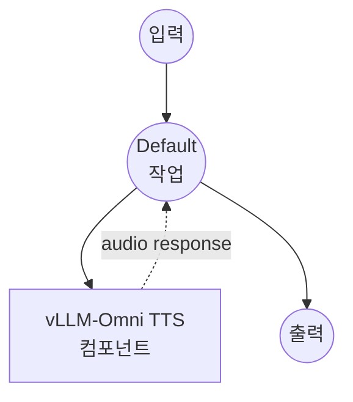

# vLLM 텍스트 음성 변환 예제

이 예제는 vLLM-Omni를 통해 Qwen3-TTS 모델을 사용하여 텍스트에서 음성 오디오를 생성하는 방법을 보여주며, 커스텀 보이스 및 다국어 합성을 지원합니다.

## 개요

이 워크플로우는 다음과 같은 텍스트 음성 변환 인터페이스를 제공합니다:

1. **로컬 모델 서빙**: Qwen3-TTS-12Hz-1.7B-CustomVoice 모델로 vLLM-Omni 서버를 자동으로 설정하고 관리
2. **텍스트 음성 변환**: 텍스트 입력을 자연스러운 음성 오디오로 변환
3. **커스텀 보이스**: 오디오 생성을 위한 다양한 음성 프로필 선택 지원
4. **다국어 지원**: 자동 언어 감지를 통한 다국어 지원

## 준비사항

### 필수 요구사항

- model-compose가 설치되어 PATH에서 사용 가능
- Python 환경 관리 (pyenv 권장)
- Qwen3-TTS 모델 실행을 위한 충분한 시스템 리소스

### pyenv가 사용되는 이유

이 예제는 model-compose와의 의존성 충돌을 피하기 위해 vLLM-Omni를 위한 격리된 Python 환경을 만들기 위해 pyenv를 사용합니다:

**환경 격리의 장점:**
- model-compose는 자체 Python 환경에서 실행
- vLLM-Omni는 별도의 격리된 환경(`vllm-omni` 가상 환경)에서 실행
- 두 시스템은 HTTP API를 통해서만 통신하여 완전한 런타임 격리 가능
- 각 시스템이 최적화된 의존성 버전 사용 가능

### 환경 구성

1. 이 예제 디렉토리로 이동:
   ```bash
   cd examples/vllm-text-to-speech
   ```

2. 충분한 디스크 공간과 RAM이 있는지 확인 (권장: 1.7B 모델을 위한 8GB+ RAM)

## 실행 방법

1. **서비스 시작 (첫 실행 시 vLLM-Omni 설치):**
   ```bash
   model-compose up
   ```

2. **설치 및 모델 로딩 대기:**
   - 첫 실행: 10-20분 (모델 다운로드 및 vLLM + vLLM-Omni 설치)
   - 후속 실행: 1-3분 (모델 로딩만)

3. **워크플로우 실행:**

   **API 사용:**
   ```bash
   curl -X POST http://localhost:8080/api/workflows/runs \
     -H "Content-Type: application/json" \
     -d '{
       "input": {
         "text": "안녕하세요, 텍스트 음성 변환 데모에 오신 것을 환영합니다."
       }
     }'
   ```

   **웹 UI 사용:**
   - 웹 UI 열기: http://localhost:8081
   - 텍스트 및 설정 입력
   - "Run Workflow" 버튼 클릭

   **CLI 사용:**
   ```bash
   model-compose run --input '{
     "text": "안녕하세요, 텍스트 음성 변환 데모에 오신 것을 환영합니다."
   }'
   ```

## 컴포넌트 세부사항

### vLLM-Omni TTS 서버 컴포넌트
- **유형**: 관리되는 수명 주기를 가진 HTTP 서버 컴포넌트
- **목적**: 로컬 텍스트 음성 변환 모델 서빙
- **모델**: Qwen/Qwen3-TTS-12Hz-1.7B-CustomVoice
- **서버**: vLLM-Omni (멀티모달 확장이 포함된 vLLM)
- **포트**: 8091 (내부)
- **관리 명령**:
  - **설치**: Python 환경 설정 및 vLLM + vLLM-Omni 설치
    ```bash
    eval "$(pyenv init -)" &&
    (pyenv activate vllm-omni 2>/dev/null || pyenv virtualenv $(python --version | cut -d' ' -f2) vllm-omni) &&
    pyenv activate vllm-omni &&
    pip install vllm &&
    pip install vllm-omni
    ```
  - **시작**: Qwen3-TTS 모델로 vLLM-Omni 서버 실행
    ```bash
    eval "$(pyenv init -)" &&
    pyenv activate vllm-omni &&
    vllm serve Qwen/Qwen3-TTS-12Hz-1.7B-CustomVoice \
      --stage-configs-path vllm_omni/model_executor/stage_configs/qwen3_tts.yaml \
      --omni \
      --port 8091 \
      --trust-remote-code \
      --enforce-eager
    ```
- **API 엔드포인트**: `POST /v1/audio/speech`

## 워크플로우 세부사항

### "Text to Speech with Qwen3-TTS" 워크플로우 (기본)

**설명**: vLLM-Omni를 통해 Qwen3-TTS를 사용하여 텍스트에서 음성 오디오 생성

#### 작업 흐름

이 예제는 명시적인 작업 없이 단순화된 단일 컴포넌트 구성을 사용합니다.



#### 입력 매개변수

| 매개변수 | 유형 | 필수 | 기본값 | 설명 |
|---------|------|------|--------|------|
| `text` | text | 예 | - | 음성으로 변환할 텍스트 |
| `voice` | string | 아니오 | `vivian` | 합성에 사용할 음성 프로필 |
| `language` | string | 아니오 | `Auto` | 합성 언어 (예: `Auto`, `en`, `zh`, `ko`) |
| `instructions` | string | 아니오 | `""` | 음성 생성을 위한 추가 지시사항 |

#### 출력 형식

| 필드 | 유형 | 설명 |
|-----|------|------|
| - | audio | WAV 형식으로 생성된 음성 오디오 |

## 모델 정보

### Qwen3-TTS-12Hz-1.7B-CustomVoice
- **개발자**: Alibaba Cloud
- **매개변수**: 17억 개
- **유형**: 커스텀 보이스 지원 텍스트 음성 변환 모델
- **샘플 레이트**: 12Hz 토큰 레이트
- **언어**: 자동 언어 감지를 통한 다국어 지원
- **출력 형식**: WAV
- **라이선스**: HuggingFace 모델 카드에서 세부사항 확인

## 시스템 요구사항

### 최소 요구사항
- **RAM**: 8GB (권장 16GB+)
- **GPU**: 4GB+ VRAM을 가진 NVIDIA GPU (선택 사항이지만 권장)
- **디스크 공간**: 모델 저장을 위한 10GB+
- **CPU**: 멀티코어 프로세서 (4+ 코어 권장)

### 성능 참고사항
- 첫 시작 시 모델 다운로드에 몇 분 소요될 수 있음
- GPU 가속이 합성 속도를 크게 향상시킴
- 호환성을 위해 `--enforce-eager`가 사용됨 (그래프 모드보다 메모리를 더 사용할 수 있음)

## 맞춤화

### 음성 선택
기본 음성을 변경하려면 `voice` 필드를 수정:
```yaml
body:
  voice: ${input.voice | another-voice-name}
```

### 언어 설정
자동 감지 대신 특정 언어를 설정:
```yaml
body:
  language: ${input.language | en}
```

### 서버 구성
vLLM-Omni 서버 매개변수 수정:
```yaml
start:
  - bash
  - -c
  - |
    eval "$(pyenv init -)" &&
    pyenv activate vllm-omni &&
    vllm serve Qwen/Qwen3-TTS-12Hz-1.7B-CustomVoice \
      --stage-configs-path vllm_omni/model_executor/stage_configs/qwen3_tts.yaml \
      --omni \
      --port 8091 \
      --trust-remote-code \
      --gpu-memory-utilization 0.8
```
