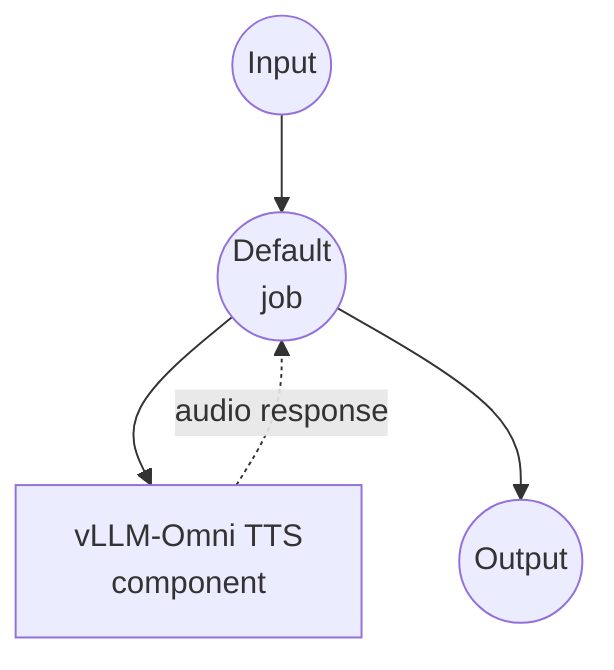

# vLLM Text to Speech Example

This example demonstrates how to generate speech audio from text using the Qwen3-TTS model served via vLLM-Omni, with support for custom voice and multilingual synthesis.

## Overview

This workflow provides a text-to-speech interface that:

1. **Local Model Serving**: Automatically sets up and manages a vLLM-Omni server with Qwen3-TTS-12Hz-1.7B-CustomVoice model
2. **Text to Speech**: Converts text input into natural-sounding speech audio
3. **Custom Voice**: Supports selecting different voice profiles for audio generation
4. **Multilingual**: Supports multiple languages with automatic language detection

## Preparation

### Prerequisites

- model-compose installed and available in your PATH
- Python environment management (pyenv recommended)
- Sufficient system resources for running Qwen3-TTS model

### Why pyenv is Used

This example uses pyenv to create an isolated Python environment for vLLM-Omni to avoid dependency conflicts with model-compose:

**Benefits of Environment Isolation:**
- model-compose runs in its own Python environment
- vLLM-Omni runs in a separate isolated environment (`vllm-omni` virtual environment)
- Both systems communicate only via HTTP API, allowing complete runtime isolation
- Each system can use optimized dependency versions

### Environment Configuration

1. Navigate to this example directory:
   ```bash
   cd examples/vllm-text-to-speech
   ```

2. Ensure you have enough disk space and RAM (recommended: 8GB+ RAM for 1.7B model)

## How to Run

1. **Start the service (first run will install vLLM-Omni):**
   ```bash
   model-compose up
   ```

2. **Wait for installation and model loading:**
   - First run: 10-20 minutes (downloads model and installs vLLM + vLLM-Omni)
   - Subsequent runs: 1-3 minutes (model loading only)

3. **Run the workflow:**

   **Using API:**
   ```bash
   curl -X POST http://localhost:8080/api/workflows/runs \
     -H "Content-Type: application/json" \
     -d '{
       "input": {
         "text": "Hello, welcome to the text to speech demo."
       }
     }'
   ```

   **Using Web UI:**
   - Open the Web UI: http://localhost:8081
   - Enter your text and settings
   - Click the "Run Workflow" button

   **Using CLI:**
   ```bash
   model-compose run --input '{
     "text": "Hello, welcome to the text to speech demo."
   }'
   ```

## Component Details

### vLLM-Omni TTS Server Component
- **Type**: HTTP server component with managed lifecycle
- **Purpose**: Local text-to-speech model serving
- **Model**: Qwen/Qwen3-TTS-12Hz-1.7B-CustomVoice
- **Server**: vLLM-Omni (vLLM with multimodal extensions)
- **Port**: 8091 (internal)
- **Management Commands**:
  - **Install**: Sets up Python environment and installs vLLM + vLLM-Omni
    ```bash
    eval "$(pyenv init -)" &&
    (pyenv activate vllm-omni 2>/dev/null || pyenv virtualenv $(python --version | cut -d' ' -f2) vllm-omni) &&
    pyenv activate vllm-omni &&
    pip install vllm &&
    pip install vllm-omni
    ```
  - **Start**: Launches vLLM-Omni server with Qwen3-TTS model
    ```bash
    eval "$(pyenv init -)" &&
    pyenv activate vllm-omni &&
    vllm serve Qwen/Qwen3-TTS-12Hz-1.7B-CustomVoice \
      --stage-configs-path vllm_omni/model_executor/stage_configs/qwen3_tts.yaml \
      --omni \
      --port 8091 \
      --trust-remote-code \
      --enforce-eager
    ```
- **API Endpoint**: `POST /v1/audio/speech`

## Workflow Details

### "Text to Speech with Qwen3-TTS" Workflow (Default)

**Description**: Generate speech audio from text using Qwen3-TTS via vLLM-Omni

#### Job Flow

This example uses a simplified single-component configuration without explicit jobs.



#### Input Parameters

| Parameter | Type | Required | Default | Description |
|-----------|------|----------|---------|-------------|
| `text` | text | Yes | - | The text to convert to speech |
| `voice` | string | No | `vivian` | Voice profile to use for synthesis |
| `language` | string | No | `Auto` | Language for synthesis (e.g., `Auto`, `en`, `zh`) |
| `instructions` | string | No | `""` | Additional instructions for speech generation |

#### Output Format

| Field | Type | Description |
|-------|------|-------------|
| - | audio | Generated speech audio in WAV format |

## Model Information

### Qwen3-TTS-12Hz-1.7B-CustomVoice
- **Developer**: Alibaba Cloud
- **Parameters**: 1.7 billion
- **Type**: Text-to-speech model with custom voice support
- **Sample Rate**: 12Hz token rate
- **Languages**: Multilingual with automatic language detection
- **Output Format**: WAV
- **License**: Check model card on HuggingFace for details

## System Requirements

### Minimum Requirements
- **RAM**: 8GB (recommended 16GB+)
- **GPU**: NVIDIA GPU with 4GB+ VRAM (optional but recommended)
- **Disk Space**: 10GB+ for model storage
- **CPU**: Multi-core processor (4+ cores recommended)

### Performance Notes
- First startup may take several minutes to download the model
- GPU acceleration significantly improves synthesis speed
- `--enforce-eager` is used for compatibility (may use more memory than graph mode)

## Customization

### Voice Selection
Change the default voice by modifying the `voice` field:
```yaml
body:
  voice: ${input.voice | another-voice-name}
```

### Language Configuration
Set a specific language instead of auto-detection:
```yaml
body:
  language: ${input.language | en}
```

### Server Configuration
Modify vLLM-Omni server parameters:
```yaml
start:
  - bash
  - -c
  - |
    eval "$(pyenv init -)" &&
    pyenv activate vllm-omni &&
    vllm serve Qwen/Qwen3-TTS-12Hz-1.7B-CustomVoice \
      --stage-configs-path vllm_omni/model_executor/stage_configs/qwen3_tts.yaml \
      --omni \
      --port 8091 \
      --trust-remote-code \
      --gpu-memory-utilization 0.8
```
