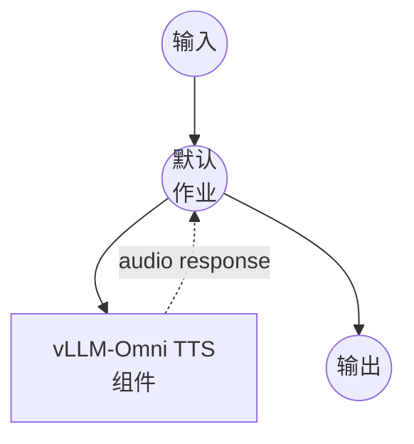

# vLLM 文本转语音示例

此示例演示如何通过 vLLM-Omni 使用 Qwen3-TTS 模型从文本生成语音音频，支持自定义语音和多语言合成。

## 概述

此工作流提供文本转语音界面：

1. **本地模型服务**：自动设置和管理带 Qwen3-TTS-12Hz-1.7B-CustomVoice 模型的 vLLM-Omni 服务器
2. **文本转语音**：将文本输入转换为自然的语音音频
3. **自定义语音**：支持选择不同的语音配置文件用于音频生成
4. **多语言支持**：支持多种语言，具有自动语言检测功能

## 准备工作

### 前置条件

- 已安装 model-compose 并在您的 PATH 中可用
- Python 环境管理（推荐使用 pyenv）
- 运行 Qwen3-TTS 模型所需的足够系统资源

### 为什么使用 pyenv

此示例使用 pyenv 为 vLLM-Omni 创建隔离的 Python 环境，以避免与 model-compose 的依赖冲突：

**环境隔离的好处：**
- model-compose 在自己的 Python 环境中运行
- vLLM-Omni 在单独的隔离环境（`vllm-omni` 虚拟环境）中运行
- 两个系统仅通过 HTTP API 通信，允许完全的运行时隔离
- 每个系统可以使用优化的依赖版本

### 环境配置

1. 导航到此示例目录：
   ```bash
   cd examples/vllm-text-to-speech
   ```

2. 确保您有足够的磁盘空间和 RAM（推荐：8GB+ RAM 用于 1.7B 模型）

## 运行方式

1. **启动服务（首次运行将安装 vLLM-Omni）：**
   ```bash
   model-compose up
   ```

2. **等待安装和模型加载：**
   - 首次运行：10-20 分钟（下载模型并安装 vLLM + vLLM-Omni）
   - 后续运行：1-3 分钟（仅模型加载）

3. **运行工作流：**

   **使用 API：**
   ```bash
   curl -X POST http://localhost:8080/api/workflows/runs \
     -H "Content-Type: application/json" \
     -d '{
       "input": {
         "text": "你好，欢迎来到文本转语音演示。"
       }
     }'
   ```

   **使用 Web UI：**
   - 打开 Web UI：http://localhost:8081
   - 输入您的文本和设置
   - 点击"运行工作流"按钮

   **使用 CLI：**
   ```bash
   model-compose run --input '{
     "text": "你好，欢迎来到文本转语音演示。"
   }'
   ```

## 组件详情

### vLLM-Omni TTS 服务器组件
- **类型**：具有托管生命周期的 HTTP 服务器组件
- **用途**：本地文本转语音模型服务
- **模型**：Qwen/Qwen3-TTS-12Hz-1.7B-CustomVoice
- **服务器**：vLLM-Omni（具有多模态扩展的 vLLM）
- **端口**：8091（内部）
- **管理命令**：
  - **安装**：设置 Python 环境并安装 vLLM + vLLM-Omni
    ```bash
    eval "$(pyenv init -)" &&
    (pyenv activate vllm-omni 2>/dev/null || pyenv virtualenv $(python --version | cut -d' ' -f2) vllm-omni) &&
    pyenv activate vllm-omni &&
    pip install vllm &&
    pip install vllm-omni
    ```
  - **启动**：使用 Qwen3-TTS 模型启动 vLLM-Omni 服务器
    ```bash
    eval "$(pyenv init -)" &&
    pyenv activate vllm-omni &&
    vllm serve Qwen/Qwen3-TTS-12Hz-1.7B-CustomVoice \
      --stage-configs-path vllm_omni/model_executor/stage_configs/qwen3_tts.yaml \
      --omni \
      --port 8091 \
      --trust-remote-code \
      --enforce-eager
    ```
- **API 端点**：`POST /v1/audio/speech`

## 工作流详情

### "Text to Speech with Qwen3-TTS"工作流（默认）

**描述**：通过 vLLM-Omni 使用 Qwen3-TTS 从文本生成语音音频

#### 作业流程

此示例使用简化的单组件配置，没有显式作业。



#### 输入参数

| 参数 | 类型 | 必需 | 默认值 | 描述 |
|-----------|------|----------|---------|-------------|
| `text` | text | 是 | - | 要转换为语音的文本 |
| `voice` | string | 否 | `vivian` | 用于合成的语音配置文件 |
| `language` | string | 否 | `Auto` | 合成语言（例如 `Auto`、`en`、`zh`） |
| `instructions` | string | 否 | `""` | 语音生成的附加指令 |

#### 输出格式

| 字段 | 类型 | 描述 |
|-------|------|-------------|
| - | audio | WAV 格式生成的语音音频 |

## 模型信息

### Qwen3-TTS-12Hz-1.7B-CustomVoice
- **开发者**：阿里云
- **参数**：17 亿
- **类型**：支持自定义语音的文本转语音模型
- **采样率**：12Hz token 率
- **语言**：多语言，具有自动语言检测
- **输出格式**：WAV
- **许可证**：详情请查看 HuggingFace 模型卡

## 系统要求

### 最低要求
- **RAM**：8GB（推荐 16GB+）
- **GPU**：NVIDIA GPU，4GB+ VRAM（可选但推荐）
- **磁盘空间**：10GB+ 用于模型存储
- **CPU**：多核处理器（推荐 4+ 核）

### 性能说明
- 首次启动可能需要几分钟下载模型
- GPU 加速显著提高合成速度
- 使用 `--enforce-eager` 以确保兼容性（可能比图模式使用更多内存）

## 自定义

### 语音选择
通过修改 `voice` 字段更改默认语音：
```yaml
body:
  voice: ${input.voice | another-voice-name}
```

### 语言配置
设置特定语言而非自动检测：
```yaml
body:
  language: ${input.language | en}
```

### 服务器配置
修改 vLLM-Omni 服务器参数：
```yaml
start:
  - bash
  - -c
  - |
    eval "$(pyenv init -)" &&
    pyenv activate vllm-omni &&
    vllm serve Qwen/Qwen3-TTS-12Hz-1.7B-CustomVoice \
      --stage-configs-path vllm_omni/model_executor/stage_configs/qwen3_tts.yaml \
      --omni \
      --port 8091 \
      --trust-remote-code \
      --gpu-memory-utilization 0.8
```
