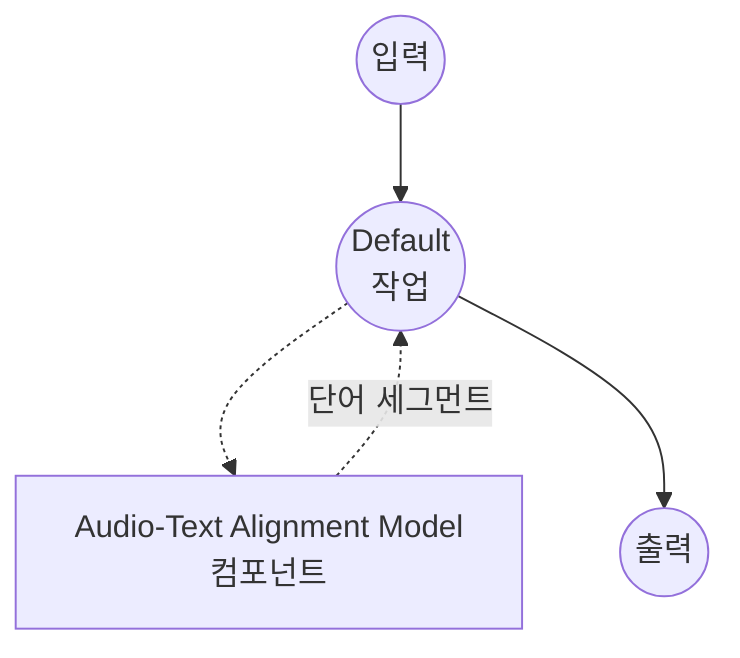

# 오디오-텍스트 정렬 모델 태스크 예제

이 예제는 model-compose의 내장 `audio-text-alignment` 태스크와 HuggingFace transformers를 사용하여, 로컬 Wav2Vec2 CTC 모델로 참조 스크립트를 오디오에 정렬하고 단어별 시작/종료 타임스탬프를 출력하는 방법을 보여줍니다.

## 개요

이 워크플로우는 로컬 강제 정렬을 제공합니다:

1. **로컬 CTC 모델**: HuggingFace transformers를 통해 사전 학습된 Wav2Vec2 CTC 모델을 로컬에서 실행
2. **단어 수준 타임스탬프**: 참조 스크립트의 모든 단어에 대해 시작/종료 시간을 반환
3. **신뢰도 점수**: 선택적으로 단어별 정렬 신뢰도를 보고
4. **장시간 오디오**: 긴 오디오를 내부적으로 청크로 나누어 VRAM 사용량을 청크 크기로 제한
5. **자동 모델 관리**: 최초 사용 시 모델을 다운로드하고 캐시
6. **외부 API 불필요**: 최초 모델 다운로드 후 완전히 오프라인으로 실행

## 준비사항

### 필수 요구사항

- model-compose가 설치되어 PATH에서 사용 가능
- Wav2Vec2 모델 실행을 위한 충분한 시스템 리소스 (권장: 4GB+ RAM, 긴 오디오에는 GPU/MPS 권장)
- transformers, torch, torchaudio, soxr가 포함된 Python 환경 (자동 관리)

### 강제 정렬과 음성 인식의 차이

음성 인식(STT)은 스크립트를 처음부터 생성합니다. 강제 정렬은 **이미 알려진 스크립트**를 받아 오디오 안에서 *각 단어가 언제 등장하는지* 를 찾아냅니다. 스크립트/자막이 있고 타이밍이 필요할 때 적합합니다 — 자막 동기화, 노래방, 더빙, 데이터셋 준비 등.

**로컬 처리의 이점:**
- **개인정보 보호**: 모든 오디오 처리가 로컬에서 이루어지며 외부 서비스로 전송되지 않음
- **비용**: 초기 설정 이후 분당 요금이나 API 사용료 없음
- **오프라인**: 모델 다운로드 이후 인터넷 연결 없이 작동
- **결정성**: 동일 입력에 대해 안정적으로 동일한 정렬 결과 생성

**트레이드오프:**
- **스크립트 품질이 중요**: 참조 스크립트의 잘못된 단어는 인접 단어의 타이밍을 어긋나게 함
- **언어 범위**: 기본 `wav2vec2-base-960h` 모델은 영어 전용; 다른 언어는 언어별 CTC 모델이 필요
- **CTC 제약**: 오디오가 스크립트를 순서대로 담고 있다고 가정 (재정렬이나 무관한 발화 없음)

### 환경 구성

1. 이 예제 디렉토리로 이동:
   ```bash
   cd examples/model-tasks/audio-text-alignment
   ```

2. 추가 환경 구성은 필요하지 않습니다 — 모델과 의존성이 자동으로 관리됩니다.

## 실행 방법

1. **서비스 시작:**
   ```bash
   model-compose up
   ```

2. **워크플로우 실행:**

   **API 사용:**
   ```bash
   curl -X POST http://localhost:8080/api/workflows/runs \
     -F "audio=@/path/to/your/audio.wav" \
     -F 'input={"audio": "@audio", "text": "the quick brown fox jumps over the lazy dog"}'
   ```

   **웹 UI 사용:**
   - Web UI 열기: http://localhost:8081
   - 오디오 파일 업로드 (WAV, MP3, FLAC 등)
   - `text` 필드에 참조 스크립트 붙여넣기
   - 선택적으로 `chunk_length`(초)와 `chunk_overlap`(예: `1s`, `500ms`) 조정
   - "Run Workflow" 버튼 클릭

   **CLI 사용:**
   ```bash
   model-compose run audio-text-alignment \
     --input '{"audio": "/path/to/your/audio.wav", "text": "the quick brown fox jumps over the lazy dog"}'
   ```

## 컴포넌트 세부사항

### 오디오-텍스트 정렬 모델 컴포넌트 (기본)
- **유형**: `audio-text-alignment` 태스크를 가진 Model 컴포넌트
- **목적**: 참조 스크립트를 오디오에 강제 정렬
- **모델**: facebook/wav2vec2-base-960h
- **아키텍처**: Wav2Vec2 (CTC)
- **기능**:
  - 자동 모델 다운로드 및 캐싱
  - 다양한 오디오 포맷 지원 (WAV, MP3, FLAC, OGG 등)
  - 단어별 시작/종료 타임스탬프
  - 선택적 단어별 신뢰도 점수
  - 겹치는 청크와 방출 스티칭을 통한 장시간 오디오 처리
  - CPU, CUDA, Apple MPS 가속

### 모델 정보: Wav2Vec2 Base 960h
- **개발자**: Meta AI (HuggingFace에 호스팅)
- **매개변수**: 약 9,500만
- **유형**: CTC 기반 음향 모델
- **학습 데이터**: LibriSpeech 960시간 (영어)
- **기능**: 강제 정렬, 음소/단어 수준 타이밍
- **지원 언어**: 영어
- **라이선스**: Apache 2.0

## 워크플로우 세부사항

### "Audio Text Alignment" 워크플로우 (기본)

**설명**: 참조 스크립트를 오디오 파일에 정렬하고 단어별 타임스탬프를 반환합니다.

#### 작업 흐름

이 예제는 명시적 job 없이 단일 컴포넌트 구성을 사용합니다.



#### 입력 매개변수

| 매개변수        | 유형   | 필수 | 기본값  | 설명 |
|-----------------|--------|------|--------|------|
| `audio`         | audio  | 예   | -      | 입력 오디오 파일 (WAV, MP3, FLAC 등) |
| `text`          | text   | 예   | -      | 오디오에 등장하는 참조 스크립트 |
| `chunk_length`  | number | 아니오 | `30.0` | 오디오 청크 길이(초). 긴 오디오는 forward pass 전에 이 크기의 창으로 분할 |
| `chunk_overlap` | text   | 아니오 | `1s`   | 인접 청크 간의 겹침 (예: `1s`, `500ms`). 청크 경계에서 문맥 손실을 방지 |

#### 출력 형식

`segments`는 단어별 항목의 리스트입니다:

| 필드         | 유형   | 설명 |
|--------------|--------|------|
| `text`       | text   | 참조 스크립트에서 가져온 단어 |
| `start_time` | number | 단어 시작 시간(초) |
| `end_time`   | number | 단어 종료 시간(초) |
| `confidence` | number | 단어별 정렬 신뢰도 (0.0–1.0) |

예:
```json
{
  "segments": [
    { "text": "the",   "start_time": 0.10, "end_time": 0.22, "confidence": 0.98 },
    { "text": "quick", "start_time": 0.24, "end_time": 0.51, "confidence": 0.95 },
    { "text": "brown", "start_time": 0.53, "end_time": 0.79, "confidence": 0.97 }
  ]
}
```

## 시스템 요구사항

### 최소 요구사항
- **RAM**: 4GB (권장 8GB+)
- **VRAM**: 긴 오디오에는 2GB+ GPU/MPS 권장
- **디스크 공간**: 모델 저장 및 캐시를 위한 1GB+
- **CPU**: 멀티코어 프로세서
- **인터넷**: 최초 모델 다운로드 시에만 필요

### 성능 노트
- 최초 실행 시 모델 다운로드 필요 (`wav2vec2-base-960h` 약 360MB)
- 오디오 길이와 무관하게 최고 VRAM은 `chunk_length`에 의해 제한
- GPU/MPS 가속은 긴 오디오의 처리량을 크게 향상

## 사용자 정의

### 다른 모델 사용

다른 CTC 모델로 교체하세요. 영어가 아닌 오디오의 경우 언어별 모델을 선택합니다:

```yaml
component:
  type: model
  task: audio-text-alignment
  driver: huggingface
  architecture: wav2vec2
  model: jonatasgrosman/wav2vec2-large-xlsr-53-korean   # 한국어
  # 또는
  model: facebook/wav2vec2-large-960h-lv60-self        # 더 큰 영어 모델
```

### 청크 크기 조정

더 긴 청크는 모델에 더 많은 문맥을 제공하지만 VRAM을 더 많이 사용합니다:

```yaml
action:
  audio: ${input.audio as audio}
  text: ${input.text}
  chunk_length: 20.0
  chunk_overlap: 2s
```

### 신뢰도 점수 생략

타임스탬프만 필요하다면 신뢰도를 비활성화하여 출력을 간소화할 수 있습니다:

```yaml
action:
  audio: ${input.audio as audio}
  text: ${input.text}
  return_confidence: false
```

## 문제 해결

### 일반적인 문제

1. **타임스탬프 어긋남**: 참조 스크립트는 오디오에서 실제 발화된 단어와 일치해야 합니다. 추가/누락된 단어는 인접 타이밍을 왜곡합니다.
2. **메모리 부족**: `chunk_length`를 줄이세요 (예: 15초) — VRAM 피크가 낮아집니다.
3. **모델 다운로드 실패**: 인터넷 연결과 디스크 공간을 확인하세요.
4. **영어가 아닌 오디오의 정렬이 좋지 않음**: 기본 모델은 영어 전용입니다. 언어별 Wav2Vec2 CTC 모델을 사용하세요.
5. **오디오 포맷 오류**: 지원되는 오디오 포맷이고 파일이 손상되지 않았는지 확인하세요.

### 성능 최적화

- **GPU/MPS 사용**: 가속을 위해 `device: cuda:0` (NVIDIA) 또는 `device: mps` (Apple Silicon) 설정
- **청크 길이**: 더 긴 청크는 스티칭 오버헤드를 줄이지만 더 많은 VRAM이 필요합니다; 기본 30초가 좋은 출발점입니다
- **배치 크기**: 액션 설정의 `batch_size`는 오디오 입력이 리스트일 때 forward pass당 여러 오디오 파일을 처리할 수 있게 합니다

## 강제 정렬 vs 음성 인식 선택 기준

| 시나리오                                     | 사용                     |
|----------------------------------------------|-------------------------|
| 오디오가 있고 스크립트가 필요할 때           | speech-to-text          |
| 오디오와 스크립트가 모두 있고 타이밍이 필요할 때 | audio-text-alignment    |
| 타임스탬프는 필요하나 스크립트가 없을 때     | `return_timestamps: true`를 사용한 speech-to-text |
| 노래방, 자막 동기화, 데이터셋 라벨링         | audio-text-alignment    |
