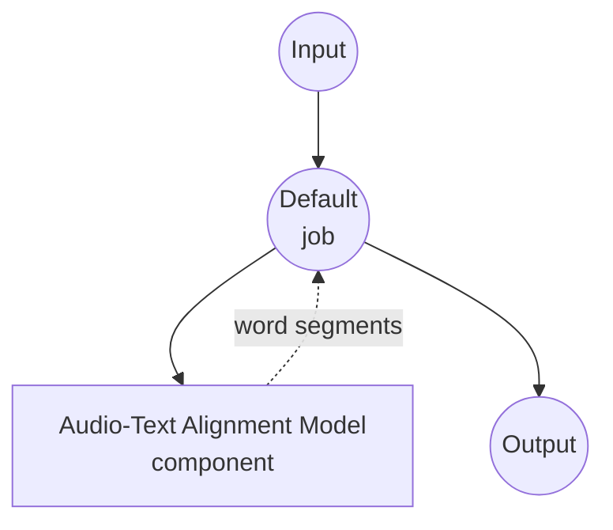

# Audio-Text Alignment Model Task Example

This example demonstrates how to use a local Wav2Vec2 CTC model to align a reference transcript to audio and emit per-word start/end timestamps, using model-compose's built-in `audio-text-alignment` task with HuggingFace transformers.

## Overview

This workflow provides local forced alignment that:

1. **Local CTC Model**: Runs a pretrained Wav2Vec2 CTC model locally via HuggingFace transformers
2. **Word-level Timestamps**: Returns start/end times for every word in the reference transcript
3. **Confidence Scores**: Optionally reports per-word alignment confidence
4. **Long-form Audio**: Chunks long audio internally so VRAM stays bounded by chunk size
5. **Automatic Model Management**: Downloads and caches the model on first use
6. **No External APIs**: Runs entirely offline after the initial model download

## Preparation

### Prerequisites

- model-compose installed and available in your PATH
- Sufficient system resources for running a Wav2Vec2 model (recommended: 4GB+ RAM, GPU/MPS recommended for long audio)
- Python environment with transformers, torch, torchaudio, and soxr (automatically managed)

### How Forced Alignment Differs from Speech-to-Text

Speech-to-text produces the transcript from scratch. Forced alignment takes an **already-known transcript** and finds *where in the audio* each word occurs. It's the right tool when you have a script/subtitles and need timing — subtitle sync, karaoke, dubbing, dataset preparation, etc.

**Benefits of Local Processing:**
- **Privacy**: All audio processing happens locally, no audio sent to external services
- **Cost**: No per-minute or API usage fees after initial setup
- **Offline**: Works without internet connection after model download
- **Determinism**: Same input reliably produces the same alignment

**Trade-offs:**
- **Transcript Quality Matters**: Wrong words in the reference transcript will misalign nearby timings
- **Language Coverage**: The default `wav2vec2-base-960h` model is English-only; other languages need a language-specific CTC model
- **CTC Constraint**: Assumes the audio contains the transcript in order (no reordering, no unrelated speech)

### Environment Configuration

1. Navigate to this example directory:
   ```bash
   cd examples/model-tasks/audio-text-alignment
   ```

2. No additional environment configuration required — model and dependencies are managed automatically.

## How to Run

1. **Start the service:**
   ```bash
   model-compose up
   ```

2. **Run the workflow:**

   **Using API:**
   ```bash
   curl -X POST http://localhost:8080/api/workflows/runs \
     -F "audio=@/path/to/your/audio.wav" \
     -F 'input={"audio": "@audio", "text": "the quick brown fox jumps over the lazy dog"}'
   ```

   **Using Web UI:**
   - Open the Web UI: http://localhost:8081
   - Upload an audio file (WAV, MP3, FLAC, etc.)
   - Paste the reference transcript into the `text` field
   - Optionally adjust `chunk_length` (seconds) and `chunk_overlap` (e.g. `1s`, `500ms`)
   - Click the "Run Workflow" button

   **Using CLI:**
   ```bash
   model-compose run audio-text-alignment \
     --input '{"audio": "/path/to/your/audio.wav", "text": "the quick brown fox jumps over the lazy dog"}'
   ```

## Component Details

### Audio-Text Alignment Model Component (Default)
- **Type**: Model component with `audio-text-alignment` task
- **Purpose**: Forced alignment of reference transcript to audio
- **Model**: facebook/wav2vec2-base-960h
- **Architecture**: Wav2Vec2 (CTC)
- **Features**:
  - Automatic model downloading and caching
  - Support for various audio formats (WAV, MP3, FLAC, OGG, etc.)
  - Per-word start/end timestamps
  - Optional per-word confidence scores
  - Long-form audio handling via overlapping chunks + emission stitching
  - CPU, CUDA, and Apple MPS acceleration

### Model Information: Wav2Vec2 Base 960h
- **Developer**: Meta AI (hosted on HuggingFace)
- **Parameters**: ~95 million
- **Type**: CTC-based acoustic model
- **Training Data**: 960 hours of LibriSpeech (English)
- **Capabilities**: Forced alignment, phoneme/word-level timing
- **Supported Languages**: English
- **License**: Apache 2.0

## Workflow Details

### "Audio Text Alignment" Workflow (Default)

**Description**: Align a reference transcript to an audio file and return per-word timestamps.

#### Job Flow

This example uses a simplified single-component configuration without explicit jobs.



#### Input Parameters

| Parameter       | Type   | Required | Default | Description |
|-----------------|--------|----------|---------|-------------|
| `audio`         | audio  | Yes      | -       | Input audio file (WAV, MP3, FLAC, etc.) |
| `text`          | text   | Yes      | -       | Reference transcript that appears in the audio |
| `chunk_length`  | number | No       | `30.0`  | Audio chunk length in seconds. Long audio is split into windows of this size before forward pass. |
| `chunk_overlap` | text   | No       | `1s`    | Overlap between adjacent chunks (e.g. `1s`, `500ms`). Prevents context loss at chunk boundaries. |

#### Output Format

`segments` is a list of per-word entries:

| Field        | Type   | Description |
|--------------|--------|-------------|
| `text`       | text   | The word from the reference transcript |
| `start_time` | number | Word start time in seconds |
| `end_time`   | number | Word end time in seconds |
| `confidence` | number | Per-word alignment confidence (0.0–1.0) |

Example:
```json
{
  "segments": [
    { "text": "the",   "start_time": 0.10, "end_time": 0.22, "confidence": 0.98 },
    { "text": "quick", "start_time": 0.24, "end_time": 0.51, "confidence": 0.95 },
    { "text": "brown", "start_time": 0.53, "end_time": 0.79, "confidence": 0.97 }
  ]
}
```

## System Requirements

### Minimum Requirements
- **RAM**: 4GB (recommended 8GB+)
- **VRAM**: 2GB+ GPU/MPS recommended for long audio
- **Disk Space**: 1GB+ for model storage and cache
- **CPU**: Multi-core processor
- **Internet**: Required for initial model download only

### Performance Notes
- First run requires model download (~360MB for `wav2vec2-base-960h`)
- Peak VRAM is bounded by `chunk_length` regardless of audio duration
- GPU/MPS acceleration significantly improves throughput for long audio

## Customization

### Using Different Models

Replace with other CTC models. For non-English audio, pick a language-specific model:

```yaml
component:
  type: model
  task: audio-text-alignment
  driver: huggingface
  architecture: wav2vec2
  model: jonatasgrosman/wav2vec2-large-xlsr-53-korean   # Korean
  # or
  model: facebook/wav2vec2-large-960h-lv60-self        # Larger English model
```

### Tuning Chunk Size

Longer chunks give more context to the model but use more VRAM:

```yaml
action:
  audio: ${input.audio as audio}
  text: ${input.text}
  chunk_length: 20.0
  chunk_overlap: 2s
```

### Dropping Confidence Scores

If you only need timestamps, disable confidence to slim the output:

```yaml
action:
  audio: ${input.audio as audio}
  text: ${input.text}
  return_confidence: false
```

## Troubleshooting

### Common Issues

1. **Misaligned Timestamps**: The reference transcript must match the words actually spoken in the audio. Extra/missing words distort nearby timings.
2. **Out of Memory**: Reduce `chunk_length` (e.g. 15s) to lower VRAM peak.
3. **Model Download Fails**: Check internet connection and disk space.
4. **Non-English Audio Aligns Poorly**: The default model is English-only. Use a language-specific Wav2Vec2 CTC model.
5. **Audio Format Errors**: Ensure the file is a supported audio format and not corrupted.

### Performance Optimization

- **GPU/MPS Usage**: Set `device: cuda:0` (NVIDIA) or `device: mps` (Apple Silicon) for acceleration
- **Chunk Length**: Larger chunks reduce stitching overhead but need more VRAM; the default 30s is a good starting point
- **Batch Size**: `batch_size` in the action config lets multiple audio files run per forward pass when audio inputs are lists

## When to Use Forced Alignment vs Speech-to-Text

| Scenario                                     | Use                     |
|----------------------------------------------|-------------------------|
| You have audio and need the transcript       | speech-to-text          |
| You have both audio *and* transcript, need timings | audio-text-alignment    |
| You need timestamps but no transcript exists | speech-to-text with `return_timestamps: true` |
| Karaoke, subtitle sync, dataset labeling     | audio-text-alignment    |
