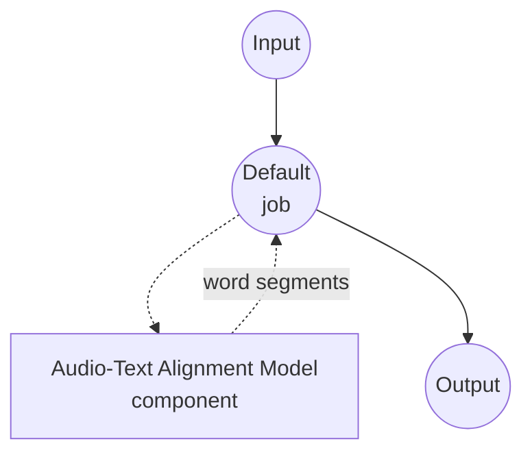

# 音频文本对齐模型任务示例

此示例演示了如何使用 model-compose 内置的 `audio-text-alignment` 任务，通过 HuggingFace transformers 的本地 Wav2Vec2 CTC 模型，将参考文本对齐到音频并输出每个词的起止时间戳。

## 概述

此工作流提供本地强制对齐：

1. **本地 CTC 模型**：通过 HuggingFace transformers 在本地运行预训练的 Wav2Vec2 CTC 模型
2. **词级时间戳**：为参考文本中的每个词返回起始/结束时间
3. **置信度分数**：可选地报告每个词的对齐置信度
4. **长音频处理**：内部对长音频进行分块，使 VRAM 受块大小限制
5. **自动模型管理**：首次使用时下载并缓存模型
6. **无需外部 API**：初次模型下载后完全离线运行

## 准备工作

### 前置条件

- 已安装 model-compose 并在您的 PATH 中可用
- 运行 Wav2Vec2 模型的足够系统资源（推荐：4GB+ RAM，长音频推荐 GPU/MPS）
- 包含 transformers、torch、torchaudio 和 soxr 的 Python 环境（自动管理）

### 强制对齐与语音识别的区别

语音识别（STT）从零开始产出文本。强制对齐则接受一个**已知的文本**，找出音频中*每个词出现的位置*。当您已有脚本/字幕且需要时序时，它是合适的工具 —— 字幕同步、卡拉 OK、配音、数据集准备等。

**本地处理的优点：**
- **隐私**：所有音频处理均在本地进行，不会将音频发送到外部服务
- **成本**：初次设置后无按分钟或 API 使用费用
- **离线**：模型下载后无需互联网连接即可工作
- **确定性**：相同输入可靠地产出相同的对齐结果

**权衡：**
- **文本质量至关重要**：参考文本中错误的词会导致相邻词的时序错位
- **语言覆盖**：默认 `wav2vec2-base-960h` 模型仅支持英语；其他语言需要特定语言的 CTC 模型
- **CTC 约束**：假设音频按顺序包含该文本（不能重排，不能包含无关语音）

### 环境配置

1. 进入本示例目录：
   ```bash
   cd examples/model-tasks/audio-text-alignment
   ```

2. 无需额外环境配置 —— 模型与依赖自动管理。

## 运行方式

1. **启动服务：**
   ```bash
   model-compose up
   ```

2. **运行工作流：**

   **使用 API：**
   ```bash
   curl -X POST http://localhost:8080/api/workflows/runs \
     -F "audio=@/path/to/your/audio.wav" \
     -F 'input={"audio": "@audio", "text": "the quick brown fox jumps over the lazy dog"}'
   ```

   **使用 Web UI：**
   - 打开 Web UI：http://localhost:8081
   - 上传音频文件（WAV、MP3、FLAC 等）
   - 将参考文本粘贴到 `text` 字段
   - 可选调整 `chunk_length`（秒）和 `chunk_overlap`（例如 `1s`、`500ms`）
   - 点击"运行工作流"按钮

   **使用 CLI：**
   ```bash
   model-compose run audio-text-alignment \
     --input '{"audio": "/path/to/your/audio.wav", "text": "the quick brown fox jumps over the lazy dog"}'
   ```

## 组件详情

### 音频-文本对齐模型组件（默认）
- **类型**：具有 `audio-text-alignment` 任务的 Model 组件
- **用途**：将参考文本强制对齐到音频
- **模型**：facebook/wav2vec2-base-960h
- **架构**：Wav2Vec2 (CTC)
- **功能**：
  - 自动模型下载与缓存
  - 支持多种音频格式（WAV、MP3、FLAC、OGG 等）
  - 词级起止时间戳
  - 可选的词级置信度分数
  - 通过重叠分块与发射拼接处理长音频
  - CPU、CUDA 和 Apple MPS 加速

### 模型信息：Wav2Vec2 Base 960h
- **开发者**：Meta AI（托管于 HuggingFace）
- **参数量**：约 9500 万
- **类型**：基于 CTC 的声学模型
- **训练数据**：LibriSpeech 960 小时（英语）
- **能力**：强制对齐、音素/词级时序
- **支持语言**：英语
- **许可证**：Apache 2.0

## 工作流详情

### "Audio Text Alignment" 工作流（默认）

**描述**：将参考文本对齐到音频文件并返回每个词的时间戳。

#### 作业流程

此示例使用无显式作业的单组件配置。



#### 输入参数

| 参数            | 类型   | 必需 | 默认值 | 描述 |
|-----------------|--------|------|--------|------|
| `audio`         | audio  | 是   | -      | 输入音频文件（WAV、MP3、FLAC 等） |
| `text`          | text   | 是   | -      | 音频中出现的参考文本 |
| `chunk_length`  | number | 否   | `30.0` | 音频块长度（秒）。长音频在前向传播前会被切分为此大小的窗口 |
| `chunk_overlap` | text   | 否   | `1s`   | 相邻块之间的重叠（例如 `1s`、`500ms`）。防止在块边界处的上下文丢失 |

#### 输出格式

`segments` 是每个词的条目列表：

| 字段         | 类型   | 描述 |
|--------------|--------|------|
| `text`       | text   | 来自参考文本的词 |
| `start_time` | number | 词起始时间（秒） |
| `end_time`   | number | 词结束时间（秒） |
| `confidence` | number | 每个词的对齐置信度 (0.0–1.0) |

示例：
```json
{
  "segments": [
    { "text": "the",   "start_time": 0.10, "end_time": 0.22, "confidence": 0.98 },
    { "text": "quick", "start_time": 0.24, "end_time": 0.51, "confidence": 0.95 },
    { "text": "brown", "start_time": 0.53, "end_time": 0.79, "confidence": 0.97 }
  ]
}
```

## 系统要求

### 最低要求
- **RAM**：4GB（推荐 8GB+）
- **VRAM**：长音频推荐 2GB+ GPU/MPS
- **磁盘空间**：模型存储与缓存需 1GB+
- **CPU**：多核处理器
- **互联网**：仅初次模型下载时需要

### 性能说明
- 首次运行需要下载模型（`wav2vec2-base-960h` 约 360MB）
- 无论音频时长如何，峰值 VRAM 都受 `chunk_length` 限制
- GPU/MPS 加速可显著提高长音频的吞吐

## 自定义

### 使用不同的模型

替换为其他 CTC 模型。对于非英语音频，选择特定语言的模型：

```yaml
component:
  type: model
  task: audio-text-alignment
  driver: huggingface
  architecture: wav2vec2
  model: jonatasgrosman/wav2vec2-large-xlsr-53-korean   # 韩语
  # 或
  model: facebook/wav2vec2-large-960h-lv60-self        # 更大的英语模型
```

### 调整块大小

更长的块为模型提供更多上下文，但会占用更多 VRAM：

```yaml
action:
  audio: ${input.audio as audio}
  text: ${input.text}
  chunk_length: 20.0
  chunk_overlap: 2s
```

### 移除置信度分数

如果仅需要时间戳，禁用置信度可以精简输出：

```yaml
action:
  audio: ${input.audio as audio}
  text: ${input.text}
  return_confidence: false
```

## 故障排除

### 常见问题

1. **时间戳错位**：参考文本必须与音频中实际讲述的词一致。多余/缺失的词会扭曲相邻词的时序。
2. **内存不足**：减小 `chunk_length`（例如 15 秒）以降低 VRAM 峰值。
3. **模型下载失败**：检查互联网连接与磁盘空间。
4. **非英语音频对齐效果差**：默认模型仅英语。请使用特定语言的 Wav2Vec2 CTC 模型。
5. **音频格式错误**：确保文件是支持的音频格式且未损坏。

### 性能优化

- **GPU/MPS 使用**：设置 `device: cuda:0`（NVIDIA）或 `device: mps`（Apple Silicon）以进行加速
- **块长度**：更大的块可减少拼接开销但需要更多 VRAM；默认 30 秒是好的起点
- **批大小**：当音频输入为列表时，动作配置中的 `batch_size` 允许每次前向传播处理多个音频文件

## 何时使用强制对齐 vs 语音识别

| 场景                                         | 使用                    |
|----------------------------------------------|-------------------------|
| 已有音频，需要文本                           | speech-to-text          |
| 既有音频*又有*文本，需要时序                 | audio-text-alignment    |
| 需要时间戳但没有现成文本                     | 使用 `return_timestamps: true` 的 speech-to-text |
| 卡拉 OK、字幕同步、数据集标注                | audio-text-alignment    |
