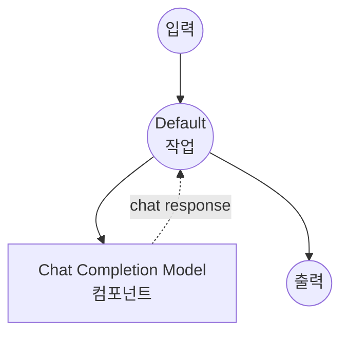

# Chat Completion Model Task 예제

이 예제는 허깅페이스 transformers를 사용한 model-compose의 내장 chat-completion task로 로컬 언어 모델을 사용하여 대화형 AI 기능을 제공하는 방법을 보여줍니다. 외부 API 의존성 없이 작동합니다.

## 개요

이 워크플로우는 다음과 같은 로컬 chat completion을 제공합니다:

1. **로컬 Chat 모델**: 허깅페이스 transformers를 사용하여 로컬에서 사전 훈련된 chat 모델 실행
2. **대화 형식**: 구조화된 대화를 위한 system 및 user 메시지 역할 지원
3. **자동 모델 관리**: 첫 사용 시 모델 자동 다운로드 및 캐싱
4. **외부 API 불필요**: API 의존성 없이 완전한 오프라인 chat completion

## 준비사항

### 필수 요구사항

- model-compose가 설치되어 PATH에서 사용 가능
- SmolLM3-3B 모델 실행을 위한 충분한 시스템 리소스 (권장: 8GB+ RAM)
- transformers 및 torch가 포함된 Python 환경 (자동 관리)

### 로컬 Chat 모델을 사용하는 이유

클라우드 기반 chat API와 달리 로컬 모델 실행은 다음을 제공합니다:

**로컬 처리의 이점:**
- **프라이버시**: 모든 대화가 로컬에서 발생, 외부 서비스로 데이터 전송 없음
- **비용**: 초기 설정 후 토큰당 또는 API 사용 요금 없음
- **오프라인**: 모델 다운로드 후 인터넷 연결 없이 작동
- **지연 시간**: chat 응답에 대한 네트워크 지연 없음
- **사용자 정의**: 모델 매개변수 및 대화 흐름에 대한 완전한 제어
- **재현성**: 동일한 매개변수로 실행 간 일관된 결과

**트레이드오프:**
- **하드웨어 요구사항**: 적절한 RAM 및 처리 능력 필요
- **설정 시간**: 초기 모델 다운로드 및 로딩 시간
- **모델 제한**: 소규모 모델은 대형 클라우드 모델보다 정교한 응답이 부족할 수 있음

### 환경 구성

1. 이 예제 디렉토리로 이동:
   ```bash
   cd examples/model-tasks/chat-completion
   ```

2. 추가 환경 구성 불필요 - 모델 및 의존성 자동 관리

## 실행 방법

1. **서비스 시작:**
   ```bash
   model-compose up
   ```

2. **워크플로우 실행:**

   **API 사용:**
   ```bash
   curl -X POST http://localhost:8080/api/workflows/runs \
     -H "Content-Type: application/json" \
     -d '{
       "input": {
         "system-prompt": "You are a helpful AI assistant.",
         "user-prompt": "Explain quantum computing in simple terms."
       }
     }'
   ```

   **웹 UI 사용:**
   - Web UI 열기: http://localhost:8081
   - system prompt와 user prompt 입력
   - "Run Workflow" 버튼 클릭

   **CLI 사용:**
   ```bash
   model-compose run --input '{
     "system-prompt": "You are a helpful AI assistant.",
     "user-prompt": "Explain quantum computing in simple terms."
   }'
   ```

## 컴포넌트 세부사항

### Chat Completion Model 컴포넌트 (기본)
- **유형**: chat-completion task를 가진 Model 컴포넌트
- **목적**: 사전 훈련된 chat 모델을 사용한 로컬 대화형 AI
- **모델**: HuggingFaceTB/SmolLM3-3B (30억 매개변수 chat 모델)
- **Task**: chat-completion (허깅페이스 transformers 태스크)
- **기능**:
  - 자동 모델 다운로드 및 캐싱
  - System 및 user 메시지 역할 지원
  - 대화 컨텍스트 이해
  - CPU 및 GPU 가속 지원
  - 메모리 효율적인 모델 로딩

### 모델 정보: SmolLM3-3B
- **개발자**: 허깅페이스 (HuggingFaceTB 팀)
- **매개변수**: 30억
- **유형**: Chat 최적화된 causal language 모델
- **훈련**: 대화 작업에 대한 instruction-tuned
- **언어**: 주로 영어, 일부 다국어 기능
- **전문 분야**: 일반 대화, 질문 답변, 작업 지원
- **라이선스**: Apache 2.0

## 워크플로우 세부사항

### "Generate Chat Messages" 워크플로우 (기본)

**설명**: 사전 훈련된 언어 모델을 사용하여 주어진 역할 메시지를 기반으로 chat 메시지 생성

#### 작업 흐름

이 예제는 명시적인 작업 없이 단순화된 단일 컴포넌트 구성을 사용합니다.



#### 입력 매개변수

| 매개변수 | 유형 | 필수 | 기본값 | 설명 |
|---------|------|------|--------|------|
| `system_prompt` | text | 아니오 | - | 어시스턴트의 역할 및 동작을 정의하는 system 메시지 |
| `user_prompt` | text | 예 | - | 어시스턴트가 응답해야 하는 user 메시지 |

#### 출력 형식

| 필드 | 유형 | 설명 |
|-----|------|------|
| `generated` | text | user 메시지에 대한 어시스턴트의 응답 |

## 메시지 형식

chat completion task는 표준 대화 형식을 따릅니다:

### System 메시지
- **역할**: `system`
- **목적**: 어시스턴트의 성격, 역할 및 가이드라인 설정
- **선택사항**: 기본 동작을 위해 생략 가능
- **예제**: "You are a helpful assistant specialized in programming."

### User 메시지
- **역할**: `user`
- **목적**: 사용자의 질문 또는 요청 포함
- **필수**: 대화를 위해 제공되어야 함
- **예제**: "Explain how recursion works in Python."

## 시스템 요구사항

### 최소 요구사항
- **RAM**: 8GB (권장 16GB+)
- **디스크 공간**: 모델 저장 및 캐시를 위한 10GB+
- **CPU**: 멀티코어 프로세서 (4+ 코어 권장)
- **인터넷**: 초기 모델 다운로드에만 필요

### 성능 참고사항
- 첫 실행 시 모델 다운로드 필요 (수 GB)
- 모델 로딩에 하드웨어에 따라 1-2분 소요
- GPU 가속으로 응답 속도 크게 향상
- system prompt 복잡도에 따라 응답 품질 변동 가능

## 사용자 정의

### 다른 모델 사용

다른 chat 가능 모델로 교체:

```yaml
component:
  type: model
  task: chat-completion
  model: microsoft/DialoGPT-medium      # 대화형 모델
  # 또는
  model: HuggingFaceH4/zephyr-7b-beta   # 더 크고 고품질 모델
```

### 모델 매개변수 추가

생성 동작 미세 조정:

```yaml
component:
  type: model
  task: chat-completion
  model: HuggingFaceTB/SmolLM3-3B
  messages:
    - role: system
      content: ${input.system_prompt}
    - role: user
      content: ${input.user_prompt}
  params:
    max_length: 2048
    temperature: ${input.temperature as number | 0.7}
    do_sample: true
    pad_token_id: 50256
```

### 다중 턴 대화

대화 기록을 위한 확장:

```yaml
component:
  type: model
  task: chat-completion
  model: HuggingFaceTB/SmolLM3-3B
  messages:
    - role: system
      content: ${input.system_prompt | "You are a helpful assistant."}
    - role: user
      content: ${input.conversation_history[0].content}
    - role: assistant
      content: ${input.conversation_history[0].response}
    - role: user
      content: ${input.user_prompt}
```

## 문제 해결

### 일반적인 문제

1. **메모리 부족**: 모델 크기 줄이거나 시스템 RAM 업그레이드
2. **모델 다운로드 실패**: 인터넷 연결 및 디스크 공간 확인
3. **느린 응답**: GPU 가속 고려 또는 더 작은 모델 사용
4. **낮은 품질**: 더 큰 모델 시도 또는 더 나은 system prompt 사용

### 성능 최적화

- **GPU 사용**: GPU 가속을 위한 CUDA 호환 PyTorch 설치
- **메모리 관리**: RAM 확보를 위해 다른 애플리케이션 종료
- **모델 선택**: 모델 크기 대 품질 트레이드오프 고려

## API 기반 솔루션과의 비교

| 기능 | 로컬 Chat 모델 | 클라우드 Chat API |
|-----|---------------|-----------------|
| 프라이버시 | 완전한 프라이버시 | 제공자에게 데이터 전송 |
| 비용 | 하드웨어 비용만 | 토큰/요청당 가격 |
| 지연 시간 | 하드웨어 의존적 | 네트워크 + API 지연 |
| 가용성 | 오프라인 가능 | 인터넷 필요 |
| 모델 제어 | 완전한 매개변수 제어 | 제한된 구성 |
| 품질 | 로컬 모델에 따라 다름 | 일반적으로 더 높은 품질 |
| 확장성 | 하드웨어 제한 | 탄력적 확장 |
| 설정 복잡도 | 모델 다운로드 필요 | API 키만 필요 |
