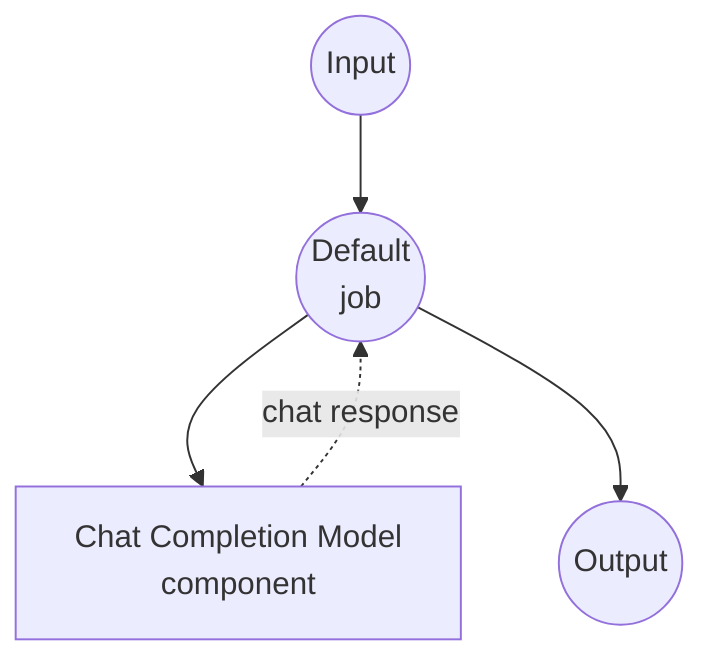

# Chat Completion Model Task Example

This example demonstrates how to use local language models for chat completion using model-compose's built-in chat-completion task with HuggingFace transformers, providing conversational AI capabilities without external API dependencies.

## Overview

This workflow provides local chat completion that:

1. **Local Chat Model**: Runs a pretrained chat model locally using HuggingFace transformers
2. **Conversational Format**: Supports system and user message roles for structured conversations
3. **Automatic Model Management**: Downloads and caches models automatically on first use
4. **No External APIs**: Completely offline chat completion without API dependencies

## Preparation

### Prerequisites

- model-compose installed and available in your PATH
- Sufficient system resources for running SmolLM3-3B model (recommended: 8GB+ RAM)
- Python environment with transformers and torch (automatically managed)

### Why Local Chat Models

Unlike cloud-based chat APIs, local model execution provides:

**Benefits of Local Processing:**
- **Privacy**: All conversations happen locally, no data sent to external services
- **Cost**: No per-token or API usage fees after initial setup
- **Offline**: Works without internet connection after model download
- **Latency**: No network latency for chat responses
- **Customization**: Full control over model parameters and conversation flow
- **Reproducibility**: Consistent results across runs with same parameters

**Trade-offs:**
- **Hardware Requirements**: Requires adequate RAM and processing power
- **Setup Time**: Initial model download and loading time
- **Model Limitations**: Smaller models may have less sophisticated responses than large cloud models

### Environment Configuration

1. Navigate to this example directory:
   ```bash
   cd examples/model-tasks/chat-completion
   ```

2. No additional environment configuration required - model and dependencies are managed automatically.

## How to Run

1. **Start the service:**
   ```bash
   model-compose up
   ```

2. **Run the workflow:**

   **Using API:**
   ```bash
   curl -X POST http://localhost:8080/api/workflows/runs \
     -H "Content-Type: application/json" \
     -d '{
       "input": {
         "system-prompt": "You are a helpful AI assistant.",
         "user-prompt": "Explain quantum computing in simple terms."
       }
     }'
   ```

   **Using Web UI:**
   - Open the Web UI: http://localhost:8081
   - Enter your system prompt and user prompt
   - Click the "Run Workflow" button

   **Using CLI:**
   ```bash
   model-compose run --input '{
     "system-prompt": "You are a helpful AI assistant.",
     "user-prompt": "Explain quantum computing in simple terms."
   }'
   ```

## Component Details

### Chat Completion Model Component (Default)
- **Type**: Model component with chat-completion task
- **Purpose**: Local conversational AI using pretrained chat model
- **Model**: HuggingFaceTB/SmolLM3-3B (3 billion parameter chat model)
- **Task**: chat-completion (HuggingFace transformers task)
- **Features**:
  - Automatic model downloading and caching
  - System and user message role support
  - Conversational context understanding
  - CPU and GPU acceleration support
  - Memory-efficient model loading

### Model Information: SmolLM3-3B
- **Developer**: HuggingFace (HuggingFaceTB team)
- **Parameters**: 3 billion
- **Type**: Chat-optimized causal language model
- **Training**: Instruction-tuned for conversational tasks
- **Languages**: Primarily English, with some multilingual capabilities
- **Specialties**: General conversation, question answering, task assistance
- **License**: Apache 2.0

## Workflow Details

### "Generate Chat Messages" Workflow (Default)

**Description**: Generate chat messages based on a given role message using a pretrained language model.

#### Job Flow

This example uses a simplified single-component configuration without explicit jobs.



#### Input Parameters

| Parameter | Type | Required | Default | Description |
|-----------|------|----------|---------|-------------|
| `system_prompt` | text | No | - | System message defining the assistant's role and behavior |
| `user_prompt` | text | Yes | - | User message that the assistant should respond to |

#### Output Format

| Field | Type | Description |
|-------|------|-------------|
| `generated` | text | The assistant's response to the user message |

## Message Format

The chat completion task follows the standard conversational format:

### System Message
- **Role**: `system`
- **Purpose**: Sets the assistant's personality, role, and guidelines
- **Optional**: Can be omitted for default behavior
- **Example**: "You are a helpful assistant specialized in programming."

### User Message
- **Role**: `user`
- **Purpose**: Contains the user's question or request
- **Required**: Must be provided for the conversation
- **Example**: "Explain how recursion works in Python."

## System Requirements

### Minimum Requirements
- **RAM**: 8GB (recommended 16GB+)
- **Disk Space**: 10GB+ for model storage and cache
- **CPU**: Multi-core processor (4+ cores recommended)
- **Internet**: Required for initial model download only

### Performance Notes
- First run requires model download (several GB)
- Model loading takes 1-2 minutes depending on hardware
- GPU acceleration significantly improves response speed
- Response quality may vary with system prompt complexity

## Customization

### Using Different Models

Replace with other chat-capable models:

```yaml
component:
  type: model
  task: chat-completion
  model: microsoft/DialoGPT-medium      # Conversational model
  # or
  model: HuggingFaceH4/zephyr-7b-beta   # Larger, higher-quality model
```

### Adding Model Parameters

Fine-tune generation behavior:

```yaml
component:
  type: model
  task: chat-completion
  model: HuggingFaceTB/SmolLM3-3B
  action:
    messages:
      - role: system
        content: ${input.system_prompt}
      - role: user
        content: ${input.user_prompt}
    params:
      max_length: 2048
      temperature: ${input.temperature as number | 0.7}
      do_sample: true
      pad_token_id: 50256
```

### Multi-Turn Conversations

Extend for conversation history:

```yaml
component:
  type: model
  task: chat-completion
  model: HuggingFaceTB/SmolLM3-3B
  action:
    messages:
      - role: system
        content: ${input.system_prompt | "You are a helpful assistant."}
      - role: user
        content: ${input.conversation_history[0].content}
      - role: assistant
        content: ${input.conversation_history[0].response}
      - role: user
        content: ${input.user_prompt}
```

## Troubleshooting

### Common Issues

1. **Out of Memory**: Reduce model size or upgrade system RAM
2. **Model Download Fails**: Check internet connection and disk space
3. **Slow Responses**: Consider GPU acceleration or smaller model
4. **Poor Quality**: Try larger models or better system prompts

### Performance Optimization

- **GPU Usage**: Install CUDA-compatible PyTorch for GPU acceleration
- **Memory Management**: Close other applications to free up RAM
- **Model Selection**: Consider model size vs. quality tradeoffs

## Comparison with API-based Solutions

| Feature | Local Chat Model | Cloud Chat API |
|---------|-----------------|----------------|
| Privacy | Complete privacy | Data sent to provider |
| Cost | Hardware cost only | Per-token/request pricing |
| Latency | Hardware dependent | Network + API latency |
| Availability | Offline capable | Internet required |
| Model Control | Full parameter control | Limited configuration |
| Quality | Depends on local model | Usually higher quality |
| Scalability | Hardware limited | Elastic scaling |
| Setup Complexity | Model download required | API key only |

## Advanced Usage

### Role-Based Workflows
```yaml
workflows:
  - id: customer-support
    input:
      system_prompt: "You are a customer support agent. Be helpful, patient, and professional."
      user_prompt: ${input.customer_question}

  - id: code-reviewer
    input:
      system_prompt: "You are a senior software engineer. Review code for bugs, style, and best practices."
      user_prompt: ${input.code_to_review}
```

### Template-Based Responses
```yaml
component:
  type: model
  task: chat-completion
  model: HuggingFaceTB/SmolLM3-3B
  action:
    messages:
      - role: system
        content: |
          You are a ${input.role | "helpful assistant"}.
          ${input.additional_instructions}
          Always be ${input.tone | "professional and friendly"}.
      - role: user
        content: ${input.user_prompt}
```

## Model Variants

Other recommended models for different use cases:

### Smaller Models (Lower Requirements)
- `microsoft/DialoGPT-small` - 117M parameters, faster inference
- `HuggingFaceTB/SmolLM3-1.7B` - 1.7B parameters, good balance

### Larger Models (Higher Quality)
- `HuggingFaceH4/zephyr-7b-beta` - 7B parameters, instruction-tuned
- `microsoft/DialoGPT-large` - 774M parameters, better conversational quality

### Specialized Models
- `microsoft/BlenderBot-400M-distill` - Conversational AI focus
- `facebook/blenderbot-1B-distill` - Engaging personality, casual conversation
