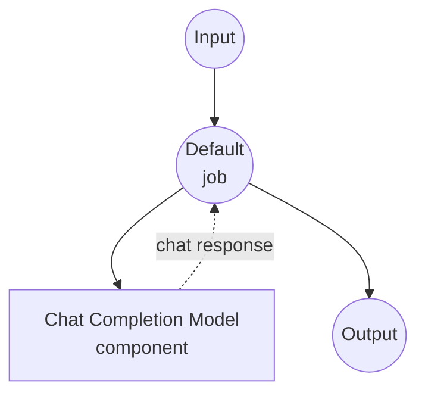

# 聊天完成模型任务示例

此示例演示如何使用 model-compose 的内置聊天完成任务通过 HuggingFace transformers 使用本地语言模型进行聊天完成，提供无需外部 API 依赖的对话 AI 功能。

## 概述

此工作流提供本地聊天完成功能，包括：

1. **本地聊天模型**：使用 HuggingFace transformers 在本地运行预训练聊天模型
2. **对话格式**：支持系统和用户消息角色以进行结构化对话
3. **自动模型管理**：首次使用时自动下载和缓存模型
4. **无外部 API**：完全离线的聊天完成，无 API 依赖

## 准备工作

### 前置条件

- 已安装 model-compose 并在 PATH 中可用
- 运行 SmolLM3-3B 模型的足够系统资源（推荐：8GB+ RAM）
- 具有 transformers 和 torch 的 Python 环境（自动管理）

### 为什么使用本地聊天模型

与基于云的聊天 API 不同，本地模型执行提供：

**本地处理的优势：**
- **隐私**：所有对话都在本地进行，不向外部服务发送数据
- **成本**：初始设置后无按令牌或 API 使用费用
- **离线**：模型下载后可在无互联网连接的情况下工作
- **延迟**：聊天响应无网络延迟
- **自定义**：完全控制模型参数和对话流程
- **可重复性**：使用相同参数跨运行的一致结果

**权衡：**
- **硬件要求**：需要足够的 RAM 和处理能力
- **设置时间**：初始模型下载和加载时间
- **模型限制**：较小的模型可能没有大型云模型那么复杂的响应

### 环境配置

1. 导航到此示例目录：
   ```bash
   cd examples/model-tasks/chat-completion
   ```

2. 无需额外的环境配置 - 模型和依赖项会自动管理。

## 运行方法

1. **启动服务：**
   ```bash
   model-compose up
   ```

2. **运行工作流：**

   **使用 API：**
   ```bash
   curl -X POST http://localhost:8080/api/workflows/runs \
     -H "Content-Type: application/json" \
     -d '{
       "input": {
         "system-prompt": "You are a helpful AI assistant.",
         "user-prompt": "Explain quantum computing in simple terms."
       }
     }'
   ```

   **使用 Web UI：**
   - 打开 Web UI：http://localhost:8081
   - 输入您的系统提示和用户提示
   - 点击 "Run Workflow" 按钮

   **使用 CLI：**
   ```bash
   model-compose run --input '{
     "system-prompt": "You are a helpful AI assistant.",
     "user-prompt": "Explain quantum computing in simple terms."
   }'
   ```

## 组件详情

### 聊天完成模型组件（默认）
- **类型**：具有聊天完成任务的 Model 组件
- **目的**：使用预训练聊天模型的本地对话 AI
- **模型**：HuggingFaceTB/SmolLM3-3B（30 亿参数聊天模型）
- **任务**：chat-completion（HuggingFace transformers 任务）
- **功能**：
  - 自动模型下载和缓存
  - 系统和用户消息角色支持
  - 对话上下文理解
  - CPU 和 GPU 加速支持
  - 内存高效的模型加载

### 模型信息：SmolLM3-3B
- **开发者**：HuggingFace（HuggingFaceTB 团队）
- **参数**：30 亿
- **类型**：针对聊天优化的因果语言模型
- **训练**：针对对话任务进行指令调优
- **语言**：主要是英语，具有一些多语言能力
- **专长**：一般对话、问答、任务协助
- **许可证**：Apache 2.0

## 工作流详情

### "生成聊天消息" 工作流（默认）

**描述**：使用预训练语言模型基于给定的角色消息生成聊天消息。

#### 作业流程

此示例使用简化的单组件配置，没有显式作业。



#### 输入参数

| 参数 | 类型 | 必需 | 默认值 | 描述 |
|-----------|------|----------|---------|-------------|
| `system_prompt` | text | 否 | - | 定义助手角色和行为的系统消息 |
| `user_prompt` | text | 是 | - | 助手应回应的用户消息 |

#### 输出格式

| 字段 | 类型 | 描述 |
|-------|------|-------------|
| `generated` | text | 助手对用户消息的响应 |

## 消息格式

聊天完成任务遵循标准对话格式：

### 系统消息
- **角色**：`system`
- **目的**：设置助手的个性、角色和指南
- **可选**：可以省略以使用默认行为
- **示例**："You are a helpful assistant specialized in programming."

### 用户消息
- **角色**：`user`
- **目的**：包含用户的问题或请求
- **必需**：必须为对话提供
- **示例**："Explain how recursion works in Python."

## 系统要求

### 最低要求
- **RAM**：8GB（推荐 16GB+）
- **磁盘空间**：10GB+ 用于模型存储和缓存
- **CPU**：多核处理器（推荐 4+ 核）
- **互联网**：仅初始模型下载需要

### 性能说明
- 首次运行需要下载模型（数 GB）
- 模型加载需要 1-2 分钟，具体取决于硬件
- GPU 加速显著提高响应速度
- 响应质量可能因系统提示复杂性而异

## 自定义

### 使用不同的模型

替换为其他支持聊天的模型：

```yaml
component:
  type: model
  task: chat-completion
  model: microsoft/DialoGPT-medium      # 对话模型
  # 或
  model: HuggingFaceH4/zephyr-7b-beta   # 更大、更高质量的模型
```

### 添加模型参数

微调生成行为：

```yaml
component:
  type: model
  task: chat-completion
  model: HuggingFaceTB/SmolLM3-3B
  messages:
    - role: system
      content: ${input.system_prompt}
    - role: user
      content: ${input.user_prompt}
  params:
    max_length: 2048
    temperature: ${input.temperature as number | 0.7}
    do_sample: true
    pad_token_id: 50256
```

### 多轮对话

扩展对话历史：

```yaml
component:
  type: model
  task: chat-completion
  model: HuggingFaceTB/SmolLM3-3B
  messages:
    - role: system
      content: ${input.system_prompt | "You are a helpful assistant."}
    - role: user
      content: ${input.conversation_history[0].content}
    - role: assistant
      content: ${input.conversation_history[0].response}
    - role: user
      content: ${input.user_prompt}
```

## 故障排除

### 常见问题

1. **内存不足**：减小模型大小或升级系统 RAM
2. **模型下载失败**：检查互联网连接和磁盘空间
3. **响应缓慢**：考虑 GPU 加速或更小的模型
4. **质量差**：尝试更大的模型或更好的系统提示

### 性能优化

- **GPU 使用**：安装兼容 CUDA 的 PyTorch 以实现 GPU 加速
- **内存管理**：关闭其他应用程序以释放 RAM
- **模型选择**：考虑模型大小与质量权衡

## 与基于 API 的解决方案的比较

| 功能 | 本地聊天模型 | 云聊天 API |
|---------|-----------------|----------------|
| 隐私 | 完全隐私 | 数据发送给提供商 |
| 成本 | 仅硬件成本 | 按令牌/请求定价 |
| 延迟 | 取决于硬件 | 网络 + API 延迟 |
| 可用性 | 离线能力 | 需要互联网 |
| 模型控制 | 完全参数控制 | 有限配置 |
| 质量 | 取决于本地模型 | 通常质量更高 |
| 可扩展性 | 硬件限制 | 弹性扩展 |
| 设置复杂性 | 需要模型下载 | 仅需 API 密钥 |

## 高级用法

### 基于角色的工作流
```yaml
workflows:
  - id: customer-support
    input:
      system_prompt: "You are a customer support agent. Be helpful, patient, and professional."
      user_prompt: ${input.customer_question}

  - id: code-reviewer
    input:
      system_prompt: "You are a senior software engineer. Review code for bugs, style, and best practices."
      user_prompt: ${input.code_to_review}
```

### 基于模板的响应
```yaml
component:
  type: model
  task: chat-completion
  model: HuggingFaceTB/SmolLM3-3B
  messages:
    - role: system
      content: |
        You are a ${input.role | "helpful assistant"}.
        ${input.additional_instructions}
        Always be ${input.tone | "professional and friendly"}.
    - role: user
      content: ${input.user_prompt}
```

## 模型变体

其他推荐用于不同用例的模型：

### 较小的模型（较低要求）
- `microsoft/DialoGPT-small` - 117M 参数，更快的推理
- `HuggingFaceTB/SmolLM3-1.7B` - 17 亿参数，良好的平衡

### 更大的模型（更高质量）
- `HuggingFaceH4/zephyr-7b-beta` - 70 亿参数，指令调优
- `microsoft/DialoGPT-large` - 774M 参数，更好的对话质量

### 专业模型
- `microsoft/BlenderBot-400M-distill` - 专注于对话 AI
- `facebook/blenderbot-1B-distill` - 引人入胜的个性，休闲对话
