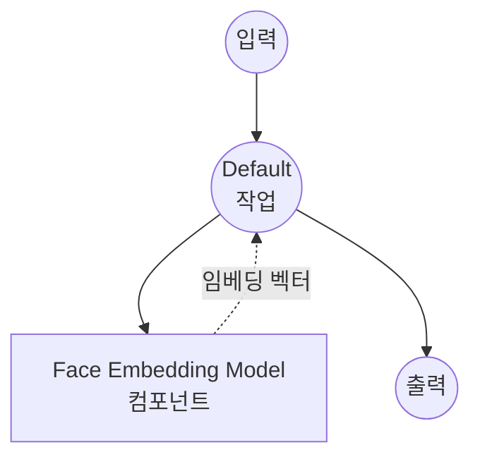

# Face Embedding Model Task 예제

이 예제는 model-compose의 내장 `face-embedding` 작업과 InsightFace를 사용하여 이미지에서 얼굴 아이덴티티 임베딩을 추출하는 방법을 보여주며, 신원 확인, 클러스터링, 유사도 검색에 적합한 오프라인 얼굴 벡터 추출 기능을 제공합니다.

## 개요

이 워크플로우는 다음과 같은 로컬 얼굴 임베딩 추출을 제공합니다:

1. **로컬 얼굴 임베딩 모델**: 외부 API 없이 InsightFace의 `antelopev2` 모델 팩을 로컬에서 실행
2. **아이덴티티 벡터**: 이미지에서 가장 지배적인 얼굴을 나타내는 정규화된 임베딩 벡터 추출
3. **자동 감지 및 정렬**: 임베딩 전에 얼굴을 자동으로 감지, 정렬, 크롭
4. **다운스트림 활용**: 반환된 임베딩을 벡터 스토어나 유사도 지표(cosine, L2)에 바로 투입 가능
5. **자동 모델 관리**: 로컬 `antelopev2` 모델 팩을 로드; 한 번만 다운로드하면 이후 재사용

## 준비사항

### 필수 요구사항

- model-compose가 설치되어 PATH에서 사용 가능
- onnxruntime 실행을 위한 충분한 시스템 리소스 (권장: 4GB+ RAM)
- `insightface`, `opencv-python`, `onnxruntime`이 있는 Python 환경 (첫 실행 시 자동 설치)
- `./.models/antelopev2` 경로에 배치된 `antelopev2` 모델 팩

### antelopev2 모델 팩 다운로드

InsightFace에서 모델 팩을 다운로드하여 `./.models/antelopev2` 아래에 배치합니다:

```bash
mkdir -p models
# InsightFace 모델 저장소에서 antelopev2.zip을 다운로드하여 ./.models/antelopev2에 압축 해제
```

예상 구조:

```
.models/
└── antelopev2/
    ├── 1k3d68.onnx
    ├── 2d106det.onnx
    ├── genderage.onnx
    ├── glintr100.onnx
    └── scrfd_10g_bnkps.onnx
```

### 환경 구성

1. 이 예제 디렉토리로 이동:
   ```bash
   cd examples/model-tasks/face-embedding
   ```

2. `./.models/antelopev2` 아래에 모델 팩을 배치하는 것 외에 추가 환경 구성 불필요.

## 실행 방법

1. **서비스 시작:**
   ```bash
   model-compose up
   ```

2. **워크플로우 실행:**

   **API 사용:**
   ```bash
   curl -X POST http://localhost:8080/api/workflows/runs \
     -F "face=@/path/to/face.jpg" \
     -F 'input={"face_image": "@face"}'
   ```

   **Web UI 사용:**
   - Web UI 열기: http://localhost:8081
   - 최소 1개의 얼굴을 포함하는 `face_image` 업로드
   - "Run Workflow" 버튼 클릭

   **CLI 사용:**
   ```bash
   model-compose run --input '{"face_image": "/path/to/face.jpg"}'
   ```

## 컴포넌트 세부사항

### Face Embedding Model 컴포넌트 (기본)
- **유형**: `face-embedding` 작업을 사용하는 Model 컴포넌트
- **패밀리**: `insightface`
- **모델**: 로컬 `./.models/antelopev2` 팩
- **기능**:
  - 임베딩 이전에 얼굴 감지 및 정렬 수행
  - 얼굴당 고정 차원의 아이덴티티 벡터 생성
  - onnxruntime을 통한 CPU 또는 GPU 추론
  - GPU 메모리 제한을 위해 순차 실행 (`max_concurrent_count: 1`)

### 모델 정보: antelopev2 (InsightFace)
- **제공자**: InsightFace
- **백본**: ResNet-100 (`glintr100.onnx`)
- **임베딩 차원**: 512
- **감지기**: SCRFD-10G (`scrfd_10g_bnkps.onnx`)
- **정규화**: L2 정규화된 임베딩 — 코사인 유사도는 내적과 동일
- **라이센스**: 비상업적 연구 용도 전용

## 워크플로우 세부사항

### 기본 워크플로우

**설명**: InsightFace의 `antelopev2` 팩을 사용하여 이미지에서 얼굴 아이덴티티 임베딩을 추출합니다.

#### 작업 흐름

이 예제는 명시적인 작업 없이 단순화된 단일 컴포넌트 구성을 사용합니다.



#### 입력 매개변수

| 매개변수 | 유형 | 필수 | 기본값 | 설명 |
|---------|------|------|--------|------|
| `face_image` | image | 예 | - | 최소 1개의 얼굴을 포함하는 입력 이미지 |

#### 출력 형식

| 필드 | 유형 | 설명 |
|-----|------|------|
| `embedding` | json (number[]) | 지배적인 얼굴의 아이덴티티 임베딩 벡터 (L2 정규화됨) |

## 시스템 요구사항

### 최소 요구사항
- **RAM**: 4GB (권장 8GB+)
- **디스크 공간**: `antelopev2` 팩용 약 1GB
- **CPU**: 최신 x86_64 또는 ARM64 프로세서
- **인터넷**: 일회성 모델 팩 다운로드에만 필요

### 성능 참고사항
- 첫 실행 시 onnxruntime과 감지기 초기화 — 이후 실행이 더 빠름
- GPU (onnxruntime을 통한 CUDA / CoreML / DirectML)는 처리량을 크게 향상시킴
- 처리 시간은 이미지 파일 크기가 아닌 감지 해상도에 비례

## 사용자 정의

### 다른 InsightFace 팩 사용

`model` 필드를 다른 로컬 팩(예: `buffalo_l`)으로 지정:

```yaml
component:
  type: model
  task: face-embedding
  family: insightface
  model: ./.models/buffalo_l
  action:
    image: ${input.face_image as image}
```

### 배치 임베딩

한 번의 워크플로우 실행으로 여러 얼굴 이미지 처리:

```yaml
workflow:
  title: 배치 얼굴 임베딩
  jobs:
    - id: embed
      component: face-embedder
      repeat_count: ${input.image_count}
      input:
        face_image: ${input.images[${index}]}
```

### 벡터 스토어로 투입

임베딩을 벡터 스토어 컴포넌트에 바로 파이핑:

```yaml
workflow:
  jobs:
    - id: embed
      component: face-embedder
      input:
        face_image: ${input.face_image}
    - id: upsert
      component: vector-store
      input:
        id: ${input.user_id}
        vector: ${embed.embedding}
```

## 문제 해결

### 일반적인 문제

1. **얼굴이 감지되지 않음**: 입력 이미지에 정면을 향한 명확한 얼굴이 있는지 확인; 필요 시 모델 팩의 감지기 신뢰도 임계값을 낮추기
2. **모델 파일 없음**: `./.models/antelopev2` 디렉토리에 위에 나열된 모든 `.onnx` 파일이 있는지 확인
3. **onnxruntime 설치 실패**: 일부 플랫폼에서는 `onnxruntime-gpu` 또는 `onnxruntime-silicon`을 명시적으로 설치해야 할 수 있음
4. **첫 실행이 느림**: 모델 로딩에 수 초가 걸림 — 지연이 중요한 경우 `preload: true` 스타일의 장기 실행 서비스 유지

### 성능 최적화

- **GPU**: 더 빠른 추론을 위해 `onnxruntime-gpu` (CUDA) 또는 `onnxruntime-silicon` (Apple) 설치
- **얼굴 감지 크기**: 감지 입력이 클수록 작은 얼굴에 대한 재현율이 향상되지만 추론이 느려짐
- **동시 요청**: GPU 메모리가 허용하는 경우에만 `max_concurrent_count` 증가

## 유사도 비교

임베딩이 L2 정규화되어 있으므로 유사도는 내적입니다:

```python
import numpy as np

def cosine_similarity(a, b):
    return float(np.dot(a, b))

# 동일 인물: 유사도 ≈ 0.6 – 0.9
# 다른 인물: 유사도 ≈ 0.0 – 0.3
```

일반적인 임계값:
- `> 0.6`: 동일 인물 (높은 신뢰도)
- `0.4 – 0.6`: 동일 인물 (중간 신뢰도)
- `< 0.4`: 다른 인물

## 관련 예제

- `face-swap`: 소스 이미지의 얼굴 아이덴티티를 타겟 이미지로 전이
- `image-embedding`: 시각적 유사도 검색을 위한 범용 이미지 임베딩
