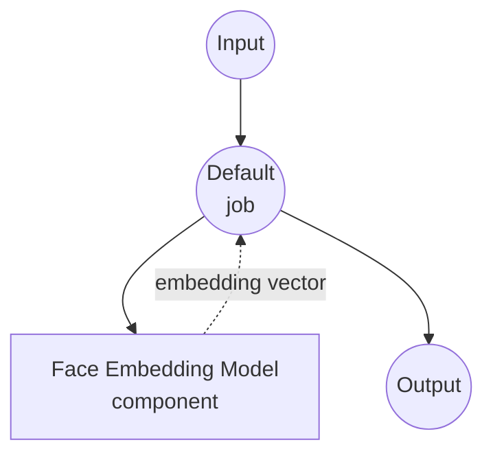

# Face Embedding Model Task Example

This example demonstrates how to extract face identity embeddings from images using InsightFace via model-compose's built-in `face-embedding` task, providing offline face-vector extraction suitable for identity verification, clustering, and similarity search.

## Overview

This workflow provides local face embedding extraction that:

1. **Local Face Embedding Model**: Runs InsightFace's `antelopev2` model pack locally without external APIs
2. **Identity Vector**: Extracts a normalized embedding vector representing the dominant face in the image
3. **Automatic Detection & Alignment**: Detects, aligns, and crops the face automatically before embedding
4. **Downstream Ready**: The returned embedding can be fed directly into vector stores or similarity metrics (cosine, L2)
5. **Automatic Model Management**: Loads the local `antelopev2` model pack; download it once and reuse across runs

## Preparation

### Prerequisites

- model-compose installed and available in your PATH
- Sufficient system resources to run onnxruntime (recommended: 4GB+ RAM)
- Python environment with `insightface`, `opencv-python`, and `onnxruntime` (installed automatically on first run)
- The `antelopev2` model pack placed at `./.models/antelopev2`

### Downloading the antelopev2 Model Pack

Download the model pack from InsightFace and place it under `./.models/antelopev2`:

```bash
mkdir -p models
# Download antelopev2.zip from the InsightFace model zoo and extract it into ./.models/antelopev2
```

The expected layout is:

```
.models/
└── antelopev2/
    ├── 1k3d68.onnx
    ├── 2d106det.onnx
    ├── genderage.onnx
    ├── glintr100.onnx
    └── scrfd_10g_bnkps.onnx
```

### Environment Configuration

1. Navigate to this example directory:
   ```bash
   cd examples/model-tasks/face-embedding
   ```

2. No additional environment configuration required beyond placing the model pack under `./.models/antelopev2`.

## How to Run

1. **Start the service:**
   ```bash
   model-compose up
   ```

2. **Run the workflow:**

   **Using API:**
   ```bash
   curl -X POST http://localhost:8080/api/workflows/runs \
     -F "face=@/path/to/face.jpg" \
     -F 'input={"face_image": "@face"}'
   ```

   **Using Web UI:**
   - Open the Web UI: http://localhost:8081
   - Upload a `face_image` containing at least one face
   - Click the "Run Workflow" button

   **Using CLI:**
   ```bash
   model-compose run --input '{"face_image": "/path/to/face.jpg"}'
   ```

## Component Details

### Face Embedding Model Component (Default)
- **Type**: Model component with `face-embedding` task
- **Family**: `insightface`
- **Model**: local `./.models/antelopev2` pack
- **Features**:
  - Face detection and alignment before embedding
  - Produces a fixed-dimension identity vector per face
  - CPU or GPU inference via onnxruntime
  - Serial execution (`max_concurrent_count: 1`) to keep GPU memory bounded

### Model Information: antelopev2 (InsightFace)
- **Provider**: InsightFace
- **Backbone**: ResNet-100 (`glintr100.onnx`)
- **Embedding Dimension**: 512
- **Detector**: SCRFD-10G (`scrfd_10g_bnkps.onnx`)
- **Normalization**: L2-normalized embeddings — cosine similarity is equivalent to a dot product
- **License**: Non-commercial research use only

## Workflow Details

### Default Workflow

**Description**: Extract a face identity embedding from an image using InsightFace's `antelopev2` pack.

#### Job Flow

This example uses a simplified single-component configuration without explicit jobs.



#### Input Parameters

| Parameter | Type | Required | Default | Description |
|-----------|------|----------|---------|-------------|
| `face_image` | image | Yes | - | Input image containing at least one face |

#### Output Format

| Field | Type | Description |
|-------|------|-------------|
| `embedding` | json (number[]) | Identity embedding vector of the dominant face (L2-normalized) |

## System Requirements

### Minimum Requirements
- **RAM**: 4GB (recommended 8GB+)
- **Disk Space**: ~1GB for the `antelopev2` pack
- **CPU**: Any modern x86_64 or ARM64 processor
- **Internet**: Required for the one-time model pack download

### Performance Notes
- First run initializes onnxruntime and the detector — subsequent runs are faster
- GPU (CUDA / CoreML / DirectML via onnxruntime) significantly improves throughput
- Processing time scales with detection resolution, not with image file size

## Customization

### Using a Different InsightFace Pack

Point the `model` field at another local pack (e.g. `buffalo_l`):

```yaml
component:
  type: model
  task: face-embedding
  family: insightface
  model: ./.models/buffalo_l
  action:
    image: ${input.face_image as image}
```

### Batch Embedding

Process multiple face images in a single workflow run:

```yaml
workflow:
  title: Batch Face Embedding
  jobs:
    - id: embed
      component: face-embedder
      repeat_count: ${input.image_count}
      input:
        face_image: ${input.images[${index}]}
```

### Feeding Into a Vector Store

Pipe the embedding directly into a vector-store component:

```yaml
workflow:
  jobs:
    - id: embed
      component: face-embedder
      input:
        face_image: ${input.face_image}
    - id: upsert
      component: vector-store
      input:
        id: ${input.user_id}
        vector: ${embed.embedding}
```

## Troubleshooting

### Common Issues

1. **No face detected**: Ensure the input image contains a clear, front-facing face; lower the detector's confidence threshold in the model pack if needed
2. **Model files not found**: Verify the `./.models/antelopev2` directory contains all `.onnx` files listed above
3. **onnxruntime install fails**: On some platforms you may need `onnxruntime-gpu` or `onnxruntime-silicon` explicitly
4. **Slow first run**: Model loading takes several seconds — keep `preload: true`-style long-lived services if latency matters

### Performance Optimization

- **GPU**: Install `onnxruntime-gpu` (CUDA) or `onnxruntime-silicon` (Apple) for faster inference
- **Face Detection Size**: Larger detection input improves recall on small faces but slows down inference
- **Concurrent Requests**: Increase `max_concurrent_count` only if GPU memory allows

## Similarity Comparison

Because embeddings are L2-normalized, similarity is a dot product:

```python
import numpy as np

def cosine_similarity(a, b):
    return float(np.dot(a, b))

# Same identity: similarity ≈ 0.6 – 0.9
# Different identity: similarity ≈ 0.0 – 0.3
```

Typical thresholds:
- `> 0.6`: same person (high confidence)
- `0.4 – 0.6`: same person (medium confidence)
- `< 0.4`: different person

## Related Examples

- `face-swap`: Transfer a face identity from a source image to a target image
- `image-embedding`: Generic image embedding for visual similarity search
