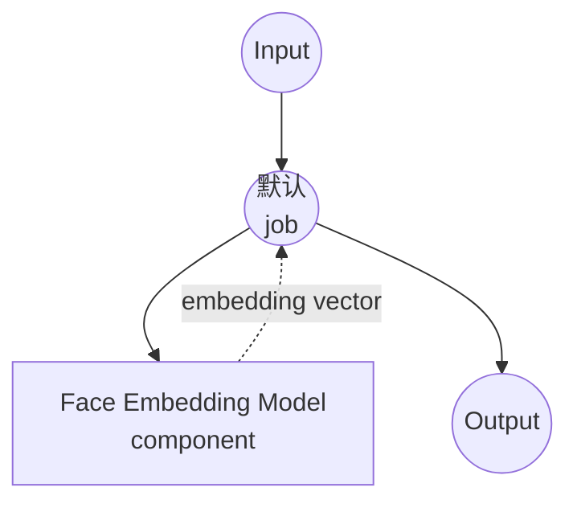

# 人脸嵌入模型任务示例

本示例演示如何通过 model-compose 的内置 `face-embedding` 任务使用 InsightFace 从图像中提取人脸身份嵌入，提供适用于身份验证、聚类和相似度搜索的离线人脸向量提取功能。

## 概述

此工作流提供本地人脸嵌入提取功能：

1. **本地人脸嵌入模型**：在本地运行 InsightFace 的 `antelopev2` 模型包，无需外部 API
2. **身份向量**：提取表示图像中主要人脸的归一化嵌入向量
3. **自动检测与对齐**：在嵌入前自动检测、对齐和裁剪人脸
4. **可用于下游**：返回的嵌入可直接输入向量存储或相似度指标（cosine、L2）
5. **自动模型管理**：加载本地 `antelopev2` 模型包；下载一次即可跨运行复用

## 准备工作

### 先决条件

- 已安装 model-compose 并在 PATH 中可用
- 运行 onnxruntime 所需的充足系统资源（推荐：4GB+ RAM）
- 带有 `insightface`、`opencv-python` 和 `onnxruntime` 的 Python 环境（首次运行时自动安装）
- 将 `antelopev2` 模型包放置在 `./.models/antelopev2`

### 下载 antelopev2 模型包

从 InsightFace 下载模型包并放置在 `./.models/antelopev2` 下：

```bash
mkdir -p models
# 从 InsightFace 模型库下载 antelopev2.zip 并解压到 ./.models/antelopev2
```

预期结构：

```
.models/
└── antelopev2/
    ├── 1k3d68.onnx
    ├── 2d106det.onnx
    ├── genderage.onnx
    ├── glintr100.onnx
    └── scrfd_10g_bnkps.onnx
```

### 环境配置

1. 导航到此示例目录：
   ```bash
   cd examples/model-tasks/face-embedding
   ```

2. 除了将模型包放置在 `./.models/antelopev2` 下之外，无需额外的环境配置。

## 如何运行

1. **启动服务：**
   ```bash
   model-compose up
   ```

2. **运行工作流：**

   **使用 API：**
   ```bash
   curl -X POST http://localhost:8080/api/workflows/runs \
     -F "face=@/path/to/face.jpg" \
     -F 'input={"face_image": "@face"}'
   ```

   **使用 Web UI：**
   - 打开 Web UI：http://localhost:8081
   - 上传至少包含一张人脸的 `face_image`
   - 点击"Run Workflow"按钮

   **使用 CLI：**
   ```bash
   model-compose run --input '{"face_image": "/path/to/face.jpg"}'
   ```

## 组件详情

### 人脸嵌入模型组件（默认）
- **类型**：带 `face-embedding` 任务的模型组件
- **系列**：`insightface`
- **模型**：本地 `./.models/antelopev2` 包
- **功能**：
  - 嵌入前进行人脸检测和对齐
  - 每张人脸生成固定维度的身份向量
  - 通过 onnxruntime 进行 CPU 或 GPU 推理
  - 顺序执行（`max_concurrent_count: 1`）以限制 GPU 内存

### 模型信息：antelopev2 (InsightFace)
- **提供者**：InsightFace
- **主干网络**：ResNet-100 (`glintr100.onnx`)
- **嵌入维度**：512
- **检测器**：SCRFD-10G (`scrfd_10g_bnkps.onnx`)
- **归一化**：L2 归一化嵌入 — 余弦相似度等同于点积
- **许可证**：仅限非商业研究用途

## 工作流详情

### 默认工作流

**描述**：使用 InsightFace 的 `antelopev2` 包从图像中提取人脸身份嵌入。

#### 作业流程

此示例使用简化的单组件配置，没有显式作业。



#### 输入参数

| 参数 | 类型 | 必需 | 默认值 | 描述 |
|-----|------|------|--------|------|
| `face_image` | image | 是 | - | 至少包含一张人脸的输入图像 |

#### 输出格式

| 字段 | 类型 | 描述 |
|-----|------|------|
| `embedding` | json (number[]) | 主要人脸的身份嵌入向量（L2 归一化） |

## 系统要求

### 最低要求
- **RAM**：4GB（推荐 8GB+）
- **磁盘空间**：`antelopev2` 包约 1GB
- **CPU**：任何现代 x86_64 或 ARM64 处理器
- **互联网**：仅用于一次性模型包下载

### 性能说明
- 首次运行会初始化 onnxruntime 和检测器 — 后续运行更快
- GPU（通过 onnxruntime 的 CUDA / CoreML / DirectML）可显著提高吞吐量
- 处理时间与检测分辨率成比例，而非图像文件大小

## 自定义

### 使用不同的 InsightFace 包

将 `model` 字段指向另一个本地包（例如 `buffalo_l`）：

```yaml
component:
  type: model
  task: face-embedding
  family: insightface
  model: ./.models/buffalo_l
  action:
    image: ${input.face_image as image}
```

### 批量嵌入

在单次工作流运行中处理多张人脸图像：

```yaml
workflow:
  title: Batch Face Embedding
  jobs:
    - id: embed
      component: face-embedder
      repeat_count: ${input.image_count}
      input:
        face_image: ${input.images[${index}]}
```

### 输入到向量存储

将嵌入直接管道输入向量存储组件：

```yaml
workflow:
  jobs:
    - id: embed
      component: face-embedder
      input:
        face_image: ${input.face_image}
    - id: upsert
      component: vector-store
      input:
        id: ${input.user_id}
        vector: ${embed.embedding}
```

## 故障排除

### 常见问题

1. **未检测到人脸**：确保输入图像包含清晰的正面人脸；如有需要可降低模型包中检测器的置信度阈值
2. **找不到模型文件**：确认 `./.models/antelopev2` 目录包含上面列出的所有 `.onnx` 文件
3. **onnxruntime 安装失败**：在某些平台上您可能需要显式安装 `onnxruntime-gpu` 或 `onnxruntime-silicon`
4. **首次运行缓慢**：模型加载需要几秒 — 如果延迟很重要，请保持 `preload: true` 风格的长时运行服务

### 性能优化

- **GPU**：安装 `onnxruntime-gpu`（CUDA）或 `onnxruntime-silicon`（Apple）以加快推理
- **人脸检测尺寸**：较大的检测输入可提高对小人脸的召回率，但会减慢推理速度
- **并发请求**：仅在 GPU 内存允许时才增加 `max_concurrent_count`

## 相似度比较

由于嵌入是 L2 归一化的，相似度即为点积：

```python
import numpy as np

def cosine_similarity(a, b):
    return float(np.dot(a, b))

# 同一身份：相似度 ≈ 0.6 – 0.9
# 不同身份：相似度 ≈ 0.0 – 0.3
```

典型阈值：
- `> 0.6`：同一人（高置信度）
- `0.4 – 0.6`：同一人（中等置信度）
- `< 0.4`：不同人

## 相关示例

- `face-swap`：将源图像的人脸身份转移到目标图像
- `image-embedding`：用于视觉相似度搜索的通用图像嵌入
