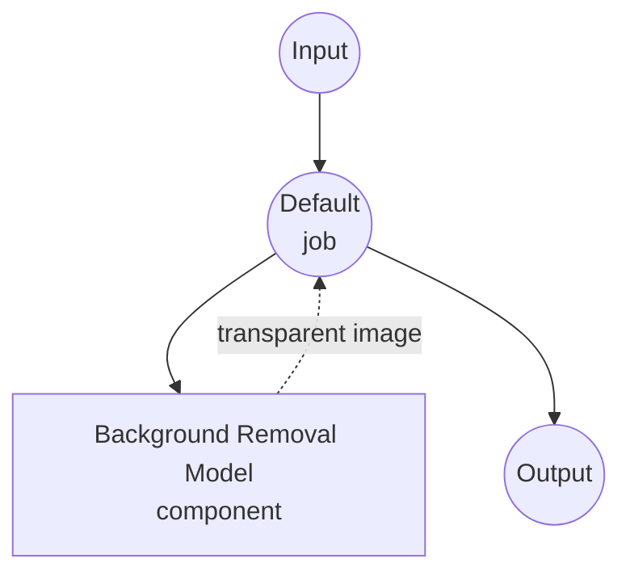

# Image Background Removal Model Task 예제

이 예제는 BiRefNet을 사용한 model-compose의 내장 image-background-removal task로 로컬 segmentation 모델을 사용하여 오프라인 이미지 배경 제거 기능을 제공하는 방법을 보여줍니다.

## 개요

이 워크플로우는 다음과 같은 로컬 이미지 배경 제거를 제공합니다:

1. **로컬 Segmentation 모델**: 고품질 전경 마스크를 생성하기 위해 BiRefNet 모델을 로컬에서 실행
2. **RGBA 또는 Mask 출력**: 투명 PNG(RGBA) 또는 단일 채널 마스크 반환
3. **자동 모델 관리**: 첫 사용 시 모델 자동 다운로드 및 캐싱
4. **외부 API 불필요**: 의존성 없이 완전한 오프라인 이미지 처리
5. **실시간 처리**: 대화형 애플리케이션에 적합한 빠른 추론

## 준비사항

### 필수 요구사항

- model-compose가 설치되어 PATH에서 사용 가능
- BiRefNet 실행을 위한 충분한 시스템 리소스 (권장: 8GB+ RAM, GPU 선호)
- torch, torchvision, transformers, PIL이 포함된 Python 환경 (자동 관리)

### 로컬 배경 제거 모델을 사용하는 이유

클라우드 기반 배경 제거 API(remove.bg, Photoroom)와 달리 로컬 모델 실행은 다음을 제공합니다:

**로컬 처리의 이점:**
- **프라이버시**: 모든 이미지 처리가 로컬에서 발생, 외부 서비스로 이미지 전송 없음
- **비용**: 초기 설정 후 이미지당 또는 API 사용 요금 없음
- **오프라인**: 모델 다운로드 후 인터넷 연결 없이 작동
- **지연시간**: 이미지 처리에 네트워크 지연 없음
- **품질 제어**: 일관되고 결정적인 segmentation 결과
- **배치 처리**: rate limit 없이 무제한 이미지 처리

**트레이드오프:**
- **하드웨어 요구사항**: 적절한 RAM과 VRAM 필요 (GPU 권장)
- **설정 시간**: 초기 모델 다운로드 및 로딩 시간
- **처리 시간**: 큰 이미지는 처리에 더 오래 걸림
- **메모리 사용량**: 큰 입력 이미지는 높은 메모리 요구량

### 환경 설정

1. 이 예제 디렉토리로 이동:
   ```bash
   cd examples/model-tasks/image-background-removal
   ```

2. 추가 환경 설정 불필요 - 모델과 의존성이 자동 관리됨

## 실행 방법

1. **서비스 시작:**
   ```bash
   model-compose up
   ```

2. **워크플로우 실행:**

   **API 사용:**
   ```bash
   curl -X POST http://localhost:8080/api/workflows/runs \
     -H "Content-Type: multipart/form-data" \
     -F "image=@/path/to/your/input-image.jpg"
   ```

   **Web UI 사용:**
   - Web UI 열기: http://localhost:8081
   - 입력 파라미터 입력
   - "Run Workflow" 버튼 클릭

   **CLI 사용:**
   ```bash
   model-compose run image-background-removal --input '{"image": "/path/to/your/input-image.jpg"}'
   ```

## 컴포넌트 상세

### Image Background Removal 모델 컴포넌트 (기본)
- **타입**: image-background-removal task를 사용하는 Model 컴포넌트
- **목적**: 배경 제거를 위한 로컬 salient object segmentation
- **모델**: ZhengPeng7/BiRefNet
- **아키텍처**: BiRefNet (Bilateral Reference Network, 고해상도 dichotomous segmentation)
- **기능**:
  - 고품질 전경/배경 분리
  - 자동 모델 다운로드 및 캐싱
  - 다양한 이미지 형식 지원
  - GPU 가속 지원
  - RGBA 투명 출력 또는 단일 채널 마스크

### 모델 정보: BiRefNet

- **개발자**: ZhengPeng7 (오픈 소스)
- **아키텍처**: dichotomous image segmentation을 위한 Bilateral Reference Network
- **학습**: DIS5K, HRSOD 및 기타 고해상도 segmentation 데이터셋
- **강점**: 머리카락, 털, 반투명 경계 등 세부 디테일 보존 우수
- **입력/출력**: RGB 이미지 → 알파 마스크 (또는 투명 RGBA 출력)
- **라이선스**: MIT

## 워크플로우 상세

### "Remove Image Background" 워크플로우 (기본)

**설명**: 사전 학습된 segmentation 모델을 사용하여 입력 이미지의 배경을 제거합니다.

#### Job 흐름

이 예제는 명시적인 job 없이 단순화된 단일 컴포넌트 구성을 사용합니다.



#### 입력 파라미터

| 파라미터 | 타입 | 필수 | 기본값 | 설명 |
|---------|------|------|--------|------|
| `image` | image | 예 | - | 입력 이미지 파일 (JPEG, PNG 등) |

#### 출력 형식

| 필드 | 타입 | 설명 |
|------|------|------|
| - | image | 배경이 제거된 RGBA 이미지 (투명) |

## 시스템 요구사항

### 최소 요구사항
- **RAM**: 8GB (권장 16GB+)
- **VRAM**: 2GB GPU 메모리 (권장 4GB+)
- **디스크 공간**: 모델 저장 및 캐시용 2GB+
- **CPU**: 멀티코어 프로세서 (4코어 이상 권장)
- **인터넷**: 초기 모델 다운로드 시에만 필요

### 성능 참고사항
- 첫 실행 시 모델 다운로드 필요 (~900MB)
- 하드웨어에 따라 모델 로딩에 10-30초 소요
- GPU 가속 시 처리 속도가 크게 향상됨
- 처리 시간은 `input_size` 파라미터에 따라 조정됨 (기본 1024×1024)
- 일반 GPU 추론: 이미지당 0.1-0.3초
- 일반 CPU 추론: 이미지당 3-8초

## 성능 최적화

### GPU 가속
최적 성능을 위해 CUDA 호환 PyTorch 설치를 확인하세요:
```bash
# 예시: CUDA 지원 PyTorch 설치
pip install torch torchvision --index-url https://download.pytorch.org/whl/cu118
```

### 메모리 관리
- **큰 이미지**: 메모리 제약 환경에서는 `input_size`를 줄이세요 (예: 768)
- **배치 처리**: VRAM에 맞게 `batch_size` 조정
- **시스템 리소스**: 처리 중 다른 애플리케이션 종료

### 처리 팁
- **Input Size**: 1024가 품질과 속도의 균형점. 빠른 처리는 512, 최대 디테일은 2048
- **형식 선택**: PNG는 출력 투명도를 보존
- **전처리**: 조명이 좋고 경계가 뚜렷한 피사체가 최고의 결과를 냄

## 커스터마이징

### 출력 형식

투명 RGBA 이미지 대신 단일 채널 마스크 반환:

```yaml
component:
  type: model
  task: image-background-removal
  model:
    provider: huggingface
    repository: ZhengPeng7/BiRefNet
  action:
    image: ${input.image as image}
    output_format: mask   # single-channel L mode image
```

### 입력 해상도 조정

```yaml
component:
  type: model
  task: image-background-removal
  model:
    provider: huggingface
    repository: ZhengPeng7/BiRefNet
  action:
    image: ${input.image as image}
    params:
      input_size: 2048   # 더 높은 디테일, 느린 추론
```

### 대체 모델 사용

동일한 입력/출력 방식으로 `AutoModelForImageSegmentation`을 노출하는 HuggingFace 모델은 모두 사용 가능:

```yaml
component:
  type: model
  task: image-background-removal
  model:
    provider: huggingface
    repository: briaai/RMBG-2.0    # BiRefNet 기반, 고품질 (라이선스 확인 필요)
  action:
    image: ${input.image as image}
```

### 배치 처리 설정

```yaml
workflow:
  title: Batch Background Removal
  jobs:
    - id: remove-backgrounds
      component: bg-remover
      repeat_count: ${input.image_count}
      input:
        image: ${input.images[${index}]}
```

## 문제 해결

### 일반적인 문제

1. **메모리 부족**: `input_size`나 `batch_size`를 줄이거나 더 작은 모델 변형 사용
2. **모델 다운로드 실패**: 인터넷 연결 및 디스크 공간 확인
3. **느린 처리**: GPU 가속 활성화 확인
4. **거친 경계**: 더 세밀한 디테일을 위해 `input_size` 증가
5. **누락된 영역**: 피사체가 배경과 잘 구분되는지 확인

## API 기반 솔루션과의 비교

| 기능 | 로컬 배경 제거 | 클라우드 배경 제거 API |
|------|---------------|----------------------|
| 프라이버시 | 완전한 프라이버시 | 이미지가 제공업체로 전송됨 |
| 비용 | 하드웨어 비용만 | 이미지당 가격 |
| 지연시간 | 하드웨어 의존적 | 네트워크 + 처리 지연시간 |
| 가용성 | 오프라인 가능 | 인터넷 필요 |
| 품질 제어 | 일관된 결과 | 가변적 품질 |
| 배치 처리 | 무제한 | rate limit 있음 |
| 커스터마이징 | 모델 선택, 파라미터 | 제한된 API 옵션 |
| 설정 복잡성 | 모델 다운로드 필요 | API 키만 필요 |
| 파일 크기 제한 | 하드웨어에 의해 제한 | API 제한 |

## 모델 변형

### 권장 모델

- **ZhengPeng7/BiRefNet**: 기본. MIT 라이선스, 고품질, ~900MB
- **ZhengPeng7/BiRefNet_lite**: 더 가볍고 빠름, 약간의 품질 트레이드오프
- **briaai/RMBG-2.0**: BiRefNet 기반, 뛰어난 품질 (상업용은 라이선스 확인)
- **briaai/RMBG-1.4**: 더 작은 ISNet 기반 모델, 빠른 추론
