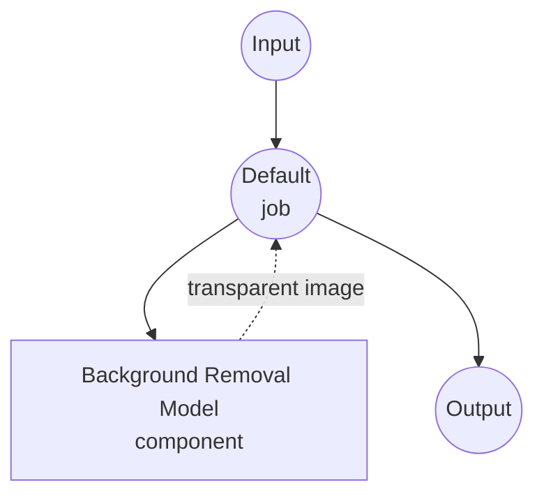

# Image Background Removal Model Task Example

This example demonstrates how to use local segmentation models for removing image backgrounds using model-compose's built-in image-background-removal task with BiRefNet, providing offline background removal capabilities.

## Overview

This workflow provides local image background removal that:

1. **Local Segmentation Model**: Runs BiRefNet model locally to produce high-quality foreground masks
2. **RGBA or Mask Output**: Returns either a transparent PNG (RGBA) or a single-channel mask
3. **Automatic Model Management**: Downloads and caches models automatically on first use
4. **No External APIs**: Completely offline image processing without dependencies
5. **Real-time Processing**: Fast inference suitable for interactive applications

## Preparation

### Prerequisites

- model-compose installed and available in your PATH
- Sufficient system resources for running BiRefNet (recommended: 8GB+ RAM, GPU preferred)
- Python environment with torch, torchvision, transformers, and PIL (automatically managed)

### Why Local Background Removal Models

Unlike cloud-based background removal APIs (remove.bg, Photoroom), local model execution provides:

**Benefits of Local Processing:**
- **Privacy**: All image processing happens locally, no images sent to external services
- **Cost**: No per-image or API usage fees after initial setup
- **Offline**: Works without internet connection after model download
- **Latency**: No network latency for image processing
- **Quality Control**: Consistent, deterministic segmentation results
- **Batch Processing**: Unlimited image processing without rate limits

**Trade-offs:**
- **Hardware Requirements**: Requires adequate RAM and VRAM (GPU recommended)
- **Setup Time**: Initial model download and loading time
- **Processing Time**: Larger images take longer to process
- **Memory Usage**: High memory requirements for large input images

### Environment Configuration

1. Navigate to this example directory:
   ```bash
   cd examples/model-tasks/image-background-removal
   ```

2. No additional environment configuration required - model and dependencies are managed automatically.

## How to Run

1. **Start the service:**
   ```bash
   model-compose up
   ```

2. **Run the workflow:**

   **Using API:**
   ```bash
   curl -X POST http://localhost:8080/api/workflows/runs \
     -H "Content-Type: multipart/form-data" \
     -F "image=@/path/to/your/input-image.jpg"
   ```

   **Using Web UI:**
   - Open the Web UI: http://localhost:8081
   - Enter your input parameters
   - Click the "Run Workflow" button

   **Using CLI:**
   ```bash
   model-compose run image-background-removal --input '{"image": "/path/to/your/input-image.jpg"}'
   ```

## Component Details

### Image Background Removal Model Component (Default)
- **Type**: Model component with image-background-removal task
- **Purpose**: Local salient object segmentation for background removal
- **Model**: ZhengPeng7/BiRefNet
- **Architecture**: BiRefNet (Bilateral Reference Network for high-resolution dichotomous segmentation)
- **Features**:
  - High-quality foreground/background separation
  - Automatic model downloading and caching
  - Support for various image formats
  - GPU acceleration support
  - RGBA transparent output or single-channel mask

### Model Information: BiRefNet

- **Developer**: ZhengPeng7 (open source)
- **Architecture**: Bilateral Reference Network for dichotomous image segmentation
- **Training**: DIS5K, HRSOD, and other high-resolution segmentation datasets
- **Strengths**: Excellent detail preservation for hair, fur, semi-transparent edges
- **Input/Output**: RGB image → alpha mask (or transparent RGBA output)
- **License**: MIT

## Workflow Details

### "Remove Image Background" Workflow (Default)

**Description**: Remove the background from an input image using a pretrained segmentation model.

#### Job Flow

This example uses a simplified single-component configuration without explicit jobs.



#### Input Parameters

| Parameter | Type | Required | Default | Description |
|-----------|------|----------|---------|-------------|
| `image` | image | Yes | - | Input image file (JPEG, PNG, etc.) |

#### Output Format

| Field | Type | Description |
|-------|------|-------------|
| - | image | RGBA image with background removed (transparent) |

## System Requirements

### Minimum Requirements
- **RAM**: 8GB (recommended 16GB+)
- **VRAM**: 2GB GPU memory (recommended 4GB+)
- **Disk Space**: 2GB+ for model storage and cache
- **CPU**: Multi-core processor (4+ cores recommended)
- **Internet**: Required for initial model download only

### Performance Notes
- First run requires model download (~900MB)
- Model loading takes 10-30 seconds depending on hardware
- GPU acceleration dramatically improves processing speed
- Processing time scales with `input_size` parameter (default 1024×1024)
- Typical GPU inference: 0.1-0.3s per image
- Typical CPU inference: 3-8s per image

## Performance Optimization

### GPU Acceleration
For optimal performance, ensure CUDA-compatible PyTorch installation:
```bash
# Example: Install CUDA-enabled PyTorch
pip install torch torchvision --index-url https://download.pytorch.org/whl/cu118
```

### Memory Management
- **Large Images**: Reduce `input_size` (e.g., 768) for memory-constrained environments
- **Batch Processing**: Adjust `batch_size` to fit your VRAM
- **System Resources**: Close other applications during processing

### Processing Tips
- **Input Size**: 1024 balances quality vs. speed. Use 512 for faster processing, 2048 for maximum detail.
- **Format Choice**: PNG preserves transparency in the output
- **Pre-processing**: Well-lit subjects with clear boundaries yield the best results

## Customization

### Output Format

Return a single-channel mask instead of a transparent RGBA image:

```yaml
component:
  type: model
  task: image-background-removal
  model:
    provider: huggingface
    repository: ZhengPeng7/BiRefNet
  action:
    image: ${input.image as image}
    output_format: mask   # single-channel L mode image
```

### Adjusting Input Resolution

```yaml
component:
  type: model
  task: image-background-removal
  model:
    provider: huggingface
    repository: ZhengPeng7/BiRefNet
  action:
    image: ${input.image as image}
    params:
      input_size: 2048   # higher detail, slower inference
```

### Using Alternative Models

Any HuggingFace model exposing `AutoModelForImageSegmentation` with the same input/output convention works:

```yaml
component:
  type: model
  task: image-background-removal
  model:
    provider: huggingface
    repository: briaai/RMBG-2.0    # BiRefNet-based, high quality (check license)
  action:
    image: ${input.image as image}
```

### Batch Processing Configuration

```yaml
workflow:
  title: Batch Background Removal
  jobs:
    - id: remove-backgrounds
      component: bg-remover
      repeat_count: ${input.image_count}
      input:
        image: ${input.images[${index}]}
```

## Troubleshooting

### Common Issues

1. **Out of Memory**: Reduce `input_size` or `batch_size`, or use a smaller model variant
2. **Model Download Fails**: Check internet connection and disk space
3. **Slow Processing**: Ensure GPU acceleration is enabled
4. **Rough Edges**: Increase `input_size` for finer detail
5. **Missed Regions**: Ensure the subject is well-defined against the background

## Comparison with API-based Solutions

| Feature | Local Background Removal | Cloud Background Removal API |
|---------|-------------------------|------------------------------|
| Privacy | Complete privacy | Images sent to provider |
| Cost | Hardware cost only | Per-image pricing |
| Latency | Hardware dependent | Network + processing latency |
| Availability | Offline capable | Internet required |
| Quality Control | Consistent results | Variable quality |
| Batch Processing | Unlimited | Rate limited |
| Customization | Model selection, parameters | Limited API options |
| Setup Complexity | Model download required | API key only |
| File Size Limits | Hardware limited | API restrictions |

## Model Variants

### Recommended Models

- **ZhengPeng7/BiRefNet**: Default. MIT license, high quality, ~900MB
- **ZhengPeng7/BiRefNet_lite**: Lighter and faster, slight quality trade-off
- **briaai/RMBG-2.0**: BiRefNet-based, excellent quality (check license for commercial use)
- **briaai/RMBG-1.4**: Smaller ISNet-based model, faster inference
