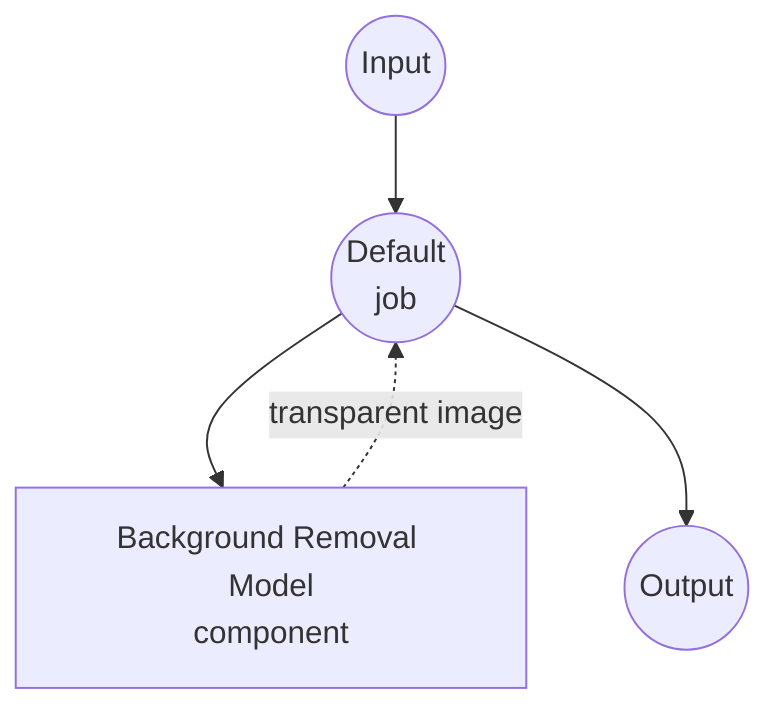

# 图像背景移除模型任务示例

此示例演示如何使用 model-compose 的内置图像背景移除任务通过 BiRefNet 使用本地分割模型移除图像背景，提供离线背景移除功能。

## 概述

此工作流提供本地图像背景移除功能，包括：

1. **本地分割模型**：在本地运行 BiRefNet 模型生成高质量的前景蒙版
2. **RGBA 或蒙版输出**：返回透明 PNG（RGBA）或单通道蒙版
3. **自动模型管理**：首次使用时自动下载和缓存模型
4. **无外部 API**：完全离线的图像处理，无依赖
5. **实时处理**：适用于交互式应用的快速推理

## 准备工作

### 前置条件

- 已安装 model-compose 并在 PATH 中可用
- 运行 BiRefNet 的足够系统资源（推荐：8GB+ RAM，首选 GPU）
- 具有 torch、torchvision、transformers 和 PIL 的 Python 环境（自动管理）

### 为什么使用本地背景移除模型

与基于云的背景移除 API（remove.bg、Photoroom）不同，本地模型执行提供：

**本地处理的优势：**
- **隐私**：所有图像处理都在本地进行，不向外部服务发送图像
- **成本**：初始设置后无按图像或 API 使用费用
- **离线**：模型下载后可在无互联网连接的情况下工作
- **延迟**：图像处理无网络延迟
- **质量控制**：一致、确定性的分割结果
- **批处理**：无速率限制的无限图像处理

**权衡：**
- **硬件要求**：需要足够的 RAM 和 VRAM（推荐 GPU）
- **设置时间**：初始模型下载和加载时间
- **处理时间**：较大图像需要更长处理时间
- **内存使用**：大输入图像需要高内存

### 环境配置

1. 导航到此示例目录：
   ```bash
   cd examples/model-tasks/image-background-removal
   ```

2. 无需额外的环境配置 - 模型和依赖自动管理。

## 运行方法

1. **启动服务：**
   ```bash
   model-compose up
   ```

2. **运行工作流：**

   **使用 API：**
   ```bash
   curl -X POST http://localhost:8080/api/workflows/runs \
     -H "Content-Type: multipart/form-data" \
     -F "image=@/path/to/your/input-image.jpg"
   ```

   **使用 Web UI：**
   - 打开 Web UI：http://localhost:8081
   - 输入您的输入参数
   - 点击"Run Workflow"按钮

   **使用 CLI：**
   ```bash
   model-compose run image-background-removal --input '{"image": "/path/to/your/input-image.jpg"}'
   ```

## 组件详情

### 图像背景移除模型组件（默认）
- **类型**：具有图像背景移除任务的模型组件
- **目的**：用于背景移除的本地显著对象分割
- **模型**：ZhengPeng7/BiRefNet
- **架构**：BiRefNet（用于高分辨率二分图像分割的双边参考网络）
- **功能**：
  - 高质量的前景/背景分离
  - 自动模型下载和缓存
  - 支持多种图像格式
  - GPU 加速支持
  - RGBA 透明输出或单通道蒙版

### 模型信息：BiRefNet

- **开发者**：ZhengPeng7（开源）
- **架构**：用于二分图像分割的双边参考网络
- **训练**：DIS5K、HRSOD 及其他高分辨率分割数据集
- **优势**：出色的细节保留能力（头发、毛发、半透明边缘）
- **输入/输出**：RGB 图像 → 透明蒙版（或透明 RGBA 输出）
- **许可证**：MIT

## 工作流详情

### "Remove Image Background" 工作流（默认）

**描述**：使用预训练分割模型移除输入图像的背景。

#### 作业流程

此示例使用简化的单组件配置，无显式作业。



#### 输入参数

| 参数 | 类型 | 必需 | 默认值 | 描述 |
|------|------|------|--------|------|
| `image` | image | 是 | - | 输入图像文件（JPEG、PNG 等） |

#### 输出格式

| 字段 | 类型 | 描述 |
|------|------|------|
| - | image | 移除背景的 RGBA 图像（透明） |

## 系统要求

### 最低要求
- **RAM**：8GB（推荐 16GB+）
- **VRAM**：2GB GPU 内存（推荐 4GB+）
- **磁盘空间**：模型存储和缓存 2GB+
- **CPU**：多核处理器（推荐 4 核以上）
- **网络**：仅初始模型下载需要

### 性能说明
- 首次运行需要模型下载（~900MB）
- 模型加载时间为 10-30 秒（取决于硬件）
- GPU 加速可显著提高处理速度
- 处理时间随 `input_size` 参数变化（默认 1024×1024）
- 典型 GPU 推理：每张图像 0.1-0.3 秒
- 典型 CPU 推理：每张图像 3-8 秒

## 性能优化

### GPU 加速
为获得最佳性能，请确保安装了兼容 CUDA 的 PyTorch：
```bash
# 示例：安装启用 CUDA 的 PyTorch
pip install torch torchvision --index-url https://download.pytorch.org/whl/cu118
```

### 内存管理
- **大图像**：在内存受限环境中减小 `input_size`（例如 768）
- **批处理**：调整 `batch_size` 以适应您的 VRAM
- **系统资源**：处理期间关闭其他应用程序

### 处理提示
- **输入尺寸**：1024 平衡质量和速度。使用 512 进行更快处理，2048 获得最大细节
- **格式选择**：PNG 可保留输出中的透明度
- **预处理**：光线充足、边界清晰的主体产生最佳效果

## 自定义

### 输出格式

返回单通道蒙版而不是透明 RGBA 图像：

```yaml
component:
  type: model
  task: image-background-removal
  model:
    provider: huggingface
    repository: ZhengPeng7/BiRefNet
  action:
    image: ${input.image as image}
    output_format: mask   # single-channel L mode image
```

### 调整输入分辨率

```yaml
component:
  type: model
  task: image-background-removal
  model:
    provider: huggingface
    repository: ZhengPeng7/BiRefNet
  action:
    image: ${input.image as image}
    params:
      input_size: 2048   # 更高细节，推理速度较慢
```

### 使用替代模型

任何使用相同输入/输出约定公开 `AutoModelForImageSegmentation` 的 HuggingFace 模型都可用：

```yaml
component:
  type: model
  task: image-background-removal
  model:
    provider: huggingface
    repository: briaai/RMBG-2.0    # 基于 BiRefNet，高质量（检查许可证）
  action:
    image: ${input.image as image}
```

### 批处理配置

```yaml
workflow:
  title: Batch Background Removal
  jobs:
    - id: remove-backgrounds
      component: bg-remover
      repeat_count: ${input.image_count}
      input:
        image: ${input.images[${index}]}
```

## 故障排除

### 常见问题

1. **内存不足**：减小 `input_size` 或 `batch_size`，或使用更小的模型变体
2. **模型下载失败**：检查网络连接和磁盘空间
3. **处理缓慢**：确保启用 GPU 加速
4. **边缘粗糙**：增加 `input_size` 以获得更精细的细节
5. **遗漏区域**：确保主体与背景界限分明

## 与基于 API 的解决方案比较

| 功能 | 本地背景移除 | 云端背景移除 API |
|------|-------------|-----------------|
| 隐私 | 完全隐私 | 图像发送到提供商 |
| 成本 | 仅硬件成本 | 按图像定价 |
| 延迟 | 取决于硬件 | 网络+处理延迟 |
| 可用性 | 支持离线 | 需要网络 |
| 质量控制 | 结果一致 | 质量可变 |
| 批处理 | 无限制 | 速率限制 |
| 自定义 | 模型选择、参数 | 有限的 API 选项 |
| 设置复杂性 | 需要模型下载 | 仅需 API 密钥 |
| 文件大小限制 | 硬件限制 | API 限制 |

## 模型变体

### 推荐模型

- **ZhengPeng7/BiRefNet**：默认。MIT 许可证，高质量，~900MB
- **ZhengPeng7/BiRefNet_lite**：更轻更快，质量略有权衡
- **briaai/RMBG-2.0**：基于 BiRefNet，出色的质量（商业用途请检查许可证）
- **briaai/RMBG-1.4**：更小的 ISNet 基础模型，推理更快
