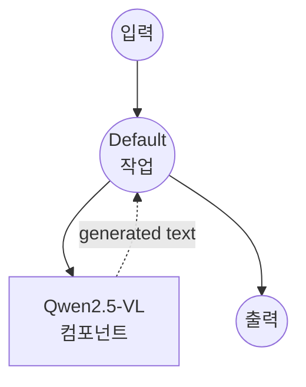

# Image-Text-to-Text (HuggingFace) 예제

이 예제는 model-compose의 내장 `image-text-to-text` task와 HuggingFace transformers를 사용하여 로컬 비전-언어 모델로 이미지에 대한 프롬프트에 응답하는 방법을 보여주며, 오프라인 멀티모달 추론 기능을 제공합니다.

## 개요

이 워크플로우는 다음과 같은 로컬 이미지 + 텍스트 -> 텍스트 생성을 제공합니다:

1. **로컬 비전-언어 모델**: HuggingFace transformers를 통해 Qwen2.5-VL-3B-Instruct를 로컬에서 실행
2. **프롬프트 기반 생성**: 제공된 이미지에 기반해 임의의 텍스트 프롬프트에 응답
3. **자동 모델 관리**: 첫 사용 시 모델을 자동으로 다운로드하고 캐시
4. **외부 API 불필요**: 클라우드 의존성 없는 완전한 오프라인 멀티모달 추론
5. **결정론적 출력**: 재현 가능한 결과를 위해 `do_sample: false` 사용

## 준비사항

### 필수 요구사항

- model-compose가 설치되어 PATH에서 사용 가능
- 3B 파라미터 VLM 실행을 위한 충분한 시스템 리소스 (권장: 16GB+ RAM, 또는 8GB+ VRAM GPU)
- transformers, torch, PIL이 포함된 Python 환경 (자동 관리)

### 로컬 비전-언어 모델을 사용하는 이유

클라우드 기반 멀티모달 API와 달리 로컬 VLM 실행은 다음을 제공합니다:

**로컬 처리의 이점:**
- **프라이버시**: 모든 이미지 + 텍스트 처리가 로컬에서 이루어지며 머신을 벗어나지 않음
- **비용**: 초기 설정 후 이미지당 또는 토큰당 요금 없음
- **오프라인**: 모델 다운로드 후 인터넷 없이 작동
- **사용자 정의**: 프롬프트, 모델, 생성 매개변수에 대한 완전한 제어
- **배치 처리**: API 속도 제한 없음

**트레이드오프:**
- **하드웨어 요구사항**: 3B VLM은 최소한 적당한 GPU 또는 많은 RAM 필요
- **설정 시간**: 초기 모델 다운로드 및 로딩 시간
- **품질 트레이드오프**: 로컬 모델은 어려운 추론에서 최대 규모 폐쇄 모델보다 뒤처질 수 있음

### 환경 구성

1. 이 예제 디렉토리로 이동:
   ```bash
   cd examples/model-tasks/image-text-to-text/huggingface
   ```

2. 추가 환경 구성 불필요 - 모델과 의존성은 자동으로 관리됩니다.

## 실행 방법

1. **서비스 시작:**
   ```bash
   model-compose up
   ```

2. **워크플로우 실행:**

   **API 사용:**
   ```bash
   curl -X POST http://localhost:8080/api/workflows/runs \
     -F "image=@/path/to/your/image.jpg" \
     -F 'input={"image": "@image", "prompt": "이 이미지에서 무슨 일이 일어나고 있는지 설명해주세요."}'
   ```

   **웹 UI 사용:**
   - Web UI 열기: http://localhost:8081
   - 이미지 업로드 후 프롬프트 입력
   - "Run Workflow" 버튼 클릭

   **CLI 사용:**
   ```bash
   model-compose run --input '{"image": "/path/to/your/image.jpg", "prompt": "이 이미지에서 무슨 일이 일어나고 있는지 설명해주세요."}'
   ```

## 컴포넌트 세부사항

### Image-Text-to-Text Model 컴포넌트
- **유형**: image-text-to-text task를 가진 Model 컴포넌트
- **드라이버**: `huggingface`
- **아키텍처**: `qwen2.5-vl`
- **모델**: `Qwen/Qwen2.5-VL-3B-Instruct`
- **동시성**: `max_concurrent_count: 1`
- **Action 파라미터**:
  - `max_output_length: 512`
  - `do_sample: false` (결정론적)

### 모델 정보: Qwen2.5-VL-3B-Instruct
- **개발자**: Alibaba (Qwen 팀)
- **파라미터**: 약 30억
- **유형**: 동적 이미지 해상도를 지원하는 비전-언어 트랜스포머
- **기능**: 이미지 설명, VQA, 문서 이해, 근거 기반 추론
- **라이센스**: HuggingFace 모델 카드 참조

## 워크플로우 세부사항

### "Image + Text to Text" 워크플로우

**설명**: 비전-언어 모델에게 커스텀 프롬프트로 이미지를 설명하도록 요청합니다.

#### 작업 흐름

이 예제는 명시적인 작업 없이 단순화된 단일 컴포넌트 구성을 사용합니다.



#### 입력 매개변수

| 매개변수 | 유형 | 필수 | 기본값 | 설명 |
|---------|------|------|--------|------|
| `image` | image | 예 | - | 입력 이미지 파일 (JPEG, PNG 등) |
| `prompt` | text | 예 | - | 이미지에 대한 텍스트 프롬프트 또는 질문 |

#### 출력 형식

| 필드 | 유형 | 설명 |
|-----|------|------|
| `generated` | text | 이미지에 근거한 프롬프트에 대한 모델의 응답 |

## 시스템 요구사항

### 최소 요구사항
- **RAM**: 16GB (CPU 전용 추론 시 권장 32GB+)
- **디스크 공간**: 모델 저장 및 캐시를 위해 10GB+
- **CPU**: 멀티코어 프로세서 (CPU 전용 추론은 느림)

### 권장 사양 (GPU)
- **GPU**: 8GB+ VRAM의 NVIDIA GPU, 또는 통합 메모리를 가진 Apple Silicon
- **CUDA / MPS**: 가속 추론용

### 성능 참고사항
- 첫 실행 시 ~6-7GB의 모델 가중치 다운로드
- 모델 로딩은 하드웨어에 따라 30-90초 소요
- 인터랙티브 지연을 위해 GPU / MPS 가속 강력히 권장
- 고해상도 이미지는 더 많은 비전 토큰을 생성하여 시간이 더 걸림

## 사용자 정의

### 더 창의적인 답변을 위한 샘플링 활성화

```yaml
component:
  type: model
  task: image-text-to-text
  driver: huggingface
  architecture: qwen2.5-vl
  model: Qwen/Qwen2.5-VL-3B-Instruct
  action:
    image: ${input.image as image}
    prompt: ${input.prompt as text}
    params:
      max_output_length: 512
      do_sample: true
      temperature: 0.7
      top_p: 0.9
```

### 더 큰 Qwen2.5-VL 변형 사용

```yaml
component:
  type: model
  task: image-text-to-text
  driver: huggingface
  architecture: qwen2.5-vl
  model: Qwen/Qwen2.5-VL-7B-Instruct    # 더 높은 품질, 더 많은 VRAM
  # 또는
  model: Qwen/Qwen2.5-VL-72B-Instruct   # 플래그십, 큰 GPU 필요
```

### 다른 VLM 계열 사용

```yaml
component:
  type: model
  task: image-text-to-text
  driver: huggingface
  architecture: llava              # 또는 지원되는 다른 VL 아키텍처
  model: llava-hf/llava-1.5-7b-hf
```

## 문제 해결

1. **메모리 부족**: 더 작은 모델(3B) 사용, `max_output_length` 감소, 또는 입력 이미지 다운스케일
2. **느린 추론**: GPU (CUDA) 또는 Apple Silicon (MPS) 활성화; 3B VLM은 CPU 전용으로 실용적이지 않음
3. **모델 다운로드 실패**: 인터넷 접근과 여유 디스크 공간 확인
4. **잘린 답변**: `max_output_length` 증가
5. **예상치 못한 답변**: 더 구체적인 프롬프트 시도 또는 창의성을 위해 샘플링 활성화

## API 기반 솔루션과 비교

| 기능 | 로컬 VLM (HuggingFace) | 클라우드 VLM API |
|---------|-------------------------|----------------|
| 프라이버시 | 완전한 프라이버시 | 이미지 + 프롬프트를 프로바이더로 전송 |
| 비용 | 하드웨어 비용만 | 이미지당 / 토큰당 가격 |
| 지연시간 | 하드웨어 의존적 | 네트워크 + API 지연 |
| 가용성 | 오프라인 가능 | 인터넷 필요 |
| 사용자 정의 | 완전한 매개변수 제어 | 제한된 API 매개변수 |
| 품질 | 로컬 모델에 따라 다름 | 어려운 작업에서 대개 더 높음 |
| 배치 처리 | 무제한 | 속도 제한 |
| 설정 복잡도 | 모델 다운로드 필요 | API 키만 |

## 모델 변형

### Qwen2.5-VL 계열
- **Qwen/Qwen2.5-VL-3B-Instruct**: 기본, 작고 효율적
- **Qwen/Qwen2.5-VL-7B-Instruct**: 더 나은 품질, 더 많은 컴퓨팅
- **Qwen/Qwen2.5-VL-72B-Instruct**: 플래그십, 대규모 멀티 GPU 셋업 필요

### 대안 오픈 VLM
- **llava-hf/llava-1.5-7b-hf**: 클래식 LLaVA
- **mistralai/Pixtral-12B-2409**: Mistral의 멀티모달 모델
- **HuggingFaceM4/idefics2-8b**: 다중 이미지 추론을 위한 IDEFICS2
