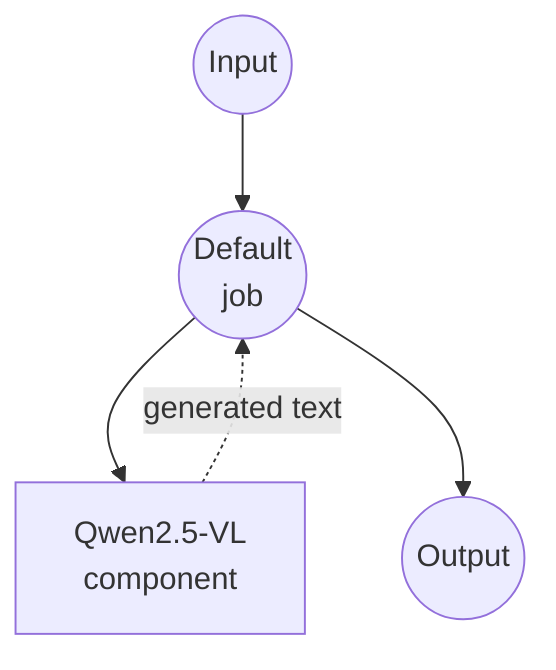

# Image-Text-to-Text (HuggingFace) Example

This example demonstrates how to use local vision-language models to answer prompts about images using model-compose's built-in `image-text-to-text` task with HuggingFace transformers, providing offline multimodal reasoning capabilities.

## Overview

This workflow provides local image + text -> text generation that:

1. **Local Vision-Language Model**: Runs Qwen2.5-VL-3B-Instruct locally via HuggingFace transformers
2. **Prompt-Guided Generation**: Answers arbitrary text prompts grounded in the provided image
3. **Automatic Model Management**: Downloads and caches the model automatically on first use
4. **No External APIs**: Fully offline multimodal inference without cloud dependencies
5. **Deterministic Output**: Uses `do_sample: false` for reproducible results

## Preparation

### Prerequisites

- model-compose installed and available in your PATH
- Sufficient system resources for running a 3B-parameter VLM (recommended: 16GB+ RAM, or a GPU with 8GB+ VRAM)
- Python environment with transformers, torch, and PIL (automatically managed)

### Why Local Vision-Language Models

Unlike cloud-based multimodal APIs, local VLM execution provides:

**Benefits of Local Processing:**
- **Privacy**: All image + text processing happens locally, nothing leaves your machine
- **Cost**: No per-image or per-token fees after initial setup
- **Offline**: Works without internet after the model is downloaded
- **Customization**: Full control over prompt, model, and generation parameters
- **Batch Processing**: No API rate limits

**Trade-offs:**
- **Hardware Requirements**: 3B VLMs comfortably need a modest GPU or a lot of RAM
- **Setup Time**: Initial model download and loading time
- **Quality Trade-offs**: Local models may trail the largest closed models on hard reasoning

### Environment Configuration

1. Navigate to this example directory:
   ```bash
   cd examples/model-tasks/image-text-to-text/huggingface
   ```

2. No additional environment configuration required - model and dependencies are managed automatically.

## How to Run

1. **Start the service:**
   ```bash
   model-compose up
   ```

2. **Run the workflow:**

   **Using API:**
   ```bash
   curl -X POST http://localhost:8080/api/workflows/runs \
     -F "image=@/path/to/your/image.jpg" \
     -F 'input={"image": "@image", "prompt": "Describe what is happening in this image."}'
   ```

   **Using Web UI:**
   - Open the Web UI: http://localhost:8081
   - Upload an image and enter a prompt
   - Click the "Run Workflow" button

   **Using CLI:**
   ```bash
   model-compose run --input '{"image": "/path/to/your/image.jpg", "prompt": "Describe what is happening in this image."}'
   ```

## Component Details

### Image-Text-to-Text Model Component
- **Type**: Model component with image-text-to-text task
- **Driver**: `huggingface`
- **Architecture**: `qwen2.5-vl`
- **Model**: `Qwen/Qwen2.5-VL-3B-Instruct`
- **Concurrency**: `max_concurrent_count: 1`
- **Action Params**:
  - `max_output_length: 512`
  - `do_sample: false` (deterministic)

### Model Information: Qwen2.5-VL-3B-Instruct
- **Developer**: Alibaba (Qwen team)
- **Parameters**: ~3 billion
- **Type**: Vision-language transformer with dynamic image resolution
- **Capabilities**: Image description, VQA, document understanding, grounded reasoning
- **License**: See model card on HuggingFace

## Workflow Details

### "Image + Text to Text" Workflow

**Description**: Ask a vision-language model to describe an image with a custom prompt.

#### Job Flow

This example uses a simplified single-component configuration without explicit jobs.



#### Input Parameters

| Parameter | Type | Required | Default | Description |
|-----------|------|----------|---------|-------------|
| `image` | image | Yes | - | Input image file (JPEG, PNG, etc.) |
| `prompt` | text | Yes | - | Text prompt or question about the image |

#### Output Format

| Field | Type | Description |
|-------|------|-------------|
| `generated` | text | Model's response to the prompt, grounded in the image |

## System Requirements

### Minimum Requirements
- **RAM**: 16GB (recommended 32GB+ for CPU-only inference)
- **Disk Space**: 10GB+ for model storage and cache
- **CPU**: Multi-core processor (CPU-only inference will be slow)

### Recommended (GPU)
- **GPU**: NVIDIA GPU with 8GB+ VRAM, or Apple Silicon with unified memory
- **CUDA / MPS**: For accelerated inference

### Performance Notes
- First run downloads ~6-7GB of model weights
- Model loading takes 30-90 seconds depending on hardware
- GPU / MPS acceleration is strongly recommended for interactive latency
- Higher-resolution images produce more visual tokens and take longer

## Customization

### Enabling Sampling for More Creative Answers

```yaml
component:
  type: model
  task: image-text-to-text
  driver: huggingface
  architecture: qwen2.5-vl
  model: Qwen/Qwen2.5-VL-3B-Instruct
  action:
    image: ${input.image as image}
    prompt: ${input.prompt as text}
    params:
      max_output_length: 512
      do_sample: true
      temperature: 0.7
      top_p: 0.9
```

### Using a Larger Qwen2.5-VL Variant

```yaml
component:
  type: model
  task: image-text-to-text
  driver: huggingface
  architecture: qwen2.5-vl
  model: Qwen/Qwen2.5-VL-7B-Instruct    # Higher quality, more VRAM
  # or
  model: Qwen/Qwen2.5-VL-72B-Instruct   # Flagship, requires large GPU
```

### Using a Different VLM Family

```yaml
component:
  type: model
  task: image-text-to-text
  driver: huggingface
  architecture: llava              # Or another supported VL architecture
  model: llava-hf/llava-1.5-7b-hf
```

## Troubleshooting

1. **Out of Memory**: Use a smaller model (3B), reduce `max_output_length`, or downscale input images
2. **Slow Inference**: Enable GPU (CUDA) or Apple Silicon (MPS); CPU-only is impractical for 3B VLMs
3. **Model Download Fails**: Check internet access and free disk space
4. **Truncated Answers**: Increase `max_output_length`
5. **Unexpected Answers**: Try a more specific prompt or enable sampling for creativity

## Comparison with API-based Solutions

| Feature | Local VLM (HuggingFace) | Cloud VLM API |
|---------|-------------------------|----------------|
| Privacy | Complete privacy | Image + prompt sent to provider |
| Cost | Hardware cost only | Per-image / per-token pricing |
| Latency | Hardware dependent | Network + API latency |
| Availability | Offline capable | Internet required |
| Customization | Full parameter control | Limited API parameters |
| Quality | Depends on local model | Usually higher on hard tasks |
| Batch Processing | Unlimited | Rate limited |
| Setup Complexity | Model download required | API key only |

## Model Variants

### Qwen2.5-VL Family
- **Qwen/Qwen2.5-VL-3B-Instruct**: Default, small and efficient
- **Qwen/Qwen2.5-VL-7B-Instruct**: Better quality, more compute
- **Qwen/Qwen2.5-VL-72B-Instruct**: Flagship, requires large multi-GPU setup

### Alternative Open VLMs
- **llava-hf/llava-1.5-7b-hf**: Classic LLaVA
- **mistralai/Pixtral-12B-2409**: Mistral's multimodal model
- **HuggingFaceM4/idefics2-8b**: IDEFICS2 for multi-image reasoning
