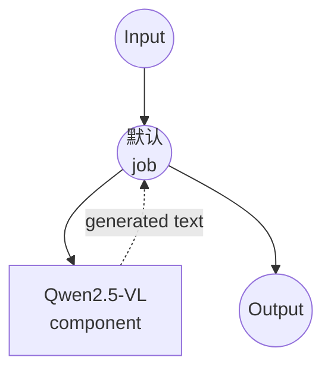

# Image-Text-to-Text (HuggingFace) 示例

本示例演示如何使用 model-compose 的内置 `image-text-to-text` 任务与 HuggingFace transformers，通过本地视觉-语言模型基于图像回答提示，提供离线多模态推理能力。

## 概述

此工作流提供本地图像 + 文本 -> 文本生成：

1. **本地视觉-语言模型**：通过 HuggingFace transformers 在本地运行 Qwen2.5-VL-3B-Instruct
2. **提示驱动生成**：基于提供的图像回答任意文本提示
3. **自动模型管理**：首次使用时自动下载并缓存模型
4. **无需外部 API**：无云依赖的完全离线多模态推理
5. **确定性输出**：使用 `do_sample: false` 以获得可重复的结果

## 准备工作

### 先决条件

- 已安装 model-compose 并在 PATH 中可用
- 运行 3B 参数 VLM 所需的充足系统资源（推荐：16GB+ RAM，或 8GB+ VRAM 的 GPU）
- 带有 transformers、torch 和 PIL 的 Python 环境（自动管理）

### 为什么选择本地视觉-语言模型

与基于云的多模态 API 不同，本地 VLM 执行提供：

**本地处理的优势：**
- **隐私**：所有图像 + 文本处理在本地进行，不会离开您的机器
- **成本**：初始设置后没有按图像或按 token 收费
- **离线**：模型下载后无需互联网即可工作
- **自定义**：完全控制提示、模型和生成参数
- **批量处理**：无 API 速率限制

**权衡：**
- **硬件要求**：3B VLM 至少需要中等 GPU 或大量 RAM
- **设置时间**：初始模型下载和加载时间
- **质量权衡**：本地模型在困难推理上可能落后于最大的闭源模型

### 环境配置

1. 导航到此示例目录：
   ```bash
   cd examples/model-tasks/image-text-to-text/huggingface
   ```

2. 无需额外的环境配置 - 模型和依赖项自动管理。

## 如何运行

1. **启动服务：**
   ```bash
   model-compose up
   ```

2. **运行工作流：**

   **使用 API：**
   ```bash
   curl -X POST http://localhost:8080/api/workflows/runs \
     -F "image=@/path/to/your/image.jpg" \
     -F 'input={"image": "@image", "prompt": "描述这张图像中正在发生什么。"}'
   ```

   **使用 Web UI：**
   - 打开 Web UI：http://localhost:8081
   - 上传图像并输入提示
   - 点击 "Run Workflow" 按钮

   **使用 CLI：**
   ```bash
   model-compose run --input '{"image": "/path/to/your/image.jpg", "prompt": "描述这张图像中正在发生什么。"}'
   ```

## 组件详情

### Image-Text-to-Text Model 组件
- **类型**：具有 image-text-to-text 任务的 Model 组件
- **驱动**：`huggingface`
- **架构**：`qwen2.5-vl`
- **模型**：`Qwen/Qwen2.5-VL-3B-Instruct`
- **并发**：`max_concurrent_count: 1`
- **Action 参数**：
  - `max_output_length: 512`
  - `do_sample: false`（确定性）

### 模型信息：Qwen2.5-VL-3B-Instruct
- **开发者**：阿里巴巴（Qwen 团队）
- **参数**：约 30 亿
- **类型**：支持动态图像分辨率的视觉-语言 transformer
- **能力**：图像描述、VQA、文档理解、基于事实的推理
- **许可证**：参见 HuggingFace 模型卡

## 工作流详情

### "Image + Text to Text" 工作流

**描述**：请视觉-语言模型使用自定义提示描述图像。

#### 作业流程

此示例使用简化的单组件配置，没有显式作业。



#### 输入参数

| 参数 | 类型 | 必需 | 默认值 | 描述 |
|---------|------|------|--------|------|
| `image` | image | 是 | - | 输入图像文件（JPEG、PNG 等）|
| `prompt` | text | 是 | - | 关于图像的文本提示或问题 |

#### 输出格式

| 字段 | 类型 | 描述 |
|-----|------|------|
| `generated` | text | 模型基于图像对提示的响应 |

## 系统要求

### 最低要求
- **RAM**：16GB（仅 CPU 推理推荐 32GB+）
- **磁盘空间**：模型存储和缓存需 10GB+
- **CPU**：多核处理器（仅 CPU 推理会很慢）

### 推荐配置 (GPU)
- **GPU**：8GB+ VRAM 的 NVIDIA GPU，或带有统一内存的 Apple Silicon
- **CUDA / MPS**：用于加速推理

### 性能说明
- 首次运行下载 ~6-7GB 的模型权重
- 模型加载需要 30-90 秒，具体取决于硬件
- 强烈推荐使用 GPU / MPS 加速以获得交互式延迟
- 更高分辨率的图像产生更多视觉 token，耗时更长

## 自定义

### 启用采样以获得更有创意的回答

```yaml
component:
  type: model
  task: image-text-to-text
  driver: huggingface
  architecture: qwen2.5-vl
  model: Qwen/Qwen2.5-VL-3B-Instruct
  action:
    image: ${input.image as image}
    prompt: ${input.prompt as text}
    params:
      max_output_length: 512
      do_sample: true
      temperature: 0.7
      top_p: 0.9
```

### 使用更大的 Qwen2.5-VL 变体

```yaml
component:
  type: model
  task: image-text-to-text
  driver: huggingface
  architecture: qwen2.5-vl
  model: Qwen/Qwen2.5-VL-7B-Instruct    # 更高质量，更多 VRAM
  # 或
  model: Qwen/Qwen2.5-VL-72B-Instruct   # 旗舰型，需要大型 GPU
```

### 使用不同的 VLM 系列

```yaml
component:
  type: model
  task: image-text-to-text
  driver: huggingface
  architecture: llava              # 或其他支持的 VL 架构
  model: llava-hf/llava-1.5-7b-hf
```

## 故障排除

1. **内存不足**：使用更小的模型（3B），减少 `max_output_length`，或缩小输入图像
2. **推理速度慢**：启用 GPU (CUDA) 或 Apple Silicon (MPS)；3B VLM 仅 CPU 不实用
3. **模型下载失败**：检查互联网访问和可用磁盘空间
4. **答案被截断**：增加 `max_output_length`
5. **意外的答案**：尝试更具体的提示或启用采样以获得创造性

## 与基于 API 的解决方案的比较

| 功能 | 本地 VLM (HuggingFace) | 云 VLM API |
|---------|-------------------------|----------------|
| 隐私 | 完全隐私 | 图像 + 提示发送到提供商 |
| 成本 | 仅硬件成本 | 按图像 / 按 token 定价 |
| 延迟 | 取决于硬件 | 网络 + API 延迟 |
| 可用性 | 可离线 | 需要互联网 |
| 自定义 | 完全参数控制 | 有限的 API 参数 |
| 质量 | 取决于本地模型 | 困难任务上通常更高 |
| 批量处理 | 无限制 | 速率限制 |
| 设置复杂性 | 需要模型下载 | 仅需 API 密钥 |

## 模型变体

### Qwen2.5-VL 系列
- **Qwen/Qwen2.5-VL-3B-Instruct**：默认，小巧高效
- **Qwen/Qwen2.5-VL-7B-Instruct**：质量更好，更多算力
- **Qwen/Qwen2.5-VL-72B-Instruct**：旗舰型，需要大型多 GPU 配置

### 其他开源 VLM
- **llava-hf/llava-1.5-7b-hf**：经典 LLaVA
- **mistralai/Pixtral-12B-2409**：Mistral 的多模态模型
- **HuggingFaceM4/idefics2-8b**：用于多图像推理的 IDEFICS2
