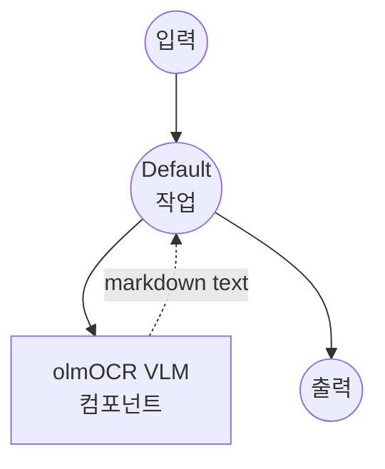

# Image-Text-to-Text (vLLM / olmOCR) 예제

이 예제는 model-compose의 내장 `vllm` 드라이버를 사용하여 vLLM으로 서빙되는 AllenAI olmOCR-2 비전-언어 모델에 이미지와 프롬프트를 결합해 로컬에서 문서 OCR을 실행하는 방법을 보여줍니다.

## 개요

이 워크플로우는 다음과 같은 로컬 문서-투-마크다운 변환을 제공합니다:

1. **vLLM 백엔드**: 높은 처리량과 GPU 최적화 추론으로 비전-언어 모델 서빙
2. **olmOCR-2 모델**: 정확한 텍스트 및 레이아웃 추출을 위해 AllenAI의 문서 튜닝 VLM 사용
3. **마크다운 출력**: 페이지 이미지를 LaTeX 수식과 마크다운 테이블이 포함된 마크다운으로 변환
4. **Front Matter 메타데이터**: 상단에 문서 메타데이터(언어, 회전, table/diagram 플래그) 출력
5. **외부 API 불필요**: 클라우드 의존성 없는 완전한 오프라인 OCR

## 준비사항

### 필수 요구사항

- model-compose가 설치되어 PATH에서 사용 가능
- 최신 CUDA 드라이버가 설치된 NVIDIA GPU (실질적으로 vLLM은 GPU 전용)
- Python virtualenv 지원 (`.venv/vllm` 아래에 격리된 venv가 생성됨)

### 비전-언어 모델에 vLLM을 사용하는 이유

단순한 HuggingFace 생성 루프와 달리 vLLM은 다음을 제공합니다:

**이점:**
- **처리량**: PagedAttention과 continuous batching으로 더 높은 tokens/sec
- **메모리 효율성**: `gpu_memory_utilization`을 통한 향상된 GPU 메모리 활용
- **긴 컨텍스트**: 긴 시각 + 텍스트 컨텍스트 처리 (`max_model_len`까지)
- **격리**: 자체 virtualenv에서 실행되어 의존성 충돌 방지

**트레이드오프:**
- **GPU 필요**: 실사용을 위해 CUDA GPU 필요
- **시작 시간**: 첫 실행 시 모델 다운로드 및 CUDA 커널 초기화
- **높은 리소스 요구**: 7B FP8 모델도 여전히 상당한 GPU 필요

### 환경 구성

1. 이 예제 디렉토리로 이동:
   ```bash
   cd examples/model-tasks/image-text-to-text/vllm
   ```

2. 추가 환경 구성 불필요 - vLLM virtualenv와 모델은 첫 시작 시 자동으로 생성 및 다운로드됩니다.

## 실행 방법

1. **서비스 시작:**
   ```bash
   model-compose up
   ```
   첫 실행 시 `.venv/vllm`이 프로비저닝되고 vLLM이 설치된 후 `allenai/olmOCR-2-7B-1025-FP8`이 다운로드됩니다. 이 과정은 수 분이 소요될 수 있습니다 (`start_timeout: 600s` 참조).

2. **워크플로우 실행:**

   **API 사용:**
   ```bash
   curl -X POST http://localhost:8080/api/workflows/runs \
     -F "image=@/path/to/page.png" \
     -F 'input={"image": "@image"}'
   ```

   **웹 UI 사용:**
   - Web UI 열기: http://localhost:8081
   - 렌더링된 PDF 페이지 이미지 업로드
   - "Run Workflow" 버튼 클릭

   **CLI 사용:**
   ```bash
   model-compose run --input '{"image": "/path/to/page.png"}'
   ```

## 컴포넌트 세부사항

### Image-Text-to-Text Model 컴포넌트
- **유형**: image-text-to-text task를 가진 Model 컴포넌트
- **드라이버**: `vllm`
- **모델**: `allenai/olmOCR-2-7B-1025-FP8`
- **런타임**: `.venv/vllm`의 `virtualenv` (Python)
- **동시성**: `max_concurrent_count: 1`
- **옵션**:
  - `max_model_len: 16384`
  - `gpu_memory_utilization: 0.9`
- **Action 파라미터**:
  - `max_output_length: 8000`
  - `do_sample: false` (결정론적)

### 모델 정보: olmOCR-2-7B-1025-FP8
- **개발자**: AllenAI
- **베이스**: Qwen2.5-VL-7B 계열, 문서 OCR을 위한 파인튜닝
- **양자화**: FP8 (weight-only), 더 나은 GPU 메모리 풋프린트
- **특기**: 페이지 수준 OCR, 테이블 구조, 수식 전사
- **라이센스**: HuggingFace 모델 카드 참조

## 워크플로우 세부사항

### "Document OCR with olmOCR (vLLM)" 워크플로우

**설명**: vLLM을 통해 AllenAI의 olmOCR-2 비전-언어 모델을 사용하여 단일 PDF 페이지를 렌더링(또는 이미지를 받아)하여 마크다운으로 변환합니다.

#### 작업 흐름

이 예제는 명시적인 작업 없이 단순화된 단일 컴포넌트 구성을 사용합니다.



#### 입력 매개변수

| 매개변수 | 유형 | 필수 | 기본값 | 설명 |
|---------|------|------|--------|------|
| `image` | image | 예 | - | OCR할 페이지 이미지 (렌더링된 PDF 페이지 또는 스캔본) |

프롬프트는 워크플로우에 고정되어 있으며, `primary_language`, `is_rotation_valid`, `rotation_correction`, `is_table`, `is_diagram`을 지정하는 front matter 섹션이 포함된 마크다운 반환을 모델에 지시합니다.

#### 출력 형식

| 필드 | 유형 | 설명 |
|-----|------|------|
| `markdown` | text | 메타데이터 front matter 블록이 포함된 페이지의 마크다운 전사 |

## 시스템 요구사항

### 권장 사양
- **GPU**: 24GB+ VRAM을 가진 NVIDIA GPU (FP8 7B는 16k 컨텍스트에서 KV 캐시 여유 공간 필요)
- **RAM**: 16GB+
- **디스크 공간**: 모델 가중치와 virtualenv를 위해 20GB+
- **CUDA**: 설치된 vLLM 빌드와 호환되는 드라이버

### 성능 참고사항
- 첫 실행 시 ~7-9GB의 모델 가중치 다운로드
- cold start 시 vLLM 시작에 몇 분이 걸릴 수 있음
- `gpu_memory_utilization: 0.9`는 대부분의 GPU를 예약합니다. GPU를 공유하는 경우 낮추세요.

## 사용자 정의

### GPU 메모리 및 컨텍스트 길이 조정

```yaml
component:
  type: model
  task: image-text-to-text
  driver: vllm
  model: allenai/olmOCR-2-7B-1025-FP8
  options:
    max_model_len: 8192              # KV 캐시 부담을 줄이려면 낮추기
    gpu_memory_utilization: 0.75     # 다른 GPU 사용자를 위한 여유 공간 확보
```

### 다른 VLM 사용

```yaml
component:
  type: model
  task: image-text-to-text
  driver: vllm
  model: Qwen/Qwen2.5-VL-7B-Instruct    # 범용 VLM
```

### 커스텀 프롬프트

다른 비전 작업을 위해 내장 OCR 프롬프트 재정의:

```yaml
component:
  action:
    image: ${input.image as image}
    prompt: ${input.prompt as text}
    params:
      max_output_length: 2048
      do_sample: false
```

## 문제 해결

1. **vLLM 설치 실패**: 호환 CUDA 툴체인 확인, `.venv/vllm` 삭제 후 재시도
2. **CUDA 메모리 부족**: `gpu_memory_utilization` 및/또는 `max_model_len` 낮추기
3. **첫 시작이 느림**: 모델 다운로드와 CUDA 커널 초기화 때문. 로그 확인, 필요 시 `start_timeout` 연장
4. **비어있거나 깨진 출력**: 페이지 이미지 해상도 확인 (PDF는 150-300 DPI로 렌더링)
5. **CPU 전용 머신**: vLLM은 사실상 GPU가 필요합니다. 대신 `huggingface` 변형 사용
