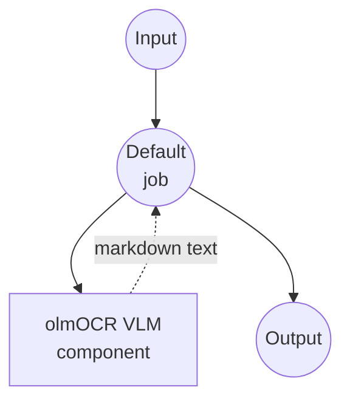

# Image-Text-to-Text (vLLM / olmOCR) Example

This example demonstrates how to run document OCR locally by combining an image and a prompt with AllenAI's olmOCR-2 vision-language model, served through vLLM using model-compose's built-in `vllm` driver.

## Overview

This workflow provides local document-to-markdown conversion that:

1. **vLLM Backend**: Serves the vision-language model with high-throughput, GPU-optimized inference
2. **olmOCR-2 Model**: Uses AllenAI's document-tuned VLM for accurate text and layout extraction
3. **Markdown Output**: Converts a page image into markdown with LaTeX equations and markdown tables
4. **Front Matter Metadata**: Emits document metadata (language, rotation, table/diagram flags) at the top
5. **No External APIs**: Fully offline OCR without cloud dependencies

## Preparation

### Prerequisites

- model-compose installed and available in your PATH
- NVIDIA GPU with recent CUDA drivers (vLLM is GPU-only in practice)
- Python virtualenv support (an isolated venv is created for vLLM under `.venv/vllm`)

### Why vLLM for Vision-Language Models

Unlike simple HuggingFace generation loops, vLLM provides:

**Benefits:**
- **Throughput**: PagedAttention and continuous batching for higher tokens/sec
- **Memory Efficiency**: Better GPU memory utilization via `gpu_memory_utilization`
- **Long Context**: Handles long visual + text contexts (up to `max_model_len`)
- **Isolation**: Runs in its own virtualenv, avoiding dependency conflicts

**Trade-offs:**
- **GPU Required**: Practical use requires a CUDA GPU
- **Startup Time**: First launch downloads the model and initializes CUDA kernels
- **Resource Heavy**: 7B FP8 model still needs a capable GPU

### Environment Configuration

1. Navigate to this example directory:
   ```bash
   cd examples/model-tasks/image-text-to-text/vllm
   ```

2. No additional environment configuration required - the vLLM virtualenv and model are created and downloaded automatically on first start.

## How to Run

1. **Start the service:**
   ```bash
   model-compose up
   ```
   The first launch will provision `.venv/vllm`, install vLLM, and download `allenai/olmOCR-2-7B-1025-FP8`. This may take several minutes (see `start_timeout: 600s`).

2. **Run the workflow:**

   **Using API:**
   ```bash
   curl -X POST http://localhost:8080/api/workflows/runs \
     -F "image=@/path/to/page.png" \
     -F 'input={"image": "@image"}'
   ```

   **Using Web UI:**
   - Open the Web UI: http://localhost:8081
   - Upload a rendered PDF page image
   - Click the "Run Workflow" button

   **Using CLI:**
   ```bash
   model-compose run --input '{"image": "/path/to/page.png"}'
   ```

## Component Details

### Image-Text-to-Text Model Component
- **Type**: Model component with image-text-to-text task
- **Driver**: `vllm`
- **Model**: `allenai/olmOCR-2-7B-1025-FP8`
- **Runtime**: `virtualenv` (Python) at `.venv/vllm`
- **Concurrency**: `max_concurrent_count: 1`
- **Options**:
  - `max_model_len: 16384`
  - `gpu_memory_utilization: 0.9`
- **Action Params**:
  - `max_output_length: 8000`
  - `do_sample: false` (deterministic)

### Model Information: olmOCR-2-7B-1025-FP8
- **Developer**: AllenAI
- **Base**: Qwen2.5-VL-7B family, fine-tuned for document OCR
- **Quantization**: FP8 (weight-only), for better GPU memory footprint
- **Specialties**: Page-level OCR, table structure, equation transcription
- **License**: See model card on HuggingFace

## Workflow Details

### "Document OCR with olmOCR (vLLM)" Workflow

**Description**: Render a single PDF page (or accept an image) and convert it to markdown using AllenAI's olmOCR-2 vision-language model via vLLM.

#### Job Flow

This example uses a simplified single-component configuration without explicit jobs.



#### Input Parameters

| Parameter | Type | Required | Default | Description |
|-----------|------|----------|---------|-------------|
| `image` | image | Yes | - | Page image to OCR (a rendered PDF page or scan) |

The prompt is fixed by the workflow and instructs the model to return markdown with a front matter section specifying `primary_language`, `is_rotation_valid`, `rotation_correction`, `is_table`, and `is_diagram`.

#### Output Format

| Field | Type | Description |
|-------|------|-------------|
| `markdown` | text | Markdown transcription of the page with a metadata front matter block |

## System Requirements

### Recommended
- **GPU**: NVIDIA GPU with 24GB+ VRAM (FP8 7B still needs headroom for KV cache at 16k context)
- **RAM**: 16GB+
- **Disk Space**: 20GB+ for model weights and virtualenv
- **CUDA**: Driver compatible with the installed vLLM build

### Performance Notes
- First run downloads ~7-9GB of model weights
- vLLM startup may take a few minutes on cold start
- `gpu_memory_utilization: 0.9` reserves most of the GPU; lower it if you share the GPU

## Customization

### Adjusting GPU Memory and Context Length

```yaml
component:
  type: model
  task: image-text-to-text
  driver: vllm
  model: allenai/olmOCR-2-7B-1025-FP8
  options:
    max_model_len: 8192              # Lower for less KV cache pressure
    gpu_memory_utilization: 0.75     # Leave more room for other GPU users
```

### Using a Different VLM

```yaml
component:
  type: model
  task: image-text-to-text
  driver: vllm
  model: Qwen/Qwen2.5-VL-7B-Instruct    # General-purpose VLM
```

### Custom Prompt

Override the built-in OCR prompt for other vision tasks:

```yaml
component:
  action:
    image: ${input.image as image}
    prompt: ${input.prompt as text}
    params:
      max_output_length: 2048
      do_sample: false
```

## Troubleshooting

1. **vLLM install fails**: Ensure a compatible CUDA toolchain; delete `.venv/vllm` and retry
2. **CUDA out of memory**: Lower `gpu_memory_utilization` and/or `max_model_len`
3. **Slow first start**: Model download plus CUDA kernel init; watch logs, extend `start_timeout` if needed
4. **Empty or garbled output**: Verify the page image is high enough resolution (render PDFs at 150-300 DPI)
5. **CPU-only machine**: vLLM effectively requires a GPU; use the `huggingface` variant instead
