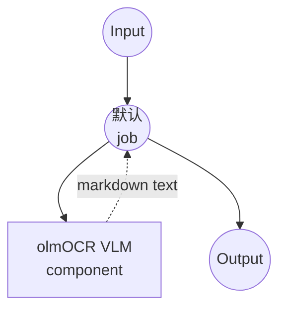

# Image-Text-to-Text (vLLM / olmOCR) 示例

本示例演示如何使用 model-compose 的内置 `vllm` 驱动，通过 vLLM 服务 AllenAI 的 olmOCR-2 视觉-语言模型，将图像和提示结合起来在本地运行文档 OCR。

## 概述

此工作流提供本地文档到 Markdown 的转换：

1. **vLLM 后端**：以高吞吐量、GPU 优化的推理提供视觉-语言模型服务
2. **olmOCR-2 模型**：使用 AllenAI 的文档微调 VLM 进行准确的文本和版面提取
3. **Markdown 输出**：将页面图像转换为包含 LaTeX 公式和 Markdown 表格的 Markdown
4. **Front Matter 元数据**：在顶部输出文档元数据（语言、旋转、table/diagram 标记）
5. **无需外部 API**：无云依赖的完全离线 OCR

## 准备工作

### 先决条件

- 已安装 model-compose 并在 PATH 中可用
- 具有最新 CUDA 驱动的 NVIDIA GPU（实际上 vLLM 仅支持 GPU）
- Python virtualenv 支持（在 `.venv/vllm` 下会创建隔离的 venv）

### 为什么视觉-语言模型选择 vLLM

与简单的 HuggingFace 生成循环相比，vLLM 提供：

**优势：**
- **吞吐量**：PagedAttention 和连续批处理实现更高的 tokens/sec
- **内存效率**：通过 `gpu_memory_utilization` 更好地利用 GPU 内存
- **长上下文**：处理长视觉 + 文本上下文（最多 `max_model_len`）
- **隔离**：在独立的 virtualenv 中运行，避免依赖冲突

**权衡：**
- **需要 GPU**：实际使用需要 CUDA GPU
- **启动时间**：首次启动需下载模型并初始化 CUDA 内核
- **资源密集**：7B FP8 模型仍需要强大的 GPU

### 环境配置

1. 导航到此示例目录：
   ```bash
   cd examples/model-tasks/image-text-to-text/vllm
   ```

2. 无需额外的环境配置 - vLLM virtualenv 和模型在首次启动时自动创建和下载。

## 如何运行

1. **启动服务：**
   ```bash
   model-compose up
   ```
   首次启动会配置 `.venv/vllm`，安装 vLLM，并下载 `allenai/olmOCR-2-7B-1025-FP8`。这可能需要几分钟（参见 `start_timeout: 600s`）。

2. **运行工作流：**

   **使用 API：**
   ```bash
   curl -X POST http://localhost:8080/api/workflows/runs \
     -F "image=@/path/to/page.png" \
     -F 'input={"image": "@image"}'
   ```

   **使用 Web UI：**
   - 打开 Web UI：http://localhost:8081
   - 上传渲染后的 PDF 页面图像
   - 点击 "Run Workflow" 按钮

   **使用 CLI：**
   ```bash
   model-compose run --input '{"image": "/path/to/page.png"}'
   ```

## 组件详情

### Image-Text-to-Text Model 组件
- **类型**：具有 image-text-to-text 任务的 Model 组件
- **驱动**：`vllm`
- **模型**：`allenai/olmOCR-2-7B-1025-FP8`
- **运行时**：位于 `.venv/vllm` 的 `virtualenv` (Python)
- **并发**：`max_concurrent_count: 1`
- **选项**：
  - `max_model_len: 16384`
  - `gpu_memory_utilization: 0.9`
- **Action 参数**：
  - `max_output_length: 8000`
  - `do_sample: false`（确定性）

### 模型信息：olmOCR-2-7B-1025-FP8
- **开发者**：AllenAI
- **基础**：Qwen2.5-VL-7B 系列，针对文档 OCR 微调
- **量化**：FP8（仅权重），以获得更好的 GPU 内存占用
- **专长**：页面级 OCR、表格结构、公式转录
- **许可证**：参见 HuggingFace 模型卡

## 工作流详情

### "Document OCR with olmOCR (vLLM)" 工作流

**描述**：通过 vLLM 使用 AllenAI 的 olmOCR-2 视觉-语言模型，渲染单个 PDF 页面（或接受图像）并转换为 Markdown。

#### 作业流程

此示例使用简化的单组件配置，没有显式作业。



#### 输入参数

| 参数 | 类型 | 必需 | 默认值 | 描述 |
|---------|------|------|--------|------|
| `image` | image | 是 | - | 要 OCR 的页面图像（渲染后的 PDF 页面或扫描件）|

提示由工作流固定，指示模型返回包含指定 `primary_language`、`is_rotation_valid`、`rotation_correction`、`is_table` 和 `is_diagram` 的 front matter 部分的 Markdown。

#### 输出格式

| 字段 | 类型 | 描述 |
|-----|------|------|
| `markdown` | text | 页面的 Markdown 转录，包含元数据 front matter 块 |

## 系统要求

### 推荐配置
- **GPU**：24GB+ VRAM 的 NVIDIA GPU（FP8 7B 在 16k 上下文下仍需 KV 缓存的余量）
- **RAM**：16GB+
- **磁盘空间**：模型权重和 virtualenv 需 20GB+
- **CUDA**：与已安装的 vLLM 构建兼容的驱动

### 性能说明
- 首次运行下载 ~7-9GB 的模型权重
- 冷启动时 vLLM 启动可能需要几分钟
- `gpu_memory_utilization: 0.9` 会保留大部分 GPU；如果您与他人共享 GPU 请调低此值

## 自定义

### 调整 GPU 内存和上下文长度

```yaml
component:
  type: model
  task: image-text-to-text
  driver: vllm
  model: allenai/olmOCR-2-7B-1025-FP8
  options:
    max_model_len: 8192              # 调低以减少 KV 缓存压力
    gpu_memory_utilization: 0.75     # 为其他 GPU 用户留出更多空间
```

### 使用不同的 VLM

```yaml
component:
  type: model
  task: image-text-to-text
  driver: vllm
  model: Qwen/Qwen2.5-VL-7B-Instruct    # 通用 VLM
```

### 自定义提示

覆盖内置 OCR 提示以用于其他视觉任务：

```yaml
component:
  action:
    image: ${input.image as image}
    prompt: ${input.prompt as text}
    params:
      max_output_length: 2048
      do_sample: false
```

## 故障排除

1. **vLLM 安装失败**：确认兼容的 CUDA 工具链；删除 `.venv/vllm` 后重试
2. **CUDA 内存不足**：调低 `gpu_memory_utilization` 和/或 `max_model_len`
3. **首次启动缓慢**：模型下载加 CUDA 内核初始化；查看日志，必要时延长 `start_timeout`
4. **输出为空或乱码**：确认页面图像分辨率足够高（PDF 以 150-300 DPI 渲染）
5. **仅 CPU 机器**：vLLM 实际上需要 GPU；请改用 `huggingface` 变体
