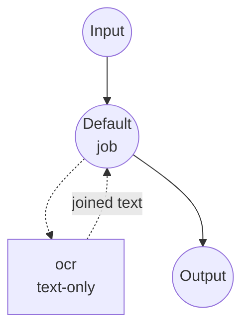
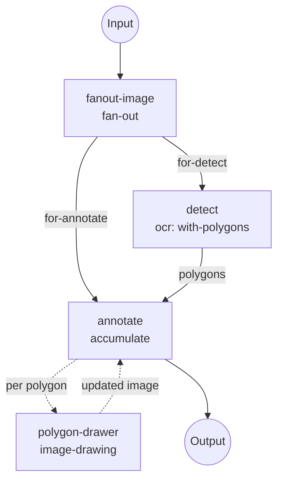

# RapidOCR Image-to-Text 예제

model-compose의 `image-to-text` 태스크 아래에서 RapidOCR로 OCR을 로컬 실행합니다.
두 가지 워크플로우를 노출합니다.

- **`recognize-text`** — 평문 OCR. 인식된 텍스트를 줄바꿈으로 이어붙인 문자열로
  반환합니다. 생성형 image-to-text 모델(BLIP 등)과 같은 shape이므로, 캡셔닝
  파이프라인의 OCR 대체재로 바로 끼울 수 있습니다.
- **`annotate-text`** — OCR + 폴리곤 오버레이. `return_polygons: true`로 OCR을
  실행하여 인식된 각 텍스트 라인마다 원본 이미지에 빨간색 폴리곤을 하나씩
  그리고, 주석이 들어간 이미지와 원시 OCR 레코드를 함께 반환합니다.

## 준비

### 사전 요구사항

- model-compose가 PATH에 설치돼 있어야 합니다
- 최초 실행 시 인터넷 접속 필요 (RapidOCR 엔진 번들을 한 번 다운로드)

파이썬 의존성(`rapidocr`, `opencv-python`)은 model-compose가 최초 기동 시
자동으로 관리합니다. RapidOCR는 기본적으로 CPU로 동작하며 GPU는 필요 없습니다.

### RapidOCR를 쓰는 이유

RapidOCR는 PaddleOCR을 ONNX 런타임으로 포팅한 경량 OCR 엔진입니다. 비생성형이고
결정론적이며, 가볍고 CPU에서도 빠르고, 큰 트랜스포머 가중치를 다시 받지 않고
언어만 바꿀 수 있습니다.

- **로컬·프라이빗**: 이미지가 머신 밖으로 나가지 않습니다.
- **결정론적**: 같은 입력이면 같은 출력. 샘플링 파라미터가 없습니다.
- **다국어 지원**: `language` 필드로 인식 언어를 지정 (`en`, `ch`, `japan`,
  `korean`, …).
- **필요할 때만 구조화 출력**: 오버레이 렌더링이나 다운스트림 필터링이 필요할 때는
  폴리곤 + 라인별 스코어를, 그 외에는 평문 문자열만 받습니다.

## 실행 방법

1. **서비스 시작:**
   ```bash
   model-compose up
   ```

2. **평문 OCR** (`recognize-text`, 기본 워크플로우):

   ```bash
   # API
   curl -X POST http://localhost:8080/api/workflows/runs \
     -F "image=@/path/to/page.jpg" \
     -F 'input={"image": "@image"}'

   # CLI
   model-compose run recognize-text --input '{"image": "/path/to/page.jpg"}'
   ```

3. **OCR + 폴리곤 오버레이** (`annotate-text`):

   ```bash
   # API — 워크플로우 id로 고정
   curl -X POST http://localhost:8080/api/workflows/annotate-text/runs \
     -F "image=@/path/to/page.jpg" \
     -F 'input={"image": "@image", "line_width": 3}'

   # CLI
   model-compose run annotate-text --input '{"image": "/path/to/page.jpg"}'
   ```

   응답에는 `annotated_image` (빨간 폴리곤이 그려진 PNG), `text` (이어붙인 평문),
   `lines` (텍스트/폴리곤/스코어가 담긴 라인별 레코드)이 포함됩니다.

4. **Web UI:** http://localhost:8081 — 사이드바에서 워크플로우를 선택하고,
   이미지를 업로드한 뒤 **Run Workflow**를 누릅니다.

## 워크플로우 상세

### `recognize-text` — 평문 OCR (기본)

단일 컴포넌트 워크플로우. `ocr` 컴포넌트의 `text-only` 액션을 호출합니다.



**입력:**

| 파라미터  | 타입    | 필수 | 설명                                   |
|---------|--------|-----|--------------------------------------|
| `image` | image  | 예   | 입력 이미지 (JPEG, PNG, PDF 페이지 등)       |

**출력:**

| 필드    | 타입  | 설명                              |
|-------|------|---------------------------------|
| `text`| text | 인식된 텍스트, 라인들은 `\n`으로 조인        |

### `annotate-text` — OCR + 폴리곤 오버레이

세 개의 잡으로 구성됩니다. `fanout-image`가 업로드를 스풀링해서 OCR과 드로잉
브랜치가 각자 읽을 수 있게 하고, `detect`가 `return_polygons: true`로 OCR을
실행하며, `annotate`가 인라인 `accumulate` 잡으로 라인마다 `polygon-drawer`
컴포넌트를 호출해 원본 이미지 사본 위에 폴리곤을 하나씩 접어 넣습니다.



**입력:**

| 파라미터       | 타입   | 필수 | 기본값 | 설명                        |
|-------------|-------|-----|------|---------------------------|
| `image`     | image | 예   | —    | 입력 이미지                   |
| `line_width`| number| 아니오| `2`  | 폴리곤 외곽선 두께 (픽셀)         |

**출력:**

| 필드              | 타입    | 설명                                                                    |
|------------------|--------|-----------------------------------------------------------------------|
| `annotated_image`| image  | 인식된 각 텍스트 라인 주위에 빨간 폴리곤이 그려진 이미지                              |
| `text`           | text   | 인식된 텍스트, 라인들은 `\n`으로 조인                                         |
| `lines`          | json   | 라인별 레코드: `[{text, polygon: [{x,y},...], score}, ...]`                 |

`annotate`가 간결해지는 핵심은, RapidOCR의 `polygon` 필드가 `{x, y}` 객체 리스트이고
`image-drawing` 컴포넌트의 `points` 필드가 그 형식을 그대로 받는다는 점입니다 —
형변환이나 중간 글루 코드가 전혀 필요 없습니다.

## 커스터마이즈

### 인식 언어 변경

`language`는 프로젝트 표준 ISO 639-1 / BCP 47 코드(`en`, `zh`, `zh-CN`, `ko`,
`ja`)를 씁니다. 지원 코드 셋은 `model`에 따라 다릅니다 — `v6-*`는 영어·중국어,
`v5-*`는 한국어까지, `v4-*`는 일본어까지 커버합니다. 언어를 바꿀 때는 `model`과
`language`를 함께 교체하세요.

```yaml
components:
  - id: ocr
    type: model
    task: image-to-text
    driver: custom
    family: rapidocr
    model: v5-mobile
    language: ko
```

| Model | 지원 언어 |
|-------|---------|
| `v6-small`(기본), `v6-tiny`, `v6-medium` | `en`, `zh`, `zh-CN` |
| `v5-mobile` | `en`, `zh`, `zh-CN`, `ko` |
| `v5-server` | `zh`, `zh-CN` 전용 |
| `v4-mobile` | `en`, `zh`, `zh-CN`, `ja`, `ko` |
| `v4-server` | `zh`, `zh-CN` 전용 |

`*-server` 모델은 중국어 recognizer만 번들합니다 — 다른 언어는 해당 버전의 `*-mobile` 모델을 사용하세요.

### 검출 민감도 튜닝

```yaml
actions:
  - id: with-polygons
    image: ${input.image as image}
    return_polygons: true
    params:
      text_score:   0.6   # 낮은 신뢰도 결과 제거 (기본 0.5)
      box_thresh:   0.5   # 박스 형성용 검출 스코어
      unclip_ratio: 1.8   # 인식 전 검출 폴리곤 확장 비율
      use_cls:      true  # 회전된 텍스트 각도 분류
```

### 오버레이 색 변경, 텍스트 라벨 추가

`polygon-drawer`는 단순한 `image-drawing` 호출이므로 `outline` 색을 바꾸거나,
`annotate` 루프 안에 `method: text`인 두 번째 드로잉 컴포넌트를 체이닝해서
폴리곤 옆에 인식된 텍스트를 라벨로 붙일 수 있습니다.

## 문제 해결

- **첫 실행이 느립니다**: RapidOCR 엔진 번들을 한 번 받고 캐시합니다. 이후 실행은
  캐시된 모델을 재사용합니다.
- **문자가 깨지거나 빠집니다**: 언어 불일치일 가능성이 큽니다. 이미지 주요 문자에
  맞게 `language`를 바꿔 보세요.
- **오탐이 많습니다**: `params.text_score`와 `params.box_thresh`를 올려 보세요.
- **폴리곤 가장자리에서 텍스트가 잘립니다**: `params.unclip_ratio`를 키워 인식
  전에 검출 폴리곤이 조금 더 넓어지도록 하세요.

## 참고

- [`image-to-text` 컴포넌트 레퍼런스](../../../docs/reference/compose/components/model.md#image-to-text) — 두 드라이버의 전체 액션 필드 목록.
- [`image-drawing` 컴포넌트 레퍼런스](../../../docs/reference/compose/components/image-drawing.md) — 모든 드로잉 메서드와 포인트 입력 형식.
- [`image-to-text` HuggingFace 예제](../image-to-text) — 생성형 캡셔닝 쪽 상대 예제 (BLIP).
