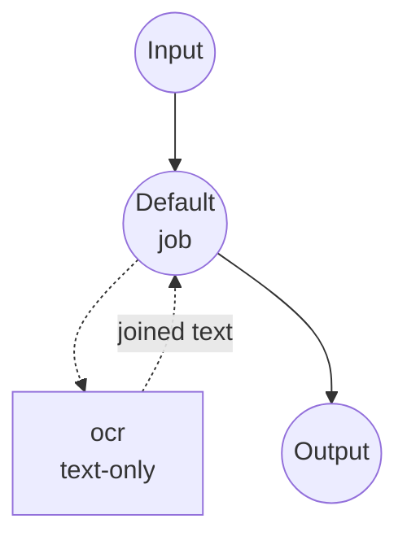
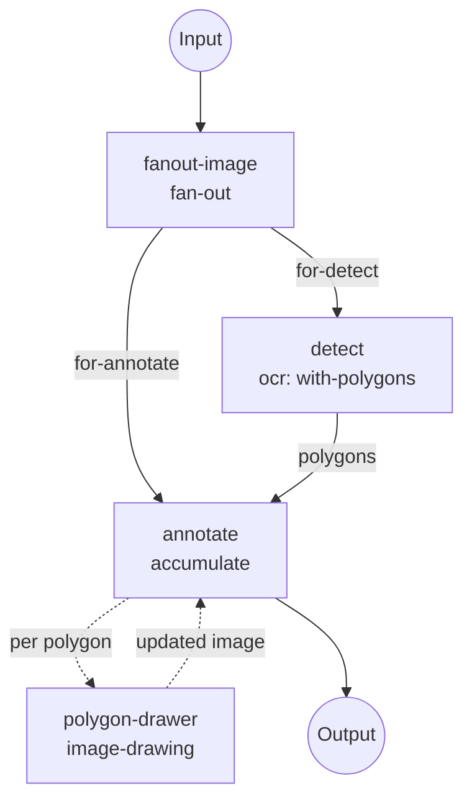

# RapidOCR Image-to-Text Example

Run optical character recognition (OCR) locally with RapidOCR under
model-compose's `image-to-text` task. The example exposes two workflows:

- **`recognize-text`** — plain-text OCR. Returns the recognized text joined
  with newlines, matching the shape a generative image-to-text model (e.g.
  BLIP) would return. Drop-in OCR replacement for captioning pipelines.
- **`annotate-text`** — OCR + polygon overlay. Runs OCR with `return_polygons:
  true` and draws one red polygon per recognized text line on top of the
  source image, returning the annotated image alongside the raw OCR records.

## Preparation

### Prerequisites

- model-compose installed and available in your PATH
- Internet access on first run (the RapidOCR engine bundle downloads once)

Model-compose auto-manages the Python dependencies (`rapidocr`,
`opencv-python`) on first startup. RapidOCR runs on CPU by default; no GPU
is required.

### Why RapidOCR

RapidOCR is a lightweight ONNX runtime port of PaddleOCR. It's a non-
generative, deterministic OCR engine — small, fast on CPU, and language-
switchable without re-downloading large transformer weights:

- **Local & private**: images never leave the machine.
- **Deterministic**: same input → same output; no sampling parameters.
- **Multilingual**: pick the recognition language via the `language` field
  (`en`, `ch`, `japan`, `korean`, …).
- **Structured output on demand**: ask for polygons + per-line scores when
  you need them (for overlay rendering or downstream filtering), or just
  take the joined text string.

## How to Run

1. **Start the service:**
   ```bash
   model-compose up
   ```

2. **Plain text OCR** (`recognize-text`, the default workflow):

   ```bash
   # API
   curl -X POST http://localhost:8080/api/workflows/runs \
     -F "image=@/path/to/page.jpg" \
     -F 'input={"image": "@image"}'

   # CLI
   model-compose run recognize-text --input '{"image": "/path/to/page.jpg"}'
   ```

3. **OCR + polygon overlay** (`annotate-text`):

   ```bash
   # API — pin the workflow by id
   curl -X POST http://localhost:8080/api/workflows/annotate-text/runs \
     -F "image=@/path/to/page.jpg" \
     -F 'input={"image": "@image", "line_width": 3}'

   # CLI
   model-compose run annotate-text --input '{"image": "/path/to/page.jpg"}'
   ```

   The response includes `annotated_image` (PNG with red polygon outlines),
   `text` (joined plain text), and `lines` (per-line records with text,
   polygon, and score).

4. **Web UI:** http://localhost:8081 — pick the workflow from the sidebar,
   upload an image, and click **Run Workflow**.

## Workflow Details

### `recognize-text` — Plain Text OCR (default)

Single-component workflow. Calls the `ocr` component's `text-only` action.



**Input:**

| Parameter | Type  | Required | Description                       |
|-----------|-------|----------|-----------------------------------|
| `image`   | image | yes      | Input image (JPEG, PNG, PDF page) |

**Output:**

| Field  | Type | Description                                     |
|--------|------|-------------------------------------------------|
| `text` | text | Recognized text, lines joined with `\n`         |

### `annotate-text` — OCR + Polygon Overlay

Three-job pipeline. `fanout-image` spools the upload so OCR and the drawing
branch can read it independently; `detect` runs OCR with
`return_polygons: true`; `annotate` folds one polygon per line onto a copy
of the source image with an inline `accumulate` job that calls the
`polygon-drawer` component once per detected line.



**Input:**

| Parameter    | Type    | Required | Default | Description                        |
|--------------|---------|----------|---------|------------------------------------|
| `image`      | image   | yes      | —       | Input image                        |
| `line_width` | number  | no       | `2`     | Polygon outline thickness (pixels) |

**Output:**

| Field             | Type  | Description                                                                   |
|-------------------|-------|-------------------------------------------------------------------------------|
| `annotated_image` | image | Input image with a red polygon drawn around each recognized text line         |
| `text`            | text  | Recognized text, lines joined with `\n`                                       |
| `lines`           | json  | Per-line records: `[{text, polygon: [{x,y},...], score}, ...]`                |

The key move that makes `annotate` concise: RapidOCR's `polygon` field is a
list of `{x, y}` objects, and the `image-drawing` component's `points` field
accepts that shape directly — no reshaping or custom glue is needed.

## Customization

### Switch recognition language

`language` uses project-standard ISO 639-1 / BCP 47 codes (`en`, `zh`,
`zh-CN`, `ko`, `ja`). The set of supported codes depends on the `model` —
`v6-*` covers English and Chinese, `v5-*` adds Korean, `v4-*` adds Japanese
on top. Swap `model` and `language` together when you change language:

```yaml
components:
  - id: ocr
    type: model
    task: image-to-text
    driver: custom
    family: rapidocr
    model: v5-mobile
    language: ko
```

| Model | Languages |
|-------|-----------|
| `v6-small` (default), `v6-tiny`, `v6-medium` | `en`, `zh`, `zh-CN` |
| `v5-mobile` | `en`, `zh`, `zh-CN`, `ko` |
| `v5-server` | `zh`, `zh-CN` only |
| `v4-mobile` | `en`, `zh`, `zh-CN`, `ja`, `ko` |
| `v4-server` | `zh`, `zh-CN` only |

The `*-server` models ship Chinese recognizers only; for every other language use the matching `*-mobile` model.

### Tune detection sensitivity

```yaml
actions:
  - id: with-polygons
    image: ${input.image as image}
    return_polygons: true
    params:
      text_score:   0.6   # drop low-confidence recognitions (default 0.5)
      box_thresh:   0.5   # detection score for forming boxes
      unclip_ratio: 1.8   # expand detected polygons before recognition
      use_cls:      true  # angle classification for rotated text
```

### Change overlay color or add text labels

The `polygon-drawer` component is a plain `image-drawing` call — swap the
`outline` color, or chain a second drawing component (`method: text`) in the
`annotate` loop to label each polygon with its recognized text.

## Troubleshooting

- **First run is slow**: the RapidOCR engine bundle downloads once, then is
  cached. Subsequent runs reuse the cached models.
- **Garbled or missing characters**: likely a language mismatch. Set
  `language` to match the dominant script in your images.
- **Too many false positives**: raise `params.text_score` and/or
  `params.box_thresh`.
- **Clipped text at polygon edges**: increase `params.unclip_ratio` so
  detected polygons expand a bit before recognition.

## See Also

- [`image-to-text` component reference](../../../docs/reference/compose/components/model.md#image-to-text) — full action field list for both drivers.
- [`image-drawing` component reference](../../../docs/reference/compose/components/image-drawing.md) — all drawing methods and point input formats.
- [`image-to-text` HuggingFace example](../image-to-text) — the generative-captioning counterpart (BLIP).
