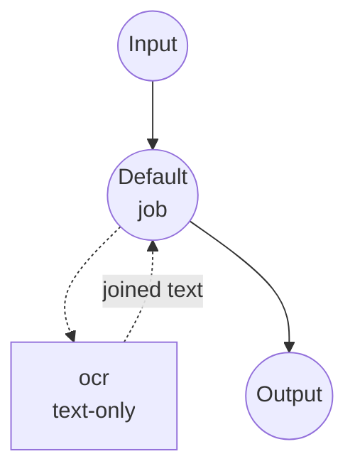
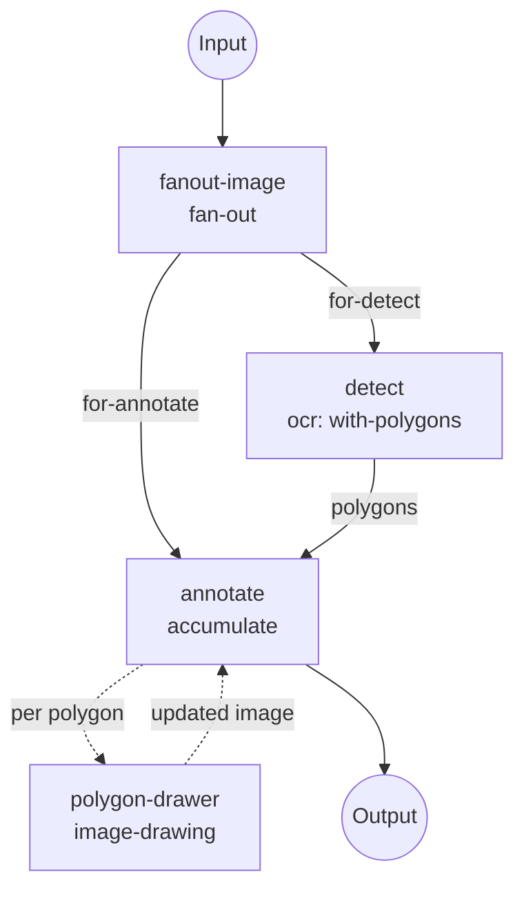

# RapidOCR Image-to-Text 示例

在 model-compose 的 `image-to-text` 任务下使用 RapidOCR 在本地运行光学字符识别
（OCR）。本示例暴露两个工作流：

- **`recognize-text`** — 纯文本 OCR。将识别到的文本用换行拼接后作为字符串返回，与
  生成式 image-to-text 模型（如 BLIP）的输出形状一致。可作为图像描述管道的
  OCR 直接替代。
- **`annotate-text`** — OCR + 多边形叠加。以 `return_polygons: true` 运行 OCR，
  并在原图上为每个识别到的文本行绘制一个红色多边形，连同标注后的图像与原始 OCR
  记录一起返回。

## 准备

### 前置条件

- 已安装 model-compose 并位于 PATH 中
- 首次运行需要联网（RapidOCR 引擎包仅下载一次）

Python 依赖（`rapidocr`、`opencv-python`）由 model-compose 在首次启动时自动管理。
RapidOCR 默认在 CPU 上运行，无需 GPU。

### 为什么选择 RapidOCR

RapidOCR 是 PaddleOCR 的 ONNX 运行时轻量移植。它是一个非生成式、确定性的 OCR
引擎——小巧、在 CPU 上快速、无需重新下载庞大 Transformer 权重即可切换语言：

- **本地·隐私**：图像永远不离开本机。
- **确定性**：相同输入 → 相同输出；不涉及采样参数。
- **多语言**：通过 `language` 字段选择识别语言（`en`、`ch`、`japan`、`korean` 等）。
- **按需结构化输出**：需要叠加绘制或下游过滤时请求多边形 + 每行分数，否则只取拼接
  后的文本字符串。

## 运行方式

1. **启动服务：**
   ```bash
   model-compose up
   ```

2. **纯文本 OCR** (`recognize-text`，默认工作流)：

   ```bash
   # API
   curl -X POST http://localhost:8080/api/workflows/runs \
     -F "image=@/path/to/page.jpg" \
     -F 'input={"image": "@image"}'

   # CLI
   model-compose run recognize-text --input '{"image": "/path/to/page.jpg"}'
   ```

3. **OCR + 多边形叠加** (`annotate-text`)：

   ```bash
   # API —— 通过工作流 id 指定
   curl -X POST http://localhost:8080/api/workflows/annotate-text/runs \
     -F "image=@/path/to/page.jpg" \
     -F 'input={"image": "@image", "line_width": 3}'

   # CLI
   model-compose run annotate-text --input '{"image": "/path/to/page.jpg"}'
   ```

   响应包含 `annotated_image`（带红色多边形轮廓的 PNG）、`text`（拼接后的纯文本）
   和 `lines`（每行记录：text、polygon、score）。

4. **Web UI：** http://localhost:8081 —— 在侧边栏选择工作流，上传图像后点击
   **Run Workflow**。

## 工作流详情

### `recognize-text` —— 纯文本 OCR（默认）

单组件工作流。调用 `ocr` 组件的 `text-only` action。



**输入：**

| 参数     | 类型   | 必需 | 描述                             |
|---------|--------|-----|--------------------------------|
| `image` | image  | 是   | 输入图像（JPEG、PNG、PDF 页面等）         |

**输出：**

| 字段    | 类型 | 描述                           |
|-------|------|------------------------------|
| `text`| text | 识别到的文本，各行用 `\n` 拼接          |

### `annotate-text` —— OCR + 多边形叠加

三个作业组成的管道。`fanout-image` 将上传缓冲，使 OCR 与绘制分支可独立读取；
`detect` 以 `return_polygons: true` 运行 OCR；`annotate` 通过内联 `accumulate`
作业，对每一行调用一次 `polygon-drawer` 组件，将多边形依次叠加到原图副本上。



**输入：**

| 参数           | 类型    | 必需 | 默认 | 描述                     |
|---------------|--------|-----|-----|------------------------|
| `image`       | image  | 是   | —   | 输入图像                 |
| `line_width`  | number | 否   | `2` | 多边形轮廓粗细（像素）        |

**输出：**

| 字段              | 类型    | 描述                                                                    |
|------------------|--------|-----------------------------------------------------------------------|
| `annotated_image`| image  | 原图上每行识别文本周围绘制红色多边形                                             |
| `text`           | text   | 识别到的文本，各行用 `\n` 拼接                                             |
| `lines`          | json   | 每行记录：`[{text, polygon: [{x,y},...], score}, ...]`                   |

`annotate` 之所以简洁的关键：RapidOCR 的 `polygon` 字段是 `{x, y}` 对象列表，而
`image-drawing` 组件的 `points` 字段直接接受这种形状——无需任何形状转换或粘合代码。

## 自定义

### 切换识别语言

`language` 使用项目标准 ISO 639-1 / BCP 47 代码（`en`、`zh`、`zh-CN`、`ko`、
`ja`）。支持的代码集合取决于 `model` —— `v6-*` 覆盖英语和中文，`v5-*` 增加
韩语，`v4-*` 在此之上再增加日语。切换语言时请同步修改 `model` 与 `language`：

```yaml
components:
  - id: ocr
    type: model
    task: image-to-text
    driver: custom
    family: rapidocr
    model: v5-mobile
    language: ko
```

| Model | 支持语言 |
|-------|---------|
| `v6-small`（默认）、`v6-tiny`、`v6-medium` | `en`、`zh`、`zh-CN` |
| `v5-mobile` | `en`、`zh`、`zh-CN`、`ko` |
| `v5-server` | 仅 `zh`、`zh-CN` |
| `v4-mobile` | `en`、`zh`、`zh-CN`、`ja`、`ko` |
| `v4-server` | 仅 `zh`、`zh-CN` |

`*-server` 模型只捆绑中文识别器 —— 其他语言请使用对应版本的 `*-mobile` 模型。

### 调整检测灵敏度

```yaml
actions:
  - id: with-polygons
    image: ${input.image as image}
    return_polygons: true
    params:
      text_score:   0.6   # 丢弃低置信度结果（默认 0.5）
      box_thresh:   0.5   # 形成框的检测分数阈值
      unclip_ratio: 1.8   # 识别前扩张检测多边形的比率
      use_cls:      true  # 对旋转文本做角度分类
```

### 更改叠加颜色或添加文本标签

`polygon-drawer` 只是一个普通的 `image-drawing` 调用——更换 `outline` 颜色，或在
`annotate` 循环内链入一个 `method: text` 的第二个绘制组件，为每个多边形标注识别文本。

## 故障排查

- **首次运行较慢**：RapidOCR 引擎包仅下载一次并缓存，后续运行复用缓存模型。
- **字符乱码或缺失**：很可能是语言不匹配。按图像的主要文字设置 `language`。
- **误检过多**：提高 `params.text_score` 与 `params.box_thresh`。
- **多边形边缘文字被裁切**：加大 `params.unclip_ratio` 让识别前的检测多边形稍微扩张。

## 相关链接

- [`image-to-text` 组件参考](../../../docs/reference/compose/components/model.md#image-to-text) —— 两种驱动的完整 action 字段列表。
- [`image-drawing` 组件参考](../../../docs/reference/compose/components/image-drawing.md) —— 所有绘制方法及点输入格式。
- [`image-to-text` HuggingFace 示例](../image-to-text) —— 生成式图像描述的对照示例（BLIP）。
