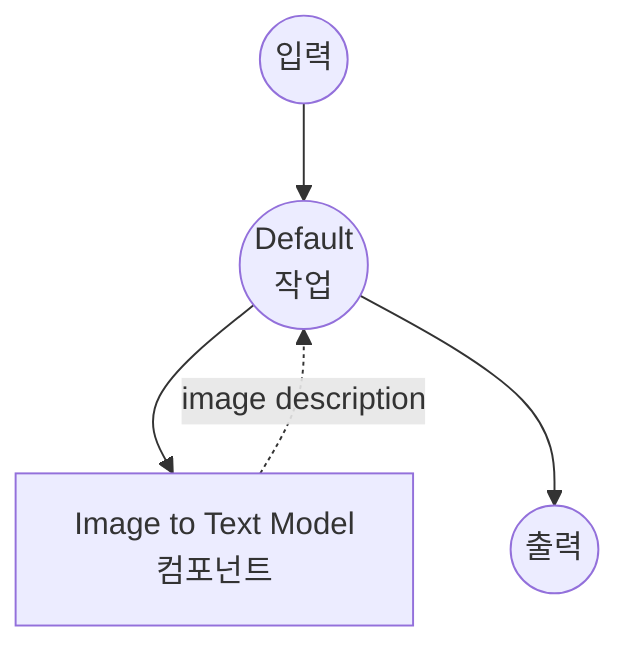

# Image-to-Text Model Task 예제

이 예제는 model-compose의 내장 image-to-text 작업과 허깅페이스 transformers를 사용하여 로컬 비전-언어 모델로 이미지 캡션 및 설명을 생성하는 방법을 보여주며, 오프라인 이미지 이해 기능을 제공합니다.

## 개요

이 워크플로우는 다음과 같은 로컬 이미지-텍스트 생성을 제공합니다:

1. **로컬 비전 모델**: 허깅페이스 transformers를 사용하여 사전 학습된 비전-언어 모델을 로컬에서 실행
2. **이미지 이해**: 입력 이미지에서 자연어 설명 생성
3. **선택적 프롬프팅**: 커스텀 프롬프트로 유도된 이미지 설명 지원
4. **자동 모델 관리**: 첫 사용 시 모델을 자동으로 다운로드하고 캐시
5. **외부 API 불필요**: API 의존성 없이 완전히 오프라인 이미지 분석

## 준비사항

### 필수 요구사항

- model-compose가 설치되어 PATH에서 사용 가능
- BLIP 모델 실행을 위한 충분한 시스템 리소스 (권장: 8GB+ RAM)
- transformers, torch 및 PIL이 있는 Python 환경 (자동 관리)

### 로컬 비전 모델을 사용하는 이유

클라우드 기반 비전 API와 달리 로컬 모델 실행은 다음을 제공합니다:

**로컬 처리의 이점:**
- **프라이버시**: 모든 이미지 처리가 로컬에서 이루어지며 외부 서비스로 이미지 전송 없음
- **비용**: 초기 설정 후 이미지당 또는 API 사용 요금 없음
- **오프라인**: 모델 다운로드 후 인터넷 연결 없이 작동
- **지연시간**: 이미지 분석에 네트워크 지연 없음
- **사용자 정의**: 모델 매개변수 및 프롬프팅에 대한 완전한 제어
- **배치 처리**: 속도 제한 없이 무제한 이미지 처리

**트레이드오프:**
- **하드웨어 요구사항**: 적절한 RAM 및 처리 능력 필요
- **설정 시간**: 초기 모델 다운로드 및 로딩 시간
- **모델 제한**: 더 작은 모델은 대형 클라우드 모델보다 덜 정교한 이해를 가질 수 있음

### 환경 구성

1. 이 예제 디렉토리로 이동:
   ```bash
   cd examples/model-tasks/image-to-text
   ```

2. 추가 환경 구성 불필요 - 모델 및 종속성이 자동으로 관리됩니다.

## 실행 방법

1. **서비스 시작:**
   ```bash
   model-compose up
   ```

2. **워크플로우 실행:**

   **API 사용:**
   ```bash
   # 기본 이미지 캡션
   curl -X POST http://localhost:8080/api/workflows/runs \
     -F "image=@/path/to/your/image.jpg" \
     -F "input={\"image\": \"@image\"}"

   # 유도된 생성을 위한 텍스트 프롬프트 포함
   curl -X POST http://localhost:8080/api/workflows/runs \
     -F "image=@/path/to/your/image.jpg" \
     -F "input={\"image\": \"@image\", \"prompt\": \"Describe the colors and mood in this image\"}"
   ```

   **웹 UI 사용:**
   - 웹 UI 열기: http://localhost:8081
   - 이미지 파일 업로드 또는 이미지 경로 제공
   - 선택적으로 생성을 유도할 텍스트 프롬프트 입력
   - "Run Workflow" 버튼 클릭

   **CLI 사용:**
   ```bash
   # 기본 이미지 캡션
   model-compose run image-to-text --input '{"image": "/path/to/your/image.jpg"}'

   # 유도된 생성을 위한 텍스트 프롬프트 포함
   model-compose run image-to-text --input '{"image": "/path/to/your/image.jpg", "prompt": "Describe the colors and mood in this image"}'
   ```

## 컴포넌트 세부사항

### Image to Text Model 컴포넌트 (기본)
- **유형**: image-to-text 작업을 사용하는 Model 컴포넌트
- **목적**: 로컬 이미지 이해 및 캡션
- **모델**: Salesforce/blip-image-captioning-large
- **아키텍처**: BLIP (Bootstrapping Language-Image Pre-training)
- **기능**:
  - 자동 모델 다운로드 및 캐싱
  - 다양한 이미지 형식 지원 (JPEG, PNG 등)
  - 선택적 프롬프트 유도 생성
  - CPU 및 GPU 가속 지원
  - 메모리 효율적인 모델 로딩

### 모델 정보: BLIP Image Captioning Large
- **개발자**: Salesforce Research
- **매개변수**: 3억 8,500만
- **유형**: 비전-언어 트랜스포머 모델
- **아키텍처**: BLIP (비전 트랜스포머가 있는 인코더-디코더)
- **학습 데이터**: 웹의 대규모 이미지-텍스트 쌍
- **기능**: 이미지 캡션, 시각적 질의응답
- **입력 해상도**: 384x384 픽셀 (자동 크기 조정)
- **라이센스**: BSD-3-Clause

## 워크플로우 세부사항

### "Generate Text from Image" 워크플로우 (기본)

**설명**: 사전 학습된 비전-언어 모델을 사용하여 이미지에서 자연어 설명을 생성합니다.

#### 작업 흐름

이 예제는 명시적인 작업 없이 단순화된 단일 컴포넌트 구성을 사용합니다.



#### 입력 매개변수

| 매개변수 | 유형 | 필수 | 기본값 | 설명 |
|---------|------|------|--------|------|
| `image` | image | 예 | - | 입력 이미지 파일 (JPEG, PNG 등) |
| `prompt` | text | 아니오 | - | 설명을 유도할 선택적 프롬프트 |

#### 출력 형식

| 필드 | 유형 | 설명 |
|-----|------|------|
| `generated` | text | 이미지의 자연어 설명 |

## 시스템 요구사항

### 최소 요구사항
- **RAM**: 8GB (권장 16GB+)
- **디스크 공간**: 모델 저장 및 캐시를 위한 5GB+
- **CPU**: 멀티코어 프로세서 (4+ 코어 권장)
- **인터넷**: 초기 모델 다운로드에만 필요

### 성능 참고사항
- 첫 실행 시 모델 다운로드 필요 (~1.5GB)
- 모델 로딩은 하드웨어에 따라 30-60초 소요
- GPU 가속으로 추론 속도가 크게 향상됨
- 처리 시간은 이미지 크기 및 복잡도에 따라 다름

## 사용자 정의

### 다른 모델 사용

다른 비전-언어 모델로 교체:

```yaml
component:
  type: model
  task: image-to-text
  model: nlpconnect/vit-gpt2-image-captioning    # 더 작고 빠른 모델
  # 또는
  model: microsoft/git-large-coco                # 더 상세한 설명
```

### 커스텀 프롬프트 추가

특화된 프롬프팅 템플릿 생성:

```yaml
component:
  type: model
  task: image-to-text
  model: Salesforce/blip-image-captioning-large
  image: ${input.image as image}
  prompt: |
    ${input.custom_prompt | "Describe this image in detail, focusing on colors, objects, and activities."}
```

### 배치 처리

여러 이미지 처리:

```yaml
workflow:
  title: Batch Image Analysis
  jobs:
    - id: caption-images
      component: image-captioner
      repeat_count: ${input.image_count}
      input:
        image: ${input.images[${index}]}
        prompt: ${input.prompt}
```

## 문제 해결

### 일반적인 문제

1. **메모리 부족**: 배치 크기 줄이기 또는 시스템 RAM 업그레이드
2. **모델 다운로드 실패**: 인터넷 연결 및 디스크 공간 확인
3. **느린 처리**: GPU 가속 또는 더 작은 모델 고려
4. **품질 저하**: 더 큰 모델 시도 또는 프롬프팅 전략 조정
5. **이미지 형식 오류**: 지원되는 형식 확인 및 파일 손상 검사

### 성능 최적화

- **GPU 사용**: GPU 가속을 위해 CUDA 호환 PyTorch 설치
- **메모리 관리**: RAM을 확보하기 위해 다른 애플리케이션 종료
- **이미지 전처리**: 처리 전 대형 이미지 크기 조정
- **모델 선택**: 모델 크기와 품질 요구사항 균형

## API 기반 솔루션과 비교

| 기능 | 로컬 비전 모델 | 클라우드 비전 API |
|-----|-------------|----------------|
| 프라이버시 | 완전한 프라이버시 | 프로바이더로 이미지 전송 |
| 비용 | 하드웨어 비용만 | 이미지당 가격 |
| 지연시간 | 하드웨어 의존적 | 네트워크 + API 지연 |
| 가용성 | 오프라인 가능 | 인터넷 필요 |
| 사용자 정의 | 모델 선택, 프롬프팅 | 제한된 API 매개변수 |
| 품질 | 로컬 모델에 따라 다름 | 일반적으로 더 높은 품질 |
| 배치 처리 | 무제한 | 속도 제한 |
| 설정 복잡도 | 모델 다운로드 필요 | API 키만 |

## 고급 사용

### 다중 모달 워크플로우
```yaml
workflows:
  - id: image-analysis-pipeline
    jobs:
      - id: caption
        component: image-captioner
        input:
          image: ${input.image}
      - id: enhance-description
        component: text-enhancer
        input:
          text: ${caption.output}
```

### 커스텀 프롬프트 템플릿
```yaml
component:
  type: model
  task: image-to-text
  model: Salesforce/blip-image-captioning-large
  image: ${input.image as image}
  prompt: |
    Context: ${input.context | "general description"}
    Style: ${input.style | "detailed and objective"}
    Focus: ${input.focus | "main subjects and activities"}

    Please describe this image.
```

## 모델 변형

다양한 사용 사례를 위한 다른 권장 모델:

### 더 작은 모델 (낮은 요구사항)
- `nlpconnect/vit-gpt2-image-captioning` - 3억 매개변수, 빠른 추론
- `Salesforce/blip-image-captioning-base` - 베이스 버전, 줄어든 메모리

### 더 큰 모델 (높은 품질)
- `microsoft/git-large-coco` - 10억 매개변수, 더 상세한 설명
- `Salesforce/blip2-opt-2.7b` - BLIP-2 아키텍처, 향상된 기능

### 특화된 모델
- `microsoft/git-base-vatex` - 동작 설명을 위한 비디오 학습 모델
- `nlpconnect/vit-gpt2-image-captioning` - GPT-2 기반 생성
