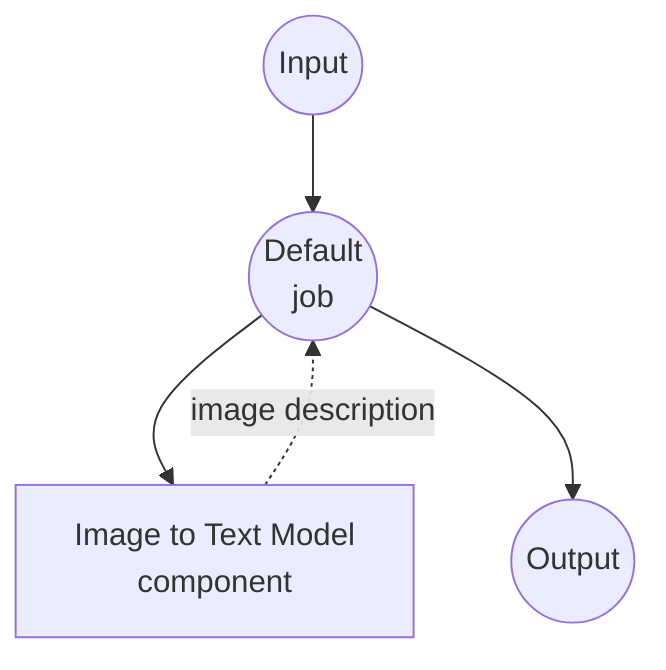

# Image-to-Text Model Task Example

This example demonstrates how to use local vision-language models for image captioning and description using model-compose's built-in image-to-text task with HuggingFace transformers, providing offline image understanding capabilities.

## Overview

This workflow provides local image-to-text generation that:

1. **Local Vision Model**: Runs a pretrained vision-language model locally using HuggingFace transformers
2. **Image Understanding**: Generates natural language descriptions from input images
3. **Optional Prompting**: Supports guided image description with custom prompts
4. **Automatic Model Management**: Downloads and caches models automatically on first use
5. **No External APIs**: Completely offline image analysis without API dependencies

## Preparation

### Prerequisites

- model-compose installed and available in your PATH
- Sufficient system resources for running BLIP model (recommended: 8GB+ RAM)
- Python environment with transformers, torch, and PIL (automatically managed)

### Why Local Vision Models

Unlike cloud-based vision APIs, local model execution provides:

**Benefits of Local Processing:**
- **Privacy**: All image processing happens locally, no images sent to external services
- **Cost**: No per-image or API usage fees after initial setup
- **Offline**: Works without internet connection after model download
- **Latency**: No network latency for image analysis
- **Customization**: Full control over model parameters and prompting
- **Batch Processing**: Unlimited image processing without rate limits

**Trade-offs:**
- **Hardware Requirements**: Requires adequate RAM and processing power
- **Setup Time**: Initial model download and loading time
- **Model Limitations**: Smaller models may have less sophisticated understanding than large cloud models

### Environment Configuration

1. Navigate to this example directory:
   ```bash
   cd examples/model-tasks/image-to-text
   ```

2. No additional environment configuration required - model and dependencies are managed automatically.

## How to Run

1. **Start the service:**
   ```bash
   model-compose up
   ```

2. **Run the workflow:**

   **Using API:**
   ```bash
   # Basic image captioning
   curl -X POST http://localhost:8080/api/workflows/__default__/runs \
     -F "image=@/path/to/your/image.jpg" \
     -F "input={\"image\": \"@image\"}"
   
   # With text prompt for guided generation
   curl -X POST http://localhost:8080/api/workflows/__default__/runs \
     -F "image=@/path/to/your/image.jpg" \
     -F "input={\"image\": \"@image\", \"prompt\": \"Describe the colors and mood in this image\"}"
   ```

   **Using Web UI:**
   - Open the Web UI: http://localhost:8081
   - Upload an image file or provide image path
   - Optionally enter a text prompt to guide generation
   - Click the "Run Workflow" button

   **Using CLI:**
   ```bash
   # Basic image captioning
   model-compose run image-to-text --input '{"image": "/path/to/your/image.jpg"}'
   
   # With text prompt for guided generation
   model-compose run image-to-text --input '{"image": "/path/to/your/image.jpg", "prompt": "Describe the colors and mood in this image"}'
   ```

## Component Details

### Image to Text Model Component (Default)
- **Type**: Model component with image-to-text task
- **Purpose**: Local image understanding and captioning
- **Model**: Salesforce/blip-image-captioning-large
- **Architecture**: BLIP (Bootstrapping Language-Image Pre-training)
- **Features**:
  - Automatic model downloading and caching
  - Support for various image formats (JPEG, PNG, etc.)
  - Optional prompt-guided generation
  - CPU and GPU acceleration support
  - Memory-efficient model loading

### Model Information: BLIP Image Captioning Large
- **Developer**: Salesforce Research
- **Parameters**: 385 million
- **Type**: Vision-language transformer model
- **Architecture**: BLIP (encoder-decoder with vision transformer)
- **Training Data**: Large-scale image-text pairs from web
- **Capabilities**: Image captioning, visual question answering
- **Input Resolution**: 384x384 pixels (automatically resized)
- **License**: BSD-3-Clause

## Workflow Details

### "Generate Text from Image" Workflow (Default)

**Description**: Generate natural language descriptions from images using a pretrained vision-language model.

#### Job Flow

This example uses a simplified single-component configuration without explicit jobs.



#### Input Parameters

| Parameter | Type | Required | Default | Description |
|-----------|------|----------|---------|-------------|
| `image` | image | Yes | - | Input image file (JPEG, PNG, etc.) |
| `prompt` | text | No | - | Optional prompt to guide the description |

#### Output Format

| Field | Type | Description |
|-------|------|-------------|
| `generated` | text | Natural language description of the image |

## System Requirements

### Minimum Requirements
- **RAM**: 8GB (recommended 16GB+)
- **Disk Space**: 5GB+ for model storage and cache
- **CPU**: Multi-core processor (4+ cores recommended)
- **Internet**: Required for initial model download only

### Performance Notes
- First run requires model download (~1.5GB)
- Model loading takes 30-60 seconds depending on hardware
- GPU acceleration significantly improves inference speed
- Processing time varies with image size and complexity

## Customization

### Using Different Models

Replace with other vision-language models:

```yaml
component:
  type: model
  task: image-to-text
  model: nlpconnect/vit-gpt2-image-captioning    # Smaller, faster model
  # or
  model: microsoft/git-large-coco                # More detailed descriptions
```

### Adding Custom Prompts

Create specialized prompting templates:

```yaml
component:
  type: model
  task: image-to-text
  model: Salesforce/blip-image-captioning-large
  image: ${input.image as image}
  prompt: |
    ${input.custom_prompt | "Describe this image in detail, focusing on colors, objects, and activities."}
```

### Batch Processing

Process multiple images:

```yaml
workflow:
  title: Batch Image Analysis
  jobs:
    - id: caption-images
      component: image-captioner
      repeat_count: ${input.image_count}
      input:
        image: ${input.images[${index}]}
        prompt: ${input.prompt}
```

## Troubleshooting

### Common Issues

1. **Out of Memory**: Reduce batch size or upgrade system RAM
2. **Model Download Fails**: Check internet connection and disk space
3. **Slow Processing**: Consider GPU acceleration or smaller model
4. **Poor Quality**: Try larger models or adjust prompting strategy
5. **Image Format Errors**: Ensure supported format and check file corruption

### Performance Optimization

- **GPU Usage**: Install CUDA-compatible PyTorch for GPU acceleration
- **Memory Management**: Close other applications to free up RAM
- **Image Preprocessing**: Resize large images before processing
- **Model Selection**: Balance model size with quality requirements

## Comparison with API-based Solutions

| Feature | Local Vision Model | Cloud Vision API |
|---------|-------------------|------------------|
| Privacy | Complete privacy | Images sent to provider |
| Cost | Hardware cost only | Per-image pricing |
| Latency | Hardware dependent | Network + API latency |
| Availability | Offline capable | Internet required |
| Customization | Model selection, prompting | Limited API parameters |
| Quality | Depends on local model | Usually higher quality |
| Batch Processing | Unlimited | Rate limited |
| Setup Complexity | Model download required | API key only |

## Advanced Usage

### Multi-Modal Workflows
```yaml
workflows:
  - id: image-analysis-pipeline
    jobs:
      - id: caption
        component: image-captioner
        input:
          image: ${input.image}
      - id: enhance-description
        component: text-enhancer
        input:
          text: ${caption.output}
```

### Custom Prompt Templates
```yaml
component:
  type: model
  task: image-to-text
  model: Salesforce/blip-image-captioning-large
  image: ${input.image as image}
  prompt: |
    Context: ${input.context | "general description"}
    Style: ${input.style | "detailed and objective"}
    Focus: ${input.focus | "main subjects and activities"}

    Please describe this image.
```

## Model Variants

Other recommended models for different use cases:

### Smaller Models (Lower Requirements)
- `nlpconnect/vit-gpt2-image-captioning` - 300M parameters, faster inference
- `Salesforce/blip-image-captioning-base` - Base version, reduced memory

### Larger Models (Higher Quality)
- `microsoft/git-large-coco` - 1B parameters, more detailed descriptions
- `Salesforce/blip2-opt-2.7b` - BLIP-2 architecture, enhanced capabilities

### Specialized Models
- `microsoft/git-base-vatex` - Video-trained model for action descriptions
- `nlpconnect/vit-gpt2-image-captioning` - GPT-2 based generation
