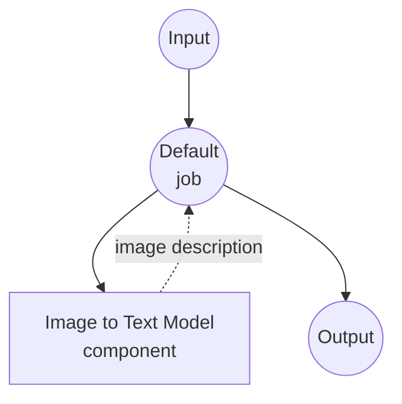

# 图像转文本模型任务示例

此示例演示如何使用 model-compose 的内置图像转文本任务通过 HuggingFace transformers 使用本地视觉语言模型进行图像字幕和描述，提供离线图像理解能力。

## 概述

此工作流提供本地图像转文本生成功能，包括：

1. **本地视觉模型**：使用 HuggingFace transformers 在本地运行预训练视觉语言模型
2. **图像理解**：从输入图像生成自然语言描述
3. **可选提示**：支持使用自定义提示进行引导式图像描述
4. **自动模型管理**：首次使用时自动下载和缓存模型
5. **无外部 API**：完全离线的图像分析，无 API 依赖

## 准备工作

### 前置条件

- 已安装 model-compose 并在 PATH 中可用
- 运行 BLIP 模型的足够系统资源（推荐：8GB+ RAM）
- 具有 transformers、torch 和 PIL 的 Python 环境（自动管理）

### 为什么使用本地视觉模型

与基于云的视觉 API 不同，本地模型执行提供：

**本地处理的优势：**
- **隐私**：所有图像处理都在本地进行，不向外部服务发送图像
- **成本**：初始设置后无按图像或 API 使用费用
- **离线**：模型下载后可在无互联网连接的情况下工作
- **延迟**：图像分析无网络延迟
- **自定义**：完全控制模型参数和提示
- **批量处理**：无速率限制的无限图像处理

**权衡：**
- **硬件要求**：需要足够的 RAM 和处理能力
- **设置时间**：初始模型下载和加载时间
- **模型限制**：较小的模型可能没有大型云模型那么复杂的理解能力

### 环境配置

1. 导航到此示例目录：
   ```bash
   cd examples/model-tasks/image-to-text
   ```

2. 无需额外的环境配置 - 模型和依赖项会自动管理。

## 运行方法

1. **启动服务：**
   ```bash
   model-compose up
   ```

2. **运行工作流：**

   **使用 API：**
   ```bash
   # 基本图像字幕
   curl -X POST http://localhost:8080/api/workflows/runs \
     -F "image=@/path/to/your/image.jpg" \
     -F "input={\"image\": \"@image\"}"

   # 使用文本提示进行引导生成
   curl -X POST http://localhost:8080/api/workflows/runs \
     -F "image=@/path/to/your/image.jpg" \
     -F "input={\"image\": \"@image\", \"prompt\": \"Describe the colors and mood in this image\"}"
   ```

   **使用 Web UI：**
   - 打开 Web UI：http://localhost:8081
   - 上传图像文件或提供图像路径
   - 可选择输入文本提示以指导生成
   - 点击 "Run Workflow" 按钮

   **使用 CLI：**
   ```bash
   # 基本图像字幕
   model-compose run image-to-text --input '{"image": "/path/to/your/image.jpg"}'

   # 使用文本提示进行引导生成
   model-compose run image-to-text --input '{"image": "/path/to/your/image.jpg", "prompt": "Describe the colors and mood in this image"}'
   ```

## 组件详情

### 图像转文本模型组件（默认）
- **类型**：具有图像转文本任务的 Model 组件
- **目的**：本地图像理解和字幕
- **模型**：Salesforce/blip-image-captioning-large
- **架构**：BLIP（引导语言-图像预训练）
- **功能**：
  - 自动模型下载和缓存
  - 支持各种图像格式（JPEG、PNG 等）
  - 可选的提示引导生成
  - CPU 和 GPU 加速支持
  - 内存高效的模型加载

### 模型信息：BLIP 图像字幕 Large
- **开发者**：Salesforce Research
- **参数**：3.85 亿
- **类型**：视觉语言 transformer 模型
- **架构**：BLIP（带有视觉 transformer 的编码器-解码器）
- **训练数据**：来自网络的大规模图像-文本对
- **能力**：图像字幕、视觉问答
- **输入分辨率**：384x384 像素（自动调整大小）
- **许可证**：BSD-3-Clause

## 工作流详情

### "从图像生成文本" 工作流（默认）

**描述**：使用预训练视觉语言模型从图像生成自然语言描述。

#### 作业流程

此示例使用简化的单组件配置，没有显式作业。



#### 输入参数

| 参数 | 类型 | 必需 | 默认值 | 描述 |
|-----------|------|----------|---------|-------------|
| `image` | image | 是 | - | 输入图像文件（JPEG、PNG 等）|
| `prompt` | text | 否 | - | 用于指导描述的可选提示 |

#### 输出格式

| 字段 | 类型 | 描述 |
|-------|------|-------------|
| `generated` | text | 图像的自然语言描述 |

## 系统要求

### 最低要求
- **RAM**：8GB（推荐 16GB+）
- **磁盘空间**：5GB+ 用于模型存储和缓存
- **CPU**：多核处理器（推荐 4+ 核）
- **互联网**：仅初始模型下载需要

### 性能说明
- 首次运行需要下载模型（约 1.5GB）
- 模型加载需要 30-60 秒，具体取决于硬件
- GPU 加速显著提高推理速度
- 处理时间因图像大小和复杂性而异

## 自定义

### 使用不同的模型

替换为其他视觉语言模型：

```yaml
component:
  type: model
  task: image-to-text
  model: nlpconnect/vit-gpt2-image-captioning    # 更小、更快的模型
  # 或
  model: microsoft/git-large-coco                # 更详细的描述
```

### 添加自定义提示

创建专门的提示模板：

```yaml
component:
  type: model
  task: image-to-text
  model: Salesforce/blip-image-captioning-large
  action:
    image: ${input.image as image}
    prompt: |
      ${input.custom_prompt | "Describe this image in detail, focusing on colors, objects, and activities."}
```

### 批量处理

处理多个图像：

```yaml
workflow:
  title: Batch Image Analysis
  jobs:
    - id: caption-images
      component: image-captioner
      repeat_count: ${input.image_count}
      input:
        image: ${input.images[${index}]}
        prompt: ${input.prompt}
```

## 故障排除

### 常见问题

1. **内存不足**：减小批量大小或升级系统 RAM
2. **模型下载失败**：检查互联网连接和磁盘空间
3. **处理缓慢**：考虑 GPU 加速或更小的模型
4. **质量差**：尝试更大的模型或调整提示策略
5. **图像格式错误**：确保支持的格式并检查文件损坏

### 性能优化

- **GPU 使用**：安装兼容 CUDA 的 PyTorch 以实现 GPU 加速
- **内存管理**：关闭其他应用程序以释放 RAM
- **图像预处理**：在处理前调整大图像大小
- **模型选择**：平衡模型大小与质量要求

## 与基于 API 的解决方案的比较

| 功能 | 本地视觉模型 | 云视觉 API |
|---------|-------------------|------------------|
| 隐私 | 完全隐私 | 图像发送给提供商 |
| 成本 | 仅硬件成本 | 按图像定价 |
| 延迟 | 取决于硬件 | 网络 + API 延迟 |
| 可用性 | 离线能力 | 需要互联网 |
| 自定义 | 模型选择、提示 | 有限的 API 参数 |
| 质量 | 取决于本地模型 | 通常质量更高 |
| 批量处理 | 无限制 | 速率限制 |
| 设置复杂性 | 需要模型下载 | 仅需 API 密钥 |

## 高级用法

### 多模态工作流
```yaml
workflows:
  - id: image-analysis-pipeline
    jobs:
      - id: caption
        component: image-captioner
        input:
          image: ${input.image}
      - id: enhance-description
        component: text-enhancer
        input:
          text: ${caption.output}
```

### 自定义提示模板
```yaml
component:
  type: model
  task: image-to-text
  model: Salesforce/blip-image-captioning-large
  action:
    image: ${input.image as image}
    prompt: |
      Context: ${input.context | "general description"}
      Style: ${input.style | "detailed and objective"}
      Focus: ${input.focus | "main subjects and activities"}

      Please describe this image.
```

## 模型变体

其他推荐用于不同用例的模型：

### 较小的模型（较低要求）
- `nlpconnect/vit-gpt2-image-captioning` - 300M 参数，更快的推理
- `Salesforce/blip-image-captioning-base` - 基础版本，减少内存

### 更大的模型（更高质量）
- `microsoft/git-large-coco` - 10 亿参数，更详细的描述
- `Salesforce/blip2-opt-2.7b` - BLIP-2 架构，增强能力

### 专业模型
- `microsoft/git-base-vatex` - 视频训练模型用于动作描述
- `nlpconnect/vit-gpt2-image-captioning` - 基于 GPT-2 的生成
