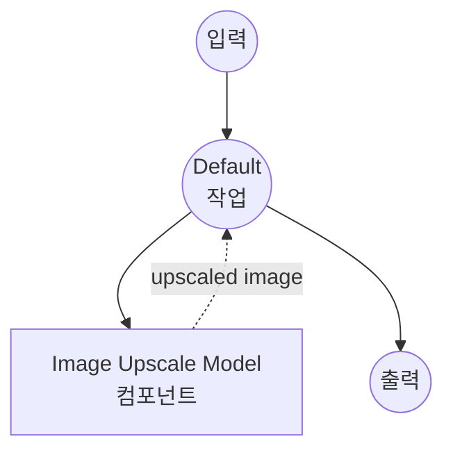

# Image Upscale Model Task 예제

이 예제는 Real-ESRGAN을 사용한 model-compose의 내장 image-upscale task로 로컬 super-resolution 모델을 사용하여 오프라인 이미지 향상 기능을 제공하는 방법을 보여줍니다.

## 개요

이 워크플로우는 다음과 같은 로컬 이미지 upscaling을 제공합니다:

1. **로컬 Super-Resolution 모델**: 4배 이미지 upscaling을 위해 Real-ESRGAN 모델을 로컬에서 실행
2. **고품질 향상**: 최첨단 GAN 기반 super-resolution 사용
3. **자동 모델 관리**: 첫 사용 시 모델 자동 다운로드 및 캐싱
4. **외부 API 불필요**: 의존성 없이 완전한 오프라인 이미지 처리
5. **실시간 처리**: 대화형 애플리케이션에 적합한 빠른 추론

## 준비사항

### 필수 요구사항

- model-compose가 설치되어 PATH에서 사용 가능
- Real-ESRGAN 실행을 위한 충분한 시스템 리소스 (권장: 8GB+ RAM, GPU 선호)
- torch, opencv, PIL이 포함된 Python 환경 (자동 관리)

### 로컬 Super-Resolution 모델을 사용하는 이유

클라우드 기반 이미지 향상 API와 달리 로컬 모델 실행은 다음을 제공합니다:

**로컬 처리의 이점:**
- **프라이버시**: 모든 이미지 처리가 로컬에서 발생, 외부 서비스로 이미지 전송 없음
- **비용**: 초기 설정 후 이미지당 또는 API 사용 요금 없음
- **오프라인**: 모델 다운로드 후 인터넷 연결 없이 작동
- **지연 시간**: 이미지 처리에 대한 네트워크 지연 없음
- **품질 제어**: 일관되고 결정적인 upscaling 결과
- **배치 처리**: rate limit 없이 무제한 이미지 처리

**트레이드오프:**
- **하드웨어 요구사항**: 적절한 RAM 및 VRAM 필요 (GPU 권장)
- **설정 시간**: 초기 모델 다운로드 및 로딩 시간
- **처리 시간**: 더 큰 이미지는 처리 시간이 더 오래 걸림
- **메모리 사용**: 큰 입력 이미지에 대한 높은 메모리 요구사항

### 환경 구성

1. 이 예제 디렉토리로 이동:
   ```bash
   cd examples/model-tasks/image-upscale
   ```

2. 추가 환경 구성 불필요 - 모델 및 의존성 자동 관리

## 실행 방법

1. **서비스 시작:**
   ```bash
   model-compose up
   ```

2. **워크플로우 실행:**

   **API 사용:**
   ```bash
   curl -X POST http://localhost:8080/api/workflows/runs \
     -H "Content-Type: multipart/form-data" \
     -F "image=@/path/to/your/low-resolution-image.jpg"
   ```

   **웹 UI 사용:**
   - Web UI 열기: http://localhost:8081
   - 입력 매개변수 입력
   - "Run Workflow" 버튼 클릭

   **CLI 사용:**
   ```bash
   model-compose run image-upscale --input '{"image": "/path/to/your/low-resolution-image.jpg"}'
   ```

## 컴포넌트 세부사항

### Image Upscale Model 컴포넌트 (기본)
- **유형**: image-upscale task를 가진 Model 컴포넌트
- **목적**: 로컬 이미지 super-resolution 및 향상
- **모델**: ai-forever/Real-ESRGAN (RealESRGAN_x4.pth)
- **아키텍처**: Real-ESRGAN (Real Enhanced Super-Resolution GAN)
- **기능**:
  - 4배 upscaling factor (예: 256x256 → 1024x1024)
  - 자동 모델 다운로드 및 캐싱
  - 다양한 이미지 형식 지원
  - GPU 가속 지원
  - 메모리 효율적인 처리

### 모델 정보: Real-ESRGAN

- **개발자**: Tencent ARC Lab / ai-forever
- **아키텍처**: Enhanced Super-Resolution Generative Adversarial Network
- **Scale Factor**: 4배 (각 차원에서 해상도를 4배로)
- **훈련**: 실제 열화 합성 및 고품질 데이터셋
- **강점**: 자연 이미지 향상, artifact 감소
- **입출력**: RGB 이미지, 종횡비 유지
- **라이선스**: Apache 2.0

## 워크플로우 세부사항

### "Upscale Image" 워크플로우 (기본)

**설명**: 사전 훈련된 super-resolution 모델을 사용하여 이미지 해상도를 4배 향상

#### 작업 흐름

이 예제는 명시적인 작업 없이 단순화된 단일 컴포넌트 구성을 사용합니다.



#### 입력 매개변수

| 매개변수 | 유형 | 필수 | 기본값 | 설명 |
|---------|------|------|--------|------|
| `image` | image | 예 | - | upscale할 입력 이미지 파일 (JPEG, PNG 등) |

#### 출력 형식

| 필드 | 유형 | 설명 |
|-----|------|------|
| - | image | 4배 해상도 향상이 적용된 upscaled 이미지 |

## 시스템 요구사항

### 최소 요구사항
- **RAM**: 8GB (권장 16GB+)
- **VRAM**: 4GB GPU 메모리 (권장 8GB+)
- **디스크 공간**: 모델 저장 및 캐시를 위한 3GB+
- **CPU**: 멀티코어 프로세서 (4+ 코어 권장)
- **인터넷**: 초기 모델 다운로드에만 필요

### 성능 참고사항
- 첫 실행 시 모델 다운로드 필요 (~300MB)
- 모델 로딩에 하드웨어에 따라 30-60초 소요
- GPU 가속으로 처리 속도 크게 향상
- 처리 시간은 입력 이미지 크기에 비례
- 메모리 사용량은 이미지 해상도에 따라 증가

## 성능 최적화

### GPU 가속
최적의 성능을 위해 CUDA 호환 PyTorch 설치 확인:
```bash
# 예제: CUDA 지원 PyTorch 설치
pip install torch torchvision --index-url https://download.pytorch.org/whl/cu118
```

### 메모리 관리
- **큰 이미지**: 메모리 효율성을 위해 더 작은 타일로 처리
- **배치 처리**: 메모리 오버플로우 방지를 위해 이미지를 순차적으로 처리
- **시스템 리소스**: 처리 중 다른 애플리케이션 종료

### 처리 팁
- **입력 크기**: 더 작은 입력 이미지가 더 빠르게 처리됨
- **형식 선택**: PNG가 JPEG보다 품질을 더 잘 보존
- **전처리**: 중요한 영역에 초점을 맞추기 위해 이미지 자르기

## 사용자 정의

### Scale Factor 조정

이 예제는 4배 scaling을 사용하지만 다른 모델에 대해 수정할 수 있습니다:

```yaml
component:
  type: model
  task: image-upscale
  architecture: real-esrgan
  model:
    provider: huggingface
    repository: ai-forever/Real-ESRGAN
    filename: RealESRGAN_x2.pth  # 2배 scaling용
  scale: 2
  action:
    image: ${input.image as image}
```

### 대체 모델 사용

```yaml
component:
  type: model
  task: image-upscale
  architecture: esrgan
  model:
    provider: huggingface
    repository: ai-forever/Real-ESRGAN
    filename: ESRGAN_x4.pth      # 원본 ESRGAN 모델
  scale: 4
  action:
    image: ${input.image as image}
```

## 문제 해결

### 일반적인 문제

1. **메모리 부족**: 입력 이미지 크기 줄이거나 GPU/RAM 업그레이드
2. **모델 다운로드 실패**: 인터넷 연결 및 디스크 공간 확인
3. **느린 처리**: GPU 가속 활성화 확인
4. **낮은 품질**: 입력 이미지 품질 및 형식 확인
5. **충돌**: 처리 중 시스템 리소스 모니터링

### 메모리 최적화

```yaml
component:
  type: model
  task: image-upscale
  architecture: real-esrgan
  model:
    provider: huggingface
    repository: ai-forever/Real-ESRGAN
    filename: RealESRGAN_x4.pth
  scale: 4
  action:
    image: ${input.image as image}
    params:
      tile_size: 512        # 더 작은 타일로 처리
      tile_pad: 10          # 가장자리 artifact 방지를 위한 패딩
```

## API 기반 솔루션과의 비교

| 기능 | 로컬 Super-Resolution | 클라우드 Enhancement API |
|-----|----------------------|----------------------|
| 프라이버시 | 완전한 프라이버시 | 제공자에게 이미지 전송 |
| 비용 | 하드웨어 비용만 | 이미지당 가격 |
| 지연 시간 | 하드웨어 의존적 | 네트워크 + 처리 지연 |
| 가용성 | 오프라인 가능 | 인터넷 필요 |
| 품질 제어 | 일관된 결과 | 가변적인 품질 |
| 배치 처리 | 무제한 | Rate limited |
| 사용자 정의 | 모델 선택, 매개변수 | 제한된 API 옵션 |
| 설정 복잡도 | 모델 다운로드 필요 | API 키만 필요 |
| 파일 크기 제한 | 하드웨어 제한 | API 제한 |
