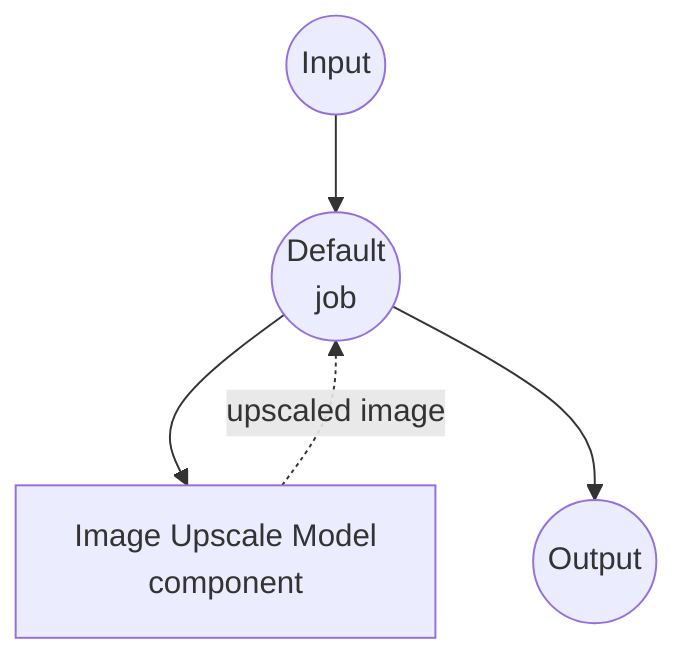

# Image Upscale Model Task Example

This example demonstrates how to use local super-resolution models for image upscaling using model-compose's built-in image-upscale task with Real-ESRGAN, providing offline image enhancement capabilities.

## Overview

This workflow provides local image upscaling that:

1. **Local Super-Resolution Model**: Runs Real-ESRGAN model locally for 4x image upscaling
2. **High-Quality Enhancement**: Uses state-of-the-art GAN-based super-resolution
3. **Automatic Model Management**: Downloads and caches models automatically on first use
4. **No External APIs**: Completely offline image processing without dependencies
5. **Real-time Processing**: Fast inference suitable for interactive applications

## Preparation

### Prerequisites

- model-compose installed and available in your PATH
- Sufficient system resources for running Real-ESRGAN (recommended: 8GB+ RAM, GPU preferred)
- Python environment with torch, opencv, and PIL (automatically managed)

### Why Local Super-Resolution Models

Unlike cloud-based image enhancement APIs, local model execution provides:

**Benefits of Local Processing:**
- **Privacy**: All image processing happens locally, no images sent to external services
- **Cost**: No per-image or API usage fees after initial setup
- **Offline**: Works without internet connection after model download
- **Latency**: No network latency for image processing
- **Quality Control**: Consistent, deterministic upscaling results
- **Batch Processing**: Unlimited image processing without rate limits

**Trade-offs:**
- **Hardware Requirements**: Requires adequate RAM and VRAM (GPU recommended)
- **Setup Time**: Initial model download and loading time
- **Processing Time**: Larger images take longer to process
- **Memory Usage**: High memory requirements for large input images

### Environment Configuration

1. Navigate to this example directory:
   ```bash
   cd examples/model-tasks/image-upscale
   ```

2. No additional environment configuration required - model and dependencies are managed automatically.

## How to Run

1. **Start the service:**
   ```bash
   model-compose up
   ```

2. **Run the workflow:**

   **Using API:**
   ```bash
   curl -X POST http://localhost:8080/api/workflows/runs \
     -H "Content-Type: multipart/form-data" \
     -F "image=@/path/to/your/low-resolution-image.jpg"
   ```

   **Using Web UI:**
   - Open the Web UI: http://localhost:8081
   - Enter your input parameters
   - Click the "Run Workflow" button

   **Using CLI:**
   ```bash
   model-compose run image-upscale --input '{"image": "/path/to/your/low-resolution-image.jpg"}'
   ```

## Component Details

### Image Upscale Model Component (Default)
- **Type**: Model component with image-upscale task
- **Purpose**: Local image super-resolution and enhancement
- **Model**: ai-forever/Real-ESRGAN (RealESRGAN_x4.pth)
- **Architecture**: Real-ESRGAN (Real Enhanced Super-Resolution GAN)
- **Features**:
  - 4x upscaling factor (e.g., 256x256 → 1024x1024)
  - Automatic model downloading and caching
  - Support for various image formats
  - GPU acceleration support
  - Memory-efficient processing

### Model Information: Real-ESRGAN

- **Developer**: Tencent ARC Lab / ai-forever
- **Architecture**: Enhanced Super-Resolution Generative Adversarial Network
- **Scale Factor**: 4x (quadruples resolution in each dimension)
- **Training**: Real-world degradation synthesis and high-quality datasets
- **Strengths**: Natural image enhancement, artifact reduction
- **Input/Output**: RGB images, maintains aspect ratio
- **License**: Apache 2.0

## Workflow Details

### "Upscale Image" Workflow (Default)

**Description**: Enhance image resolution by 4x using a pretrained super-resolution model.

#### Job Flow

This example uses a simplified single-component configuration without explicit jobs.



#### Input Parameters

| Parameter | Type | Required | Default | Description |
|-----------|------|----------|---------|-------------|
| `image` | image | Yes | - | Input image file to upscale (JPEG, PNG, etc.) |

#### Output Format

| Field | Type | Description |
|-------|------|-------------|
| - | image | Upscaled image with 4x resolution enhancement |

## System Requirements

### Minimum Requirements
- **RAM**: 8GB (recommended 16GB+)
- **VRAM**: 4GB GPU memory (recommended 8GB+)
- **Disk Space**: 3GB+ for model storage and cache
- **CPU**: Multi-core processor (4+ cores recommended)
- **Internet**: Required for initial model download only

### Performance Notes
- First run requires model download (~300MB)
- Model loading takes 30-60 seconds depending on hardware
- GPU acceleration dramatically improves processing speed
- Processing time scales with input image size
- Memory usage increases with image resolution

## Performance Optimization

### GPU Acceleration
For optimal performance, ensure CUDA-compatible PyTorch installation:
```bash
# Example: Install CUDA-enabled PyTorch
pip install torch torchvision --index-url https://download.pytorch.org/whl/cu118
```

### Memory Management
- **Large Images**: Process in smaller tiles for memory efficiency
- **Batch Processing**: Process images sequentially to avoid memory overflow
- **System Resources**: Close other applications during processing

### Processing Tips
- **Input Size**: Smaller input images process faster
- **Format Choice**: PNG preserves quality better than JPEG
- **Pre-processing**: Crop images to focus on important regions

## Customization

### Adjusting Scale Factor

While this example uses 4x scaling, you can modify for different models:

```yaml
component:
  type: model
  task: image-upscale
  architecture: real-esrgan
  model:
    provider: huggingface
    repository: ai-forever/Real-ESRGAN
    filename: RealESRGAN_x2.pth  # For 2x scaling
  scale: 2
  action:
    image: ${input.image as image}
```

### Using Alternative Models

```yaml
component:
  type: model
  task: image-upscale
  architecture: esrgan
  model:
    provider: huggingface
    repository: ai-forever/Real-ESRGAN
    filename: ESRGAN_x4.pth      # Original ESRGAN model
  scale: 4
  action:
    image: ${input.image as image}
```

### Batch Processing Configuration

```yaml
workflow:
  title: Batch Image Upscaling
  jobs:
    - id: upscale-images
      component: image-upscaler
      repeat_count: ${input.image_count}
      input:
        image: ${input.images[${index}]}
```

## Troubleshooting

### Common Issues

1. **Out of Memory**: Reduce input image size or upgrade GPU/RAM
2. **Model Download Fails**: Check internet connection and disk space
3. **Slow Processing**: Ensure GPU acceleration is enabled
4. **Poor Quality**: Check input image quality and format
5. **Crashes**: Monitor system resources during processing

### Memory Optimization

```yaml
component:
  type: model
  task: image-upscale
  architecture: real-esrgan
  model:
    provider: huggingface
    repository: ai-forever/Real-ESRGAN
    filename: RealESRGAN_x4.pth
  scale: 4
  action:
    image: ${input.image as image}
    params:
      tile_size: 512        # Process in smaller tiles
      tile_pad: 10          # Padding to avoid edge artifacts
```

## Comparison with API-based Solutions

| Feature | Local Super-Resolution | Cloud Enhancement API |
|---------|----------------------|---------------------|
| Privacy | Complete privacy | Images sent to provider |
| Cost | Hardware cost only | Per-image pricing |
| Latency | Hardware dependent | Network + processing latency |
| Availability | Offline capable | Internet required |
| Quality Control | Consistent results | Variable quality |
| Batch Processing | Unlimited | Rate limited |
| Customization | Model selection, parameters | Limited API options |
| Setup Complexity | Model download required | API key only |
| File Size Limits | Hardware limited | API restrictions |

## Advanced Usage

### Multi-Stage Enhancement Pipeline
```yaml
workflows:
  - id: photo-restoration
    jobs:
      - id: upscale
        component: image-upscaler
        input:
          image: ${input.image}
      - id: denoise
        component: image-denoiser
        input:
          image: ${upscale.output}
      - id: sharpen
        component: image-sharpener
        input:
          image: ${denoise.output}
```

### Quality Assessment Integration
```yaml
workflow:
  title: Upscale with Quality Check
  jobs:
    - id: upscale
      component: image-upscaler
      input:
        image: ${input.image}
    - id: quality-check
      component: image-quality-analyzer
      input:
        original: ${input.image}
        enhanced: ${upscale.output}
```

## Model Variants

### Different Scale Factors
- **RealESRGAN_x2.pth**: 2x upscaling, faster processing
- **RealESRGAN_x4.pth**: 4x upscaling, higher quality (default)
- **RealESRGAN_x8.pth**: 8x upscaling, highest quality, slower

### Specialized Models
- **RealESRGAN_anime.pth**: Optimized for anime/cartoon images
- **RealESRGAN_photo.pth**: Optimized for photographic images
- **ESRGAN_x4.pth**: Original ESRGAN model, good baseline
