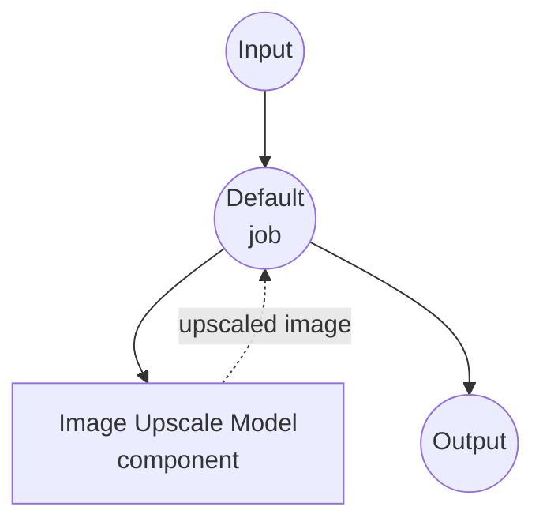

# 图像放大模型任务示例

此示例演示如何使用 model-compose 的内置图像放大任务通过 Real-ESRGAN 使用本地超分辨率模型进行图像放大，提供离线图像增强功能。

## 概述

此工作流提供本地图像放大功能，包括：

1. **本地超分辨率模型**：在本地运行 Real-ESRGAN 模型进行 4 倍图像放大
2. **高质量增强**：使用最先进的基于 GAN 的超分辨率
3. **自动模型管理**：首次使用时自动下载和缓存模型
4. **无外部 API**：完全离线的图像处理，无依赖
5. **实时处理**：适用于交互式应用的快速推理

## 准备工作

### 前置条件

- 已安装 model-compose 并在 PATH 中可用
- 运行 Real-ESRGAN 的足够系统资源（推荐：8GB+ RAM，首选 GPU）
- 具有 torch、opencv 和 PIL 的 Python 环境（自动管理）

### 为什么使用本地超分辨率模型

与基于云的图像增强 API 不同，本地模型执行提供：

**本地处理的优势：**
- **隐私**：所有图像处理都在本地进行，不向外部服务发送图像
- **成本**：初始设置后无按图像或 API 使用费用
- **离线**：模型下载后可在无互联网连接的情况下工作
- **延迟**：图像处理无网络延迟
- **质量控制**：一致、确定性的放大结果
- **批量处理**：无速率限制的无限图像处理

**权衡：**
- **硬件要求**：需要足够的 RAM 和 VRAM（推荐 GPU）
- **设置时间**：初始模型下载和加载时间
- **处理时间**：较大的图像处理时间更长
- **内存使用**：大输入图像的高内存要求

### 环境配置

1. 导航到此示例目录：
   ```bash
   cd examples/model-tasks/image-upscale
   ```

2. 无需额外的环境配置 - 模型和依赖项会自动管理。

## 运行方法

1. **启动服务：**
   ```bash
   model-compose up
   ```

2. **运行工作流：**

   **使用 API：**
   ```bash
   curl -X POST http://localhost:8080/api/workflows/runs \
     -H "Content-Type: multipart/form-data" \
     -F "image=@/path/to/your/low-resolution-image.jpg"
   ```

   **使用 Web UI：**
   - 打开 Web UI：http://localhost:8081
   - 输入您的输入参数
   - 点击 "Run Workflow" 按钮

   **使用 CLI：**
   ```bash
   model-compose run image-upscale --input '{"image": "/path/to/your/low-resolution-image.jpg"}'
   ```

## 组件详情

### 图像放大模型组件（默认）
- **类型**：具有图像放大任务的 Model 组件
- **目的**：本地图像超分辨率和增强
- **模型**：ai-forever/Real-ESRGAN（RealESRGAN_x4.pth）
- **架构**：Real-ESRGAN（真实增强超分辨率 GAN）
- **功能**：
  - 4 倍放大因子（例如，256x256 → 1024x1024）
  - 自动模型下载和缓存
  - 支持各种图像格式
  - GPU 加速支持
  - 内存高效处理

### 模型信息：Real-ESRGAN

- **开发者**：腾讯 ARC 实验室 / ai-forever
- **架构**：增强超分辨率生成对抗网络
- **缩放因子**：4 倍（每个维度的分辨率翻两番）
- **训练**：真实世界退化合成和高质量数据集
- **优势**：自然图像增强、伪影减少
- **输入/输出**：RGB 图像，保持纵横比
- **许可证**：Apache 2.0

## 工作流详情

### "放大图像" 工作流（默认）

**描述**：使用预训练超分辨率模型将图像分辨率提高 4 倍。

#### 作业流程

此示例使用简化的单组件配置，没有显式作业。



#### 输入参数

| 参数 | 类型 | 必需 | 默认值 | 描述 |
|-----------|------|----------|---------|-------------|
| `image` | image | 是 | - | 要放大的输入图像文件（JPEG、PNG 等）|

#### 输出格式

| 字段 | 类型 | 描述 |
|-------|------|-------------|
| - | image | 具有 4 倍分辨率增强的放大图像 |

## 系统要求

### 最低要求
- **RAM**：8GB（推荐 16GB+）
- **VRAM**：4GB GPU 内存（推荐 8GB+）
- **磁盘空间**：3GB+ 用于模型存储和缓存
- **CPU**：多核处理器（推荐 4+ 核）
- **互联网**：仅初始模型下载需要

### 性能说明
- 首次运行需要下载模型（约 300MB）
- 模型加载需要 30-60 秒，具体取决于硬件
- GPU 加速显著提高处理速度
- 处理时间随输入图像大小而变化
- 内存使用随图像分辨率增加

## 性能优化

### GPU 加速
为获得最佳性能，请确保安装兼容 CUDA 的 PyTorch：
```bash
# 示例：安装启用 CUDA 的 PyTorch
pip install torch torchvision --index-url https://download.pytorch.org/whl/cu118
```

### 内存管理
- **大图像**：以较小的瓦片处理以提高内存效率
- **批量处理**：按顺序处理图像以避免内存溢出
- **系统资源**：处理期间关闭其他应用程序

### 处理技巧
- **输入大小**：较小的输入图像处理更快
- **格式选择**：PNG 比 JPEG 更好地保留质量
- **预处理**：裁剪图像以专注于重要区域

## 自定义

### 调整缩放因子

虽然此示例使用 4 倍缩放，但您可以为不同的模型进行修改：

```yaml
component:
  type: model
  task: image-upscale
  architecture: real-esrgan
  model:
    provider: huggingface
    repository: ai-forever/Real-ESRGAN
    filename: RealESRGAN_x2.pth  # 用于 2 倍缩放
  scale: 2
  image: ${input.image as image}
```

### 使用替代模型

```yaml
component:
  type: model
  task: image-upscale
  architecture: esrgan
  model:
    provider: huggingface
    repository: ai-forever/Real-ESRGAN
    filename: ESRGAN_x4.pth      # 原始 ESRGAN 模型
  scale: 4
  image: ${input.image as image}
```

### 批量处理配置

```yaml
workflow:
  title: Batch Image Upscaling
  jobs:
    - id: upscale-images
      component: image-upscaler
      repeat_count: ${input.image_count}
      input:
        image: ${input.images[${index}]}
```

## 故障排除

### 常见问题

1. **内存不足**：减小输入图像大小或升级 GPU/RAM
2. **模型下载失败**：检查互联网连接和磁盘空间
3. **处理缓慢**：确保启用 GPU 加速
4. **质量差**：检查输入图像质量和格式
5. **崩溃**：在处理期间监控系统资源

### 内存优化

```yaml
component:
  type: model
  task: image-upscale
  architecture: real-esrgan
  model:
    provider: huggingface
    repository: ai-forever/Real-ESRGAN
    filename: RealESRGAN_x4.pth
  scale: 4
  image: ${input.image as image}
  params:
    tile_size: 512        # 以较小的瓦片处理
    tile_pad: 10          # 填充以避免边缘伪影
```

## 与基于 API 的解决方案的比较

| 功能 | 本地超分辨率 | 云增强 API |
|---------|----------------------|---------------------|
| 隐私 | 完全隐私 | 图像发送给提供商 |
| 成本 | 仅硬件成本 | 按图像定价 |
| 延迟 | 取决于硬件 | 网络 + 处理延迟 |
| 可用性 | 离线能力 | 需要互联网 |
| 质量控制 | 一致的结果 | 可变质量 |
| 批量处理 | 无限制 | 速率限制 |
| 自定义 | 模型选择、参数 | 有限的 API 选项 |
| 设置复杂性 | 需要模型下载 | 仅需 API 密钥 |
| 文件大小限制 | 硬件限制 | API 限制 |

## 高级用法

### 多阶段增强管道
```yaml
workflows:
  - id: photo-restoration
    jobs:
      - id: upscale
        component: image-upscaler
        input:
          image: ${input.image}
      - id: denoise
        component: image-denoiser
        input:
          image: ${upscale.output}
      - id: sharpen
        component: image-sharpener
        input:
          image: ${denoise.output}
```

### 质量评估集成
```yaml
workflow:
  title: Upscale with Quality Check
  jobs:
    - id: upscale
      component: image-upscaler
      input:
        image: ${input.image}
    - id: quality-check
      component: image-quality-analyzer
      input:
        original: ${input.image}
        enhanced: ${upscale.output}
```

## 模型变体

### 不同的缩放因子
- **RealESRGAN_x2.pth**：2 倍放大，处理更快
- **RealESRGAN_x4.pth**：4 倍放大，更高质量（默认）
- **RealESRGAN_x8.pth**：8 倍放大，最高质量，较慢

### 专业模型
- **RealESRGAN_anime.pth**：针对动漫/卡通图像优化
- **RealESRGAN_photo.pth**：针对摄影图像优化
- **ESRGAN_x4.pth**：原始 ESRGAN 模型，良好的基线
