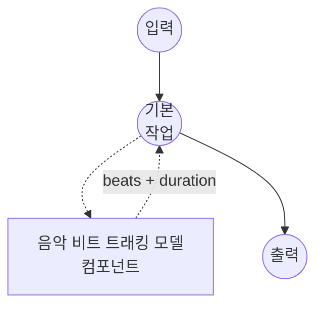

# 음악 비트 트래킹 모델 태스크 예제 (Beat This!)

이 예제는 로컬 Beat This! 모델과 함께 model-compose의 내장 music-beat-tracking 태스크를 사용하여 오디오 녹음에서 비트(beat)와 다운비트(downbeat) 위치를 감지하는 방법을 보여주며, 초기 패키지 설치 후 완전 오프라인으로 실행됩니다.

## 개요

이 워크플로우는 통합된 비트 이벤트 목록과 입력 오디오의 길이를 반환합니다:

1. **로컬 비트 트래커**: Beat This!를 로컬 실행; 체크포인트는 첫 사용 시 자동 다운로드됨
2. **통합된 비트 이벤트**: 각 이벤트는 `time`, `is_downbeat`, `beat_number`(각 다운비트부터 1-인덱스로 매겨진 마디 내 비트 위치)를 포함
3. **선택적 메타데이터**: `return_metadata`를 토글하여 응답에 `duration`을 포함
4. **선택적 DBN 리파인먼트**: 컴포넌트에 `dbn: true`를 설정하면 madmom의 Dynamic Bayesian Network를 적용해 템포 일관성 있는 후처리를 추가
5. **외부 API 불필요**: 의존성 설치 후 완전 오프라인

## 준비사항

### 필수 요구사항

- model-compose가 설치되어 PATH에서 사용 가능
- `beat_this`, `torch`, `torchaudio`가 포함된 Python 환경 (컴포넌트 설정 요구사항으로 선언되어 첫 실행 시 자동 설치)
- 선택사항: `dbn: true`를 활성화한다면 `madmom`
- GPU는 선택사항; Beat This!는 CPU, MPS, CUDA에서 실행됨

### 비트 트래킹을 사용하는 이유

자동 비트 트래킹은 녹음의 기저에 있는 메트릭 그리드 — 비트 온셋의 시퀀스와 그중 어떤 것이 다운비트(마디의 시작)인지 — 를 생성합니다. 일반적인 다운스트림 사용 사례:

- **비트 동기화 편집**: 비트에 맞춰 비디오 컷, 이펙트 적용, 또는 비주얼라이제이션 트리거
- **템포 및 박자 분석**: 인접 비트 간격에서 BPM을, 비트/다운비트 비율에서 박자를 유도
- **DJ 스타일 도구**: 공통 템포 그리드에 오디오를 정렬, 워핑, 또는 양자화
- **코드 및 구조 세그먼테이션**: 상위 레벨 MIR 파이프라인의 세그먼트 경계로 다운비트 사용

## 실행 방법

1. **서비스 시작:**
   ```bash
   model-compose up
   ```

2. **워크플로우 실행:**

   **API 사용:**
   ```bash
   curl -X POST http://localhost:8080/api/workflows/runs \
     -F "audio=@/path/to/your/recording.wav" \
     -F "input={\"audio\": \"@audio\"}"
   ```

   **웹 UI 사용:**
   - 웹 UI 열기: http://localhost:8081
   - 오디오 파일 업로드 (MP3, WAV, FLAC 등)
   - 필요에 따라 `return_metadata` 전환
   - "Run Workflow" 버튼 클릭

   **CLI 사용:**
   ```bash
   model-compose run music-beat-tracking --input '{"audio": "/path/to/your/recording.wav"}'
   ```

## 컴포넌트 세부사항

### 음악 비트 트래킹 모델 컴포넌트 (기본)

- **유형**: `music-beat-tracking` 태스크를 가진 모델 컴포넌트
- **드라이버**: `custom`
- **패밀리**: `beat-this`
- **목적**: 음악 오디오에서 비트와 다운비트 위치 감지
- **기능**:
  - `beat_this` 패키지를 통한 로컬 추론; 체크포인트는 HuggingFace 캐시에 자동 다운로드
  - 통합된 비트 이벤트 목록(`time`, `is_downbeat`, `beat_number`)과 입력 오디오 길이 반환
  - `return_metadata`를 통한 선택적 메타데이터
  - 컴포넌트의 `dbn: true`를 통한 선택적 madmom DBN 후처리

### 모델 정보: Beat This!

- **개발자**: JKU CP (요하네스 케플러 대학교 린츠 — Computational Perception)
- **유형**: 트랜스포머 기반 비트/다운비트 공동 추정기
- **라이선스**: [Beat This! 저장소](https://github.com/CPJKU/beat_this) 참조
- **논문**: "Beat This! Accurate Beat Tracking Without DBN Postprocessing" (ISMIR 2024)

사용 가능한 체크포인트:

- `final0`, `final1`, `final2` — 메인 모델 (각 ~78 MB)
- `small0`, `small1`, `small2` — 컴팩트 모델 (각 ~8 MB)

## 워크플로우 세부사항

### "Music Beat Tracking" 워크플로우 (기본)

**설명**: 입력 녹음의 비트와 다운비트 위치를 추적합니다.

#### 작업 흐름



#### 입력 매개변수 (Beat This!)

`beat-this` 패밀리가 액션에서 받는 필드입니다.

| 매개변수 | 위치 | 유형 | 필수 | 기본값 | 설명 |
|-----------|----------|------|----------|---------|-------------|
| `audio` | `action` | audio | 예 | - | 입력 녹음 (MP3, WAV, FLAC 등) |
| `return_metadata` | `action` | boolean | 아니오 | `true` | 처리 메타데이터(`duration`, ...)를 결과에 포함할지 여부 |

컴포넌트 수준 필드 (요청별이 아닌 한 번만 로드):

| 매개변수 | 유형 | 기본값 | 설명 |
|-----------|------|---------|-------------|
| `model` | string | `final0` | Beat This! 체크포인트 이름 (`final0/1/2`, `small0/1/2`) |
| `device` | string | `auto` | 연산 장치 (`cpu`, `cuda`, `cuda:0`, `mps`) |
| `dbn` | boolean | `false` | madmom DBN 후처리 적용 (`madmom` 설치 필요) |
| `precision` | string | — | 수치 정밀도 (`float32`, `float16`); 생략하면 드라이버가 선택, `float16`은 CUDA 추론 속도를 높임 |

#### 출력 형식

워크플로우 출력은 JSON 객체입니다:

- `beats` — 비트 이벤트 목록. 각 이벤트는 다음을 포함:
  - `time` — 비트 타임스탬프 (초)
  - `is_downbeat` — 이 비트가 새 마디를 시작할 때 `true`
  - `beat_number` — 가장 최근 다운비트부터 1-인덱스로 매겨진 마디 내 비트 위치 (다운비트에서 `1`, 이후 비트에서 `2`, `3`, ...). 첫 번째로 감지된 다운비트 이전에 발생하는 비트(픽업 노트 / 아나크루시스)에서는 마디 위치를 알 수 없어 `null`
- `duration` — 입력 오디오 길이(초, float); `return_metadata: true`일 때 포함됨

응답 예시:

```json
{
  "beats": [
    { "time": 0.100, "is_downbeat": false, "beat_number": null },
    { "time": 0.300, "is_downbeat": false, "beat_number": null },
    { "time": 0.512, "is_downbeat": true,  "beat_number": 1 },
    { "time": 1.017, "is_downbeat": false, "beat_number": 2 },
    { "time": 1.521, "is_downbeat": false, "beat_number": 3 },
    { "time": 2.025, "is_downbeat": true,  "beat_number": 1 }
  ],
  "duration": 12.34
}
```

## 문제 해결

### 일반적인 문제

1. **긴 녹음에서 비트가 드리프트함**: 컴포넌트에 `dbn: true`를 활성화하세요 (`pip install madmom` 필요) — Dynamic Bayesian Network가 트랙 전체에 걸쳐 템포 일관성을 강제하지만, 추론이 ~2-3배 느려집니다.
2. **긴 파일에서 CUDA 메모리 부족**: Beat This!는 전체 트랙을 단일 포워드 패스로 처리합니다. `small*` 체크포인트로 다운그레이드하거나 `device: cpu`로 폴백하세요.
3. **첫 실행이 느림**: `final*` 체크포인트(~78 MB)는 첫 사용 시 HuggingFace에서 다운로드되어 `~/.cache/huggingface/` 아래에 캐시됩니다.
4. **반정밀도가 약간 다른 타이밍을 생성함**: 예상된 동작입니다 — `precision: float16`은 CUDA에서 ~2배 추론 속도를 위해 몇 밀리초의 타이밍 정밀도를 트레이드오프합니다. `bfloat16`은 Beat This!에서 지원되지 않으며 float32로 폴백합니다.
