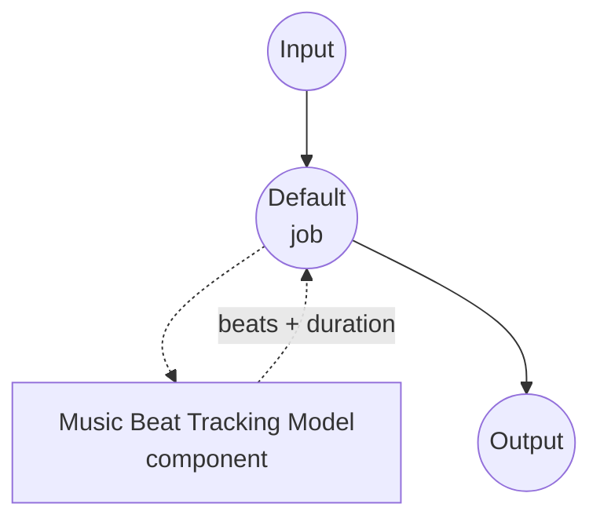

# Music Beat Tracking Model Task Example (Beat This!)

This example demonstrates how to detect beat and downbeat positions in an audio recording using model-compose's built-in music-beat-tracking task with a local Beat This! model, running fully offline after the initial package install.

## Overview

This workflow returns a unified list of beat events plus the input audio duration:

1. **Local Beat Tracker**: Runs Beat This! locally; checkpoints auto-download on first use
2. **Unified Beat Events**: Each event carries `time`, `is_downbeat`, and `beat_number` (the beat's position within its measure, 1-indexed from each downbeat)
3. **Selectable Metadata**: Toggle `return_metadata` to include `duration` in the response
4. **Optional DBN Refinement**: Set `dbn: true` on the component to layer madmom's Dynamic Bayesian Network on top for tempo-consistent post-processing
5. **No External APIs**: Fully offline once dependencies are installed

## Preparation

### Prerequisites

- model-compose installed and available in your PATH
- Python environment with `beat_this`, `torch`, `torchaudio` (declared as component setup requirements and auto-installed on first run)
- Optional: `madmom` if you enable `dbn: true`
- GPU is optional; Beat This! runs on CPU, MPS, or CUDA

### Why Beat Tracking

Automatic beat tracking produces the metrical grid underlying a recording — the sequence of beat onsets, and which of those are downbeats (measure starts). Typical downstream uses:

- **Beat-synchronized editing**: Cut video, apply effects, or trigger visualizations on the beat
- **Tempo and meter analysis**: Derive BPM from adjacent beat spacings and meter from the beat/downbeat ratio
- **DJ-style tools**: Align, warp, or quantize audio to a common tempo grid
- **Chord and structure segmentation**: Use downbeats as segment boundaries for higher-level MIR pipelines

## How to Run

1. **Start the service:**
   ```bash
   model-compose up
   ```

2. **Run the workflow:**

   **Using API:**
   ```bash
   curl -X POST http://localhost:8080/api/workflows/runs \
     -F "audio=@/path/to/your/recording.wav" \
     -F "input={\"audio\": \"@audio\"}"
   ```

   **Using Web UI:**
   - Open the Web UI: http://localhost:8081
   - Upload an audio file (MP3, WAV, FLAC, etc.)
   - Toggle `return_metadata` as needed
   - Click the "Run Workflow" button

   **Using CLI:**
   ```bash
   model-compose run music-beat-tracking --input '{"audio": "/path/to/your/recording.wav"}'
   ```

## Component Details

### Music Beat Tracking Model Component (Default)

- **Type**: Model component with `music-beat-tracking` task
- **Driver**: `custom`
- **Family**: `beat-this`
- **Purpose**: Detect beat and downbeat positions in music audio
- **Features**:
  - Local inference via the `beat_this` package; checkpoints auto-download to the HuggingFace cache
  - Returns a unified beat event list (`time`, `is_downbeat`, `beat_number`) plus the input audio duration
  - Selectable metadata via `return_metadata`
  - Optional madmom DBN post-processing via `dbn: true` on the component

### Model Information: Beat This!

- **Developer**: JKU CP (Johannes Kepler University, Linz — Computational Perception)
- **Type**: Transformer-based joint beat and downbeat estimator
- **License**: See the [Beat This! repository](https://github.com/CPJKU/beat_this)
- **Paper**: "Beat This! Accurate Beat Tracking Without DBN Postprocessing" (ISMIR 2024)

Available checkpoints:

- `final0`, `final1`, `final2` — main models (~78 MB each)
- `small0`, `small1`, `small2` — compact models (~8 MB each)

## Workflow Details

### "Music Beat Tracking" Workflow (Default)

**Description**: Track beat and downbeat positions in an input recording.

#### Job Flow



#### Input Parameters (Beat This!)

Fields the `beat-this` family accepts on its action.

| Parameter | Location | Type | Required | Default | Description |
|-----------|----------|------|----------|---------|-------------|
| `audio` | `action` | audio | Yes | - | Input recording (MP3, WAV, FLAC, etc.) |
| `return_metadata` | `action` | boolean | No | `true` | Whether processing metadata (`duration`, ...) is included in the result |

Component-level fields (loaded once, not per request):

| Parameter | Type | Default | Description |
|-----------|------|---------|-------------|
| `model` | string | `final0` | Beat This! checkpoint name (`final0/1/2`, `small0/1/2`) |
| `device` | string | `auto` | Compute device (`cpu`, `cuda`, `cuda:0`, `mps`) |
| `dbn` | boolean | `false` | Apply madmom DBN post-processing (requires `madmom` installed) |
| `precision` | string | `auto` | Numeric precision (`auto`, `float32`, `float16`); `float16` speeds up CUDA inference |

#### Output Format

The workflow output is a JSON object:

- `beats` — a list of beat events. Each event has:
  - `time` — beat timestamp in seconds
  - `is_downbeat` — `true` when this beat starts a new measure
  - `beat_number` — the beat's position within its measure, 1-indexed from the most recent downbeat (`1` on downbeats, `2`, `3`, ... on subsequent beats). `null` for beats that occur before the first detected downbeat (pickup notes / anacrusis), where the measure position is unknown
- `duration` — the input audio duration in seconds as a float (included when `return_metadata: true`)

Example response:

```json
{
  "beats": [
    { "time": 0.100, "is_downbeat": false, "beat_number": null },
    { "time": 0.300, "is_downbeat": false, "beat_number": null },
    { "time": 0.512, "is_downbeat": true,  "beat_number": 1 },
    { "time": 1.017, "is_downbeat": false, "beat_number": 2 },
    { "time": 1.521, "is_downbeat": false, "beat_number": 3 },
    { "time": 2.025, "is_downbeat": true,  "beat_number": 1 }
  ],
  "duration": 12.34
}
```

## Troubleshooting

### Common Issues

1. **Beats drift on long recordings**: Enable `dbn: true` on the component (requires `pip install madmom`) — the Dynamic Bayesian Network enforces tempo consistency across the whole track at the cost of ~2-3x slower inference.
2. **CUDA out of memory on long files**: Beat This! processes the whole track in one forward pass. Downgrade to a `small*` checkpoint or fall back to `device: cpu`.
3. **First run is slow**: The `final*` checkpoints (~78 MB) download from HuggingFace on first use and are cached under `~/.cache/huggingface/`.
4. **Half-precision produces slightly different timings**: Expected — `precision: float16` trades a few milliseconds of timing precision for ~2x inference speed on CUDA. `bfloat16` is not supported by Beat This! and falls back to float32.
