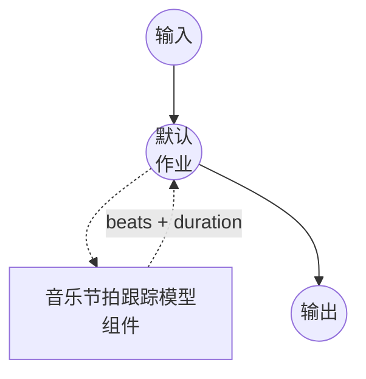

# 音乐节拍跟踪模型任务示例 (Beat This!)

此示例演示如何使用 model-compose 内置的 music-beat-tracking 任务和本地 Beat This! 模型，检测音频录音中的节拍（beat）和强拍（downbeat）位置，在初次包安装后完全离线运行。

## 概述

此工作流返回一个统一的节拍事件列表以及输入音频的时长：

1. **本地节拍跟踪器**：在本地运行 Beat This!；检查点在首次使用时自动下载
2. **统一的节拍事件**：每个事件携带 `time`、`is_downbeat` 和 `beat_number`（节拍在其小节内的位置，从每个强拍开始以 1 为起始索引）
3. **可选元数据**：切换 `return_metadata` 以在响应中包含 `duration`
4. **可选 DBN 优化**：在组件上设置 `dbn: true`，在其之上叠加 madmom 的动态贝叶斯网络进行节奏一致的后处理
5. **无需外部 API**：依赖项安装后完全离线

## 准备工作

### 前置条件

- 已安装 model-compose 并在您的 PATH 中可用
- 包含 `beat_this`、`torch`、`torchaudio` 的 Python 环境（作为组件设置要求声明，首次运行时自动安装）
- 可选：如果启用 `dbn: true`，则需要 `madmom`
- GPU 可选；Beat This! 可在 CPU、MPS 或 CUDA 上运行

### 为何选择节拍跟踪

自动节拍跟踪产生录音底层的节拍网格 —— 节拍起始点的序列，以及其中哪些是强拍（小节起点）。典型的下游用途：

- **节拍同步编辑**：在节拍上剪辑视频、应用效果或触发可视化
- **节奏和拍号分析**：从相邻节拍间距推导 BPM，从节拍/强拍比率推导拍号
- **DJ 风格工具**：将音频对齐、变形或量化到共同的节奏网格
- **和弦与结构分段**：使用强拍作为更高层 MIR 流水线的分段边界

## 运行方式

1. **启动服务：**
   ```bash
   model-compose up
   ```

2. **运行工作流：**

   **使用 API：**
   ```bash
   curl -X POST http://localhost:8080/api/workflows/runs \
     -F "audio=@/path/to/your/recording.wav" \
     -F "input={\"audio\": \"@audio\"}"
   ```

   **使用 Web UI：**
   - 打开 Web UI：http://localhost:8081
   - 上传音频文件（MP3、WAV、FLAC 等）
   - 根据需要切换 `return_metadata`
   - 点击"运行工作流"按钮

   **使用 CLI：**
   ```bash
   model-compose run music-beat-tracking --input '{"audio": "/path/to/your/recording.wav"}'
   ```

## 组件详情

### 音乐节拍跟踪模型组件（默认）

- **类型**：具有 `music-beat-tracking` 任务的模型组件
- **驱动**：`custom`
- **系列**：`beat-this`
- **用途**：检测音乐音频中的节拍和强拍位置
- **功能**：
  - 通过 `beat_this` 包进行本地推理；检查点自动下载到 HuggingFace 缓存
  - 返回统一的节拍事件列表（`time`、`is_downbeat`、`beat_number`）以及输入音频时长
  - 通过 `return_metadata` 提供可选元数据
  - 通过组件上的 `dbn: true` 提供可选的 madmom DBN 后处理

### 模型信息：Beat This!

- **开发者**：JKU CP（林茨约翰内斯·开普勒大学 —— Computational Perception）
- **类型**：基于 Transformer 的节拍/强拍联合估计器
- **许可证**：请参见 [Beat This! 仓库](https://github.com/CPJKU/beat_this)
- **论文**："Beat This! Accurate Beat Tracking Without DBN Postprocessing" (ISMIR 2024)

可用检查点：

- `final0`、`final1`、`final2` —— 主模型（每个约 78 MB）
- `small0`、`small1`、`small2` —— 紧凑模型（每个约 8 MB）

## 工作流详情

### "Music Beat Tracking" 工作流（默认）

**描述**：跟踪输入录音中的节拍和强拍位置。

#### 作业流程



#### 输入参数 (Beat This!)

`beat-this` 系列在其动作上接受的字段。

| 参数 | 位置 | 类型 | 必需 | 默认值 | 描述 |
|-----------|----------|------|----------|---------|-------------|
| `audio` | `action` | audio | 是 | - | 输入录音（MP3、WAV、FLAC 等） |
| `return_metadata` | `action` | boolean | 否 | `true` | 处理元数据（`duration`、...）是否包含在结果中 |

组件级字段（加载一次，而非每个请求）：

| 参数 | 类型 | 默认值 | 描述 |
|-----------|------|---------|-------------|
| `model` | string | `final0` | Beat This! 检查点名称（`final0/1/2`、`small0/1/2`） |
| `device` | string | `auto` | 计算设备（`cpu`、`cuda`、`cuda:0`、`mps`） |
| `dbn` | boolean | `false` | 应用 madmom DBN 后处理（需要安装 `madmom`） |
| `precision` | string | — | 数值精度（`float32`、`float16`）；省略时由驱动选择，`float16` 加速 CUDA 推理 |

#### 输出格式

工作流输出是一个 JSON 对象：

- `beats` —— 节拍事件列表。每个事件包含：
  - `time` —— 节拍时间戳（秒）
  - `is_downbeat` —— 当此节拍开始新小节时为 `true`
  - `beat_number` —— 节拍在其小节内的位置，从最近的强拍开始以 1 为起始索引（强拍上为 `1`，之后的节拍为 `2`、`3`、...）。对于在首个检测到的强拍之前发生的节拍（弱起/预备拍），小节位置未知，为 `null`
- `duration` —— 输入音频时长（秒，float）；当 `return_metadata: true` 时包含

响应示例：

```json
{
  "beats": [
    { "time": 0.100, "is_downbeat": false, "beat_number": null },
    { "time": 0.300, "is_downbeat": false, "beat_number": null },
    { "time": 0.512, "is_downbeat": true,  "beat_number": 1 },
    { "time": 1.017, "is_downbeat": false, "beat_number": 2 },
    { "time": 1.521, "is_downbeat": false, "beat_number": 3 },
    { "time": 2.025, "is_downbeat": true,  "beat_number": 1 }
  ],
  "duration": 12.34
}
```

## 故障排除

### 常见问题

1. **长录音上节拍漂移**：在组件上启用 `dbn: true`（需要 `pip install madmom`）—— 动态贝叶斯网络在整个轨道上强制节奏一致性，代价是推理速度降低约 2-3 倍。
2. **长文件上 CUDA 内存不足**：Beat This! 以单次前向传递处理整个轨道。降级到 `small*` 检查点或回退到 `device: cpu`。
3. **首次运行很慢**：`final*` 检查点（约 78 MB）在首次使用时从 HuggingFace 下载并缓存到 `~/.cache/huggingface/` 下。
4. **半精度产生略有不同的时间点**：预期行为 —— `precision: float16` 以几毫秒的时间精度为代价换取 CUDA 上约 2 倍的推理速度。Beat This! 不支持 `bfloat16`，会回退到 float32。
