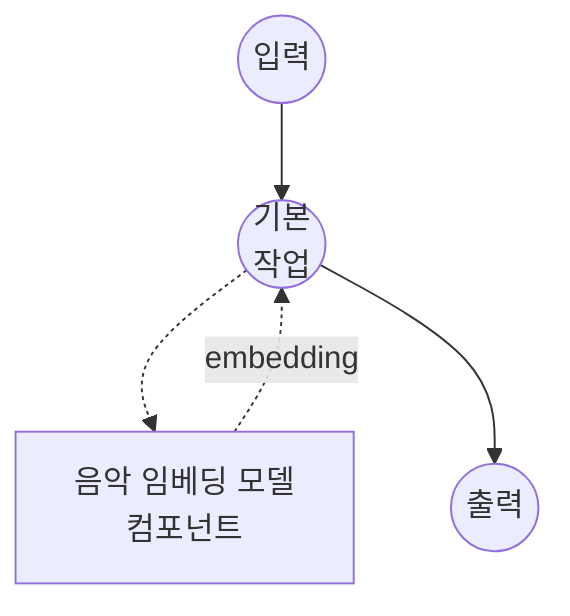

# 음악 임베딩 모델 태스크 예제 (Sample ID)

이 예제는 Sony의 Sample ID 모델과 함께 model-compose의 music-embedding 태스크를 사용하여 오디오 녹음을 고정 크기 임베딩 벡터로 변환하는 방법을 보여주며, 초기 체크포인트 다운로드 후 완전 오프라인으로 실행됩니다.

## 개요

이 워크플로우는 오디오 입력당 단일 임베딩 벡터를 반환하며, 샘플 식별 데이터베이스에서의 최근접 이웃 검색에 적합합니다:

1. **Sample ID 모델**: ICASSP 2026 Sample ID 인코더를 로컬에서 실행; 멀티트랙 대조 학습으로 훈련된 CQT 기반 ResNet-IBN 네트워크
2. **고정 크기 출력**: 각 입력은 지속 시간과 무관하게 1024차원 벡터가 됨 (모델이 내부적으로 시간축을 평균화)
3. **기본 L2 정규화**: 출력은 단위 길이이므로 코사인 유사도가 내적으로 축약되어 검색에 유리
4. **외부 API 불필요**: 체크포인트 캐싱 후 완전 오프라인

## 준비사항

### 필수 요구사항

- model-compose가 설치되어 PATH에서 사용 가능
- `torch`, `torchaudio`, `soxr`, `sampleid`가 포함된 Python 환경 (컴포넌트 설정 요구사항으로 선언되어 첫 실행 시 자동 설치; `sampleid`는 https://github.com/sony/sampleid 에서 가져옴)
- 처리량을 위해 GPU가 강력히 권장되지만, 작은 배치는 CPU에서도 동작

### 음악 임베딩을 사용하는 이유

음악 임베딩은 원시 오디오를 벡터 공간으로 투영하여, 지각적으로 또는 음악적으로 관련된 구간이 가까이 놓이게 합니다. 일반적인 다운스트림 사용 사례:

- **샘플 식별**: 곡의 일부 스니펫이 주어졌을 때, 그 스니펫이 샘플링된 원곡을 검색
- **커버/버전 감지**: 동일한 곡의 다른 연주 매칭
- **음악 유사도 검색**: 오디오 라이브러리에서 "비슷한 소리" 추천 구축
- **중복 제거**: 대규모 카탈로그 전체에서 거의 동일한 테이크나 마스터 클러스터링

참고: Sample ID는 샘플 검색용으로 특별히 훈련되었습니다 — 피치 시프트, 타임 스트레치, EQ, 다른 트랙과의 믹싱에 강건합니다. 범용 음악 태거나 장르 분류기가 아닙니다.

## 실행 방법

1. **서비스 시작:**
   ```bash
   model-compose up
   ```
   첫 실행 시 `sampleid` 패키지가 GitHub에서 설치되고 체크포인트(~200 MB)가 Zenodo에서 설치된 패키지 디렉토리로 다운로드됩니다.

2. **워크플로우 실행:**

   **API 사용:**
   ```bash
   # 기본 임베딩
   curl -X POST http://localhost:8080/api/workflows/runs \
     -F "audio=@/path/to/your/recording.wav" \
     -F "input={\"audio\": \"@audio\"}"

   # 정규화되지 않은 출력
   curl -X POST http://localhost:8080/api/workflows/runs \
     -F "audio=@/path/to/your/recording.wav" \
     -F "input={\"audio\": \"@audio\", \"normalize\": false}"
   ```

   **웹 UI 사용:**
   - 웹 UI 열기: http://localhost:8081
   - 오디오 파일 업로드 (MP3, WAV, FLAC 등)
   - 선택적으로 `normalize` 토글
   - "Run Workflow" 버튼 클릭

   **CLI 사용:**
   ```bash
   model-compose run music-embedding-sample-id --input '{"audio": "/path/to/your/recording.wav"}'
   ```

## 컴포넌트 세부사항

### 음악 임베딩 모델 컴포넌트 (기본)

- **유형**: `music-embedding` 태스크를 가진 모델 컴포넌트
- **드라이버**: `custom`
- **패밀리**: `sampleid`
- **목적**: 음악 클립을 검색용 고정 크기 벡터로 인코딩
- **기능**:
  - Sony의 `sampleid` 패키지를 통한 로컬 추론
  - 첫 사용 시 사전 학습된 체크포인트를 Zenodo에서 자동 다운로드
  - 소스 포맷과 무관하게 입력 오디오를 내부적으로 16 kHz 모노로 리샘플
  - 코사인 유사도 검색을 위한 선택적 L2 정규화

### 모델 정보: Sample ID

- **개발자**: Sony AI (Alain Riou, Joan Serrà, Yuki Mitsufuji)
- **유형**: CQT 프론트엔드 + ResNet-IBN 백본 + GeM 풀링, 멀티트랙 대조 학습으로 훈련
- **임베딩 차원**: 1024
- **라이선스**: MIT
- **논문**: "Automatic Music Sample Identification with Multi-Track Contrastive Learning" (ICASSP 2026, https://arxiv.org/abs/2510.11507)

## 워크플로우 세부사항

### "Music Embedding (Sample ID)" 워크플로우 (기본)

**설명**: 입력 녹음을 단일 고정 크기 벡터로 인코딩합니다.

#### 작업 흐름



#### 입력 매개변수

| 매개변수 | 위치 | 유형 | 필수 | 기본값 | 설명 |
|-----------|----------|------|----------|---------|-------------|
| `audio` | `action` | audio | 예 | - | 입력 녹음 (MP3, WAV, FLAC 등); 16 kHz 모노로 리샘플됨 |
| `normalize` | `action.params` | boolean | 아니오 | `true` | 출력 벡터의 L2 정규화 여부 |
| `batch_size` | `action` | integer | 아니오 | `8` | 목록이 제공될 때 배치당 처리되는 오디오 입력 수 |

#### 출력 형식

워크플로우 출력은 1024개의 float으로 구성된 JSON 배열입니다 — 입력 오디오에 대한 임베딩 벡터. `normalize: true`(기본값)일 때 두 벡터의 코사인 유사도는 내적으로 축약되며, 이는 벡터 데이터베이스(FAISS, Milvus, pgvector 등)에 그대로 활용할 수 있습니다.

## 긴 녹음을 위한 세그먼트별 임베딩

Sample ID는 모델 내부에서 임베딩을 시간축으로 평균화하므로, 30초 클립과 3분 곡 모두 단일 벡터로 나옵니다. 긴 녹음의 경우 5초 윈도우 하나에서라도 매치가 표면화되도록 거의 항상 **세그먼트별** 임베딩을 원할 것입니다.

권장 패턴은 이 컴포넌트를 호출하기 전에 입력을 짧고 겹치는 세그먼트로 분할한 다음, 세그먼트 배치를 한 번의 호출로 보내는 것입니다:

```yaml
action:
  audio: ${input.segments as audio}   # 오디오 세그먼트 목록
  batch_size: 16
```

오디오 청크 목록을 방출하는 어떤 컴포넌트든 — `ffmpeg`를 래핑하는 셸 명령, 자체 스플리터를 호출하는 HTTP 클라이언트, 또는 향후 내장 `audio-splitter` 컴포넌트 — 이 액션에 직접 공급할 수 있습니다. 반환되는 임베딩 목록은 세그먼트 순서를 보존합니다.

## Sample-ID 검색 파이프라인 구축

Sample ID 자체는 벡터만 생성합니다. "쿼리 곡이 주어졌을 때, 각 부분이 어디에서 샘플링되었는지 찾기" 전체 파이프라인은 일반적으로 다음과 같습니다:

1. **인덱스 구축 (오프라인)**: 모든 레퍼런스 트랙을 5초 윈도우로 청킹, 각 청크를 임베딩, 벡터를 최근접 이웃 인덱스(FAISS / Milvus / pgvector)에 `(track_id, start_time)`으로 키 저장.
2. **쿼리 (온라인)**: 쿼리 트랙을 동일한 방식으로 청킹, 임베딩, 각 쿼리 벡터에 대해 top-k 최근접 이웃 검색을 실행하고 히트를 후처리 (예: 트랙별 중복 제거, 연속 매치 요구).

이 컴포넌트를 사용하는 것은 (1)의 임베딩 단계와 (2)의 임베딩 단계뿐입니다. 청킹, 인덱싱, 후처리는 그 주변에 위치합니다.

## 문제 해결

### 일반적인 문제

1. **첫 실행이 시작 시 멈춤**: 초기 실행은 GitHub에서 `sampleid`를 설치하고(torch와 전이 의존성이 없으면 함께 가져옴) Zenodo에서 체크포인트를 다운로드합니다. 이후 실행은 둘 다 재사용합니다.
2. **긴 입력에서 GPU 메모리 부족**: 인코더는 전체 파형을 디바이스에 유지합니다; 매우 긴 입력의 경우 `batch_size`를 올리기보다 30초 이하 세그먼트로 분할하세요(위 "세그먼트별 임베딩" 참조).
3. **매우 다른 트랙 간에도 벡터가 동일해 보임**: `normalize: true`가 설정되어 있고 원시 유클리드 거리가 아니라 코사인 유사도(또는 정규화된 벡터에 대한 내적)로 비교하고 있는지 확인하세요.
4. **짧은 쿼리에서 검색 품질이 낮음**: Sample ID는 약 5초 윈도우로 훈련되었습니다. 몇 초보다 짧은 쿼리는 인코더가 구별할 만한 음악적 내용이 너무 적습니다; 쿼리를 최소 5초까지 패딩하거나 연장하세요.
5. **체크포인트를 고정하고 싶음**: 컴포넌트에 `model: /absolute/path/to/your.ckpt`를 설정하여 Zenodo 다운로드를 건너뛰고 로컬 파일을 대신 로드하세요.
