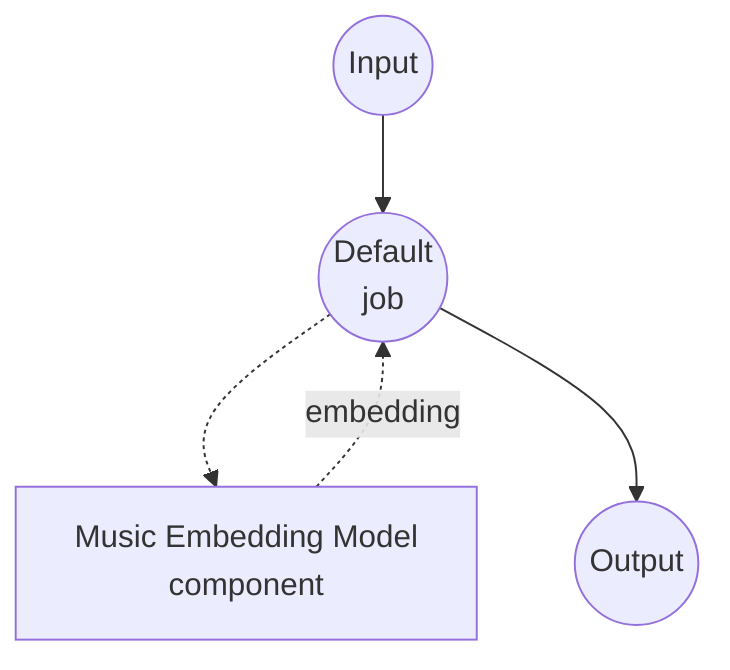

# Music Embedding Model Task Example (Sample ID)

This example demonstrates how to convert an audio recording into a fixed-size embedding vector using model-compose's music-embedding task with Sony's Sample ID model, running fully offline after the initial checkpoint download.

## Overview

This workflow returns a single embedding vector per audio input, suitable for nearest-neighbor retrieval in a sample-identification database:

1. **Sample ID Model**: Runs the ICASSP 2026 Sample ID encoder locally; a CQT-based ResNet-IBN network trained with multi-track contrastive learning
2. **Fixed-size Output**: Each input becomes a 1024-D vector regardless of duration (the model averages over time internally)
3. **L2-Normalized by Default**: Output is unit-length, so cosine similarity reduces to a dot product for retrieval
4. **No External APIs**: Fully offline once the checkpoint is cached

## Preparation

### Prerequisites

- model-compose installed and available in your PATH
- Python environment with `torch`, `torchaudio`, `soxr`, and `sampleid` (declared as component setup requirements and auto-installed on first run; `sampleid` is pulled from https://github.com/sony/sampleid)
- GPU strongly recommended for throughput; CPU works for small batches

### Why Music Embedding

Music embeddings project raw audio into a vector space where perceptually or musically related segments land close together. Typical downstream uses:

- **Sample identification**: Given a snippet of a song, retrieve the original recording the snippet was sampled from
- **Cover / version detection**: Match different performances of the same underlying composition
- **Music similarity search**: Build "sounds like" recommendations from an audio library
- **De-duplication**: Cluster near-identical takes or masters across a large catalog

Note: Sample ID is trained specifically for sample retrieval — it is robust to pitch shifts, time-stretching, EQ, and mixing with other tracks. It is not a general-purpose music tagger or genre classifier.

## How to Run

1. **Start the service:**
   ```bash
   model-compose up
   ```
   On first run, the `sampleid` package is installed from GitHub and the checkpoint (~200 MB) is downloaded from Zenodo into the installed package directory.

2. **Run the workflow:**

   **Using API:**
   ```bash
   # Basic embedding
   curl -X POST http://localhost:8080/api/workflows/runs \
     -F "audio=@/path/to/your/recording.wav" \
     -F "input={\"audio\": \"@audio\"}"

   # Un-normalized output
   curl -X POST http://localhost:8080/api/workflows/runs \
     -F "audio=@/path/to/your/recording.wav" \
     -F "input={\"audio\": \"@audio\", \"normalize\": false}"
   ```

   **Using Web UI:**
   - Open the Web UI: http://localhost:8081
   - Upload an audio file (MP3, WAV, FLAC, etc.)
   - Optionally toggle `normalize`
   - Click the "Run Workflow" button

   **Using CLI:**
   ```bash
   model-compose run music-embedding-sample-id --input '{"audio": "/path/to/your/recording.wav"}'
   ```

## Component Details

### Music Embedding Model Component (Default)

- **Type**: Model component with `music-embedding` task
- **Driver**: `custom`
- **Family**: `sampleid`
- **Purpose**: Encode a music clip into a fixed-size vector for retrieval
- **Features**:
  - Local inference via Sony's `sampleid` package
  - Auto-downloads the pretrained checkpoint from Zenodo on first use
  - Input audio is resampled to 16 kHz mono internally regardless of the source format
  - Optional L2 normalization for cosine-similarity retrieval

### Model Information: Sample ID

- **Developer**: Sony AI (Alain Riou, Joan Serrà, Yuki Mitsufuji)
- **Type**: CQT frontend + ResNet-IBN backbone + GeM pooling, trained with multi-track contrastive learning
- **Embedding Dimension**: 1024
- **License**: MIT
- **Paper**: "Automatic Music Sample Identification with Multi-Track Contrastive Learning" (ICASSP 2026, https://arxiv.org/abs/2510.11507)

## Workflow Details

### "Music Embedding (Sample ID)" Workflow (Default)

**Description**: Encode an input recording into a single fixed-size vector.

#### Job Flow



#### Input Parameters

| Parameter | Location | Type | Required | Default | Description |
|-----------|----------|------|----------|---------|-------------|
| `audio` | `action` | audio | Yes | - | Input recording (MP3, WAV, FLAC, etc.); resampled to 16 kHz mono |
| `normalize` | `action.params` | boolean | No | `true` | Whether the output vector is L2-normalized |
| `batch_size` | `action` | integer | No | `8` | Number of audio inputs processed per batch when a list is supplied |

#### Output Format

The workflow output is a JSON array of 1024 floats — the embedding vector for the input audio. When `normalize: true` (the default), two vectors' cosine similarity reduces to their dot product, which makes them a drop-in fit for vector databases (FAISS, Milvus, pgvector, etc.).

## Per-segment Embeddings for Long Recordings

Sample ID averages embeddings across time inside the model, so a 30-second clip and a 3-minute song both come out as a single vector. For long recordings you almost always want **per-segment** embeddings so a match on one 5-second window still surfaces.

The recommended pattern is to split the input into short, overlapping segments before calling this component, then send the batch of segments in one call:

```yaml
action:
  audio: ${input.segments as audio}   # a list of audio segments
  batch_size: 16
```

Any component that emits a list of audio chunks — a shell command wrapping `ffmpeg`, an HTTP client hitting your own splitter, or a future built-in `audio-splitter` component — can feed this action directly. The returned embedding list preserves the segment order.

## Building a Sample-ID Retrieval Pipeline

Sample ID by itself only produces vectors. A full "given a query song, find where each of its parts was sampled from" pipeline typically looks like:

1. **Index build (offline)**: chunk every reference track into 5-second windows, embed each chunk, and store the vectors in a nearest-neighbor index (FAISS / Milvus / pgvector) keyed by `(track_id, start_time)`.
2. **Query (online)**: chunk the query track the same way, embed it, run a top-k nearest-neighbor search per query vector, and post-process the hits (e.g. dedup by track, require consecutive matches).

Only step (1)'s embedding stage and step (2)'s embedding stage use this component. Chunking, indexing, and post-processing sit around it.

## Troubleshooting

### Common Issues

1. **First run stalls on startup**: The initial launch installs `sampleid` from GitHub (pulls torch and its transitive deps if missing) and downloads the checkpoint from Zenodo. Subsequent runs reuse both.
2. **Out-of-memory on GPU with long inputs**: The encoder holds the entire waveform on device; for very long inputs, split into ≤30-second segments (see "Per-segment Embeddings" above) rather than raising `batch_size`.
3. **Vectors look identical across very different tracks**: Confirm `normalize: true` is set and that you are comparing with cosine similarity (or dot product on normalized vectors), not raw Euclidean distance.
4. **Retrieval quality is poor on short queries**: Sample ID was trained on ~5-second windows. Queries shorter than a few seconds carry too little musical content for the encoder to disambiguate; pad or extend the query to at least 5 seconds.
5. **Want to pin the checkpoint**: Set `model: /absolute/path/to/your.ckpt` on the component to skip the Zenodo download and load a local file instead.
