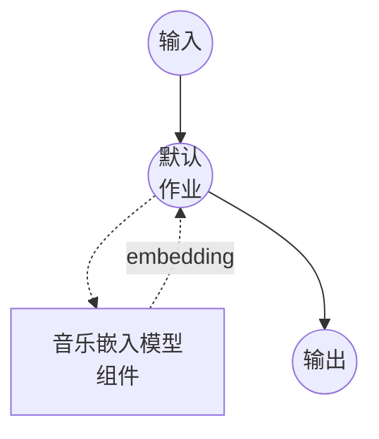

# 音乐嵌入模型任务示例 (Sample ID)

此示例演示如何使用 model-compose 的 music-embedding 任务和 Sony 的 Sample ID 模型将音频录音转换为固定大小的嵌入向量，在初次检查点下载后完全离线运行。

## 概述

此工作流为每个音频输入返回单个嵌入向量，适用于样本识别数据库中的最近邻检索：

1. **Sample ID 模型**：在本地运行 ICASSP 2026 Sample ID 编码器；一个基于 CQT 的 ResNet-IBN 网络，采用多轨对比学习训练
2. **固定大小输出**：无论持续时间如何，每个输入都变为 1024 维向量（模型在内部对时间轴取平均）
3. **默认 L2 归一化**：输出为单位长度，因此余弦相似度归约为点积，便于检索
4. **无需外部 API**：检查点缓存后完全离线

## 准备工作

### 前置条件

- 已安装 model-compose 并在您的 PATH 中可用
- 包含 `torch`、`torchaudio`、`soxr`、`sampleid` 的 Python 环境（作为组件设置要求声明，首次运行时自动安装；`sampleid` 从 https://github.com/sony/sampleid 拉取）
- 强烈推荐 GPU 以提升吞吐量；小批量在 CPU 上也可运行

### 为何选择音乐嵌入

音乐嵌入将原始音频投影到向量空间，感知或音乐上相关的片段会落在附近。典型的下游用途：

- **样本识别**：给定一首歌的片段，检索该片段所采样的原始录音
- **翻唱/版本检测**：匹配同一底层作品的不同演绎
- **音乐相似度搜索**：从音频库构建"听起来像"的推荐
- **去重**：跨大型目录聚类几乎相同的录音或母带

注意：Sample ID 专门为样本检索训练 — 对音高偏移、时间拉伸、EQ 以及与其他曲目的混音具有鲁棒性。它不是通用的音乐标签器或流派分类器。

## 运行方式

1. **启动服务：**
   ```bash
   model-compose up
   ```
   首次运行时，`sampleid` 包从 GitHub 安装，检查点（~200 MB）从 Zenodo 下载到已安装的包目录中。

2. **运行工作流：**

   **使用 API：**
   ```bash
   # 基础嵌入
   curl -X POST http://localhost:8080/api/workflows/runs \
     -F "audio=@/path/to/your/recording.wav" \
     -F "input={\"audio\": \"@audio\"}"

   # 未归一化的输出
   curl -X POST http://localhost:8080/api/workflows/runs \
     -F "audio=@/path/to/your/recording.wav" \
     -F "input={\"audio\": \"@audio\", \"normalize\": false}"
   ```

   **使用 Web UI：**
   - 打开 Web UI：http://localhost:8081
   - 上传音频文件（MP3、WAV、FLAC 等）
   - 可选择切换 `normalize`
   - 点击"运行工作流"按钮

   **使用 CLI：**
   ```bash
   model-compose run music-embedding-sample-id --input '{"audio": "/path/to/your/recording.wav"}'
   ```

## 组件详情

### 音乐嵌入模型组件（默认）

- **类型**：具有 `music-embedding` 任务的模型组件
- **驱动**：`custom`
- **系列**：`sampleid`
- **用途**：将音乐片段编码为用于检索的固定大小向量
- **功能**：
  - 通过 Sony 的 `sampleid` 包进行本地推理
  - 首次使用时从 Zenodo 自动下载预训练检查点
  - 输入音频在内部重采样为 16 kHz 单声道，与源格式无关
  - 用于余弦相似度检索的可选 L2 归一化

### 模型信息：Sample ID

- **开发者**：Sony AI (Alain Riou, Joan Serrà, Yuki Mitsufuji)
- **类型**：CQT 前端 + ResNet-IBN 骨干 + GeM 池化，采用多轨对比学习训练
- **嵌入维度**：1024
- **许可证**：MIT
- **论文**："Automatic Music Sample Identification with Multi-Track Contrastive Learning" (ICASSP 2026, https://arxiv.org/abs/2510.11507)

## 工作流详情

### "Music Embedding (Sample ID)" 工作流（默认）

**描述**：将输入录音编码为单个固定大小的向量。

#### 作业流程



#### 输入参数

| 参数 | 位置 | 类型 | 必需 | 默认值 | 描述 |
|-----------|----------|------|----------|---------|-------------|
| `audio` | `action` | audio | 是 | - | 输入录音（MP3、WAV、FLAC 等）；重采样为 16 kHz 单声道 |
| `normalize` | `action.params` | boolean | 否 | `true` | 输出向量是否 L2 归一化 |
| `batch_size` | `action` | integer | 否 | `8` | 提供列表时每批处理的音频输入数 |

#### 输出格式

工作流输出是一个由 1024 个浮点数组成的 JSON 数组 — 输入音频的嵌入向量。当 `normalize: true`（默认值）时，两个向量的余弦相似度归约为它们的点积，这使得它们可以直接用于向量数据库（FAISS、Milvus、pgvector 等）。

## 长录音的分段嵌入

Sample ID 在模型内部对时间轴上的嵌入取平均，因此 30 秒的片段和 3 分钟的歌曲都会得出单个向量。对于长录音，您几乎总是希望获得**分段**嵌入，以便在一个 5 秒窗口上的匹配仍能显现。

推荐的模式是在调用此组件之前将输入拆分为短的、重叠的分段，然后在一次调用中发送分段批次：

```yaml
action:
  audio: ${input.segments as audio}   # 音频分段列表
  batch_size: 16
```

任何发出音频块列表的组件 — 包装 `ffmpeg` 的 shell 命令、调用您自己的分割器的 HTTP 客户端，或未来的内置 `audio-splitter` 组件 — 都可以直接馈送到此 action。返回的嵌入列表保留分段顺序。

## 构建 Sample-ID 检索管道

Sample ID 本身只生成向量。"给定一首查询歌曲，找出其各部分是从何处采样"的完整管道通常如下所示：

1. **索引构建（离线）**：将每个参考音轨分块为 5 秒窗口，对每个块进行嵌入，并将向量存储在最近邻索引（FAISS / Milvus / pgvector）中，键为 `(track_id, start_time)`。
2. **查询（在线）**：以相同方式对查询音轨分块，进行嵌入，对每个查询向量运行 top-k 最近邻搜索，并对命中结果进行后处理（例如按音轨去重、要求连续匹配）。

只有步骤 (1) 的嵌入阶段和步骤 (2) 的嵌入阶段使用此组件。分块、索引和后处理位于其周围。

## 故障排除

### 常见问题

1. **首次运行在启动时停滞**：初始启动会从 GitHub 安装 `sampleid`（如果缺失则拉取 torch 及其传递依赖）并从 Zenodo 下载检查点。后续运行会重用两者。
2. **长输入下 GPU 内存不足**：编码器将整个波形保留在设备上；对于非常长的输入，请分割为 ≤30 秒的分段（见上文"分段嵌入"），而不是提高 `batch_size`。
3. **完全不同的音轨间向量看起来相同**：确认设置了 `normalize: true`，并且您使用余弦相似度（或对归一化向量使用点积）进行比较，而非原始欧氏距离。
4. **短查询的检索质量差**：Sample ID 在约 5 秒窗口上训练。短于几秒的查询携带的音乐内容太少，编码器无法区分；将查询填充或延长至至少 5 秒。
5. **想要固定检查点**：在组件上设置 `model: /absolute/path/to/your.ckpt` 以跳过 Zenodo 下载并加载本地文件。
