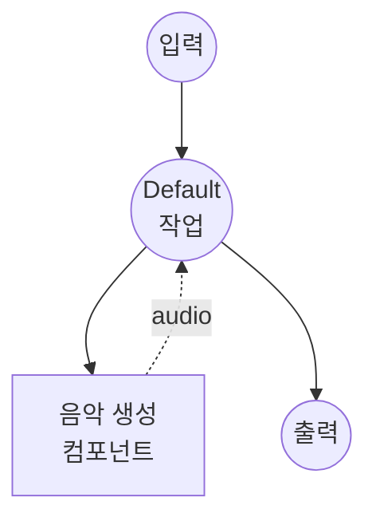

# 음악 생성 모델 태스크 예제

이 예제는 ACE-Step 1.5를 사용하여 텍스트 설명과 선택적 가사로부터 음악을 생성하는 방법을 보여주며, model-compose의 내장 모델 태스크 기능을 통해 로컬에서 실행됩니다.

## 개요

이 워크플로우는 다음과 같은 로컬 음악 생성을 제공합니다:

1. **로컬 모델 실행**: 디퓨전 기반 음악 생성 파이프라인을 사용하여 ACE-Step 1.5를 로컬에서 실행
2. **텍스트 기반 생성**: 자연어로 원하는 음악 스타일, 장르, 분위기, 악기를 설명
3. **가사 지원**: 구조 태그(예: `[Verse]`, `[Chorus]`)를 포함한 선택적 가사 제공
4. **파라미터 설정**: 길이, BPM, 추론 품질 등을 제어
5. **외부 API 불필요**: API 의존 없이 완전한 오프라인 음악 합성

## 준비사항

### 필수 요구사항

- model-compose가 설치되어 PATH에서 사용 가능
- CUDA를 지원하는 NVIDIA GPU (`cuda:0`으로 구성) 또는 Apple Silicon Mac (`mps`)
- 충분한 시스템 리소스 (권장: 8GB+ VRAM)
- acestep과 soundfile이 포함된 Python 환경 (자동 관리)

### 환경 구성

1. 이 예제 디렉토리로 이동:
   ```bash
   cd examples/model-tasks/music-generation
   ```

2. 추가 환경 구성이 필요 없습니다 - 모델과 의존성은 자동으로 관리됩니다.

## 실행 방법

1. **서비스 시작:**
   ```bash
   model-compose up
   ```

2. **워크플로우 실행:**

   **API 사용:**
   ```bash
   curl -X POST http://localhost:8080/api/workflows/runs \
     -H "Content-Type: application/json" \
     -d '{
       "input": {
         "prompt": "일렉트릭 기타와 신스가 있는 밝은 팝송",
         "lyrics": "[Verse]\n안녕 세상아\n[Chorus]\n라라라"
       }
     }'
   ```

   **웹 UI 사용:**
   - 웹 UI 열기: http://localhost:8081
   - 프롬프트와 선택적 가사 입력
   - "Run Workflow" 버튼 클릭

   **CLI 사용:**
   ```bash
   model-compose run --input '{"prompt": "일렉트릭 기타와 신스가 있는 밝은 팝송", "lyrics": "[Verse]\n안녕 세상아"}'
   ```

## 컴포넌트 세부사항

### 음악 생성 모델 컴포넌트 (기본)
- **유형**: music-generation 태스크를 가진 모델 컴포넌트
- **목적**: 텍스트 설명으로부터 로컬 음악 생성
- **모델**: ACE-Step/Ace-Step1.5
- **드라이버**: custom (ACE-Step 계열)
- **디바이스**: cuda:0
- **프리셋**: acestep-v15-turbo (8 추론 스텝의 터보 모드)
- **동시성**: 1 (한 번에 하나의 요청)

### 모델 정보: ACE-Step 1.5
- **개발자**: ACE-Step
- **유형**: 디퓨전 기반 음악 생성 모델
- **아키텍처**: DiT (Diffusion Transformer)
- **출력 형식**: 오디오 (WAV, 48kHz)
- **프리셋**: `acestep-v15-turbo` (빠름), `acestep-v15-base` (균형), `acestep-v15-sft` (고품질)

## 워크플로우 세부사항

### "Music Generation" 워크플로우 (기본)

**설명**: ACE-Step 1.5를 사용하여 텍스트 설명과 선택적 가사로부터 음악을 생성합니다.

#### 작업 흐름



#### 입력 매개변수

| 매개변수 | 유형 | 필수 | 기본값 | 설명 |
|---------|------|------|--------|------|
| `prompt` | text | 예 | - | 음악 스타일, 장르, 분위기, 악기에 대한 텍스트 설명 |
| `lyrics` | text | 아니오 | - | 구조 태그를 포함한 선택적 가사 (예: `[Verse]`, `[Chorus]`) |
| `duration` | integer | 아니오 | `30` | 생성할 음악의 길이 (초) |
| `bpm` | integer | 아니오 | `120` | 분당 비트 수 |

#### 출력 형식

| 필드 | 유형 | 설명 |
|-----|------|------|
| - | audio | 생성된 음악 오디오 (WAV) |

## 시스템 요구사항

### 최소 요구사항
- **GPU**: 8GB+ VRAM의 NVIDIA GPU (CUDA 필수) 또는 Apple Silicon Mac (MPS)
- **RAM**: 16GB (권장 32GB+)
- **디스크 공간**: 모델 저장을 위한 15GB+
- **인터넷**: 초기 모델 다운로드 시에만 필요

### 성능 참고사항
- 첫 실행 시 모델 다운로드 필요 (수 GB)
- 이 예제에서는 GPU가 필수입니다 (`device: cuda:0`)
- GPU 메모리 문제를 방지하기 위한 단일 동시 요청
- 터보 프리셋(`acestep-v15-turbo`)은 8 추론 스텝으로 상당히 빠르게 음악을 생성합니다

## 맞춤화

### Apple Silicon Mac 사용
```yaml
component:
  device: mps
```

### 음악 파라미터 조정
```yaml
action:
  prompt: ${input.prompt as text}
  lyrics: ${input.lyrics as text}
  params:
    duration: 60
    bpm: 140
    key_scale: Em
    time_signature: 3/4
    inference_steps: 32
    guidance_scale: 7.5
    seed: 42
```

### 고품질 프리셋 사용
```yaml
component:
  preset: acestep-v15-base
  action:
    params:
      inference_steps: 32
      guidance_scale: 7.5
```

## 관련 예제

- **[text-to-speech-generate](../text-to-speech-generate/)**: 프리셋 보이스를 사용한 텍스트 음성 변환
- **[text-to-speech-clone](../text-to-speech-clone/)**: 참조 오디오에서 음성을 복제
