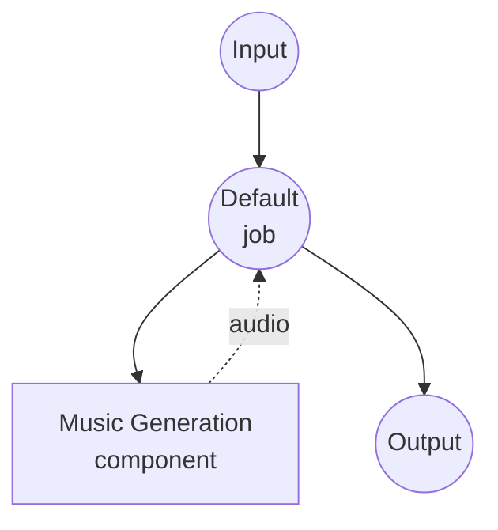

# Music Generation Model Task Example

This example demonstrates how to generate music from text descriptions and optional lyrics using ACE-Step 1.5, running locally via model-compose's built-in model task functionality.

## Overview

This workflow provides local music generation that:

1. **Local Model Execution**: Runs ACE-Step 1.5 locally using a diffusion-based music generation pipeline
2. **Text-Guided Generation**: Describe the desired music style, genre, mood, and instrumentation in natural language
3. **Lyrics Support**: Optionally provide song lyrics with structural tags (e.g., `[Verse]`, `[Chorus]`)
4. **Configurable Parameters**: Control duration, BPM, inference quality, and more
5. **No External APIs**: Completely offline music synthesis without API dependencies

## Preparation

### Prerequisites

- model-compose installed and available in your PATH
- NVIDIA GPU with CUDA support (configured for `cuda:0`) or Apple Silicon Mac (`mps`)
- Sufficient system resources (recommended: 8GB+ VRAM)
- Python environment with acestep and soundfile (automatically managed)

### Environment Configuration

1. Navigate to this example directory:
   ```bash
   cd examples/model-tasks/music-generation
   ```

2. No additional environment configuration required - model and dependencies are managed automatically.

## How to Run

1. **Start the service:**
   ```bash
   model-compose up
   ```

2. **Run the workflow:**

   **Using API:**
   ```bash
   curl -X POST http://localhost:8080/api/workflows/runs \
     -H "Content-Type: application/json" \
     -d '{
       "input": {
         "prompt": "upbeat pop song with electric guitar and synth",
         "lyrics": "[Verse]\nHello world, this is a test\n[Chorus]\nLa la la"
       }
     }'
   ```

   **Using Web UI:**
   - Open the Web UI: http://localhost:8081
   - Enter your prompt and optional lyrics
   - Click the "Run Workflow" button

   **Using CLI:**
   ```bash
   model-compose run --input '{"prompt": "upbeat pop song with electric guitar and synth", "lyrics": "[Verse]\nHello world"}'
   ```

## Component Details

### Music Generation Model Component (Default)
- **Type**: Model component with music-generation task
- **Purpose**: Local music generation from text descriptions
- **Model**: ACE-Step/Ace-Step1.5
- **Driver**: custom (ACE-Step family)
- **Device**: cuda:0
- **Preset**: acestep-v15-turbo (turbo mode with 8 inference steps)
- **Concurrency**: 1 (single request at a time)

### Model Information: ACE-Step 1.5
- **Developer**: ACE-Step
- **Type**: Diffusion-based music generation model
- **Architecture**: DiT (Diffusion Transformer)
- **Output Format**: Audio (WAV, 48kHz)
- **Presets**: `acestep-v15-turbo` (fast), `acestep-v15-base` (balanced), `acestep-v15-sft` (high quality)

## Workflow Details

### "Music Generation" Workflow (Default)

**Description**: Generate music from text description and optional lyrics using ACE-Step 1.5.

#### Job Flow



#### Input Parameters

| Parameter | Type | Required | Default | Description |
|-----------|------|----------|---------|-------------|
| `prompt` | text | Yes | - | Text description of the music style, genre, mood, and instrumentation |
| `lyrics` | text | No | - | Song lyrics with optional structural tags (e.g. `[Verse]`, `[Chorus]`) |
| `duration` | integer | No | `30` | Duration of the generated music in seconds |
| `bpm` | integer | No | `120` | Beats per minute |

#### Output Format

| Field | Type | Description |
|-------|------|-------------|
| - | audio | Generated music audio (WAV) |

## System Requirements

### Minimum Requirements
- **GPU**: NVIDIA GPU with 8GB+ VRAM (CUDA required) or Apple Silicon Mac (MPS)
- **RAM**: 16GB (recommended 32GB+)
- **Disk Space**: 15GB+ for model storage
- **Internet**: Required for initial model download only

### Performance Notes
- First run requires model download (several GB)
- GPU is required for this example (`device: cuda:0`)
- Single concurrent request to prevent GPU memory issues
- Turbo preset (`acestep-v15-turbo`) generates music significantly faster with 8 inference steps

## Customization

### Using Apple Silicon Mac
```yaml
component:
  device: mps
```

### Adjusting Music Parameters
```yaml
action:
  prompt: ${input.prompt as text}
  lyrics: ${input.lyrics as text}
  params:
    duration: 60
    bpm: 140
    key_scale: Em
    time_signature: 3/4
    inference_steps: 32
    guidance_scale: 7.5
    seed: 42
```

### Using Higher Quality Preset
```yaml
component:
  preset: acestep-v15-base
  action:
    params:
      inference_steps: 32
      guidance_scale: 7.5
```

## Related Examples

- **[text-to-speech-generate](../text-to-speech-generate/)**: Generate speech audio from text using a preset voice
- **[text-to-speech-clone](../text-to-speech-clone/)**: Clone a voice from reference audio
