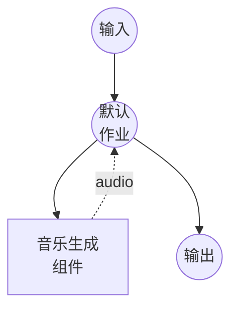

# 音乐生成模型任务示例

此示例演示如何使用 ACE-Step 1.5 从文本描述和可选歌词生成音乐，通过 model-compose 的内置模型任务功能在本地运行。

## 概述

此工作流提供本地音乐生成：

1. **本地模型执行**：使用基于扩散的音乐生成管线在本地运行 ACE-Step 1.5
2. **文本引导生成**：用自然语言描述所需的音乐风格、流派、氛围和乐器
3. **歌词支持**：可选提供包含结构标签（例如 `[Verse]`、`[Chorus]`）的歌词
4. **可配置参数**：控制时长、BPM、推理质量等
5. **无需外部 API**：无 API 依赖的完全离线音乐合成

## 准备工作

### 前置条件

- 已安装 model-compose 并在您的 PATH 中可用
- 支持 CUDA 的 NVIDIA GPU（配置为 `cuda:0`）或 Apple Silicon Mac（`mps`）
- 足够的系统资源（推荐：8GB+ VRAM）
- 包含 acestep 和 soundfile 的 Python 环境（自动管理）

### 环境配置

1. 导航到此示例目录：
   ```bash
   cd examples/model-tasks/music-generation
   ```

2. 无需额外的环境配置 - 模型和依赖会自动管理。

## 运行方式

1. **启动服务：**
   ```bash
   model-compose up
   ```

2. **运行工作流：**

   **使用 API：**
   ```bash
   curl -X POST http://localhost:8080/api/workflows/runs \
     -H "Content-Type: application/json" \
     -d '{
       "input": {
         "prompt": "带有电吉他和合成器的欢快流行歌曲",
         "lyrics": "[Verse]\n你好世界\n[Chorus]\n啦啦啦"
       }
     }'
   ```

   **使用 Web UI：**
   - 打开 Web UI：http://localhost:8081
   - 输入提示词和可选歌词
   - 点击"运行工作流"按钮

   **使用 CLI：**
   ```bash
   model-compose run --input '{"prompt": "带有电吉他和合成器的欢快流行歌曲", "lyrics": "[Verse]\n你好世界"}'
   ```

## 组件详情

### 音乐生成模型组件（默认）
- **类型**：具有 music-generation 任务的模型组件
- **用途**：从文本描述进行本地音乐生成
- **模型**：ACE-Step/Ace-Step1.5
- **驱动**：custom（ACE-Step 系列）
- **设备**：cuda:0
- **预设**：acestep-v15-turbo（8 推理步骤的快速模式）
- **并发数**：1（同时处理一个请求）

### 模型信息：ACE-Step 1.5
- **开发者**：ACE-Step
- **类型**：基于扩散的音乐生成模型
- **架构**：DiT（Diffusion Transformer）
- **输出格式**：音频（WAV，48kHz）
- **预设**：`acestep-v15-turbo`（快速）、`acestep-v15-base`（均衡）、`acestep-v15-sft`（高质量）

## 工作流详情

### "Music Generation"工作流（默认）

**描述**：使用 ACE-Step 1.5 从文本描述和可选歌词生成音乐。

#### 作业流程



#### 输入参数

| 参数 | 类型 | 必需 | 默认值 | 描述 |
|------|------|------|--------|------|
| `prompt` | text | 是 | - | 音乐风格、流派、氛围和乐器的文本描述 |
| `lyrics` | text | 否 | - | 包含结构标签的可选歌词（例如 `[Verse]`、`[Chorus]`） |
| `duration` | integer | 否 | `30` | 生成音乐的时长（秒） |
| `bpm` | integer | 否 | `120` | 每分钟节拍数 |

#### 输出格式

| 字段 | 类型 | 描述 |
|------|------|------|
| - | audio | 生成的音乐音频（WAV） |

## 系统要求

### 最低要求
- **GPU**：NVIDIA GPU，8GB+ VRAM（需要 CUDA）或 Apple Silicon Mac（MPS）
- **RAM**：16GB（推荐 32GB+）
- **磁盘空间**：15GB+ 用于模型存储
- **网络**：仅初次模型下载时需要

### 性能说明
- 首次运行需要下载模型（数 GB）
- 此示例需要 GPU（`device: cuda:0`）
- 单并发请求以防止 GPU 内存问题
- 快速预设（`acestep-v15-turbo`）使用 8 推理步骤可显著加快音乐生成速度

## 自定义

### 使用 Apple Silicon Mac
```yaml
component:
  device: mps
```

### 调整音乐参数
```yaml
action:
  prompt: ${input.prompt as text}
  lyrics: ${input.lyrics as text}
  params:
    duration: 60
    bpm: 140
    key_scale: Em
    time_signature: 3/4
    inference_steps: 32
    guidance_scale: 7.5
    seed: 42
```

### 使用高质量预设
```yaml
component:
  preset: acestep-v15-base
  action:
    params:
      inference_steps: 32
      guidance_scale: 7.5
```

## 相关示例

- **[text-to-speech-generate](../text-to-speech-generate/)**：使用预设语音生成语音音频
- **[text-to-speech-clone](../text-to-speech-clone/)**：从参考音频克隆语音
