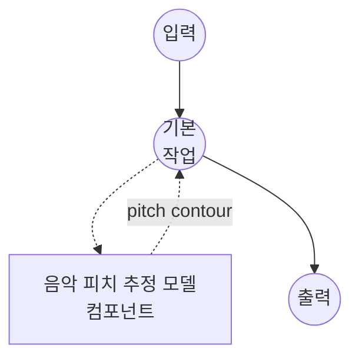

# 음악 피치 추정 모델 태스크 예제 (PESTO)

이 예제는 로컬 PESTO 모델과 함께 model-compose의 내장 music-pitch-estimation 태스크를 사용하여 단성(monophonic) 녹음의 프레임별 기본 주파수(f0)를 추정하는 방법을 보여주며, 초기 패키지 설치 후 완전 오프라인으로 실행됩니다.

## 개요

이 워크플로우는 CQT 프레임당 하나씩 이벤트가 담긴 조밀한 피치 컨투어(pitch contour)와 선택적 메타데이터를 반환합니다:

1. **로컬 피치 추정기**: `pesto-pitch` 패키지를 통해 PESTO를 로컬 실행; 번들된 체크포인트는 설치된 wheel에서 자동 로드됨
2. **조밀한 피치 컨투어**: 각 프레임은 `time`, `pitch`, `confidence`, `volume`을 포함
3. **유연한 출력 단위**: `pitch_unit`을 전환하여 Hz 또는 분수 MIDI 세미톤으로 반환
4. **세 가지 런타임**: 오프라인 배치, 청크 스트리밍, ONNX Runtime — 배포 환경에 맞는 것 선택
5. **외부 API 불필요**: 의존성 설치 후 완전 오프라인

## 준비사항

### 필수 요구사항

- model-compose가 설치되어 PATH에서 사용 가능
- `pesto-pitch`, `torch`, `torchaudio`가 포함된 Python 환경 (컴포넌트 설정 요구사항으로 선언되어 첫 실행 시 자동 설치)
- `onnx` 백엔드의 경우: `onnxruntime`과 사전 익스포트된 `.onnx` 파일 (아래 "ONNX 백엔드" 참조)
- GPU는 선택사항; PESTO는 CPU, MPS, CUDA에서 실행됨

### 피치 추정을 사용하는 이유

기본 주파수 추정은 녹음의 기저에 있는 멜로디 컨투어를 생성합니다 — 단성 소스가 노래하거나 연주하는 피치의 시퀀스와 해당 프레임이 유성(voiced)일 신뢰도. 일반적인 다운스트림 사용 사례:

- **멜로디 추출**: 컨투어에서 노트 시퀀스를 구축하여 전사 또는 검색에 활용
- **보컬 분석**: 노래 오디오에서 음정, 비브라토, 피치 드리프트 측정
- **악보 정렬**: 컨투어를 비교하여 연주를 참조 MIDI에 매칭
- **오디오 효과**: 프레임 단위로 pitch-shift / autotune / vocoder 매개변수 구동

## 실행 방법

1. **서비스 시작:**
   ```bash
   model-compose up
   ```

2. **워크플로우 실행:**

   **API 사용:**
   ```bash
   curl -X POST http://localhost:8080/api/workflows/runs \
     -F "audio=@/path/to/your/recording.wav" \
     -F "input={\"audio\": \"@audio\"}"
   ```

   **웹 UI 사용:**
   - 웹 UI 열기: http://localhost:8081
   - 오디오 파일 업로드 (MP3, WAV, FLAC 등)
   - 필요에 따라 `pitch_unit` 전환
   - "Run Workflow" 버튼 클릭

   **CLI 사용:**
   ```bash
   model-compose run music-pitch-estimation --input '{"audio": "/path/to/your/recording.wav"}'
   ```

## 컴포넌트 세부사항

### 음악 피치 추정 모델 컴포넌트 (기본)

- **유형**: `music-pitch-estimation` 태스크를 가진 모델 컴포넌트
- **드라이버**: `custom`
- **패밀리**: `pesto`
- **백엔드**: `torch` (기본) 또는 `onnx`
- **목적**: 단성 오디오의 프레임별 기본 주파수 추정
- **기능**:
  - `pesto-pitch` 패키지를 통한 로컬 추론; 번들된 체크포인트는 wheel 내에 포함
  - 조밀한 피치 컨투어(프레임당 `time`, `pitch`, `confidence`, `volume`)와 선택적 메타데이터 반환
  - 긴 녹음이나 라이브 입력에 대한 점진적 출력을 위한 청크 스트리밍
  - 가벼운 의존성 풋프린트를 위한 선택적 ONNX Runtime 백엔드

### 모델 정보: PESTO

- **개발자**: Sony CSL Paris
- **유형**: 자기지도 학습 CQT 기반 피치 추정기 (전조 등변)
- **라이선스**: [PESTO 저장소](https://github.com/SonyCSLParis/pesto) 참조
- **논문**:
  - "PESTO: Pitch Estimation with Self-supervised Transposition-equivariant Objective" (ISMIR 2023)
  - "PESTO: Real-time Pitch Estimation with Self-Supervised Transposition-Equivariant Objective" (arXiv:2508.01488)

사용 가능한 체크포인트 (`pesto-pitch`에 번들됨):

- `mir-1k_g7` — 기본값, MIR-1K로 학습됨

`model`을 로컬 `.ckpt` 경로로 지정할 수도 있습니다.

## 워크플로우 세부사항

### "Music Pitch Estimation" 워크플로우 (기본)

**설명**: 입력 녹음의 피치 컨투어를 추정합니다.

#### 작업 흐름



#### 입력 매개변수 (PESTO)

`pesto` 패밀리가 액션에서 받는 필드입니다.

| 매개변수 | 위치 | 유형 | 필수 | 기본값 | 설명 |
|-----------|----------|------|----------|---------|-------------|
| `audio` | `action` | audio | 예 | - | 입력 녹음 (MP3, WAV, FLAC 등) |
| `return_metadata` | `action` | boolean | 아니오 | `true` | 처리 메타데이터(`sample_rate`, `frame_rate`, `duration`)를 결과에 포함할지 여부 |
| `streaming` | `action` | boolean | 아니오 | `false` | 프레임별 이벤트를 점진적으로 방출; 컴포넌트의 `streaming` 또는 `backend: onnx` 필요 |
| `params.reduction` | `action` | enum | 아니오 | `alwa` | 디코딩 규칙: `alwa`, `argmax`, 또는 `weighted` |
| `params.pitch_unit` | `action` | enum | 아니오 | `hz` | 피치 값의 단위 — `hz` (주파수) 또는 `semitone` (MIDI 0 기준 분수 세미톤 거리) |
| `params.num_chunks` | `action` | int | 아니오 | `1` | GPU 메모리를 제한하기 위해 CQT 프레임을 분할 (torch 백엔드, 비스트리밍 전용) |
| `return_activations` | `action` | boolean | 아니오 | `false` | 피치 빈에 대한 프레임별 활성화 분포 포함 여부 |

컴포넌트 수준 필드 (요청별이 아닌 한 번만 로드):

| 매개변수 | 유형 | 기본값 | 설명 |
|-----------|------|---------|-------------|
| `backend` | string | `torch` | 추론 백엔드 (`pesto-pitch`를 통한 `torch` 또는 `onnxruntime`을 통한 `onnx`) |
| `model` | string | `mir-1k_g7` | PESTO 체크포인트 — 번들된 이름, 로컬 `.ckpt` 경로, 또는 로컬 `.onnx` 경로 |
| `sample_rate` | int | — | 모델이 기대하는 샘플 레이트; `backend: onnx` 및 `streaming`에 필요 |
| `step_size` | float | `10.0` | CQT 프레임 간 홉(밀리초); torch 백엔드 전용, `streaming.chunk_size`와 상호 배타적 |
| `streaming.chunk_size` | int | — | 추론 단계당 모델에 공급되는 고정 청크 길이(오디오 샘플 단위) |
| `streaming.max_batch_size` | int | `1` | 컴포넌트가 동시에 처리할 수 있는 최대 스트림 수 |
| `providers` | list | — | `onnxruntime` 실행 프로바이더 (예: `[CUDAExecutionProvider, CPUExecutionProvider]`); 생략 시 `device`에서 자동 선택 |
| `device` | string | `auto` | 연산 장치 (`cpu`, `cuda`, `cuda:0`, `mps`) |
| `precision` | string | — | 수치 정밀도 (`float32`, `float16`); `float16`은 torch 백엔드의 CUDA 추론 속도를 높임 |

#### 출력 형식

워크플로우 출력은 JSON 객체입니다. 정확한 형태는 `streaming`에 따라 다릅니다:

**비스트리밍 (`streaming: false`)** — 프레임 목록을 담은 단일 `PitchContour`:

```json
{
  "frames": [
    { "time": 0.00, "pitch": 185.616, "confidence": 0.907, "volume": 0.42 },
    { "time": 0.01, "pitch": 186.764, "confidence": 0.844, "volume": 0.43 },
    { "time": 0.02, "pitch": 188.356, "confidence": 0.798, "volume": 0.44 }
  ],
  "sample_rate": 44100,
  "frame_rate": 100.0,
  "duration": 171.0
}
```

**스트리밍 (`streaming: true`)** — 응답이 타입이 있는 이벤트의 청크 스트림:

```json
{ "type": "frame", "time": 0.00, "pitch": 185.616, "confidence": 0.907, "volume": 0.42 }
{ "type": "frame", "time": 0.01, "pitch": 186.764, "confidence": 0.844, "volume": 0.43 }
...
{ "type": "metadata", "sample_rate": 44100, "frame_rate": 100.0, "duration": 171.0, "frame_count": 17100 }
```

각 이벤트는 `type` 필드로 종류가 구분됩니다. 두 가지 이벤트가 방출됩니다:

- `type: "frame"` — CQT 프레임마다 하나씩 방출:
  - `time` — 프레임 타임스탬프(초, 홉 정렬)
  - `pitch` — `pitch_unit: hz`(기본)일 때 Hz, 아니면 분수 MIDI 세미톤
  - `confidence` — [0, 1] 유성 프레임 확률
  - `volume` — 프레임 에너지 (선형 스케일)
  - `activations` — PESTO 피치 빈에 대한 프레임별 활성화 분포 (float 리스트); `return_activations: true`일 때만 포함됨
- `type: "metadata"` — `return_metadata: true`일 때 스트림 종료 시점에 **단일 이벤트**로 방출: `sample_rate`, `frame_rate`, `duration`(스트림된 총 시간, 초), `frame_count`(총 프레임 수) 포함.

비스트리밍 모드에서는 동일한 `activations` 리스트가 `frames` 배열의 각 항목에 포함됩니다(top-level 키가 아닌).

## 대체 구성

### 스트리밍 (torch 백엔드)

각 청크가 처리되는 즉시 프레임별 이벤트를 방출하도록 청크 추론을 활성화합니다. 긴 녹음과 라이브 입력에 유용합니다. 컴포넌트에 `streaming`을 설정하고 액션에 `streaming: true`를 설정하세요:

```yaml
component:
  type: model
  task: music-pitch-estimation
  driver: custom
  family: pesto
  model: mir-1k_g7
  sample_rate: 48000
  streaming:
    chunk_size: 240          # 5 ms @ 48 kHz
    max_batch_size: 4        # 최대 4개의 동시 스트림
  action:
    audio: ${input.audio as audio}
    streaming: true
```

참고:
- `chunk_size`는 `sample_rate` 기준 오디오 샘플 단위입니다.
- 각 동시 스트림은 `max_batch_size`에서 한 슬롯을 예약합니다; 새 스트림은 "pool exhausted"로 실패하기 전에 슬롯을 최대 1초간 대기합니다.
- `step_size`는 스트리밍 경로에서 `chunk_size / sample_rate`로 자동 유도됩니다.

### ONNX 백엔드

더 가벼운 의존성 풋프린트를 위해 `onnxruntime`을 통해 PESTO를 실행합니다 (추론 시 `pesto-pitch` / `torch` 불필요). 먼저 PESTO 체크아웃에서 ONNX 그래프를 익스포트하세요:

```bash
# PESTO 작업 복사본에서
python -m realtime.export_onnx mir-1k_g7 -r 44100 -c 1024
# mir-1k_g7_44100_1024.onnx 생성
```

그런 다음 익스포트된 파일을 컴포넌트에 지정합니다:

```yaml
component:
  type: model
  task: music-pitch-estimation
  driver: custom
  family: pesto
  backend: onnx
  model: ./weights/mir-1k_g7_44100_1024.onnx
  sample_rate: 44100
  streaming:
    chunk_size: 1024
    max_batch_size: 2
  device: cuda:0
  # 선택적 재정의; 생략 시 `device`에서 자동 선택.
  providers: [CUDAExecutionProvider, CPUExecutionProvider]
  action:
    audio: ${input.audio as audio}
    streaming: true
```

참고:
- ONNX 백엔드는 항상 청크 기반입니다; 컴포넌트 수준에서 `streaming`이 필수입니다.
- `sample_rate`와 `streaming.chunk_size`는 익스포트 시 사용된 값과 일치해야 합니다.
- 비스트리밍 액션 요청(`streaming: false`)도 ONNX 백엔드에서 작동합니다 — 프레임이 내부적으로 수집되어 단일 `PitchContour`로 반환됩니다.

## 문제 해결

### 일반적인 문제

1. **긴 파일에서 CUDA 메모리 부족**: PESTO는 기본적으로 torch 백엔드에서 전체 트랙을 단일 포워드 패스로 처리합니다. `params.num_chunks`를 올려 CQT 프레임을 분할하거나, 고정 청크 단위로 처리하는 스트리밍/ONNX 백엔드로 전환하세요.
2. **"PESTO streaming pool exhausted"**: 동시 스트림 요청이 `streaming.max_batch_size`를 초과했습니다. `max_batch_size`를 올리거나 동시성을 줄이세요.
3. **ONNX 익스포트 필드가 일치하지 않음**: `sample_rate`와 `streaming.chunk_size`는 익스포트 시점에 ONNX 그래프에 박힙니다. 사용하려는 값으로 `realtime.export_onnx`를 다시 실행하세요.
4. **반정밀도가 약간 다른 피치를 생성함**: 예상된 동작입니다 — `precision: float16`은 CUDA에서 약 2배 추론 속도를 위해 피치 정확도 몇 센트를 트레이드오프합니다. `bfloat16`은 PESTO에서 지원되지 않으며 float32로 폴백합니다.
5. **다성 입력에서 낮은 신뢰도**: PESTO는 단성 피치 추정기입니다. 코드와 밀집 믹스에서 신뢰도가 붕괴됩니다; 먼저 소스를 분리하여 (예: `music-source-separation` 컴포넌트) 단성 스템을 추출하세요.
