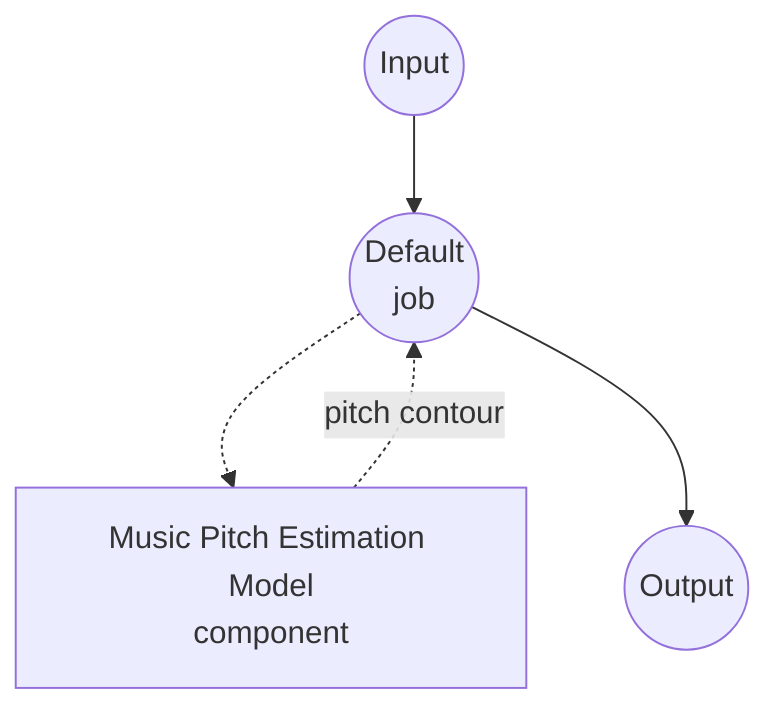

# Music Pitch Estimation Model Task Example (PESTO)

This example demonstrates how to estimate the per-frame fundamental frequency (f0) of a monophonic recording using model-compose's built-in music-pitch-estimation task with a local PESTO model, running fully offline after the initial package install.

## Overview

This workflow returns a dense pitch contour — one event per CQT frame — plus optional metadata:

1. **Local Pitch Estimator**: Runs PESTO locally via the `pesto-pitch` package; bundled checkpoints auto-load from the installed wheel
2. **Dense Pitch Contour**: Each frame carries `time`, `pitch`, `confidence`, and `volume`
3. **Flexible Output Units**: Switch `pitch_unit` to return Hz or fractional MIDI semitones
4. **Three Runtimes**: Offline batch, chunked streaming, and ONNX Runtime — pick the one that matches your deployment
5. **No External APIs**: Fully offline once dependencies are installed

## Preparation

### Prerequisites

- model-compose installed and available in your PATH
- Python environment with `pesto-pitch`, `torch`, `torchaudio` (declared as component setup requirements and auto-installed on first run)
- For the `onnx` backend: `onnxruntime` and a pre-exported `.onnx` file (see "ONNX Backend" below)
- GPU is optional; PESTO runs on CPU, MPS, or CUDA

### Why Pitch Estimation

Fundamental frequency estimation produces the melodic contour underlying a recording — the sequence of pitches a monophonic source sings or plays, plus a confidence that the frame is voiced. Typical downstream uses:

- **Melody extraction**: Build note sequences from the contour for transcription or search
- **Vocal analysis**: Measure intonation, vibrato, and pitch drift on sung audio
- **Score alignment**: Match a performance to a reference MIDI by comparing contours
- **Audio effects**: Drive pitch-shift / autotune / vocoder parameters frame-by-frame

## How to Run

1. **Start the service:**
   ```bash
   model-compose up
   ```

2. **Run the workflow:**

   **Using API:**
   ```bash
   curl -X POST http://localhost:8080/api/workflows/runs \
     -F "audio=@/path/to/your/recording.wav" \
     -F "input={\"audio\": \"@audio\"}"
   ```

   **Using Web UI:**
   - Open the Web UI: http://localhost:8081
   - Upload an audio file (MP3, WAV, FLAC, etc.)
   - Switch `pitch_unit` as needed
   - Click the "Run Workflow" button

   **Using CLI:**
   ```bash
   model-compose run music-pitch-estimation --input '{"audio": "/path/to/your/recording.wav"}'
   ```

## Component Details

### Music Pitch Estimation Model Component (Default)

- **Type**: Model component with `music-pitch-estimation` task
- **Driver**: `custom`
- **Family**: `pesto`
- **Backend**: `torch` (default) or `onnx`
- **Purpose**: Estimate the per-frame fundamental frequency of monophonic audio
- **Features**:
  - Local inference via the `pesto-pitch` package; bundled checkpoints ship with the wheel
  - Returns a dense pitch contour (`time`, `pitch`, `confidence`, `volume` per frame) plus optional metadata
  - Chunked streaming for progressive output on long recordings or live inputs
  - Optional ONNX Runtime backend for a lightweight dependency footprint

### Model Information: PESTO

- **Developer**: Sony CSL Paris
- **Type**: Self-supervised CQT-based pitch estimator (transposition-equivariant)
- **License**: See the [PESTO repository](https://github.com/SonyCSLParis/pesto)
- **Papers**:
  - "PESTO: Pitch Estimation with Self-supervised Transposition-equivariant Objective" (ISMIR 2023)
  - "PESTO: Real-time Pitch Estimation with Self-Supervised Transposition-Equivariant Objective" (arXiv:2508.01488)

Available checkpoints (bundled with `pesto-pitch`):

- `mir-1k_g7` — default, trained on MIR-1K

You can also point `model` at a local `.ckpt` path.

## Workflow Details

### "Music Pitch Estimation" Workflow (Default)

**Description**: Estimate the pitch contour of an input recording.

#### Job Flow



#### Input Parameters (PESTO)

Fields the `pesto` family accepts on its action.

| Parameter | Location | Type | Required | Default | Description |
|-----------|----------|------|----------|---------|-------------|
| `audio` | `action` | audio | Yes | - | Input recording (MP3, WAV, FLAC, etc.) |
| `return_metadata` | `action` | boolean | No | `true` | Whether processing metadata (`sample_rate`, `frame_rate`, `duration`) is included in the result |
| `streaming` | `action` | boolean | No | `false` | Emit per-frame events incrementally; requires `streaming` on the component or `backend: onnx` |
| `params.reduction` | `action` | enum | No | `alwa` | Decoding rule: `alwa`, `argmax`, or `weighted` |
| `params.pitch_unit` | `action` | enum | No | `hz` | Unit for the pitch value — `hz` (frequency) or `semitone` (fractional MIDI distance from MIDI 0) |
| `params.num_chunks` | `action` | int | No | `1` | Split CQT frames to limit GPU memory (torch backend, non-streaming only) |
| `return_activations` | `action` | boolean | No | `false` | Include per-frame activation distribution over pitch bins |

Component-level fields (loaded once, not per request):

| Parameter | Type | Default | Description |
|-----------|------|---------|-------------|
| `backend` | string | `torch` | Inference backend (`torch` via `pesto-pitch`, or `onnx` via `onnxruntime`) |
| `model` | string | `mir-1k_g7` | PESTO checkpoint — a bundled name, a local `.ckpt` path, or a local `.onnx` path |
| `sample_rate` | int | — | Sample rate the model expects; required for `backend: onnx` and for `streaming` |
| `step_size` | float | `10.0` | Hop between CQT frames in milliseconds; torch backend only, mutually exclusive with `streaming.chunk_size` |
| `streaming.chunk_size` | int | — | Fixed chunk length in audio samples fed to the model per inference step |
| `streaming.max_batch_size` | int | `1` | Maximum number of concurrent streams the component can serve |
| `providers` | list | — | `onnxruntime` execution providers (e.g. `[CUDAExecutionProvider, CPUExecutionProvider]`); auto-selected from `device` when omitted |
| `device` | string | `auto` | Compute device (`cpu`, `cuda`, `cuda:0`, `mps`) |
| `precision` | string | — | Numeric precision (`float32`, `float16`); `float16` speeds up CUDA inference on the torch backend |

#### Output Format

The workflow output is a JSON object. The exact shape depends on `streaming`:

**Non-streaming (`streaming: false`)** — a single `PitchContour` carrying a list of frames:

```json
{
  "frames": [
    { "time": 0.00, "pitch": 185.616, "confidence": 0.907, "volume": 0.42 },
    { "time": 0.01, "pitch": 186.764, "confidence": 0.844, "volume": 0.43 },
    { "time": 0.02, "pitch": 188.356, "confidence": 0.798, "volume": 0.44 }
  ],
  "sample_rate": 44100,
  "frame_rate": 100.0,
  "duration": 171.0
}
```

**Streaming (`streaming: true`)** — the response is a chunked stream of typed events:

```json
{ "type": "frame", "time": 0.00, "pitch": 185.616, "confidence": 0.907, "volume": 0.42 }
{ "type": "frame", "time": 0.01, "pitch": 186.764, "confidence": 0.844, "volume": 0.43 }
...
{ "type": "metadata", "sample_rate": 44100, "frame_rate": 100.0, "duration": 171.0, "frame_count": 17100 }
```

Each event is tagged with a `type` field. Two event kinds are emitted:

- `type: "frame"` — one event per CQT frame, carrying:
  - `time` — frame timestamp in seconds (hop-aligned)
  - `pitch` — Hz when `pitch_unit: hz` (default), otherwise fractional MIDI semitones
  - `confidence` — [0, 1] voiced-frame probability
  - `volume` — frame energy (linear scale)
  - `activations` — per-frame activation distribution over PESTO's pitch bins (list of floats); only present when `return_activations: true`
- `type: "metadata"` — a single event emitted at the end of the stream when `return_metadata: true`, carrying `sample_rate`, `frame_rate`, `duration` (total seconds streamed), and `frame_count` (total frames emitted).

In non-streaming mode the same `activations` list is embedded on each entry of the `frames` array (not as a top-level key).

## Alternative Configurations

### Streaming (torch backend)

Enable chunked inference to emit per-frame events as soon as each chunk is processed. Useful for long recordings and live inputs. Set `streaming` on the component and `streaming: true` on the action:

```yaml
component:
  type: model
  task: music-pitch-estimation
  driver: custom
  family: pesto
  model: mir-1k_g7
  sample_rate: 48000
  streaming:
    chunk_size: 240          # 5 ms @ 48 kHz
    max_batch_size: 4        # up to 4 concurrent streams
  action:
    audio: ${input.audio as audio}
    streaming: true
```

Notes:
- `chunk_size` is in audio samples at `sample_rate`.
- Each concurrent stream reserves one slot from `max_batch_size`; new streams wait up to one second for a slot before failing with "pool exhausted".
- `step_size` is derived automatically from `chunk_size / sample_rate` on the streaming path.

### ONNX Backend

Run PESTO through `onnxruntime` for a lighter dependency footprint (no `pesto-pitch` / `torch` needed at inference time). First export the ONNX graph from a PESTO checkout:

```bash
# In a PESTO working copy
python -m realtime.export_onnx mir-1k_g7 -r 44100 -c 1024
# Produces mir-1k_g7_44100_1024.onnx
```

Then point the component at the exported file:

```yaml
component:
  type: model
  task: music-pitch-estimation
  driver: custom
  family: pesto
  backend: onnx
  model: ./weights/mir-1k_g7_44100_1024.onnx
  sample_rate: 44100
  streaming:
    chunk_size: 1024
    max_batch_size: 2
  device: cuda:0
  # Optional override; auto-selected from `device` when omitted.
  providers: [CUDAExecutionProvider, CPUExecutionProvider]
  action:
    audio: ${input.audio as audio}
    streaming: true
```

Notes:
- The ONNX backend is always chunked; `streaming` is required at the component level.
- `sample_rate` and `streaming.chunk_size` must match the values used during export.
- Non-streaming action requests (`streaming: false`) still work on the ONNX backend — frames are collected internally and returned as a single `PitchContour`.

## Troubleshooting

### Common Issues

1. **CUDA out of memory on long files**: PESTO processes the whole track in one forward pass on the torch backend by default. Raise `params.num_chunks` to split the CQT frames, or switch to the streaming/ONNX backend which processes a fixed chunk at a time.
2. **"PESTO streaming pool exhausted"**: Concurrent stream requests exceeded `streaming.max_batch_size`. Raise `max_batch_size` or reduce concurrency.
3. **ONNX export fields don't match**: `sample_rate` and `streaming.chunk_size` are baked into the ONNX graph at export time. Re-run `realtime.export_onnx` with the values you want to use.
4. **Half-precision produces slightly different pitches**: Expected — `precision: float16` trades a cent or two of pitch accuracy for ~2x inference speed on CUDA. `bfloat16` is not supported by PESTO and falls back to float32.
5. **Low confidence on polyphonic input**: PESTO is a monophonic pitch estimator. Confidence collapses on chords and dense mixtures; pre-separate the source (e.g. with a `music-source-separation` component) to extract a monophonic stem first.
