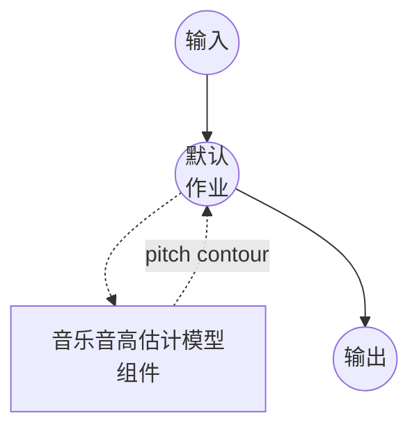

# 音乐音高估计模型任务示例 (PESTO)

此示例演示如何使用 model-compose 内置的 music-pitch-estimation 任务和本地 PESTO 模型，估计单声部（monophonic）录音的逐帧基频（f0），在初次包安装后完全离线运行。

## 概述

此工作流返回一个密集的音高轮廓（pitch contour）—— 每个 CQT 帧一个事件 —— 以及可选的元数据：

1. **本地音高估计器**：通过 `pesto-pitch` 包在本地运行 PESTO；捆绑的检查点从已安装的 wheel 自动加载
2. **密集音高轮廓**：每一帧携带 `time`、`pitch`、`confidence` 和 `volume`
3. **灵活的输出单位**：切换 `pitch_unit` 以 Hz 或分数 MIDI 半音返回
4. **三种运行时**：离线批处理、分块流式处理和 ONNX Runtime —— 选择与您的部署匹配的一个
5. **无需外部 API**：依赖项安装后完全离线

## 准备工作

### 前置条件

- 已安装 model-compose 并在您的 PATH 中可用
- 包含 `pesto-pitch`、`torch`、`torchaudio` 的 Python 环境（作为组件设置要求声明，首次运行时自动安装）
- 对于 `onnx` 后端：`onnxruntime` 以及预先导出的 `.onnx` 文件（请参见下方"ONNX 后端"）
- GPU 可选；PESTO 可在 CPU、MPS 或 CUDA 上运行

### 为何选择音高估计

基频估计产生录音底层的旋律轮廓 —— 单声部源演唱或演奏的音高序列，加上该帧是否有声的置信度。典型的下游用途：

- **旋律提取**：从轮廓构建音符序列用于转谱或检索
- **人声分析**：测量演唱音频中的音准、颤音和音高漂移
- **乐谱对齐**：通过比较轮廓将演奏与参考 MIDI 匹配
- **音频效果**：逐帧驱动 pitch-shift / autotune / vocoder 参数

## 运行方式

1. **启动服务：**
   ```bash
   model-compose up
   ```

2. **运行工作流：**

   **使用 API：**
   ```bash
   curl -X POST http://localhost:8080/api/workflows/runs \
     -F "audio=@/path/to/your/recording.wav" \
     -F "input={\"audio\": \"@audio\"}"
   ```

   **使用 Web UI：**
   - 打开 Web UI：http://localhost:8081
   - 上传音频文件（MP3、WAV、FLAC 等）
   - 根据需要切换 `pitch_unit`
   - 点击"运行工作流"按钮

   **使用 CLI：**
   ```bash
   model-compose run music-pitch-estimation --input '{"audio": "/path/to/your/recording.wav"}'
   ```

## 组件详情

### 音乐音高估计模型组件（默认）

- **类型**：具有 `music-pitch-estimation` 任务的模型组件
- **驱动**：`custom`
- **系列**：`pesto`
- **后端**：`torch`（默认）或 `onnx`
- **用途**：估计单声部音频的逐帧基频
- **功能**：
  - 通过 `pesto-pitch` 包进行本地推理；捆绑的检查点随 wheel 一起提供
  - 返回密集的音高轮廓（每帧 `time`、`pitch`、`confidence`、`volume`）以及可选的元数据
  - 分块流式处理，用于长录音或实时输入的渐进式输出
  - 可选的 ONNX Runtime 后端，依赖项占用更轻

### 模型信息：PESTO

- **开发者**：Sony CSL Paris
- **类型**：基于自监督 CQT 的音高估计器（转调等变）
- **许可证**：请参见 [PESTO 仓库](https://github.com/SonyCSLParis/pesto)
- **论文**：
  - "PESTO: Pitch Estimation with Self-supervised Transposition-equivariant Objective" (ISMIR 2023)
  - "PESTO: Real-time Pitch Estimation with Self-Supervised Transposition-Equivariant Objective" (arXiv:2508.01488)

可用检查点（随 `pesto-pitch` 捆绑）：

- `mir-1k_g7` —— 默认，使用 MIR-1K 训练

您也可以将 `model` 指向本地 `.ckpt` 路径。

## 工作流详情

### "Music Pitch Estimation" 工作流（默认）

**描述**：估计输入录音的音高轮廓。

#### 作业流程



#### 输入参数 (PESTO)

`pesto` 系列在其动作上接受的字段。

| 参数 | 位置 | 类型 | 必需 | 默认值 | 描述 |
|-----------|----------|------|----------|---------|-------------|
| `audio` | `action` | audio | 是 | - | 输入录音（MP3、WAV、FLAC 等） |
| `pitch_unit` | `action` | enum | 否 | `hz` | 音高值的单位 —— `hz`（频率）或 `semitone`（距 MIDI 0 的分数半音距离） |
| `return_metadata` | `action` | boolean | 否 | `true` | 处理元数据（`sample_rate`、`frame_rate`、`duration`）是否包含在结果中 |
| `return_activations` | `action` | boolean | 否 | `false` | 包含音高 bin 上的逐帧激活分布 |
| `streaming` | `action` | boolean | 否 | `false` | 增量发出逐帧事件；需要组件启用 `streaming` 或 `backend: onnx` |
| `params.reduction` | `action` | enum | 否 | `alwa` | 解码规则：`alwa`、`argmax` 或 `weighted` |
| `params.num_chunks` | `action` | int | 否 | `1` | 分割 CQT 帧以限制 GPU 内存（torch 后端，仅非流式） |

组件级字段（加载一次，而非每个请求）：

| 参数 | 类型 | 默认值 | 描述 |
|-----------|------|---------|-------------|
| `backend` | string | `torch` | 推理后端（通过 `pesto-pitch` 的 `torch`，或通过 `onnxruntime` 的 `onnx`） |
| `model` | string | `mir-1k_g7` | PESTO 检查点 —— 捆绑名称、本地 `.ckpt` 路径或本地 `.onnx` 路径 |
| `sample_rate` | int | — | 模型期望的采样率；`backend: onnx` 和 `streaming` 必需 |
| `step_size` | float | `10.0` | CQT 帧之间的跳跃（毫秒）；仅 torch 后端，与 `streaming.chunk_size` 互斥 |
| `streaming.chunk_size` | int | — | 每次推理步骤馈送给模型的固定块长度（音频样本） |
| `streaming.max_batch_size` | int | `1` | 组件可同时服务的最大流数 |
| `providers` | list | — | `onnxruntime` 执行提供者（例如 `[CUDAExecutionProvider, CPUExecutionProvider]`）；省略时从 `device` 自动选择 |
| `device` | string | `auto` | 计算设备（`cpu`、`cuda`、`cuda:0`、`mps`） |
| `precision` | string | — | 数值精度（`float32`、`float16`）；`float16` 加速 torch 后端的 CUDA 推理 |

#### 输出格式

工作流输出是一个 JSON 对象。确切形状取决于 `streaming`：

**非流式 (`streaming: false`)** —— 携带帧列表的单个音高轮廓对象：

```json
{
  "frames": [
    { "time": 0.00, "pitch": 185.616, "confidence": 0.907, "volume": 0.42 },
    { "time": 0.01, "pitch": 186.764, "confidence": 0.844, "volume": 0.43 },
    { "time": 0.02, "pitch": 188.356, "confidence": 0.798, "volume": 0.44 }
  ],
  "sample_rate": 44100,
  "frame_rate": 100.0,
  "duration": 171.0
}
```

**流式 (`streaming: true`)** —— 响应是带类型的事件的分块流：

```json
{ "type": "frame", "time": 0.00, "pitch": 185.616, "confidence": 0.907, "volume": 0.42 }
{ "type": "frame", "time": 0.01, "pitch": 186.764, "confidence": 0.844, "volume": 0.43 }
...
{ "type": "metadata", "sample_rate": 44100, "frame_rate": 100.0, "duration": 171.0, "frame_count": 17100 }
```

每个事件通过 `type` 字段进行类型区分。会发出两种事件：

- `type: "frame"` —— 每个 CQT 帧发出一个事件：
  - `time` —— 帧时间戳（秒，跳跃对齐）
  - `pitch` —— `pitch_unit: hz`（默认）时为 Hz，否则为分数 MIDI 半音
  - `confidence` —— [0, 1] 有声帧概率
  - `volume` —— 帧能量（线性标度）
  - `activations` —— PESTO 音高 bin 上的逐帧激活分布（float 列表）；仅当 `return_activations: true` 时包含
- `type: "metadata"` —— 当 `return_metadata: true` 时，在流结束时发出**单个事件**，包含：`sample_rate`、`frame_rate`、`duration`（流式处理的总秒数）和 `frame_count`（发出的总帧数）。

在非流式模式下，相同的 `activations` 列表嵌入在 `frames` 数组的每个条目中（而不是作为顶层键）。

## 替代配置

### 流式（torch 后端）

启用分块推理，在每个块处理完成后立即发出逐帧事件。对长录音和实时输入很有用。在组件上设置 `streaming`，在动作上设置 `streaming: true`：

```yaml
component:
  type: model
  task: music-pitch-estimation
  driver: custom
  family: pesto
  model: mir-1k_g7
  sample_rate: 48000
  streaming:
    chunk_size: 240          # 5 ms @ 48 kHz
    max_batch_size: 4        # 最多 4 个并发流
  action:
    audio: ${input.audio as audio}
    streaming: true
```

注意：
- `chunk_size` 以 `sample_rate` 下的音频样本为单位。
- 每个并发流从 `max_batch_size` 中保留一个槽位；新流在因"pool exhausted"失败前最多等待一秒。
- `step_size` 在流式路径上从 `chunk_size / sample_rate` 自动推导。

### ONNX 后端

通过 `onnxruntime` 运行 PESTO 以获得更轻的依赖项占用（推理时无需 `pesto-pitch` / `torch`）。首先从 PESTO 检出中导出 ONNX 图：

```bash
# 在 PESTO 工作副本中
python -m realtime.export_onnx mir-1k_g7 -r 44100 -c 1024
# 生成 mir-1k_g7_44100_1024.onnx
```

然后将组件指向导出的文件：

```yaml
component:
  type: model
  task: music-pitch-estimation
  driver: custom
  family: pesto
  backend: onnx
  model: ./weights/mir-1k_g7_44100_1024.onnx
  sample_rate: 44100
  streaming:
    chunk_size: 1024
    max_batch_size: 2
  device: cuda:0
  # 可选覆盖；省略时从 `device` 自动选择。
  providers: [CUDAExecutionProvider, CPUExecutionProvider]
  action:
    audio: ${input.audio as audio}
    streaming: true
```

注意：
- ONNX 后端始终是分块的；组件级 `streaming` 为必需。
- `sample_rate` 和 `streaming.chunk_size` 必须与导出时使用的值匹配。
- 非流式动作请求（`streaming: false`）在 ONNX 后端上仍然有效 —— 帧在内部收集并作为单个音高轮廓对象返回。

## 故障排除

### 常见问题

1. **长文件上 CUDA 内存不足**：PESTO 默认在 torch 后端上以单次前向传递处理整个轨道。提高 `params.num_chunks` 以分割 CQT 帧，或切换到一次处理固定块的流式/ONNX 后端。
2. **"PESTO streaming pool exhausted"**：并发流请求超过了 `streaming.max_batch_size`。提高 `max_batch_size` 或降低并发性。
3. **ONNX 导出字段不匹配**：`sample_rate` 和 `streaming.chunk_size` 在导出时被烘焙到 ONNX 图中。使用您想要使用的值重新运行 `realtime.export_onnx`。
4. **半精度产生略有不同的音高**：预期行为 —— `precision: float16` 以几分音高精度为代价换取 CUDA 上约 2 倍的推理速度。PESTO 不支持 `bfloat16`，会回退到 float32。
5. **多声部输入置信度低**：PESTO 是单声部音高估计器。在和弦和密集混音上置信度会崩溃；请先预分离源（例如使用 `music-source-separation` 组件）以提取单声部音轨。
