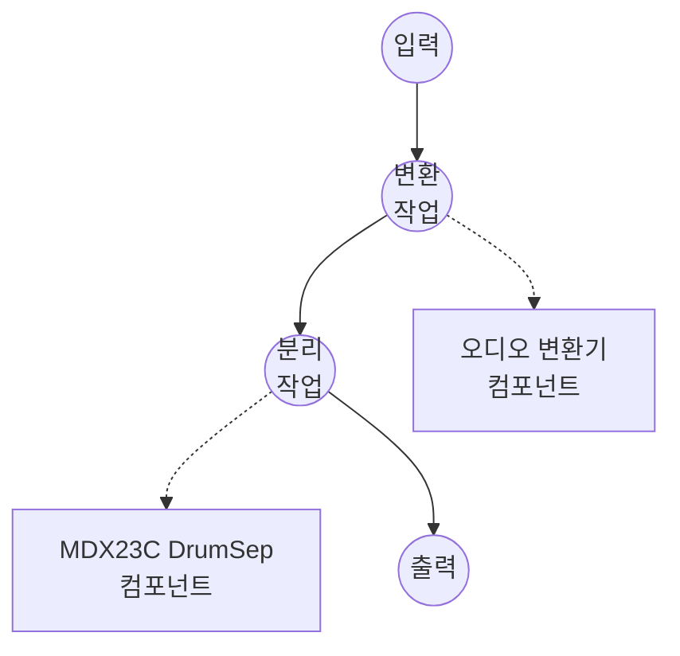

# 드럼 스템 분리 (MDX23C DrumSep) 예제

이 예제는 model-compose의 music-source-separation 태스크와 aufr33 & jarredou의 DrumSep MDX23C 체크포인트를 사용하여 드럼 녹음 — 순수 드럼 루프든 풀 믹스에서 뽑아낸 드럼 스템이든 — 을 개별 악기 스템(킥, 스네어, 톰, 하이햇, 라이드, 크래시)으로 분리하는 방법을 보여주며, 초기 모델 다운로드 후 완전 오프라인으로 실행됩니다.

## 개요

이 워크플로우는 입력 오디오에서 추출된 여섯 개의 드럼 스템 WAV 스트림을 반환합니다:

1. **로컬 MDX23C 추론**: `mindor-mdx23c` 패키지를 통해 DrumSep TFC-TDF-Net v3 체크포인트를 로컬에서 실행
2. **여섯 개 드럼 스템**: `Kick`, `Snare`, `Toms`, `Hh`(하이햇), `Ride`, `Crash`를 방출하거나 호출자가 선택한 부분집합만 방출
3. **품질 컨트롤**: 품질/속도 트레이드오프를 위한 조정 가능한 `num_overlap`
4. **외부 API 불필요**: 체크포인트가 캐시된 후 완전 오프라인

## 준비사항

### 필수 요구사항

- model-compose가 설치되어 PATH에서 사용 가능
- `torch`, `numpy`, `soxr`, `mindor-mdx23c`가 포함된 Python 환경 (컴포넌트 설정 요구사항으로 선언되어 첫 실행 시 자동 설치 — `mindor-mdx23c`는 GitHub에서 가져옴)
- DrumSep 체크포인트는 438 MB이며 첫 사용 시 HuggingFace Hub를 통해 다운로드됨
- CUDA GPU 권장; Apple Silicon MPS와 CPU 모두 작동하지만 더 느림

### 드럼 조각 분리를 사용하는 이유

일반적인 4-스템 분리기(Demucs, MDX-Net vocals)는 단일 `drums` 스템을 반환합니다. DrumSep은 한 단계 더 들어가 그 드럼 스템을 개별 악기 조각으로 분리합니다. 일반적인 다운스트림 사용 사례:

- **드럼 샘플링 / 대체**: 깨끗한 킥이나 스네어 히트를 추출하여 샘플 라이브러리와 레이어링하거나 트리거
- **그루브 분석**: 격리된 킥/스네어를 비트 트래킹이나 트랜스크립션 모델에 공급하여 더 높은 품질의 온셋 얻기
- **리믹싱**: 드럼 조각을 독립적으로 재밸런싱하거나 하이햇/심벌 텍스처 교체
- **연습 도구**: 그루브의 특정 파트를 격리하기 위해 한 번에 한 조각씩 음소거

참고: DrumSep은 입력이 이미 드럼 중심이라고 가정합니다. 풀 믹스 곡의 경우 먼저 1차 분리기(Demucs / RoFormer)를 체이닝하여 드럼 스템을 분리한 후 DrumSep에 공급하세요.

## 실행 방법

1. **서비스 시작:**
   ```bash
   model-compose up
   ```

2. **워크플로우 실행:**

   **API 사용:**
   ```bash
   # 여섯 개 드럼 스템 모두 추출 ({stem: wav} 맵 반환)
   curl -X POST http://localhost:8080/api/workflows/runs \
     -F "audio=@/path/to/your/drums.wav" \
     -F "input={\"audio\": \"@audio\"}" \
     -o drums.json

   # 고품질 분리
   curl -X POST http://localhost:8080/api/workflows/runs \
     -F "audio=@/path/to/your/drums.wav" \
     -F "input={\"audio\": \"@audio\", \"num_overlap\": 8}" \
     -o drums.json
   ```

   **웹 UI 사용:**
   - 웹 UI 열기: http://localhost:8081
   - 오디오 파일 업로드 (MP3, WAV, FLAC 등)
   - 선택적으로 `num_overlap` (2-16) 설정
   - "Run Workflow" 버튼 클릭

   **CLI 사용:**
   ```bash
   model-compose run drum-stem-separation --input '{"audio": "/path/to/your/drums.wav"}'
   ```

## 컴포넌트 세부사항

### 음악 소스 분리 모델 컴포넌트 (기본)

- **유형**: `music-source-separation` 태스크를 가진 모델 컴포넌트
- **드라이버**: `custom`
- **패밀리**: `mdx23c`
- **목적**: 드럼 녹음을 개별 조각 스템으로 분할
- **기능**:
  - `mindor-mdx23c` 패키지를 통한 로컬 추론 (ZFTurbo의 TFC-TDF-Net v3 아키텍처를 얇게 래핑)
  - 체크포인트가 생성하는 여섯 스템의 임의 부분집합 반환
  - 더 높은 `num_overlap`은 각 출력 샘플을 더 많은 오버랩 청크로 덮어 실행 시간을 대가로 청크 경계 아티팩트를 감소

### 모델 정보: DrumSep MDX23C

- **저자**: [aufr33](https://github.com/aufr33) & [jarredou](https://github.com/jarredou)
- **아키텍처**: MDX23C (TFC-TDF-Net v3), 44.1 kHz 스테레오, 6개 드럼 스템
- **보고된 품질**: 훈련 세트 평가에서 SDR ≈ 10.8
- **배포처**: HuggingFace Hub의 [Politrees/UVR_resources](https://huggingface.co/Politrees/UVR_resources)에 체크포인트 미러링

## 워크플로우 세부사항

### "Drum Stem Separation (MDX23C)" 워크플로우 (기본)

**설명**: 입력을 WAV로 변환한 다음 개별 조각 드럼 스템으로 분할합니다.

#### 작업 흐름



#### 입력 매개변수

| 매개변수 | 유형 | 필수 | 기본값 | 설명 |
|---------|------|------|--------|------|
| `audio` | audio | 예 | - | 입력 드럼 녹음 (MP3, WAV, FLAC 등) |
| `num_overlap` | integer | 아니오 | `4` | 각 출력 샘플을 덮는 오버랩 청크 수; 높을수록 더 깨끗하지만 느림 |

#### 출력 형식

워크플로우가 여섯 스템 모두를 반환할 때 출력은 `{"Kick": ..., "Snare": ..., ...}`와 같은 JSON 맵이며 각 값은 44.1 kHz 스테레오, 16비트 PCM의 WAV 오디오 스트림입니다. `params.stems`로 단일 스템이 선택되면 출력은 단일 WAV 스트림입니다.

## 스템 부분집합 요청

`action.params` 아래의 `stems`를 여섯 DrumSep 출력의 임의 부분집합으로 설정합니다:

```yaml
action:
  audio: ${input.audio as audio}
  params:
    stems: [ Kick, Snare ]
```

각 항목을 개별 작업 출력으로 라우팅하여 별도로 노출합니다:

```yaml
workflow:
  jobs:
    - id: separate
      component: separator
      input:
        audio: ${input.audio as audio}
      output:
        kick:  ${output.Kick as audio/wav}
        snare: ${output.Snare as audio/wav}
```

## 풀 믹스 분리기 뒤에 체이닝

DrumSep은 드럼 중심 오디오를 기대합니다. 풀 곡의 경우 먼저 Demucs로 드럼 스템을 분리한 다음 DrumSep에 공급하세요:

```yaml
workflow:
  jobs:
    - id: full-mix
      component: demucs
      input:
        audio: ${input.audio as audio}

    - id: drum-pieces
      component: drumsep
      depends_on: [ full-mix ]
      input:
        audio: ${jobs.full-mix.output as audio}

components:
  - id: demucs
    type: model
    task: music-source-separation
    driver: custom
    family: demucs
    model: htdemucs_ft
    action:
      audio: ${input.audio as audio}
      params:
        stems: [ drums ]

  - id: drumsep
    type: model
    task: music-source-separation
    driver: custom
    family: mdx23c
    model:
      provider: huggingface
      repository: Politrees/UVR_resources
      filename: models/MDX23C/MDX23C-DrumSep-aufr33-jarredou.ckpt
    instruments: [ Kick, Snare, Toms, Hh, Ride, Crash ]
    action:
      audio: ${input.audio as audio}
```

## 다른 MDX23C 체크포인트 사용

컴포넌트 필드는 DrumSep이 사용하는 표준 MDX23C 아키텍처를 기본값으로 합니다. 다른 크기의 체크포인트(예: 더 큰 보컬 중심 MDX23C)를 로드하려면 체크포인트와 함께 배포되는 훈련 config와 일치하도록 shape 필드를 오버라이드하세요:

```yaml
component:
  type: model
  task: music-source-separation
  driver: custom
  family: mdx23c
  model:
    provider: huggingface
    repository: <repo-with-checkpoint>
    filename: <path/to/checkpoint.ckpt>
  instruments: [ vocals ]
  # DrumSep 기본값과 다른 것만 오버라이드:
  n_fft: 4096
  hop_length: 1024
  dim_f: 2048
  num_channels: 256
```

아키텍처 필드가 일치하지 않으면 시작 시 `state_dict` shape 오류로 실패합니다 — 이렇게 어떤 필드를 오버라이드해야 하는지 알 수 있습니다.

## 문제 해결

### 일반적인 문제

1. **첫 실행이 매우 느리거나 멈춘 것처럼 보임**: DrumSep 체크포인트는 438 MB이며 첫 사용 시 다운로드됩니다. 이후 실행은 `~/.cache/huggingface/hub` 아래의 HuggingFace 캐시에서 로드됩니다.
2. **GPU에서 메모리 부족**: `num_overlap`을 낮추거나(예: `2`) 컴포넌트에서 `device: cpu`로 설정합니다.
3. **스템이 먹먹하게 들리거나 소리가 섞임**: `num_overlap`을 증가시킵니다(예: `8` 또는 `16`). 이는 청크 경계에서의 재구성 품질을 위해 실행 시간을 희생합니다.
4. **로드 시 `state_dict` 크기 불일치**: 컴포넌트의 아키텍처 필드(`n_fft`, `dim_f`, `num_channels`, `num_scales`, ...)가 체크포인트와 일치하지 않습니다. 체크포인트와 함께 배포되는 훈련 YAML을 참고하여 다른 필드를 오버라이드하세요.
5. **입력이 드럼 녹음이 아님**: DrumSep은 드럼 중심 입력을 가정합니다. 먼저 풀 믹스 분리기를 통해 라우팅하세요([풀 믹스 분리기 뒤에 체이닝](#풀-믹스-분리기-뒤에-체이닝) 참조).
