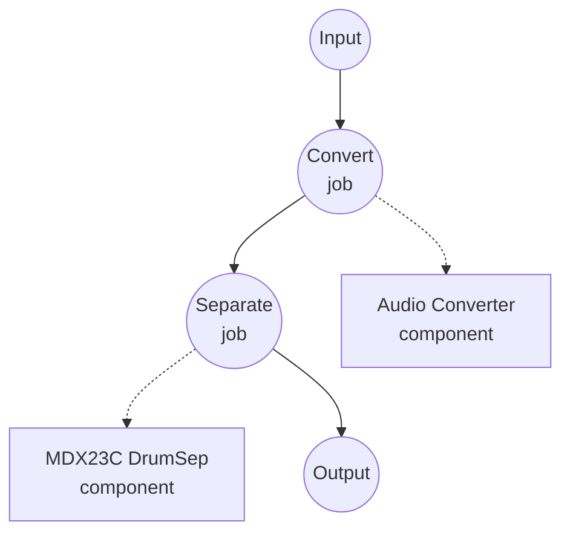

# Drum Stem Separation (MDX23C DrumSep) Example

This example demonstrates how to split a drum recording — either a raw drum loop or the drum stem from a full mix — into per-piece stems (kick, snare, toms, hi-hat, ride, crash) using model-compose's music-source-separation task with the aufr33 & jarredou DrumSep MDX23C checkpoint, running fully offline after the initial model download.

## Overview

This workflow returns six WAV streams, one per drum piece, extracted from the input audio:

1. **Local MDX23C Inference**: Runs the DrumSep TFC-TDF-Net v3 checkpoint locally via the `mindor-mdx23c` package
2. **Six Drum Stems**: Emits `Kick`, `Snare`, `Toms`, `Hh` (hi-hat), `Ride`, `Crash` — or a caller-selected subset
3. **Quality Control**: Tunable `num_overlap` for a quality/speed tradeoff
4. **No External APIs**: Fully offline once the checkpoint is cached

## Preparation

### Prerequisites

- model-compose installed and available in your PATH
- Python environment with `torch`, `numpy`, `soxr`, and `mindor-mdx23c` (declared as component setup requirements and auto-installed on first run — `mindor-mdx23c` is pulled from GitHub)
- The DrumSep checkpoint is 438 MB and is downloaded on first use via HuggingFace Hub
- CUDA GPU is recommended; Apple Silicon MPS and CPU both work but are slower

### Why Drum-Piece Separation

Standard four-stem separators (Demucs, MDX-Net vocals) return a single `drums` stem. DrumSep goes one level deeper and splits that drums stem into individual pieces. Typical downstream uses:

- **Drum sampling / replacement**: Extract clean kick or snare hits to layer or trigger sample libraries
- **Groove analysis**: Feed isolated kick/snare into beat-tracking or transcription models for higher-quality onsets
- **Remixing**: Rebalance drum pieces independently or swap the hi-hat/cymbal texture
- **Practice tools**: Mute one piece at a time to isolate specific parts of a groove

Note: DrumSep expects the input to already be drum-heavy. For a full-mix song, chain a first-pass separator (Demucs / RoFormer) to isolate the drums stem before feeding it into DrumSep.

## How to Run

1. **Start the service:**
   ```bash
   model-compose up
   ```

2. **Run the workflow:**

   **Using API:**
   ```bash
   # Extract all six drum stems (returns a map of {stem: wav})
   curl -X POST http://localhost:8080/api/workflows/runs \
     -F "audio=@/path/to/your/drums.wav" \
     -F "input={\"audio\": \"@audio\"}" \
     -o drums.json

   # Higher-quality separation
   curl -X POST http://localhost:8080/api/workflows/runs \
     -F "audio=@/path/to/your/drums.wav" \
     -F "input={\"audio\": \"@audio\", \"num_overlap\": 8}" \
     -o drums.json
   ```

   **Using Web UI:**
   - Open the Web UI: http://localhost:8081
   - Upload an audio file (MP3, WAV, FLAC, etc.)
   - Optionally set `num_overlap` (2-16)
   - Click the "Run Workflow" button

   **Using CLI:**
   ```bash
   model-compose run drum-stem-separation --input '{"audio": "/path/to/your/drums.wav"}'
   ```

## Component Details

### Music Source Separation Model Component (Default)

- **Type**: Model component with `music-source-separation` task
- **Driver**: `custom`
- **Family**: `mdx23c`
- **Purpose**: Split a drum recording into per-piece stems
- **Features**:
  - Local inference via the `mindor-mdx23c` package (thin wrapper around ZFTurbo's TFC-TDF-Net v3 architecture)
  - Returns any subset of the six stems produced by the checkpoint
  - Higher `num_overlap` covers each output sample with more overlapping chunks, reducing seam artifacts at the cost of runtime

### Model Information: DrumSep MDX23C

- **Authors**: [aufr33](https://github.com/aufr33) & [jarredou](https://github.com/jarredou)
- **Architecture**: MDX23C (TFC-TDF-Net v3), 44.1 kHz stereo, six drum stems
- **Reported quality**: SDR ≈ 10.8 on the training-set evaluation
- **Distribution**: Checkpoint mirrored on [Politrees/UVR_resources](https://huggingface.co/Politrees/UVR_resources) on HuggingFace Hub

## Workflow Details

### "Drum Stem Separation (MDX23C)" Workflow (Default)

**Description**: Convert the input to WAV, then split it into per-piece drum stems.

#### Job Flow



#### Input Parameters

| Parameter | Type | Required | Default | Description |
|-----------|------|----------|---------|-------------|
| `audio` | audio | Yes | - | Input drum recording (MP3, WAV, FLAC, etc.) |
| `num_overlap` | integer | No | `4` | Number of overlapping chunks covering each output sample; higher = cleaner, slower |

#### Output Format

When the workflow returns all six stems, the output is a JSON map like `{"Kick": ..., "Snare": ..., ...}` where each value is a WAV audio stream at 44.1 kHz stereo, 16-bit PCM. When a single stem is selected via `params.stems`, the output is a single WAV stream.

## Requesting a Subset of Stems

Set `stems` under `action.params` to any subset of the six DrumSep outputs:

```yaml
action:
  audio: ${input.audio as audio}
  params:
    stems: [ Kick, Snare ]
```

Route each entry to a separate job output to expose them individually:

```yaml
workflow:
  jobs:
    - id: separate
      component: separator
      input:
        audio: ${input.audio as audio}
      output:
        kick:  ${output.Kick as audio/wav}
        snare: ${output.Snare as audio/wav}
```

## Chaining After a Full-Mix Separator

DrumSep expects drum-heavy audio. For a full song, run Demucs first to isolate the drums stem, then feed that into DrumSep:

```yaml
workflow:
  jobs:
    - id: full-mix
      component: demucs
      input:
        audio: ${input.audio as audio}

    - id: drum-pieces
      component: drumsep
      depends_on: [ full-mix ]
      input:
        audio: ${jobs.full-mix.output as audio}

components:
  - id: demucs
    type: model
    task: music-source-separation
    driver: custom
    family: demucs
    model: htdemucs_ft
    action:
      audio: ${input.audio as audio}
      params:
        stems: [ drums ]

  - id: drumsep
    type: model
    task: music-source-separation
    driver: custom
    family: mdx23c
    model:
      provider: huggingface
      repository: Politrees/UVR_resources
      filename: models/MDX23C/MDX23C-DrumSep-aufr33-jarredou.ckpt
    instruments: [ Kick, Snare, Toms, Hh, Ride, Crash ]
    action:
      audio: ${input.audio as audio}
```

## Using a Different MDX23C Checkpoint

The component fields default to the standard MDX23C architecture that DrumSep uses. To load a differently-sized checkpoint (e.g. a larger vocals-focused MDX23C), override the shape fields to match the training config that ships with the checkpoint:

```yaml
component:
  type: model
  task: music-source-separation
  driver: custom
  family: mdx23c
  model:
    provider: huggingface
    repository: <repo-with-checkpoint>
    filename: <path/to/checkpoint.ckpt>
  instruments: [ vocals ]
  # Override only what differs from the DrumSep defaults:
  n_fft: 4096
  hop_length: 1024
  dim_f: 2048
  num_channels: 256
```

Loading with mismatched architecture fields will fail with a `state_dict` shape error at startup — that is how you know a field needs to be overridden.

## Troubleshooting

### Common Issues

1. **First run is very slow / appears to hang**: The DrumSep checkpoint is 438 MB and is downloaded on first use. Subsequent runs load from the HuggingFace cache under `~/.cache/huggingface/hub`.
2. **Out-of-memory on GPU**: Lower `num_overlap` (e.g. `2`) or set `device: cpu` on the component.
3. **Stems sound muffled or contain bleed**: Increase `num_overlap` (e.g. `8` or `16`). This trades runtime for reconstruction quality at the chunk seams.
4. **`state_dict` size mismatch on load**: The component's architecture fields (`n_fft`, `dim_f`, `num_channels`, `num_scales`, ...) do not match the checkpoint. Consult the training YAML that ships with the checkpoint and override the differing fields.
5. **Input isn't a drum recording**: DrumSep assumes drum-heavy input. Route through a full-mix separator first (see [Chaining After a Full-Mix Separator](#chaining-after-a-full-mix-separator)).
