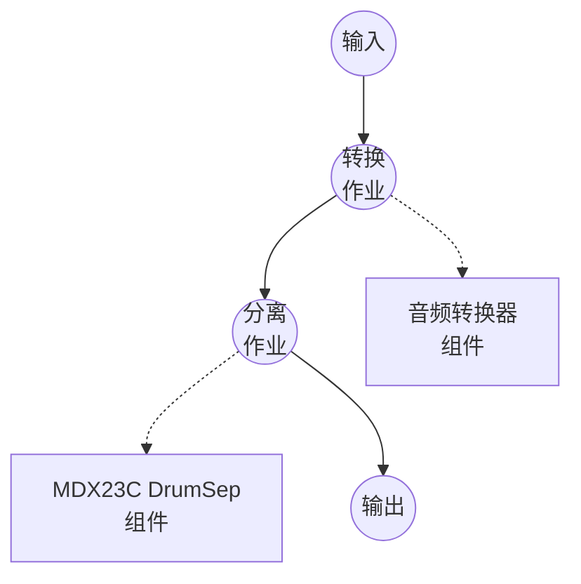

# 鼓点分离 (MDX23C DrumSep) 示例

此示例演示如何使用 model-compose 的 music-source-separation 任务和 aufr33 & jarredou 的 DrumSep MDX23C 检查点，将鼓声录音 — 无论是原始鼓循环还是从完整混音中提取的鼓音轨 — 分离为各个打击乐音轨（底鼓、军鼓、桶鼓、踩镲、叮叮镲、擦镲），在初次模型下载后完全离线运行。

## 概述

此工作流返回从输入音频中提取的六个鼓音轨 WAV 流：

1. **本地 MDX23C 推理**：通过 `mindor-mdx23c` 包在本地运行 DrumSep TFC-TDF-Net v3 检查点
2. **六个鼓音轨**：输出 `Kick`、`Snare`、`Toms`、`Hh`（踩镲）、`Ride`、`Crash`，或调用者选择的子集
3. **质量控制**：可调的 `num_overlap` 用于质量/速度权衡
4. **无需外部 API**：检查点缓存后完全离线

## 准备工作

### 前置条件

- 已安装 model-compose 并在您的 PATH 中可用
- 包含 `torch`、`numpy`、`soxr`、`mindor-mdx23c` 的 Python 环境（作为组件设置要求声明，首次运行时自动安装 — `mindor-mdx23c` 从 GitHub 拉取）
- DrumSep 检查点为 438 MB，首次使用时通过 HuggingFace Hub 下载
- 推荐使用 CUDA GPU；Apple Silicon MPS 和 CPU 都可以工作但速度较慢

### 为何选择鼓点分离

标准的四音轨分离器（Demucs、MDX-Net vocals）返回单个 `drums` 音轨。DrumSep 更进一步，将该鼓音轨分离为单独的打击乐部分。典型的下游用途：

- **鼓采样 / 替换**：提取干净的底鼓或军鼓击打以分层或触发采样库
- **律动分析**：将分离的底鼓/军鼓输入节拍跟踪或转录模型以获得更高质量的起始点
- **混音**：独立地重新平衡鼓点或替换踩镲/擦镲纹理
- **练习工具**：一次一个部分静音以隔离律动的特定部分

注意：DrumSep 期望输入已经以鼓为主。对于完整混音歌曲，先链接一个第一遍分离器（Demucs / RoFormer）以隔离鼓音轨，然后输入到 DrumSep。

## 运行方式

1. **启动服务：**
   ```bash
   model-compose up
   ```

2. **运行工作流：**

   **使用 API：**
   ```bash
   # 提取所有六个鼓音轨（返回 {stem: wav} 映射）
   curl -X POST http://localhost:8080/api/workflows/runs \
     -F "audio=@/path/to/your/drums.wav" \
     -F "input={\"audio\": \"@audio\"}" \
     -o drums.json

   # 高质量分离
   curl -X POST http://localhost:8080/api/workflows/runs \
     -F "audio=@/path/to/your/drums.wav" \
     -F "input={\"audio\": \"@audio\", \"num_overlap\": 8}" \
     -o drums.json
   ```

   **使用 Web UI：**
   - 打开 Web UI：http://localhost:8081
   - 上传音频文件（MP3、WAV、FLAC 等）
   - 可选设置 `num_overlap`（2-16）
   - 点击 "Run Workflow" 按钮

   **使用 CLI：**
   ```bash
   model-compose run drum-stem-separation --input '{"audio": "/path/to/your/drums.wav"}'
   ```

## 组件详细信息

### 音乐源分离模型组件（默认）

- **类型**：具有 `music-source-separation` 任务的模型组件
- **驱动**：`custom`
- **家族**：`mdx-23c`
- **目的**：将鼓声录音分割为各个打击乐音轨
- **功能**：
  - 通过 `mindor-mdx23c` 包进行本地推理（ZFTurbo 的 TFC-TDF-Net v3 架构的轻量封装）
  - 返回检查点产生的六个音轨的任意子集
  - 更高的 `num_overlap` 用更多重叠块覆盖每个输出样本，以运行时间为代价减少块边界伪影

### 模型信息：DrumSep MDX23C

- **作者**：[aufr33](https://github.com/aufr33) & [jarredou](https://github.com/jarredou)
- **架构**：MDX23C（TFC-TDF-Net v3），44.1 kHz 立体声，六个鼓音轨
- **报告质量**：训练集评估上 SDR ≈ 10.8
- **分发**：检查点镜像在 HuggingFace Hub 上的 [Politrees/UVR_resources](https://huggingface.co/Politrees/UVR_resources)

## 工作流详细信息

### "Drum Stem Separation (MDX23C)" 工作流（默认）

**描述**：将输入转换为 WAV，然后将其分割为各个打击乐音轨。

#### 作业流程



#### 输入参数

| 参数 | 类型 | 必需 | 默认值 | 描述 |
|------|------|------|--------|------|
| `audio` | audio | 是 | - | 输入鼓声录音（MP3、WAV、FLAC 等） |
| `num_overlap` | integer | 否 | `4` | 覆盖每个输出样本的重叠块数；越高越干净但越慢 |

#### 输出格式

当工作流返回所有六个音轨时，输出是类似 `{"Kick": ..., "Snare": ..., ...}` 的 JSON 映射，其中每个值都是 44.1 kHz 立体声、16 位 PCM 的 WAV 音频流。当通过 `params.stems` 选择单个音轨时，输出是单个 WAV 流。

## 请求音轨子集

将 `action.params` 下的 `stems` 设置为六个 DrumSep 输出的任意子集：

```yaml
action:
  audio: ${input.audio as audio}
  params:
    stems: [ Kick, Snare ]
```

将每个条目路由到单独的作业输出以分别公开它们：

```yaml
workflow:
  jobs:
    - id: separate
      component: separator
      input:
        audio: ${input.audio as audio}
      output:
        kick:  ${output.Kick as audio/wav}
        snare: ${output.Snare as audio/wav}
```

## 在完整混音分离器之后链接

DrumSep 期望以鼓为主的音频。对于完整歌曲，先运行 Demucs 以隔离鼓音轨，然后输入到 DrumSep：

```yaml
workflow:
  jobs:
    - id: full-mix
      component: demucs
      input:
        audio: ${input.audio as audio}

    - id: drum-pieces
      component: drumsep
      depends_on: [ full-mix ]
      input:
        audio: ${jobs.full-mix.output as audio}

components:
  - id: demucs
    type: model
    task: music-source-separation
    driver: custom
    family: demucs
    model: htdemucs_ft
    action:
      audio: ${input.audio as audio}
      params:
        stems: [ drums ]

  - id: drumsep
    type: model
    task: music-source-separation
    driver: custom
    family: mdx-23c
    model:
      provider: huggingface
      repository: Politrees/UVR_resources
      filename: models/MDX23C/MDX23C-DrumSep-aufr33-jarredou.ckpt
    instruments: [ Kick, Snare, Toms, Hh, Ride, Crash ]
    action:
      audio: ${input.audio as audio}
```

## 使用不同的 MDX23C 检查点

组件字段默认为 DrumSep 使用的标准 MDX23C 架构。要加载不同大小的检查点（例如更大的以人声为中心的 MDX23C），请覆盖 shape 字段以匹配随检查点分发的训练配置：

```yaml
component:
  type: model
  task: music-source-separation
  driver: custom
  family: mdx-23c
  model:
    provider: huggingface
    repository: <repo-with-checkpoint>
    filename: <path/to/checkpoint.ckpt>
  instruments: [ vocals ]
  # 仅覆盖与 DrumSep 默认值不同的部分：
  n_fft: 4096
  hop_length: 1024
  dim_f: 2048
  num_channels: 256
```

如果架构字段不匹配，将在启动时因 `state_dict` 形状错误而失败 — 这就是您知道哪个字段需要覆盖的方式。

## 故障排除

### 常见问题

1. **首次运行非常慢 / 似乎卡住**：DrumSep 检查点为 438 MB，首次使用时下载。后续运行从 `~/.cache/huggingface/hub` 下的 HuggingFace 缓存加载。
2. **GPU 内存不足**：降低 `num_overlap`（例如 `2`）或在组件上设置 `device: cpu`。
3. **音轨听起来沉闷或包含杂音**：增加 `num_overlap`（例如 `8` 或 `16`）。这以运行时间为代价换取块边界处的重建质量。
4. **加载时 `state_dict` 大小不匹配**：组件的架构字段（`n_fft`、`dim_f`、`num_channels`、`num_scales`、...）与检查点不匹配。参考随检查点分发的训练 YAML 并覆盖不同的字段。
5. **输入不是鼓声录音**：DrumSep 假定以鼓为主的输入。先通过完整混音分离器路由（参见[在完整混音分离器之后链接](#在完整混音分离器之后链接)）。
