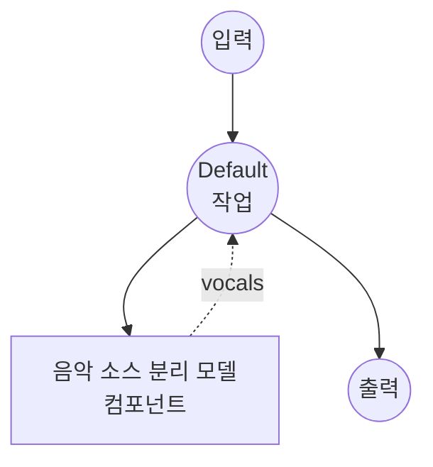

# 음악 소스 분리 모델 태스크 예제

이 예제는 로컬 Demucs v4 (`htdemucs_ft`) 모델과 함께 model-compose의 내장 music-source-separation 태스크를 사용하여 음악 트랙에서 보컬 스템을 분리하는 방법을 보여주며, 초기 모델 다운로드 후 완전 오프라인으로 실행됩니다.

## 개요

이 워크플로우는 입력 믹스에서 추출된 보컬 스템만 포함하는 WAV 파일을 반환합니다:

1. **로컬 분리 모델**: 일회성 다운로드 후 Demucs v4 파인튜닝 모델(`htdemucs_ft`)을 로컬에서 실행
2. **스템 선택**: 요청된 스템만 방출(기본값: `vocals`), 다른 스템은 폐기
3. **품질 컨트롤**: 품질/속도 트레이드오프를 위한 조정 가능한 `shifts`(등변 안정화) 및 `overlap`(청크 오버랩)
4. **외부 API 불필요**: 모델이 캐시된 후 완전 오프라인

## 준비사항

### 필수 요구사항

- model-compose가 설치되어 PATH에서 사용 가능
- `demucs`, `torch`, `torchaudio`, `numpy`, `soxr`가 포함된 Python 환경 (컴포넌트 설정 요구사항으로 선언되어 첫 실행 시 자동 설치)
- 합리적인 처리량을 위해 CUDA GPU 권장; CPU도 작동하지만 훨씬 느림
- **Apple Silicon (MPS)은 `htdemucs_ft`에서 지원되지 않음** — 파인튜닝 앙상블이 MPS의 65,536 채널 conv1d 제한을 초과합니다. `device: cpu`를 사용(이 예제의 기본값)하거나 `htdemucs`로 모델을 전환하세요(문제 해결 참조)

### 소스 분리를 사용하는 이유

음악 소스 분리는 혼합된 녹음을 구성 스템(보컬, 드럼, 베이스, 기타)으로 분할합니다. 일반적인 다운스트림 사용 사례:

- **가라오케 / 보컬 제거**: 노래방 트랙을 위해 반주만 유지
- **ASR / 가사 정렬을 위한 격리된 보컬**: 깨끗한 보컬 스템을 음성 인식 또는 강제 정렬 모델에 공급
- **리믹싱 및 샘플링**: 완성된 마스터에서 개별 스템 복구
- **커버 / 더빙 워크플로우**: 원본 백킹 트랙을 유지하면서 보컬 교체

참고: 소스 분리는 시간 범위가 아닌 *분리된 오디오*를 반환합니다. 대화에서 화자 전환 경계만 필요한 경우 `speaker-diarization` 태스크를 사용하세요.

## 실행 방법

1. **서비스 시작:**
   ```bash
   model-compose up
   ```

2. **워크플로우 실행:**

   **API 사용:**
   ```bash
   # 기본 보컬 추출
   curl -X POST http://localhost:8080/api/workflows/runs \
     -F "audio=@/path/to/your/song.mp3" \
     -F "input={\"audio\": \"@audio\"}" \
     -o vocals.wav

   # 고품질 분리 (더 많은 shifts, 더 큰 overlap)
   curl -X POST http://localhost:8080/api/workflows/runs \
     -F "audio=@/path/to/your/song.mp3" \
     -F "input={\"audio\": \"@audio\", \"shifts\": 4, \"overlap\": 0.5}" \
     -o vocals.wav
   ```

   **웹 UI 사용:**
   - 웹 UI 열기: http://localhost:8081
   - 오디오 파일 업로드 (MP3, WAV, FLAC 등)
   - 선택적으로 `shifts` (1-10) 및 `overlap` (0.0-0.99) 설정
   - "Run Workflow" 버튼 클릭

   **CLI 사용:**
   ```bash
   # 기본 보컬 추출
   model-compose run music-source-separation --input '{"audio": "/path/to/your/song.mp3"}'

   # 품질 조정 포함
   model-compose run music-source-separation --input '{
     "audio": "/path/to/your/song.mp3",
     "shifts": 4,
     "overlap": 0.5
   }'
   ```

## 컴포넌트 세부사항

### 음악 소스 분리 모델 컴포넌트 (기본)

- **유형**: `music-source-separation` 태스크를 가진 모델 컴포넌트
- **드라이버**: `custom`
- **패밀리**: `demucs`
- **목적**: 음악 믹스를 악기별 스템으로 분할
- **기능**:
  - 일회성 모델 다운로드 후 `demucs` 패키지를 통한 로컬 추론
  - 네 개의 Demucs 스템(`vocals`, `drums`, `bass`, `other`)의 임의 부분집합 반환
  - 더 높은 `shifts`는 여러 임의 시간 오프셋에 걸쳐 예측을 평균화하여 더 깨끗한 결과 생성

### 모델 정보: Demucs v4 (`htdemucs_ft`)

- **개발자**: Meta AI (Facebook Research)
- **유형**: 하이브리드 트랜스포머 Demucs (스펙트로그램 + 파형), 파인튜닝된 4-스템 모델
- **라이선스**: MIT (가중치는 Meta에서 호스팅되며 첫 사용 시 자동 다운로드)

## 워크플로우 세부사항

### "Music Source Separation" 워크플로우 (기본)

**설명**: 입력 믹스에서 보컬 스템을 추출하고 WAV 파일로 반환합니다.

#### 작업 흐름



#### 입력 매개변수

| 매개변수 | 유형 | 필수 | 기본값 | 설명 |
|---------|------|------|--------|------|
| `audio` | audio | 예 | - | 입력 음악 파일 (MP3, WAV, FLAC 등) |
| `overlap` | float | 아니오 | `0.25` | 청크 간 오버랩 비율 (0.0-0.99); 높을수록 더 깨끗하지만 느림 |
| `shifts` | integer | 아니오 | `1` | 임의 이동 평균 횟수; 높을수록 더 깨끗하지만 느림 |

#### 출력 형식

워크플로우 출력은 모델의 기본 44.1 kHz 스테레오로 16비트 PCM으로 인코딩된 보컬 스템만 포함하는 WAV 오디오 스트림입니다.

## 여러 스템 요청

`action.params` 아래의 `stems`를 Demucs의 네 개 스템 중 임의의 부분집합으로 변경합니다:

```yaml
action:
  audio: ${input.audio as audio}
  params:
    stems: [vocals, drums, bass, other]
```

두 개 이상의 스템이 요청되면 액션은 단일 오디오 스트림 대신 `{"vocals": ..., "drums": ..., ...}` 맵을 반환합니다. 각 항목을 개별 작업 출력으로 라우팅하여 별도로 노출합니다:

```yaml
workflow:
  jobs:
    - id: separate
      component: demucs-separator
      input:
        audio: ${input.audio as audio}
      output:
        vocals: ${output.vocals as audio/wav}
        drums:  ${output.drums as audio/wav}
        bass:   ${output.bass as audio/wav}
        other:  ${output.other as audio/wav}
```

## Demucs 대신 MDX-Net 사용

동일한 태스크가 ONNX Runtime을 통한 UVR MDX-Net 보컬 모델을 지원합니다. 컴포넌트를 다음과 같이 교체하세요:

```yaml
component:
  type: model
  task: music-source-separation
  driver: custom
  family: mdx-net
  model:
    provider: huggingface
    repository: seanghay/uvr_models
    filename: UVR-MDX-NET-Voc_FT.onnx
  device: auto
  action:
    audio: ${input.audio as audio}
    params:
      stems: [ vocals ]   # 또는 [vocals, instrumental]
```

MDX-Net 보컬 모델은 `vocals` 스템을 생성합니다; 보완적인 `instrumental` 스템은 원본 믹스에서 뺄셈으로 파생됩니다. 설정 요구사항: `onnxruntime`, `torch`, `numpy`, `soxr`.

## 음성 인식과 연결

깔끔한 가사 전사를 위해 격리된 보컬 스템을 ASR 모델에 공급합니다:

```yaml
workflow:
  jobs:
    - id: separate
      component: demucs-separator
      input:
        audio: ${input.audio as audio}

    - id: transcribe
      component: whisper
      depends_on: [separate]
      input:
        audio: ${jobs.separate.output as audio}

components:
  - id: demucs-separator
    type: model
    task: music-source-separation
    driver: custom
    family: demucs
    model: htdemucs_ft
    action:
      audio: ${input.audio as audio}
      params:
        stems: [ vocals ]

  - id: whisper
    type: model
    task: speech-to-text
    driver: huggingface
    architecture: whisper
    model: openai/whisper-large-v3-turbo
```

## 문제 해결

### 일반적인 문제

1. **첫 실행이 매우 느리거나 멈춘 것처럼 보임**: Demucs는 첫 사용 시 약 150 MB를 다운로드합니다. 이후 실행은 로컬 캐시에서 로드됩니다.
2. **GPU에서 메모리 부족**: `overlap`을 낮추거나(예: `0.1`) 컴포넌트에서 `device: cpu`로 설정하여 CPU 추론으로 대체합니다.
3. **보컬에 여전히 악기 소리가 섞여 있음**: `shifts`(예: `4`-`10`) 및/또는 `overlap`(예: `0.5`-`0.75`)을 증가시킵니다. 이는 분리 품질을 위해 실행 시간을 희생합니다.
4. **"Stem 'X' is not produced by this Demucs model"**: 4-스템 `htdemucs_ft`는 `vocals`, `drums`, `bass`, `other`를 지원합니다. 6-스템 변형(예: `htdemucs_6s`)은 추가로 `guitar`와 `piano`를 지원합니다.
5. **Apple Silicon에서 `NotImplementedError: Output channels > 65536 not supported at the MPS device`**: `htdemucs_ft`는 내부 conv 폭이 PyTorch의 MPS 백엔드 제한을 초과하는 배깅 앙상블입니다. `device: cpu`를 유지하거나(이 예제의 기본값) MPS 제한에 맞는 단일 모델 `htdemucs`로 전환하세요:
   ```yaml
   component:
     model: htdemucs   # htdemucs_ft 대신
     device: auto      # Apple Silicon에서 MPS를 사용합니다
   ```
