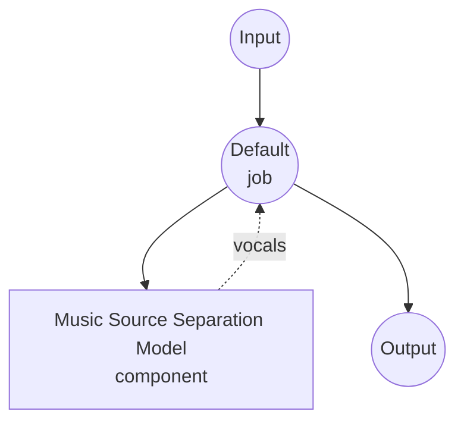

# Music Source Separation Model Task Example

This example demonstrates how to isolate the vocal stem from a music track using model-compose's built-in music-source-separation task with a local Demucs v4 (`htdemucs_ft`) model, running fully offline after the initial model download.

## Overview

This workflow returns a WAV file containing only the vocal stem extracted from the input mix:

1. **Local Separation Model**: Runs Demucs v4 fine-tuned (`htdemucs_ft`) locally after a one-time download
2. **Stem Selection**: Emits only the requested stem (defaults to `vocals`), other stems are discarded
3. **Quality Controls**: Tunable `shifts` (equivariant stabilization) and `overlap` (chunk overlap) for a quality/speed tradeoff
4. **No External APIs**: Fully offline once the model is cached

## Preparation

### Prerequisites

- model-compose installed and available in your PATH
- Python environment with `demucs`, `torch`, `torchaudio`, `numpy`, `soxr` (declared as component setup requirements and auto-installed on first run)
- A CUDA GPU is recommended for reasonable throughput; CPU works but is significantly slower
- **Apple Silicon (MPS) is not supported for `htdemucs_ft`** — the fine-tuned ensemble exceeds MPS's 65 536-channel conv1d limit. Use `device: cpu` (default in this example) or switch the model to `htdemucs` (see Troubleshooting)

### Why Source Separation

Music source separation splits a mixed recording into its constituent stems (vocals, drums, bass, other). Typical downstream uses:

- **Karaoke / vocal removal**: Keep only the accompaniment for sing-along tracks
- **Isolated vocals for ASR / lyric alignment**: Feed a clean vocal stem into speech-to-text or forced-alignment models
- **Remixing and sampling**: Recover individual stems from a finished master
- **Cover / dubbing workflows**: Replace vocals while preserving the original backing track

Note: source separation returns *unmixed audio*, not time ranges. If you only need speaker turn boundaries in dialogue, use the `speaker-diarization` task instead.

## How to Run

1. **Start the service:**
   ```bash
   model-compose up
   ```

2. **Run the workflow:**

   **Using API:**
   ```bash
   # Basic vocal extraction
   curl -X POST http://localhost:8080/api/workflows/runs \
     -F "audio=@/path/to/your/song.mp3" \
     -F "input={\"audio\": \"@audio\"}" \
     -o vocals.wav

   # Higher-quality separation (more shifts, larger overlap)
   curl -X POST http://localhost:8080/api/workflows/runs \
     -F "audio=@/path/to/your/song.mp3" \
     -F "input={\"audio\": \"@audio\", \"shifts\": 4, \"overlap\": 0.5}" \
     -o vocals.wav
   ```

   **Using Web UI:**
   - Open the Web UI: http://localhost:8081
   - Upload an audio file (MP3, WAV, FLAC, etc.)
   - Optionally set `shifts` (1-10) and `overlap` (0.0-0.99)
   - Click the "Run Workflow" button

   **Using CLI:**
   ```bash
   # Basic vocal extraction
   model-compose run music-source-separation --input '{"audio": "/path/to/your/song.mp3"}'

   # With quality tuning
   model-compose run music-source-separation --input '{
     "audio": "/path/to/your/song.mp3",
     "shifts": 4,
     "overlap": 0.5
   }'
   ```

## Component Details

### Music Source Separation Model Component (Default)

- **Type**: Model component with `music-source-separation` task
- **Driver**: `custom`
- **Family**: `demucs`
- **Purpose**: Split a music mix into per-instrument stems
- **Features**:
  - Local inference via the `demucs` package after a one-time model download
  - Returns any subset of the four Demucs stems: `vocals`, `drums`, `bass`, `other`
  - Higher `shifts` averages predictions over multiple random time offsets for a cleaner result

### Model Information: Demucs v4 (`htdemucs_ft`)

- **Developer**: Meta AI (Facebook Research)
- **Type**: Hybrid Transformer Demucs (spectrogram + waveform), fine-tuned four-stem model
- **License**: MIT (weights hosted by Meta and downloaded automatically on first use)

## Workflow Details

### "Music Source Separation" Workflow (Default)

**Description**: Extract the vocal stem from an input mix and return it as a WAV file.

#### Job Flow



#### Input Parameters

| Parameter | Type | Required | Default | Description |
|-----------|------|----------|---------|-------------|
| `audio` | audio | Yes | - | Input music file (MP3, WAV, FLAC, etc.) |
| `sample_rate` | integer | No | `44100` | Target sample rate; input is resampled if needed |
| `overlap` | float | No | `0.25` | Overlap ratio between chunks (0.0-0.99); higher = cleaner, slower |
| `shifts` | integer | No | `1` | Random-shift averaging count; higher = cleaner, slower |

#### Output Format

The workflow output is a WAV audio stream containing only the vocal stem, encoded as 16-bit PCM at the model's native 44.1 kHz stereo.

## Requesting Multiple Stems

Change `stems` under `action.params` to any subset of Demucs' four stems:

```yaml
action:
  audio: ${input.audio as audio}
  params:
    stems: [vocals, drums, bass, other]
```

When more than one stem is requested, the action returns a `{"vocals": ..., "drums": ..., ...}` map instead of a single audio stream. Route each entry to a separate job output to expose them individually:

```yaml
workflow:
  jobs:
    - id: separate
      component: demucs-separator
      input:
        audio: ${input.audio as audio}
      output:
        vocals: ${output.vocals as audio/wav}
        drums:  ${output.drums as audio/wav}
        bass:   ${output.bass as audio/wav}
        other:  ${output.other as audio/wav}
```

## Using MDX-Net Instead of Demucs

The same task supports UVR MDX-Net vocal models via ONNX Runtime. Swap the component with:

```yaml
component:
  type: model
  task: music-source-separation
  driver: custom
  family: mdx-net
  model:
    provider: huggingface
    repository: seanghay/uvr_models
    filename: UVR-MDX-NET-Voc_FT.onnx
  device: auto
  action:
    audio: ${input.audio as audio}
    params:
      stems: [vocals]   # or [vocals, instrumental]
```

MDX-Net vocal models produce a `vocals` stem; the complementary `instrumental` stem is derived by subtraction from the original mix. Setup requirements: `onnxruntime`, `torch`, `numpy`, `soxr`.

## Chaining with Speech-to-Text

Feed the isolated vocal stem into an ASR model for cleaner lyric transcription:

```yaml
workflow:
  jobs:
    - id: separate
      component: demucs-separator
      input:
        audio: ${input.audio as audio}

    - id: transcribe
      component: whisper
      depends_on: [separate]
      input:
        audio: ${jobs.separate.output as audio}

components:
  - id: demucs-separator
    type: model
    task: music-source-separation
    driver: custom
    family: demucs
    model: htdemucs_ft
    action:
      audio: ${input.audio as audio}
      params:
        stems: [vocals]

  - id: whisper
    type: model
    task: speech-to-text
    driver: huggingface
    architecture: whisper
    model: openai/whisper-large-v3-turbo
```

## Troubleshooting

### Common Issues

1. **First run is very slow / appears to hang**: Demucs downloads ~150 MB on first use. Subsequent runs load from the local cache.
2. **Out-of-memory on GPU**: Lower `overlap` (e.g. `0.1`) or set `device: cpu` on the component to fall back to CPU inference.
3. **Vocals still contain instrument bleed**: Increase `shifts` (e.g. `4`-`10`) and/or `overlap` (e.g. `0.5`-`0.75`). This trades wall-clock time for separation quality.
4. **"Stem 'X' is not produced by this Demucs model"**: The four-stem `htdemucs_ft` supports `vocals`, `drums`, `bass`, `other`. Six-stem variants (e.g. `htdemucs_6s`) additionally support `guitar` and `piano`.
5. **`NotImplementedError: Output channels > 65536 not supported at the MPS device` on Apple Silicon**: `htdemucs_ft` is a bagged ensemble whose internal conv widths exceed the MPS backend limit in PyTorch. Either keep `device: cpu` (this example's default) or switch to the single-model `htdemucs`, which fits under the MPS limit:
   ```yaml
   component:
     model: htdemucs   # instead of htdemucs_ft
     device: auto      # will use MPS on Apple Silicon
   ```
