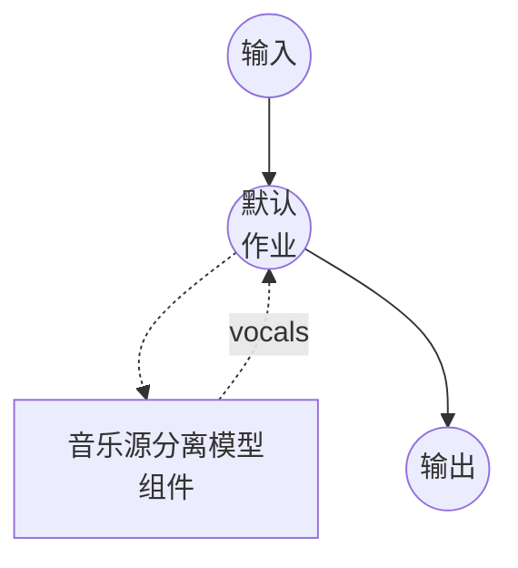

# 音乐源分离模型任务示例

此示例演示如何使用 model-compose 内置的 music-source-separation 任务和本地 Demucs v4 (`htdemucs_ft`) 模型从音乐轨道中分离人声音轨，在初次模型下载后完全离线运行。

## 概述

此工作流返回一个仅包含从输入混音中提取的人声音轨的 WAV 文件：

1. **本地分离模型**：一次性下载后在本地运行 Demucs v4 微调模型（`htdemucs_ft`）
2. **音轨选择**：仅输出所请求的音轨（默认为 `vocals`），其他音轨被丢弃
3. **质量控制**：可调的 `shifts`（等变稳定）和 `overlap`（分块重叠）用于质量/速度权衡
4. **无需外部 API**：模型缓存后完全离线

## 准备工作

### 前置条件

- 已安装 model-compose 并在您的 PATH 中可用
- 包含 `demucs`、`torch`、`torchaudio`、`numpy`、`soxr` 的 Python 环境（作为组件设置要求声明，首次运行时自动安装）
- 为获得合理吞吐量，推荐使用 CUDA GPU；CPU 可用但明显更慢
- **Apple Silicon (MPS) 不支持 `htdemucs_ft`** — 微调集成模型超过 MPS 的 65,536 通道 conv1d 限制。使用 `device: cpu`（此示例的默认值）或将模型切换到 `htdemucs`（参见故障排除）

### 为何选择源分离

音乐源分离将混合录音拆分为其组成音轨（人声、鼓、贝斯、其他）。典型的下游用途：

- **卡拉 OK / 去除人声**：为跟唱轨道仅保留伴奏
- **用于 ASR / 歌词对齐的分离人声**：将干净的人声音轨输入语音识别或强制对齐模型
- **混音和采样**：从完成的母带中恢复单独的音轨
- **翻唱 / 配音工作流**：在保留原始背景轨道的同时替换人声

注意：源分离返回*分离音频*，而非时间范围。如果您只需要对话中的说话人转换边界，请使用 `speaker-diarization` 任务。

## 运行方式

1. **启动服务：**
   ```bash
   model-compose up
   ```

2. **运行工作流：**

   **使用 API：**
   ```bash
   # 基础人声提取
   curl -X POST http://localhost:8080/api/workflows/runs \
     -F "audio=@/path/to/your/song.mp3" \
     -F "input={\"audio\": \"@audio\"}" \
     -o vocals.wav

   # 更高质量的分离（更多 shifts、更大 overlap）
   curl -X POST http://localhost:8080/api/workflows/runs \
     -F "audio=@/path/to/your/song.mp3" \
     -F "input={\"audio\": \"@audio\", \"shifts\": 4, \"overlap\": 0.5}" \
     -o vocals.wav
   ```

   **使用 Web UI：**
   - 打开 Web UI：http://localhost:8081
   - 上传音频文件（MP3、WAV、FLAC 等）
   - 可选择设置 `shifts` (1-10) 和 `overlap` (0.0-0.99)
   - 点击"运行工作流"按钮

   **使用 CLI：**
   ```bash
   # 基础人声提取
   model-compose run music-source-separation --input '{"audio": "/path/to/your/song.mp3"}'

   # 带质量调整
   model-compose run music-source-separation --input '{
     "audio": "/path/to/your/song.mp3",
     "shifts": 4,
     "overlap": 0.5
   }'
   ```

## 组件详情

### 音乐源分离模型组件（默认）

- **类型**：具有 `music-source-separation` 任务的模型组件
- **驱动**：`custom`
- **系列**：`demucs`
- **用途**：将音乐混音分割为每个乐器的音轨
- **功能**：
  - 一次性模型下载后通过 `demucs` 包进行本地推理
  - 返回四个 Demucs 音轨（`vocals`、`drums`、`bass`、`other`）的任意子集
  - 更高的 `shifts` 通过在多个随机时间偏移上平均预测以获得更干净的结果

### 模型信息：Demucs v4 (`htdemucs_ft`)

- **开发者**：Meta AI (Facebook Research)
- **类型**：混合 Transformer Demucs（频谱图 + 波形），微调的 4 音轨模型
- **许可证**：MIT（权重由 Meta 托管并在首次使用时自动下载）

## 工作流详情

### "Music Source Separation" 工作流（默认）

**描述**：从输入混音中提取人声音轨并作为 WAV 文件返回。

#### 作业流程



#### 输入参数

| 参数 | 类型 | 必需 | 默认值 | 描述 |
|-----------|------|----------|---------|-------------|
| `audio` | audio | 是 | - | 输入音乐文件（MP3、WAV、FLAC 等） |
| `overlap` | float | 否 | `0.25` | 分块之间的重叠比率 (0.0-0.99)；越高越干净但越慢 |
| `shifts` | integer | 否 | `1` | 随机偏移平均次数；越高越干净但越慢 |

#### 输出格式

工作流输出是一个 WAV 音频流，仅包含以模型原生 44.1 kHz 立体声编码为 16 位 PCM 的人声音轨。

## 请求多个音轨

将 `action.params` 下的 `stems` 更改为 Demucs 四个音轨的任意子集：

```yaml
action:
  audio: ${input.audio as audio}
  params:
    stems: [vocals, drums, bass, other]
```

请求多个音轨时，动作将返回 `{"vocals": ..., "drums": ..., ...}` 映射而非单个音频流。将每个条目路由到单独的作业输出以分别公开它们：

```yaml
workflow:
  jobs:
    - id: separate
      component: demucs-separator
      input:
        audio: ${input.audio as audio}
      output:
        vocals: ${output.vocals as audio/wav}
        drums:  ${output.drums as audio/wav}
        bass:   ${output.bass as audio/wav}
        other:  ${output.other as audio/wav}
```

## 使用 MDX-Net 替代 Demucs

同一任务通过 ONNX Runtime 支持 UVR MDX-Net 人声模型。将组件替换为：

```yaml
component:
  type: model
  task: music-source-separation
  driver: custom
  family: mdx-net
  model:
    provider: huggingface
    repository: seanghay/uvr_models
    filename: UVR-MDX-NET-Voc_FT.onnx
  device: auto
  action:
    audio: ${input.audio as audio}
    params:
      stems: [ vocals ]   # 或 [vocals, instrumental]
```

MDX-Net 人声模型产生 `vocals` 音轨；互补的 `instrumental` 音轨通过从原始混音中减去得到。设置要求：`onnxruntime`、`torch`、`numpy`、`soxr`。

## 与语音识别串联

将分离的人声音轨输入 ASR 模型以获得更清晰的歌词转录：

```yaml
workflow:
  jobs:
    - id: separate
      component: demucs-separator
      input:
        audio: ${input.audio as audio}

    - id: transcribe
      component: whisper
      depends_on: [separate]
      input:
        audio: ${jobs.separate.output as audio}

components:
  - id: demucs-separator
    type: model
    task: music-source-separation
    driver: custom
    family: demucs
    model: htdemucs_ft
    action:
      audio: ${input.audio as audio}
      params:
        stems: [ vocals ]

  - id: whisper
    type: model
    task: speech-to-text
    driver: huggingface
    architecture: whisper
    model: openai/whisper-large-v3-turbo
```

## 故障排除

### 常见问题

1. **首次运行非常慢/似乎卡住**：Demucs 在首次使用时下载约 150 MB。后续运行从本地缓存加载。
2. **GPU 内存不足**：降低 `overlap`（例如 `0.1`）或在组件上设置 `device: cpu` 以回退到 CPU 推理。
3. **人声仍然包含乐器渗漏**：增加 `shifts`（例如 `4`-`10`）和/或 `overlap`（例如 `0.5`-`0.75`）。这以运行时间换取分离质量。
4. **"Stem 'X' is not produced by this Demucs model"**：4 音轨 `htdemucs_ft` 支持 `vocals`、`drums`、`bass`、`other`。6 音轨变体（例如 `htdemucs_6s`）额外支持 `guitar` 和 `piano`。
5. **Apple Silicon 上的 `NotImplementedError: Output channels > 65536 not supported at the MPS device`**：`htdemucs_ft` 是一个装袋集成模型，其内部 conv 宽度超过 PyTorch 中 MPS 后端的限制。要么保持 `device: cpu`（此示例的默认值），要么切换到符合 MPS 限制的单模型 `htdemucs`：
   ```yaml
   component:
     model: htdemucs   # 而非 htdemucs_ft
     device: auto      # 将在 Apple Silicon 上使用 MPS
   ```
