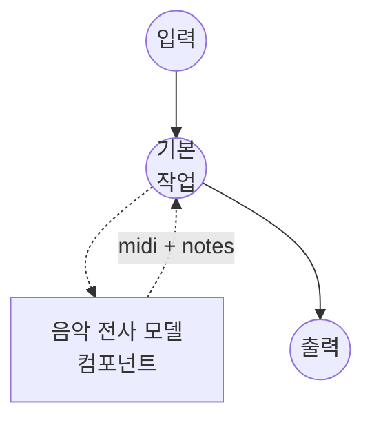

# 음악 전사 모델 태스크 예제

이 예제는 로컬 Spotify Basic Pitch 모델과 함께 model-compose의 내장 music-transcription 태스크를 사용하여 오디오 녹음을 구조화된 노트 이벤트와 MIDI 파일로 변환하는 방법을 보여주며, 초기 패키지 설치 후 완전 오프라인으로 실행됩니다.

## 개요

이 워크플로우는 입력 오디오에서 추출된 MIDI 파일과 노트 이벤트의 JSON 목록을 반환합니다:

1. **로컬 전사 모델**: Basic Pitch의 ICASSP-2022 모델을 로컬에서 실행; 체크포인트는 `basic-pitch` 패키지 내에 포함되어 있어 런타임에 다운로드가 필요 없음
2. **두 가지 출력 형식**: 표준 MIDI 파일(DAW 및 악보 편집기용)과 원시 노트 이벤트 JSON(프로그래매틱 사용을 위한)
3. **조정 가능한 임계값**: `onset_threshold`, `frame_threshold`, `minimum_note_length`로 재현율과 정밀도의 트레이드오프 조정 가능
4. **외부 API 불필요**: 의존성 설치 후 완전 오프라인

## 준비사항

### 필수 요구사항

- model-compose가 설치되어 PATH에서 사용 가능
- `basic-pitch`, `numpy`, `soxr`가 포함된 Python 환경 (컴포넌트 설정 요구사항으로 선언되어 첫 실행 시 자동 설치)
- CPU 전용: Basic Pitch는 CPU에서 편안하게 실행되는 작은 CNN이며 GPU가 필요하지 않음

### 음악 전사를 사용하는 이유

자동 음악 전사는 녹음된 연주를 노트 수준의 심볼릭 데이터(온셋, 오프셋, 피치, 벨로시티)로 변환합니다. 일반적인 다운스트림 사용 사례:

- **악보 생성**: MIDI 출력을 music21 또는 MuseScore에 공급하여 악보 렌더링
- **DAW 임포트**: MIDI를 DAW에 드롭하여 녹음을 재연주하거나 재편곡
- **음악 분석**: 오디오만의 소스에서 멜로디, 하모니, 리듬 연구
- **코드 및 조성 추정**: 노트 이벤트를 코드 및 조성 특징으로 집계

참고: 전사는 다성(polyphonic)이지만 소스 분리는 아닙니다. 입력이 전체 밴드 믹스이고 악기별 악보를 원한다면, 먼저 `music-source-separation` 태스크로 믹스를 분할한 다음 각 스템을 개별적으로 전사하세요.

## 실행 방법

1. **서비스 시작:**
   ```bash
   model-compose up
   ```

2. **워크플로우 실행:**

   **API 사용:**
   ```bash
   # 기본 전사
   curl -X POST http://localhost:8080/api/workflows/runs \
     -F "audio=@/path/to/your/recording.wav" \
     -F "input={\"audio\": \"@audio\"}"

   # 더 보수적인 온셋 (오탐지 감소)
   curl -X POST http://localhost:8080/api/workflows/runs \
     -F "audio=@/path/to/your/recording.wav" \
     -F "input={\"audio\": \"@audio\", \"onset_threshold\": 0.7, \"minimum_note_length\": 100}"
   ```

   **웹 UI 사용:**
   - 웹 UI 열기: http://localhost:8081
   - 오디오 파일 업로드 (MP3, WAV, FLAC 등)
   - 선택적으로 `onset_threshold`, `frame_threshold`, `minimum_note_length` 조정
   - "Run Workflow" 버튼 클릭

   **CLI 사용:**
   ```bash
   # 기본 전사
   model-compose run music-transcription --input '{"audio": "/path/to/your/recording.wav"}'

   # 임계값 튜닝 포함
   model-compose run music-transcription --input '{
     "audio": "/path/to/your/recording.wav",
     "onset_threshold": 0.7,
     "minimum_note_length": 100
   }'
   ```

## 컴포넌트 세부사항

### 음악 전사 모델 컴포넌트 (기본)

- **유형**: `music-transcription` 태스크를 가진 모델 컴포넌트
- **드라이버**: `custom`
- **패밀리**: `basic-pitch`
- **목적**: 오디오를 다성 노트 이벤트 + MIDI로 변환
- **기능**:
  - `basic-pitch` 패키지를 통한 로컬 추론; 체크포인트는 wheel 내에 포함
  - 단일 호출로 MIDI 바이트와 노트 이벤트 목록 반환
  - `return_pitch_bends: true` 설정 시 노트별 피치 벤드 선택 가능

### 모델 정보: Basic Pitch (ICASSP-2022)

- **개발자**: Spotify Research
- **유형**: 다성 피치 추정을 위한 합성곱 신경망
- **라이선스**: Apache 2.0 (가중치는 `basic-pitch` 패키지와 함께 제공)
- **논문**: "A Lightweight Instrument-Agnostic Model for Polyphonic Note Transcription and Multipitch Estimation" (ICASSP 2022)

## 워크플로우 세부사항

### "Music Transcription" 워크플로우 (기본)

**설명**: 입력 녹음을 MIDI 파일과 노트 이벤트 JSON으로 전사합니다.

#### 작업 흐름



#### 입력 매개변수 (Basic Pitch)

`basic-pitch` 패밀리가 액션에서 받는 필드입니다. 감지 튜닝 조정값은 `action.params` 아래에 위치하며, 나머지는 `action`에 직접 위치합니다.

| 매개변수 | 위치 | 유형 | 필수 | 기본값 | 설명 |
|-----------|----------|------|----------|---------|-------------|
| `audio` | `action` | audio | 예 | - | 입력 녹음 (MP3, WAV, FLAC 등) |
| `return_pitch_bends` | `action` | boolean | 아니오 | `false` | MIDI에 노트별 피치 벤드 이벤트를 기록하고 각 노트에 `pitch_bends` 배열로 포함할지 여부 |
| `onset_threshold` | `action.params` | float | 아니오 | `0.5` | 노트 온셋 감지를 위한 신뢰도 임계값 (0.0-1.0); 높을수록 노트 수가 적음 |
| `frame_threshold` | `action.params` | float | 아니오 | `0.3` | 프레임 간 노트 유지를 위한 신뢰도 임계값 (0.0-1.0) |
| `minimum_note_length` | `action.params` | float | 아니오 | `58.0` | 최소 노트 지속 시간(밀리초) |
| `minimum_frequency` | `action.params` | float | 아니오 | - | 감지되는 피치의 하한 (Hz) |
| `maximum_frequency` | `action.params` | float | 아니오 | - | 감지되는 피치의 상한 (Hz) |
| `midi_tempo` | `action.params` | float | 아니오 | `120` | MIDI 헤더에 기록되는 템포(BPM); 감지된 타이밍에는 영향을 주지 않음 |

#### 출력 형식

워크플로우 출력은 두 개의 필드를 가진 JSON 객체입니다:

- `midi` — `.mid`로 저장하거나 악보 렌더러로 파이프하기에 적합한 MIDI 파일
- `notes` — `{ "start_time", "end_time", "pitch", "velocity" }` 객체의 목록 (시간은 초 단위, `pitch`는 MIDI 노트 번호, `velocity`는 0.0-1.0)

## Basic Pitch 대신 Piano Transcription 사용

피아노 전용 녹음의 경우 ByteDance의 Piano Transcription 모델이 훨씬 더 깨끗한 전사(서스테인 페달 이벤트 포함)를 생성합니다. 컴포넌트를 다음과 같이 교체하세요:

```yaml
component:
  type: model
  task: music-transcription
  driver: custom
  family: piano-transcription
  device: auto
  action:
    audio: ${input.audio as audio}
    params:
      onset_threshold:        0.3   # note attack sensitivity
      offset_threshold:       0.3   # note release sensitivity
      frame_threshold:        0.1   # sustained-note frame sensitivity
      pedal_offset_threshold: 0.2   # sustain-pedal release sensitivity
```

Piano Transcription은 Basic Pitch와 다른 매개변수 집합을 노출합니다 — 스키마는 패밀리별로 다르므로 위 필드가 전체 목록입니다. `minimum_note_length`, `minimum_frequency`, `maximum_frequency`, `return_pitch_bends`, `midi_tempo`는 여기에 적용되지 않습니다 (모델은 88건반 피아노로 고정되어 있으며 피치 벤드 대신 페달 이벤트를 MIDI에 기록합니다).

첫 실행 시 체크포인트(~180 MB)를 `~/piano_transcription_inference_data/`로 다운로드합니다. 설정 요구사항: `piano_transcription_inference`, `torch`, `numpy`, `soxr`. Piano Transcription은 88건반 피아노 전용입니다 — 다른 악기나 믹스의 경우 Basic Pitch를 유지하세요.

## 음악 소스 분리와 연결

악기별 악보를 위해 분리된 각 스템을 전사에 공급합니다:

```yaml
workflow:
  jobs:
    - id: separate
      component: demucs-separator
      input:
        audio: ${input.audio as audio}
      output:
        vocals: ${output.vocals as audio/wav}
        other:  ${output.other as audio/wav}

    - id: transcribe-vocals
      component: transcriber
      depends_on: [separate]
      input:
        audio: ${jobs.separate.output.vocals as audio}

    - id: transcribe-other
      component: transcriber
      depends_on: [separate]
      input:
        audio: ${jobs.separate.output.other as audio}

components:
  - id: demucs-separator
    type: model
    task: music-source-separation
    driver: custom
    family: demucs
    model: htdemucs_ft
    action:
      audio: ${input.audio as audio}
      params:
        stems: [ vocals, other ]

  - id: transcriber
    type: model
    task: music-transcription
    driver: custom
    family: basic-pitch
    action:
      audio: ${input.audio as audio}
```

## 문제 해결

### 일반적인 문제

1. **오탐지 노트가 너무 많음**: `onset_threshold`를 올리고(예: `0.7`-`0.8`) `minimum_note_length`를 늘려(예: `100`-`150` ms) 짧은 잡음 감지를 억제합니다.
2. **조용하거나 빠른 노트가 누락됨**: `onset_threshold`(예: `0.3`)와 `frame_threshold`(예: `0.2`)를 낮춥니다. 재현율 향상은 더 많은 오탐지를 동반한다는 점을 유의하세요.
3. **DAW에서 타이밍이 어긋남**: Basic Pitch는 절대 노트 시간을 초 단위로 추정하며, MIDI 출력은 기본 템포 120 BPM을 사용합니다. `action.params` 아래의 `midi_tempo`를 소스 녹음에 맞게 설정하거나 DAW 내에서 재양자화하세요.
4. **코드가 많은 구간이 아르페지오로 출력됨**: 코드 내의 매우 짧은 노트가 프레임 수준 트래커에 의해 분할될 수 있습니다. `minimum_note_length`를 올려(예: `120` ms) 인접한 감지를 유지된 노트로 병합하세요.
5. **피아노 녹음이지만 전사가 탁함**: `piano-transcription` 패밀리로 전환하세요(위 참조). Basic Pitch는 악기에 구애받지 않으며, 피아노 전용 모델은 MAESTRO로 학습되어 피아노 다성음을 훨씬 더 잘 처리합니다.
