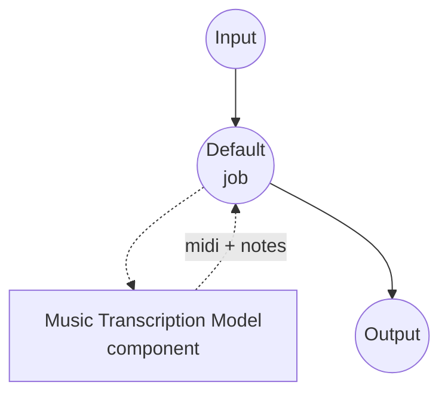

# Music Transcription Model Task Example

This example demonstrates how to convert an audio recording into structured note events and a MIDI file using model-compose's built-in music-transcription task with a local Spotify Basic Pitch model, running fully offline after the initial package install.

## Overview

This workflow returns a MIDI file and a JSON list of note events extracted from the input audio:

1. **Local Transcription Model**: Runs Basic Pitch's ICASSP-2022 model locally; the checkpoint ships inside the `basic-pitch` package, so no downloads at runtime
2. **Two Output Formats**: A standard MIDI file (for DAWs and score editors) and a raw note-event JSON (for programmatic use)
3. **Tunable Thresholds**: `onset_threshold`, `frame_threshold`, and `minimum_note_length` let you trade recall for precision
4. **No External APIs**: Fully offline once dependencies are installed

## Preparation

### Prerequisites

- model-compose installed and available in your PATH
- Python environment with `basic-pitch`, `numpy`, `soxr` (declared as component setup requirements and auto-installed on first run)
- CPU-only: Basic Pitch is a small CNN that runs comfortably on CPU; no GPU required

### Why Music Transcription

Automatic music transcription converts a recorded performance into note-level symbolic data (onsets, offsets, pitches, and velocities). Typical downstream uses:

- **Score generation**: Feed the MIDI output into music21 or MuseScore to render sheet music
- **DAW import**: Drop the MIDI into a DAW to re-perform or re-orchestrate a recording
- **Music analysis**: Study melody, harmony, and rhythm from an audio-only source
- **Chord and key estimation**: Aggregate note events into chord and key features

Note: transcription is polyphonic but not source-separated. If the input is a full band mix and you want per-instrument scores, first split the mix with the `music-source-separation` task, then transcribe each stem independently.

## How to Run

1. **Start the service:**
   ```bash
   model-compose up
   ```

2. **Run the workflow:**

   **Using API:**
   ```bash
   # Basic transcription
   curl -X POST http://localhost:8080/api/workflows/runs \
     -F "audio=@/path/to/your/recording.wav" \
     -F "input={\"audio\": \"@audio\"}"

   # More conservative onsets (fewer false positives)
   curl -X POST http://localhost:8080/api/workflows/runs \
     -F "audio=@/path/to/your/recording.wav" \
     -F "input={\"audio\": \"@audio\", \"onset_threshold\": 0.7, \"minimum_note_length\": 100}"
   ```

   **Using Web UI:**
   - Open the Web UI: http://localhost:8081
   - Upload an audio file (MP3, WAV, FLAC, etc.)
   - Optionally adjust `onset_threshold`, `frame_threshold`, `minimum_note_length`
   - Click the "Run Workflow" button

   **Using CLI:**
   ```bash
   # Basic transcription
   model-compose run music-transcription --input '{"audio": "/path/to/your/recording.wav"}'

   # With threshold tuning
   model-compose run music-transcription --input '{
     "audio": "/path/to/your/recording.wav",
     "onset_threshold": 0.7,
     "minimum_note_length": 100
   }'
   ```

## Component Details

### Music Transcription Model Component (Default)

- **Type**: Model component with `music-transcription` task
- **Driver**: `custom`
- **Family**: `basic-pitch`
- **Purpose**: Convert audio into polyphonic note events + MIDI
- **Features**:
  - Local inference via the `basic-pitch` package; checkpoint ships inside the wheel
  - Returns MIDI bytes and a note-event list in a single call
  - Optional per-note pitch bends when `return_pitch_bends: true`

### Model Information: Basic Pitch (ICASSP-2022)

- **Developer**: Spotify Research
- **Type**: Convolutional neural network for polyphonic pitch estimation
- **License**: Apache 2.0 (weights shipped with the `basic-pitch` package)
- **Paper**: "A Lightweight Instrument-Agnostic Model for Polyphonic Note Transcription and Multipitch Estimation" (ICASSP 2022)

## Workflow Details

### "Music Transcription" Workflow (Default)

**Description**: Transcribe an input recording into a MIDI file and a note-event JSON.

#### Job Flow



#### Input Parameters (Basic Pitch)

Fields the `basic-pitch` family accepts on its action. Detection tuning knobs live under `action.params`; the rest sit directly on `action`.

| Parameter | Location | Type | Required | Default | Description |
|-----------|----------|------|----------|---------|-------------|
| `audio` | `action` | audio | Yes | - | Input recording (MP3, WAV, FLAC, etc.) |
| `return_pitch_bends` | `action` | boolean | No | `false` | Whether per-note pitch bend events are written into the MIDI and included as a `pitch_bends` array on each note |
| `onset_threshold` | `action.params` | float | No | `0.5` | Confidence threshold for detecting a note onset (0.0-1.0); higher = fewer notes |
| `frame_threshold` | `action.params` | float | No | `0.3` | Confidence threshold for sustaining a note across frames (0.0-1.0) |
| `minimum_note_length` | `action.params` | float | No | `58.0` | Minimum note duration in milliseconds |
| `minimum_frequency` | `action.params` | float | No | - | Lower bound of detected pitch in Hz |
| `maximum_frequency` | `action.params` | float | No | - | Upper bound of detected pitch in Hz |
| `midi_tempo` | `action.params` | float | No | `120` | Tempo (BPM) written into the MIDI header; does not affect detected timings |

#### Output Format

The workflow output is a JSON object with two fields:

- `midi` — a MIDI file suitable for saving to `.mid` or piping into a score renderer
- `notes` — a list of `{ "start_time", "end_time", "pitch", "velocity" }` objects (times in seconds, `pitch` as MIDI note number, `velocity` in 0.0-1.0)

## Using Piano Transcription Instead of Basic Pitch

For piano-only recordings, ByteDance's Piano Transcription model produces substantially cleaner transcriptions (including sustain pedal events). Swap the component with:

```yaml
component:
  type: model
  task: music-transcription
  driver: custom
  family: piano-transcription
  device: auto
  action:
    audio: ${input.audio as audio}
    params:
      onset_threshold:        0.3   # note attack sensitivity
      offset_threshold:       0.3   # note release sensitivity
      frame_threshold:        0.1   # sustained-note frame sensitivity
      pedal_offset_threshold: 0.2   # sustain-pedal release sensitivity
```

Piano Transcription exposes a different parameter set than Basic Pitch — the schema is family-specific, so the fields above are the complete list. `minimum_note_length`, `minimum_frequency`, `maximum_frequency`, `return_pitch_bends`, and `midi_tempo` do not apply here (the model is fixed to 88-key piano and writes pedal events into the MIDI instead of pitch bends).

The first run downloads the checkpoint (~180 MB) to `~/piano_transcription_inference_data/`. Setup requirements: `piano_transcription_inference`, `torch`, `numpy`, `soxr`. Piano Transcription is 88-key piano only — for any other instrument or a mix, stick with Basic Pitch.

## Chaining with Music Source Separation

Feed each separated stem into transcription for per-instrument scores:

```yaml
workflow:
  jobs:
    - id: separate
      component: demucs-separator
      input:
        audio: ${input.audio as audio}
      output:
        vocals: ${output.vocals as audio/wav}
        other:  ${output.other as audio/wav}

    - id: transcribe-vocals
      component: transcriber
      depends_on: [separate]
      input:
        audio: ${jobs.separate.output.vocals as audio}

    - id: transcribe-other
      component: transcriber
      depends_on: [separate]
      input:
        audio: ${jobs.separate.output.other as audio}

components:
  - id: demucs-separator
    type: model
    task: music-source-separation
    driver: custom
    family: demucs
    model: htdemucs_ft
    action:
      audio: ${input.audio as audio}
      params:
        stems: [ vocals, other ]

  - id: transcriber
    type: model
    task: music-transcription
    driver: custom
    family: basic-pitch
    action:
      audio: ${input.audio as audio}
```

## Troubleshooting

### Common Issues

1. **Too many false-positive notes**: Raise `onset_threshold` (e.g. `0.7`-`0.8`) and increase `minimum_note_length` (e.g. `100`-`150` ms) to suppress spurious short blips.
2. **Missing quiet or fast notes**: Lower `onset_threshold` (e.g. `0.3`) and `frame_threshold` (e.g. `0.2`). Note that recall gains come with more false positives.
3. **Timing sounds off in a DAW**: Basic Pitch estimates absolute note times in seconds; the MIDI output uses a default tempo of 120 BPM. Set `midi_tempo` under `action.params` to match the source recording, or re-quantize inside your DAW.
4. **Chord-heavy passages come out as arpeggios**: Very short notes within a chord can be split by the frame-level tracker. Raise `minimum_note_length` (e.g. `120` ms) to merge adjacent detections into sustained notes.
5. **Piano recording, but transcription is muddy**: Switch to the `piano-transcription` family (see above). Basic Pitch is instrument-agnostic; the piano-specific model is trained on MAESTRO and handles piano polyphony much better.
